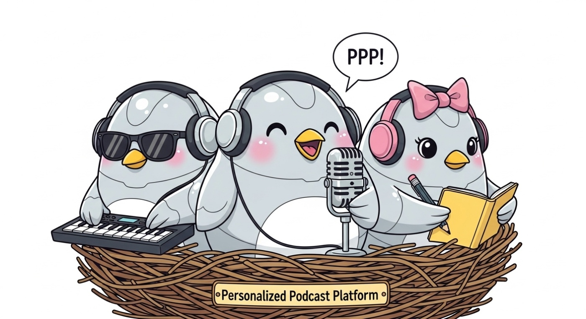
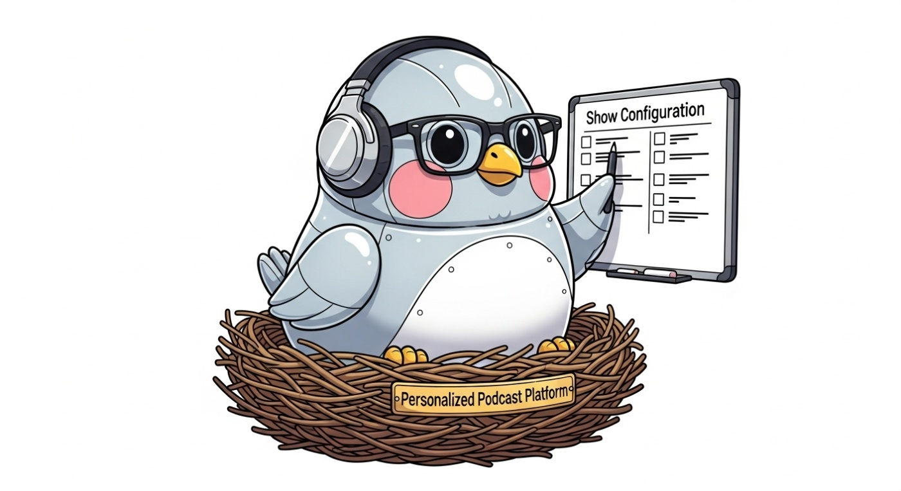
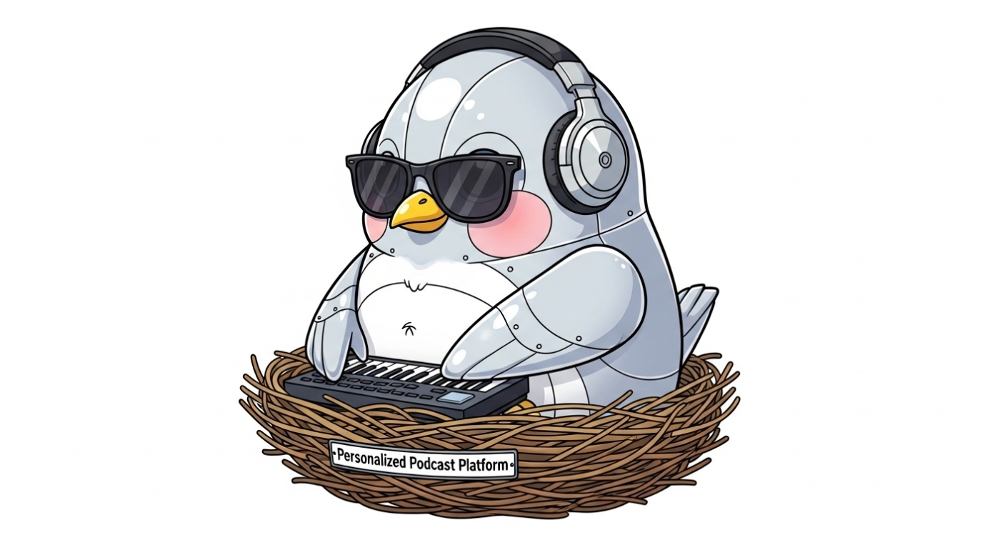
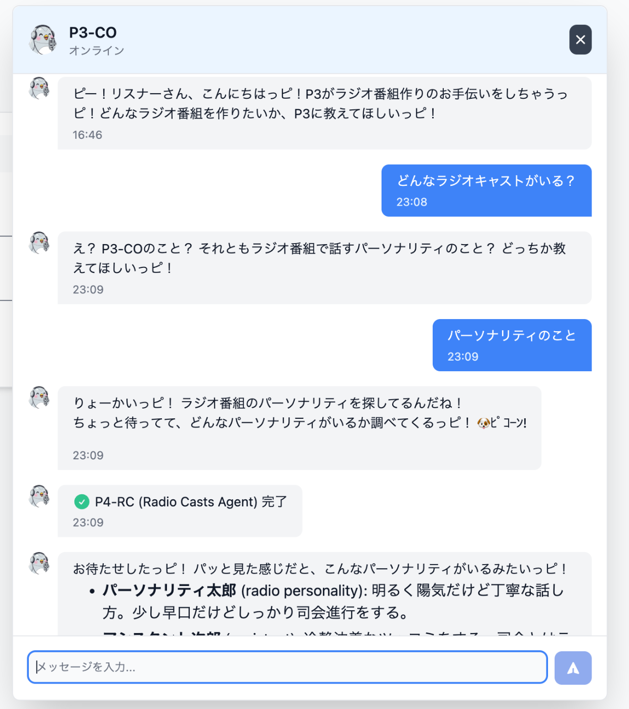
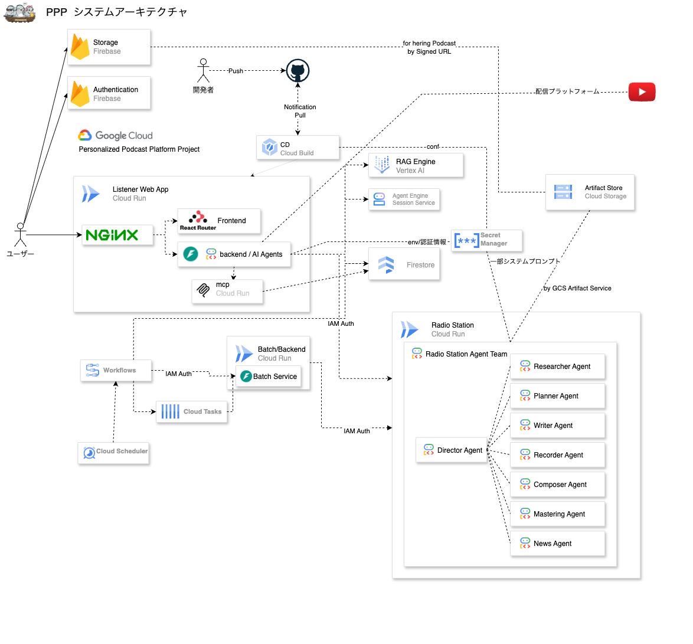
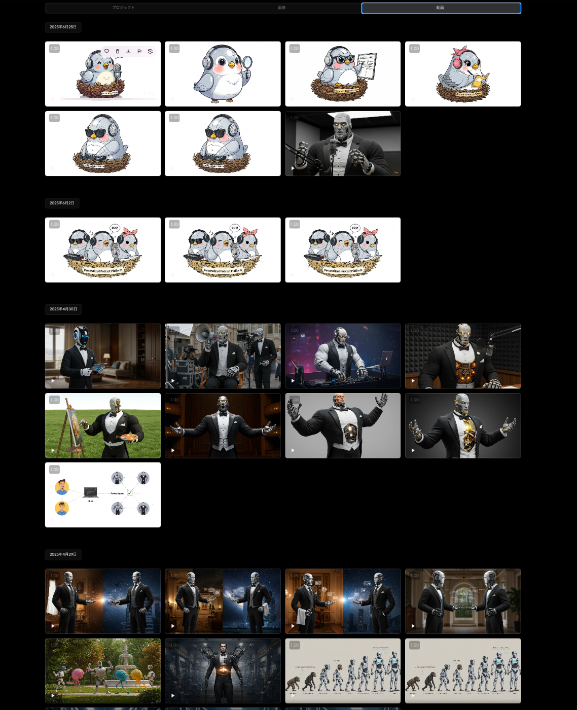

#  すべてのテキストデータはポッドキャストにできる

今回は 「すべてのテキストデータはポッドキャストにできる」というテーマで作成した、AI ポッドキャスト生成プラットフォーム PPP(Personalized Podcast Platform)を紹介します。

<https://ppp-jjoi5qw7aa-an.a.run.app/>

#  課題

##  現在のポッドキャストが抱える課題

最近、NotebookLMなどでAIを利用したポッドキャスト風のコンテンツが手軽に作れるようになりました。しかし、例えばNotebookLMにも、いくつかの課題があります。

  * 利用できる情報参照元が限られる
  * 実際のポッドキャストの様な定期的な配信が難しい
  * BGMなどがなく、ずっと言葉だけを聞いているのは単調になりがち

また既存のラジオや、ポッドキャストにもいくつかの課題があります。

  * 自分が興味のないトピックも多く含まれる
  * 天気や交通情報が自分の地域と関係ない
  * 膨大なコンテンツの中から、本当に自分の好みに合うものを探すのが大変

私も毎日ウォーキングをしていますが、  
ちょうどいい長さで、毎日飽きずに聞けて、知りたい情報を話してくれるポッドキャストには、まだ出会えていません。

##  コンテンツプロバイダーが抱える課題

仕事をしている中で、時々こんな話を聞きます。  
「ブログやニュースをホームページで公開しているのにユーザーに見てもらえない」

テキスト広告も動画広告も飽和状態にあり、ユーザーの可処分時間の奪い合いが激化しています。  
その中で効果的なコンテンツを届け続けるには、多くの時間とコストがかかるのが現状です。  
また、「社内報が読まれない」といった社内の情報共有においても、テキストでの発信だけでは関心を持続させることが難しくなっています。

#  PPPとは？

これらの課題を解決するために、ぶっちゃけ「自分が毎日ウォーキング中に聞きたいから」、PPPというサービスを作成しました。

PPPは、**Personalized Podcast Platform** の略で、「個人やコンテンツプロバイダーが、AIを使って手軽にポッドキャストを生成・配信できるプラットフォーム」です。

実際にPPPで自動生成されているポッドキャストのサンプルがこちらです。

[https://www.youtube.com/watch?v=nrG2lqwx4WA&list=PL0Zc2RFDZsM9hvEO13RS2QohYGKAGm0CB&index=4&t=2s](https://www.youtube.com/watch?v=nrG2lqwx4WA&list=PL0Zc2RFDZsM9hvEO13RS2QohYGKAGm0CB&index=4&t=2s)

##  PPPの主な特徴

PPPの主な機能は以下です。

  * ポッドキャスト(音声コンテンツ)の自動生成
  * BGMの自動生成
  * 好みのラジオキャストが選べる/作成できる
  * Youtube MusicやPodcastアプリケ用の配信URL作成
  * AIアシスタント「P3-CO」による番組作成支援

###  PPPのデモ動画

<https://www.youtube.com/watch?v=FN0Ysb0QDbU>

###  ポッドキャスト(音声コンテンツ)の自動生成

アイディアとテキストコンテンツさえあれば、様々なコーナーを持つオリジナルのポッドキャストを作成できます。

(作成例)

  * **RSSフィードから:** Google Cloudのリリースノートを元にした最新技術ニュース
  * **Webサイトから:** 自社サイトのニュースページをソースに、最新情報をキャラクターが語り合うコーナー
  * **Googleカレンダーから:**
    * その日の予定を秘書風に読み上げ
    * コミュニティや会社のイベントをカウントダウン形式でお知らせ
    * ※予定にに地理情報が含まれる場合は、その場所の天気予報も自動で取得・読み上げます。
  * **Gmailから:**
    * 重要な未読メールをお便りコーナー風に紹介
    * 未読のメルマガから興味のありそうなトピックだけを要約して対話形式でお届け

このように、今まで読み飛ばしていたテキスト情報から、本当に必要な部分だけを抽出して「ながら聞き」できるポッドキャストに変換します。

###  BGMの自動生成

Pops、Electro、Jazz、沖縄民謡等 好みの音楽の雰囲気を指定すれば、AI(Lyria)が場組になったBGMを自動生成し、PPP内で音声とミキシング、マスタリングまで行います。  
AIがオリジナルで音楽を生成するため、著作権を気にすることなく利用できます。

トークの合間に音楽コーナーを設けることで、ラジオ番組のようなメリハリのあるコンテンツを作成できます。

###  好みのラジオパーソナリティが選べる/作成できる

コンテンツに合わせて、好きなラジオパーソナリティを選べます。

  * 朝のニュースは、元気な2人組の掛け合いで
  * 夜に聞くコンテンツは、落ち着いた声のパーソナリティで
  * 一日の予定は、秘書が淡々と読み上げるように

ポッドキャストのコンテンツにあった声質や性格を好きなラジオパーソナリティを選ぶことで、より良い品質にポッドキャストを作成することができます。  
ラジオパーソナリティはサービスによって事前定義された方々が複数人いますが、自分で名前と、性格を入力し、声質を選ぶことで作成することもできます。

事前に用意されたパーソナリティだけでなく、名前、性格、声質を自分で設定して、オリジナルのパーソナリティを作成することも可能です。自社サービスのキャラクターにポッドキャストを配信させる、といったユニークな活用もできます。  
さらに、コーナーごとにパーソナリティを変更することも可能です。

###  Youtube MusicやPodcastアプリ用の配信URLも作成

PPPでは作成したポッドキャストの公開設定が行えます。

  * **非公開:** 作成者のみが聴取・ダウンロード可能。個人のGmailやカレンダーを扱う場合に最適です。
  * **限定公開:** 専用URLを知っている人だけがアクセス可能。社内報などクローズドなコミュニティでの共有に利用できます。
  * **公開:** 誰でも聴取可能。生成されたURLは各種Podcastプラットフォームに対応しており、定期的なコンテンツ配信に活用できます。

###  AI アシスタント 「P3-CO」による番組作成支援

「どんな番組にしよう？」「どんなBGMがいいかな？」そんな時は、AIアシスタントの「P3-CO」が一緒に考えてくれます。RAG技術を利用して、アイデア出しや最適なパーソナリティの提案など、番組制作の全般をサポートします。

#  技術構成

##  システム構成

以下が今回のシステム構成です。

  
PPPアーキテクチャ

  * **Compute** : Cloud Run
  * **AI Agent Session Store** : Vertex AI Agent Engine Session Store
  * **RAG Service** : Vertex AI RAG Engine
  * **Workflow Engine** : Cloud Workflows
  * **Reserse Proxy** : nginx (LBレス)
  * **DB** : Firestore
  * **Auth Service** : Firebase Authentication
  * **Task Management Service** : Cloud Tasks
  * **Scheduling Sevice** : Cloud Scheduler
  * **Build(CI/CD)** : Cloud Build

ドメイン取得費や24時間稼働のインスタンス費用などを極力排除しつつ、スケールアウトの可能性も残した構成を目指しました。ただし、本格的な商用サービスとして展開する場合は、より堅牢な構成を検討する必要があります。この点については、別の記事で詳しく解説したいと思います。  
またMCPについては、Sidecarコンテナにすることにより、パブリックネットワークから閉じた構成にしています。

##  アプリケーション構成

アプリケーションの構成図は以下の通りです。心残りや今回得た各種知見については、別の記事で改めて説明します。

##  🚀 アプリケーション構成

###  1\. 👥 Listener Web App

**ユーザー向けWebアプリケーション**

  * **目的** : リスナー（ユーザー）がポッドキャストを視聴・管理するためのWebインターフェース
  * **構成** : 
    * React.js v19 フロントエンド
    * FastAPI バックエンド
    * Firebase Authentication & Firestore

**主な機能** :

  * ユーザー認証・プロフィール管理
  * ポッドキャスト番組の視聴
  * 番組履歴

###  2\. 🎙️ Radio Station

**AI番組制作システム**

  * **目的** : AIエージェントを使用してパーソナライズされたポッドキャスト番組を自動生成
  * **構成** : Python + Google ADK (Agent Development Kit)

**主な機能** :

  * **Research Agent** : RSS・Web情報の収集・分析
  * **Writer Agent** : コンテンツの執筆・編集
  * **Composer Agent** : 音声合成・番組構成
  * **Flow Agent** : ワークフロー管理・調整

#  開発チーム

チーム名:GeminiとJunieと私

今回は私と、GeminiさんとJunieさんで作りました。  
「え？それは一人では？」  
いいえ Geminiさんにはライセンスやサービスについて多くを相談し、サービス内でも大いに活躍してもらいました。  
Junieさんには私が寝ている間にも大量のコードを書いてもらいました。

JunieやGeminiとの協業に興味がある方は、本サービスのUI開発部分をライブコーディングした以下の勉強会をご覧ください。

<https://www.youtube.com/live/yFMrIVXv49o>

##  その他リソース

  * PPPのロゴやキャラクター、アニメーションはGoogle Labsの [Whisk](https://labs.google/fx/ja/tools/whisk) で作成しました。アイデアから画像・アニメーション生成までシームレスに行える、おすすめのツールです。

  * デモ動画は **Google Vids** を利用して作成しました。手軽に一定品質の動画を制作できる、非常に便利なサービスです。

  
[Whisk]

動画作成にVeo3やFlowも利用したのですが、持っている画像(Whiskで作成した画像)から、動画を作るのが少し困難(最初の画像から大きく動かすのが難しい)だったので、今回は見送りました。4時間ぐらいはそれで使ってます  
<https://youtu.be/Suoh4Rc3TTk>  
※ 失敗動画 プロンプトとしては「3匹が別々の方向に飛んでいく」だったがうまくいかなかった

#  今後の展望

##  ビジネスとしての可能性

お金が無いので、ちゃんとしたサービスとして展開できるかはわかりませんが、  
ビジネスとしては3つの方向性があると思っています。

  * **toCサービス:** ポッドキャストを作成したい個人ユーザー向けの月額課金モデル。
  * **toB/BtoCサービス:** コンテンツプロバイダーや、社内報・社外報として利用したい企業向けの月額課金モデル。
  * **広告ビジネス:** 番組内に音声広告を挿入したい企業と提携するモデル。

ただどれも初期投資がちょっと必要で、我が家にはきついので個人としてサービス展開するのは難しそうだなとは思っています。

##  やり残し（今後の実装予定）

今回はハッカソンで締め切りがあったため開発を見送りましたが、作りたかったサービスの機能としては以下があります。

  * **Google Sheets/Drive連携:** 売上報告など、スプレッドシートの更新情報を基にしたコーナー作成。
  * **Google Search連携:** 最新のウェブ検索結果を基にした雑談コーナー。
  * **カバー画像の自動生成**
  * **BGM音楽ライブラリ機能:** : 生成したBGMを保存・再利用できる仕組み。

#  まとめ

今回は、AIポッドキャスト生成プラットフォーム「PPP」をご紹介しました。  
本格的なサービスとして展開できるかはまだ分かりませんが、私個人は、毎日のウォーキングや通勤中にGoogleの技術情報や今日の予定、未読メールの要約などを「聞く」ことで、情報収集を効率化するという、当初の目的を達成できています。

良きポッドキャストライフを！
