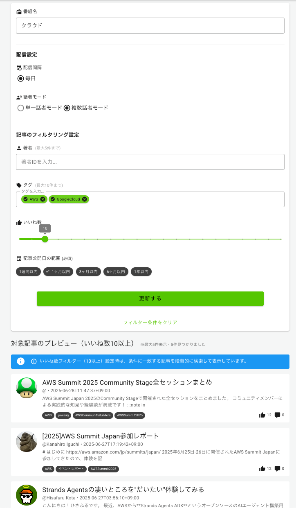
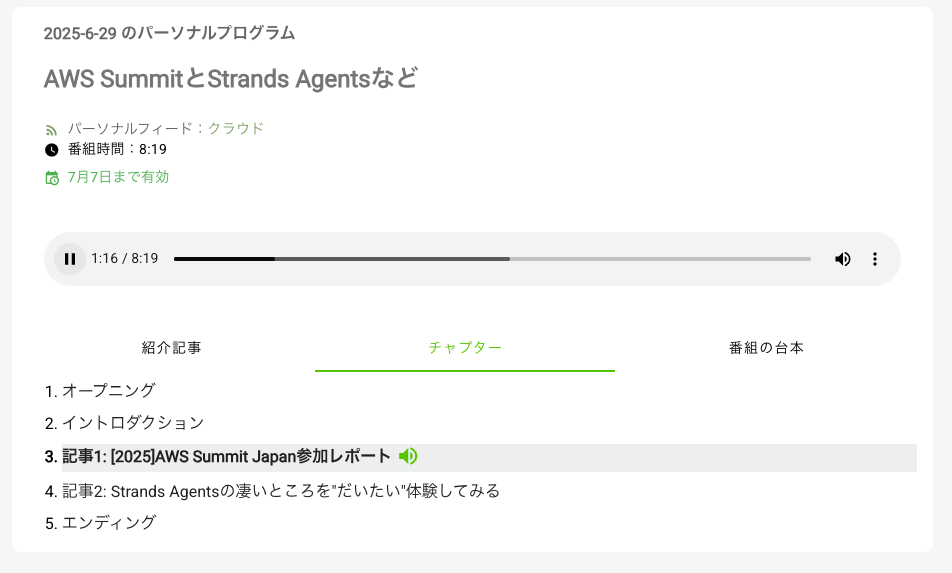
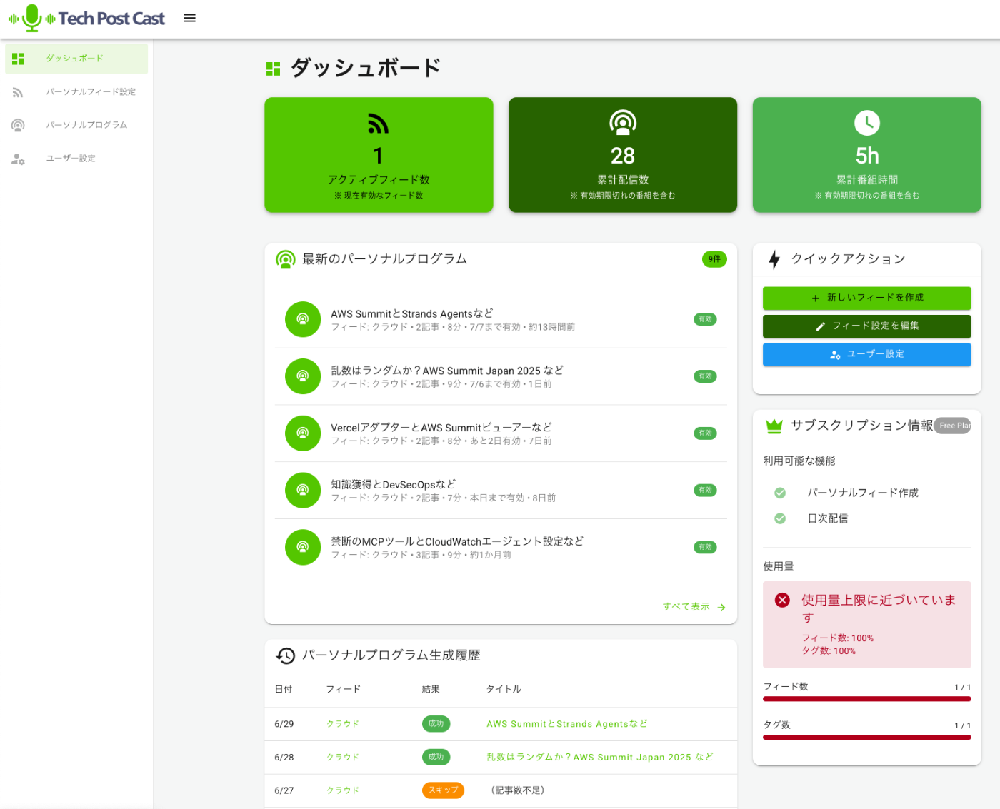
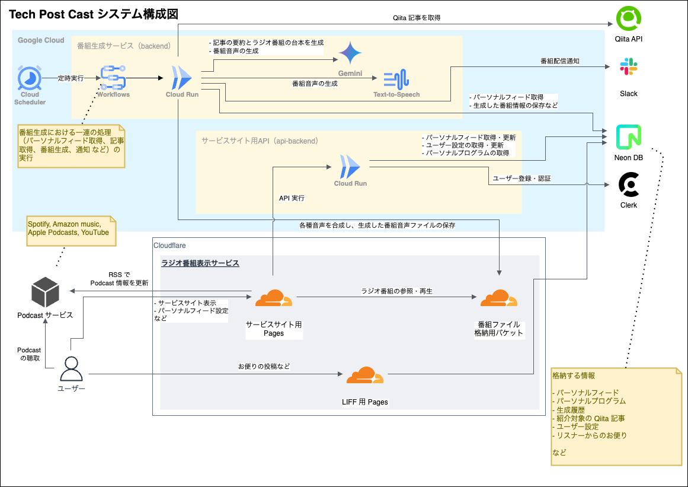

##  ■ 忙しい毎日、でも最新情報はキャッチアップしたい

我々は日々膨大な情報にさらされています。技術情報においても、Qiita や Zenn, note などのメディアでは毎日多くの技術記事が公開され、X や RSS フィード、ニュースレターなどを通じて情報を得ている人も多いでしょう。

しかし現実には、

  * 記事を読む時間がない
  * 読みたいものを探すのが面倒
  * 情報が多すぎて処理しきれない

という悩みがあるのではないでしょうか。

そこで個人開発した Web サービスが **「Tech Post Cast（テックポストキャスト）」** です。  
毎朝7時に AI の MC が Qiita で話題の技術記事を解説するラジオ番組を配信するサービスです。技術記事を「耳で聴く」ようにすることで、移動中や作業中でも情報をキャッチアップできます。  
日課のウォーキング中に聴けるように1つの番組は5-10分程度の長さにして、ひとつの番組を簡単に聞き終えられるようにしています。

##  ■ プロダクト概要：Tech Post Castとは？

**「Tech Post Cast（テックポストキャスト）」** では、毎朝決まった時間に話題の記事をAIが解説したラジオ番組を生成して配信しています。

<https://techpostcast.com>

毎日、決まった時間に配信する事でリスナーは習慣化しやすくなり、音声番組なので通勤途中はもちろん、家事や散歩、車の運転中でも気軽に聞いていただけます。

これまでは Qiita の人気記事をラジオ番組化して配信しており、トレンドのトピックスをキャッチアップできます。

今回は、ユーザーが自分の興味のあるタグや著者を選ぶだけで、パーソナライズされたユーザー専用のラジオ番組を毎日配信する **「パーソナルフィード機能」** を追加しました。

さらに、ラジオ番組の AI MC も、シングルナビゲーターである「**ポステル** 」の解説スタイルに加え、**専門家AI「ジョン」** との対話形式での解説モードも選択可能。まるでラジオのパーソナリティがニュースを語るような感覚で、日々の情報収集がより身近になります。

> 「読む」から「聴く」へ。情報収集の形をアップデートする、新しいメディア体験です。

###  サービス紹介動画

今回追加した「パーソナルフィード機能」について、本サービスの AI MC であるポステルとジョンに解説してもらいました。

<https://youtu.be/Hp45MleRgqo?si=Gn47Pcwy_QsVGLiO>

##  ■ 想定ユーザーと課題

###  🧑‍💻 主なユーザー像

  * 毎日技術記事をチェックしたいが、時間がないソフトウェアエンジニア
  * テクノロジー業界の動向を把握したい PM
  * Qiita をよく見るが、忙しくて後でまとめて読もうとして結局読まない人
  * ランニング中や通勤中に耳で情報を得たい“ながら族”な人

###  📔 解決したい課題

  * 技術記事を読む習慣をつけられない
  * 記事や情報が多すぎて、どれを読めば良いかわからない
  * 見出しだけで判断するのが難しく、内容を理解するのに時間がかかる

##  ■ Tech Post Castの主な機能と特徴

##  ■ サービス設計上の工夫

###  🎧 あなただけの「パーソナルフィード」

従来の人気記事配信では、すべてのユーザーに同じ番組内容を提供していました。今回追加したパーソナルフィード機能では、ユーザーが関心のある著者やタグを自由に選択し、さらに記事の「いいね数」を指標としてより評価の高い記事に絞って抽出できるようにすることで、一人ひとりの興味や専門分野に合わせた質の高い完全オリジナルのラジオ番組を毎日自動生成できます。

####  パーソナルフィード設定画面

パーソナルフィードの編集はユーザーが直感的に操作できる UI としました。  
設定条件に沿った記事のプレビュも確認できます。

###  🗣 音声の自然さとキャラクター性を両立

複数話者モードでは、司会役の「ポステル」と専門家の「ジョン」のAIキャラ同士の掛け合いにより、記事の要点を整理して深堀りすることで、記事を理解しやすい番組内容にしています。  
音声合成には `Gemini 2.5 Flash プレビュー TTS` を利用して複数話者での番組音声生成を実現しました。また、各種音楽（イントロ、BGM、効果音など）を合成してラジオ番組調にすることで、リスナーが聴きやすくしています。

####  サンプル番組

<https://youtu.be/YL_mBWve-5A>

###  🔊 チャプター＆RSS対応で聴きやすさを最大化

番組音声にはチャプターを付与しており、リスナーは聴きたい箇所に1アクションで瞬時に移動できます。また、生成された番組はRSS配信に対応しているため、お気に入りのPodcastアプリで番組を購読して、いつでもどこでも気軽に聴取できます。

###  📢 番組配信通知で聴取習慣をサポート

番組配信時には Slack への通知機能を提供しており、定時に通知を受け取ることでリスナーが番組を聴く習慣を自然に身につけられるようにサポートしています。  
また、ダッシュボード画面では番組の生成履歴がひと目で分かるようにしています。

###  📗 番組対象とする記事の選定

番組対象とする記事を Vertex AI Search などを利用してインターネット全体から取得することを検討しましたが、記事自体の鮮度や品質をどのように担保するかなどの課題があることや、Qiita というエンジニアコミュニティで発信されている記事が信頼性が高いと判断して、これをデータ源とさせていただきました。  
本当は zenn も利用したかったのですが、ユーザー向けの API が正式に公開されていないため Qiita のみとしました。

##  ■ 技術スタックと構成

このプロジェクトは、**Google CloudのAI・インフラサービス** を主軸に構成されています。

###  番組生成サービス

番組生成サービスでは、ユーザーが設定したパーソナルフィードをもとに、毎日決まった時間に AI が番組音声を生成します。

機能 | 技術スタック | 説明  
---|---|---  
定時実行 | `Cloud Scheduler` | 定時に番組生成処理などの実行を開始する  
処理フロー制御 | `Workflows` | 対象記事の取得・要約・台本生成・音声合成などの番組生成処理をワークフロー制御する  
記事の取得 | `Qiita API` | パーソナルフィードに沿った記事情報の検索、取得  
記事要約、台本生成、キャラクター別セリフの生成 |  `Gemini AI`, `mastra` | 記事の要約・説明する上での要点の抽出・番組台本を生成する  
番組音声の生成 |  `Gemini AI`, `Text-to-Speech`, `ffmpeg` | 番組台本を元に音声合成し、BGM や効果音を合成する  
実行環境 |  `Cloud Run`, `NestJS` | 番組生成処理の実行環境  
データベース | `Neon DB` | 番組情報などの保存  
通知 | `Slack` | 番組生成結果の通知  
  
###  サービスサイト

サービスサイトではユーザーの好みでパーソナルフィードを設定できる UI を提供します。また、番組の生成結果や番組の聴取ができます。

機能 | 技術スタック | 説明  
---|---|---  
API提供 |  `Cloud Run` , `NestJS` | サービスサイト向け API の提供  
音声ファイル配信 | `Cloudflare R2` | 番組音声ファイルの保存とCDN経由の配信  
サービスサイト |  `Cloudflare Pages` , `Nuxt3` | サービスサイトの配信  
ユーザー認証 | `Clerk` | ユーザー認証  
  
###  その他

機能 | 技術スタック | 説明  
---|---|---  
コード管理 | `GitHub` | コードのリポジトリ  
CI/CD |  `Cloud Build` , `GitHub Actions` | CI, CD  
  
###  システム構成図

##  ■ 今後の展望

###  追加したい機能など

ユーザーが効率よく音声で技術情報を収集できるプラットフォームにしたいと考えており、下記機能の追加を検討しています。

  * ユーザー同士の番組発見機能（いいね・シェア・タグ連携）
  * 複数メディア対応の拡張（Zenn, note, 海外Techブログなど）
  * 有料プランの導入

###  より広範囲の情報を使う

先にも触れましたが、本当は Qiita だけでなく Zenn の記事も利用したパーソナルプログラムを生成したいと考えていました。ですが、Zenn ではユーザー向けの正式な API は公開されていないようですので、今回は Qiita のみとなっています。  
ぜひ Zenn の記事も活用させていただきたいです。

###  `Gemini 2.5 Flash プレビュー TTS` の利用制限

複数話者モードで利用している `Gemini 2.5 Flash プレビュー TTS` はプレビュー公開ということで、 [レート制限](https://ai.google.dev/gemini-api/docs/rate-limits?hl=ja) があるため番組生成数に制限があります。GA されることでレート制限が撤廃されると思いますので、早い時期での GA を待ち望んでいます。

##  ■ まとめ

Tech Post Castは、忙しいエンジニアが「読む」から「聴く」へと情報収集スタイルを変革するサービスです。今回追加したパーソナルフィード機能により、ユーザーの興味に応じた完全オリジナルのラジオ番組を毎日自動生成できるようになりました。Google CloudのAIサービスを活用し、複数話者による自然な音声解説とチャプター・RSS対応で、移動中や作業中でも効率的に技術情報をキャッチアップできる新しいメディア体験を提供しています。

それでは皆さんも良いAIラジオライフを！
