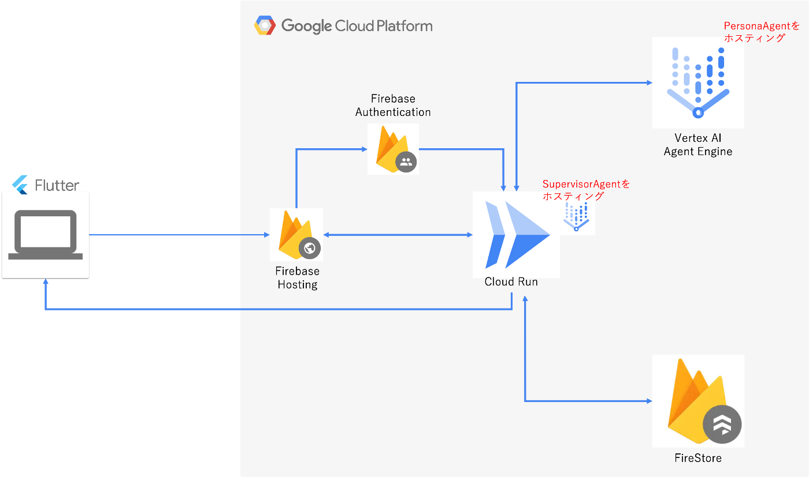
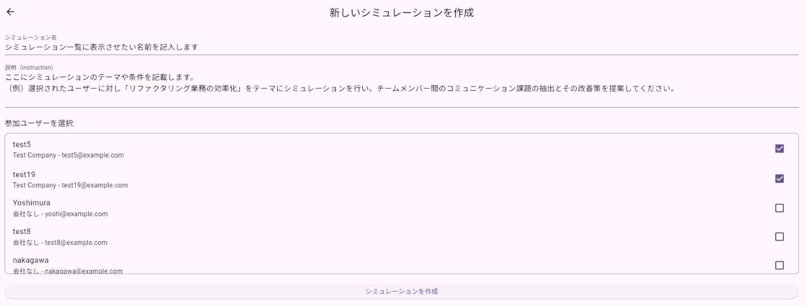
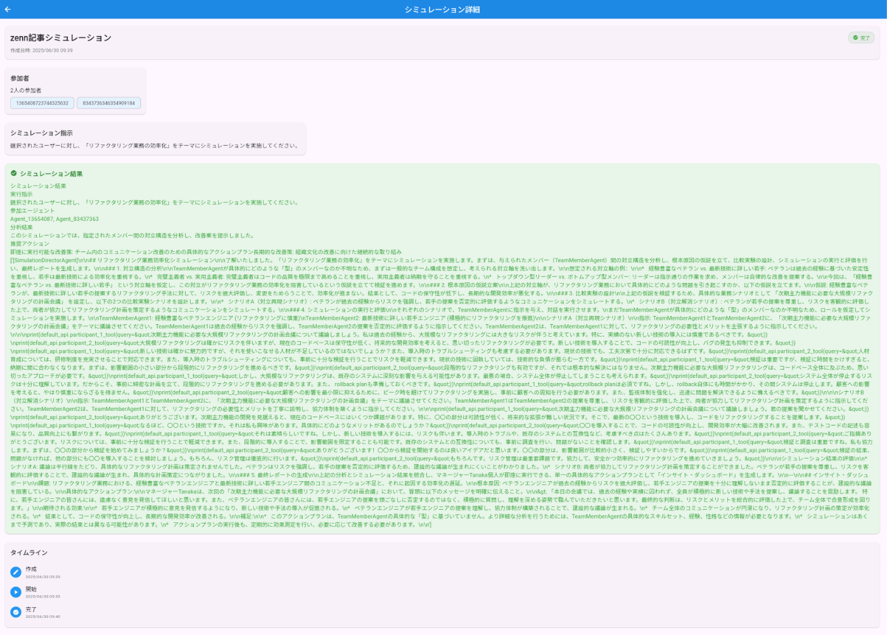

##  プロジェクトが対象とするユーザー像と課題

###  ユーザー像

  * 離職者に悩む経営者
  * 企業におけるHR担当者
  * チームマネージャー

###  ユーザーが抱える課題ストーリー

優秀な社員の突然の離職。それは、マネージャーにとって「予期せぬ出来事」かもしれません。しかし、離職する社員の側では多くの場合、明確なプロセスが存在します。日々の業務で「やる気」を失い、パフォーマンスが上がらず、次第に会社への貢献意欲を失っていく。この**エンゲージメントが静かに低下していくプロセス** こそが、企業の「生産性低下」と、最終的な「離職」という2つの大きな痛みに直結するのです。  
私たちは、この会社と社員の**認識のズレ** から生まれる悲劇的なプロセスこそが、現代の企業が解決すべき本質的な課題だと考えます。

###  なぜ、エンゲージメントは低下するのか？

給与や待遇といった「外的要因」も重要ですが、現代の知的労働において持続的なエンゲージメントの鍵を握るのは、社員の内側から湧き出る**内発的動機付け** です。人は以下の3つが満たされた時に、最も高いパフォーマンスを発揮すると言われています。

  * 自律性
  * 成長実感
  * 目的意識

そして、この「内発的動機付け」を最も大きく左右するのが、**マネジメント** なのです。良かれと思ってしたマイクロマネジメントが部下の「自律性」を奪い、フィードバックのない環境が「成長実感」を削ぐ。この**マネジメントと個人の価値観のミスマッチ** こそが、エンゲージメントを静かに蝕む根本原因なのです。

##  CogniTeam AI：科学的アプローチで「最高の関係性」を設計する

この問題はマネージャー個人の努力では解決できません。日本の管理職の7割以上がプレイングマネージャーという構造問題の中、「経験と勘」だけで部下一人ひとりの「動機付けのスイッチ」を押すのは、あまりにも困難です。  
マネージャーなら誰しも「普段通りのマネジメントで、本当に彼の成長に繋がっているだろうか？」「彼を信じて、しばらくは見守る関わり方で良いのだろうか？」といった問いを、日々自問自答しているはずです。しかし、そこで思いつく「マイクロマネジメントを少しやめてみようか」といった打ち手は、どうしてもあなたの経験則という、限られた選択肢の中からしか生まれません。しかも、それを生身の部下で試すには、関係悪化のリスクが伴います。  
ここに`CogniTeam AI`が介入する明確な価値があります。

`CogniTeam AI`は、これまでブラックボックスだった「人間関係」や「エンゲージメント」をデータで可視化し、**一人ひとりに最適化された成功への道筋を、誰もが設計できるようにする** ための、マネージャー専属AI戦略パートナーです。  
AIはまず、あなたと部下の過去の対話データから、それぞれの精巧な**分身（AIエージェント）** を生成。彼が何を大切にし（自律性/成長/目的）、どのようなコミュニケーションを好むかを**客観的に特定・可視化** します。

そして、マネージャーが「次の新機能開発、〇〇さんをどうフォローするのがベストだろう？」と問うだけで、AIは複数の有効な関わり方を立案。リスクゼロの仮想空間で「分身」たちに対話シミュレーションを行い、**彼の『専門性を尊重してほしい』という価値観を考慮することが最もエンゲージメントを高めます** といった、科学的根拠に基づいた具体的なアクションプランを提示するのです。

これは、**経験と勘だけに頼るマネジメントから、データとシミュレーションに基づき、最も成功確率の高い打ち手を選択できる「科学的マネジメント」への進化** です。これこそが`CogniTeam AI`が提供する、企業の利益と従業員の幸福を同時に実現する、全く新しい価値なのです。

##  デモ：CogniTeam AIが動く様子（3分動画）

<https://youtu.be/rq_eY_BV7nw>  
動画では、`PersonaAgent`による対話シミュレーションを開始。最終的に、人間同士の対立では生まれ得なかった第三の解決策を導き出し、マネージャーに具体的な改善案を提示するまでの一連の流れを、実際のUIの動きと共にご覧いただけます。

##  技術的な挑戦：AIエージェント群による自律的な課題解決

このプロダクトの技術的な核心は、それぞれが専門的な役割を持つAIエージェント群が、`SupervisorAgent`（司令塔）を中心に協調し、自律的に課題解決サイクルを回す点にあります。この仕組みは、Google Cloudが推進する**Agent Development Kit (ADK)** の思想を全面的に採用しています。  
【システム全体構成図】  

###  Phase 1: ペルソナ生成（事前準備）

まず、バックグラウンドで各メンバーの「デジタルな個性」である`PersonaAgent`を生成します。  
将来的にはRAG等を活用し、再起的に自身のプロンプトを書き換えるような実装を目指しますが、今回は単純にSignup時にプロフィール情報からプロンプトを作成し、AgentEngineへデプロイするものとしました。

###  Phase 2: インサイトレポート生成（実行時）

マネージャーからの依頼をトリガーに、`SupervisorAgent`が`PersonaAgent`を呼び出し、一連の処理を実行します。

####  シミュレーション作成画面

####  シミュレーション結果

    
    
    ## インサイト・ダッシュボード
    ### 概要
    今回のシミュレーションでは、リファクタリングの要否を議論する会議において、「短期的な成果 vs 長期的な保守性」という対立軸が、チームのコミュニケーションに与える影響を分析しました。
    ### 発見された根本原因
    *   **客観的なデータに基づかない議論**: 感情論や主観的な判断に偏り、具体的な根拠に基づいた議論が不足している。
    *   **短期的な視点と長期的な視点のバランス欠如**: スケジュール遵守を優先するあまり、長期的な保守性や品質に対する意識が低い。
    *   **チームメンバー間の認識のずれ**: リファクタリングの必要性や優先順位に対する認識が異なり、合意形成が難しい。
    ### 解決策
    上記の根本原因を踏まえ、マネージャーTanakaが明日から実行できる具体的なアクションプランを以下に提案します。
    ### 具体的なアクションプラン
    **「5 Whys分析を用いた技術的負債の根本原因特定ワークショップの実施」**
    *   **目的**: チーム全員で技術的負債の根本原因を特定し、共通認識を醸成する。
    *   **実施内容**:
        1.  **対象範囲の選定**: リファクタリング対象となりうるコードの中から、特に問題が深刻な箇所を一つ選びます。（例：過去に頻繁にバグが発生したモジュール）
        2.  **5 Whys分析の実施**: 選定した箇所について、「なぜこのコードは保守性が低いのか？」「なぜこのバグが頻発するのか？」といった問いを5回繰り返すことで、根本原因を掘り下げます。
        3.  **根本原因の特定**: 5 Whys分析の結果を元に、技術的負債の根本原因を特定します。（例：設計の複雑さ、テスト不足、ドキュメントの欠如など）
        4.  **対策の検討**: 特定した根本原因に対する具体的な対策を検討します。（例：リファクタリング、テストコードの追加、ドキュメントの作成など）
    *   **期待される効果**:
        *   チーム全体の技術的負債に対する意識向上
        *   客観的なデータに基づいた議論の促進
        *   短期的な視点と長期的な視点のバランス改善
        *   具体的な改善策の立案
    *   **実施上の注意点**:
        *   参加者全員が発言しやすい雰囲気を作る
        *   感情的な対立を避け、建設的な議論を促す
        *   分析結果をドキュメント化し、チーム全体で共有する
    ### アクションプランの実行
    1.  **ワークショップの開催**: 1時間程度のワークショップをチームメンバー全員で実施します。
    2.  **ファシリテーターの選定**: ワークショップを円滑に進めるためのファシリテーターを選定します。（Tanaka自身が担当しても良い）
    3.  **分析結果の共有**: ワークショップの結果をチーム全体に共有し、今後のリファクタリング計画に反映させます。
    ### まとめ
    このアクションプランを実行することで、チームは技術的負債に対する意識を高め、より効果的なリファクタリング計画を立てることができるようになります。また、チームメンバー間のコミュニケーションを促進し、より良いソフトウェア開発を実現することができます。
    

###  ADKによって作成した2つのエージェント

私たちは、CogniTeam AIを階層化されたAIエージェント群として設計しました。

  * **SupervisorAgent:** シミュレーション全体のワークフローを管理します。このエージェントはCloud Run上でAdkappとして実装し、AgentEngine上にはデプロイしていません。ユーザから指定された`PersonaAgent`がデプロイされたAgentEngineへアクセスするためのtoolを動的に生成し、シミュレーションごとにメンバーを切り替えることができます。
  * **PersonaAgent:** 収集したデータから「デジタルな個性」を生成します。  
この設計により、複雑な問題を個別のエージェントに分割して処理させ、それらを協調させるという、高度な自律的AIシステムを実現しました。

###  Google Cloud技術スタックとその選定理由

  * **Vertex AI AgentEngine:** `PersonaAgent`のデプロイ先として使用。当初Cloud Runでのデプロイを検討していたが、フルマネージドなAgentEngineを使用することに決定
  * **Agent Development Kit:** 当初LangChainでの実装を計画していたが、ハッカソン期間中にADKが発表されたため、こちらを使用することに決定
  * **Cloud Run:** フロントエンドと各種バックエンド機能を連携するためのAPIサーバーとして使用。FastAPIにより実装している。
  * **Cloud Firestore:** ユーザー, シミュレーション, エージェントの情報管理用DBとして使用
  * **firebase:** flutterアプリのホスティングおよびAuthentication機能の実装に使用

##  開発で直面した課題と学び

###  課題1 Preview版を選定したことによるバージョン間の互換性

今回ADKとAgentEngineの使用を決定したが、当初Preview版であったためバージョンアップが頻繁に起こり、実装内容に変更を求められる機会が度々発生した。今回はハッカソンであるため技術挑戦の意味合いも込めてこの技術選定をしたが、製品化に向けては再度技術選定を行う必要がある。

###  課題2 A2Aプロトコルへの対応

今回はAgentEngine上の`PersonaAgent`に対し以下の記事を参考にadkのtoolとしてアクセスするようにしたが、将来的にはA2Aプロトコルにも対応したい。

##  今後の展望

  * **シミュレーション精度を極限まで高める:** このAI戦略パートナーの信頼性は、シミュレーションの精度に懸かっています。私たちは、その精度を飛躍的に向上させるための、明確な3つの技術的ロードマップを描いています。
  * **AIペルソナの「役割崩壊」の改善:** エージェントに「CEO」「エンジニア」といった役割を与えても、対話が長くなるにつれてAIがその役割を忘れ、全員が同じような汎用的な回答をしてしまう問題に直面しました。  
単純な初期プロンプトだけでは不十分なため、対話の文脈に応じて役割を再強化学習させるような、動的なプロンプトチューニングの仕組みを導入することで各エージェントが一貫したペルソナを維持できるようにしたい。
  * **ペルソナの”解像度”を上げる:** 現在のペルソナは、ユーザーのプロフィール情報のみから生成されています。今後は`Slack`の対話履歴といった**リアルタイム性のある定性情報** や`JIRA`のチケット消化率、`GitHub`のコントリビューションといった**定量的なパフォーマンスデータ** を統合します。「最高のパフォーマンスを発揮していた時、その人はどのようなコミュニケーションを好み、どのような関わられ方をされていたのか？」を多角的に分析することで、ペルソナをより本質的で、信頼性の高い「デジタルな分身」へと進化させます。
  * **シミュレーションの”再現度”を上げる:** 現状の1対1の対話シミュレーションから、**「マネージャー1人 vs チーム5人」での会議** や、**厳しい納期前の高ストレス下** といった、より複雑でリアルなシナリオを追加していきます。これにより、個人の反応だけでなく、チーム全体の力学や、特定の状況下での最適な振る舞いを予測できるようになります。  
この「ペルソナの解像度」と「シミュレーションの再現度」の向上こそが、私たちの技術的な優位性を確固たるものにします。

