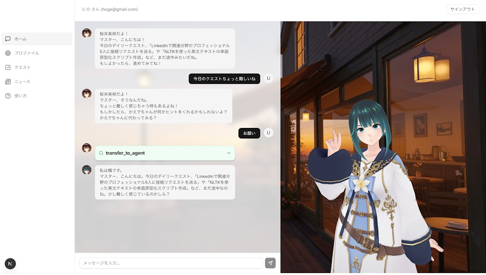
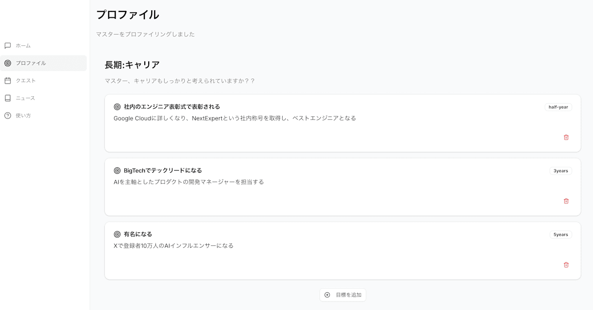
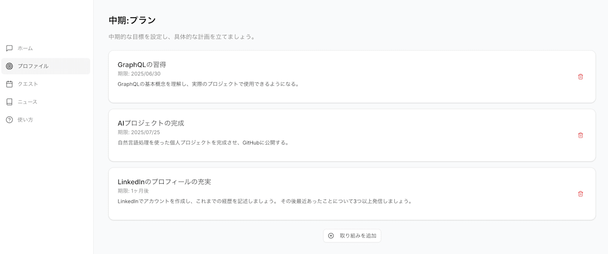
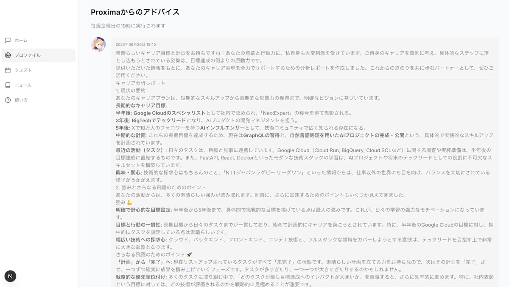
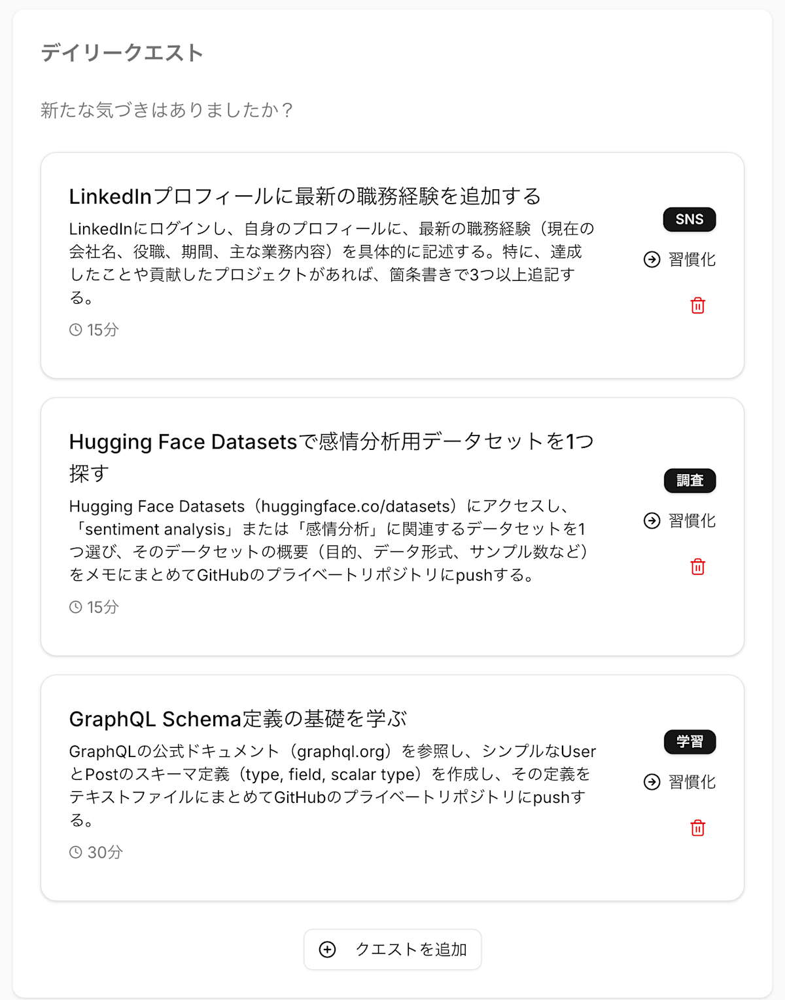
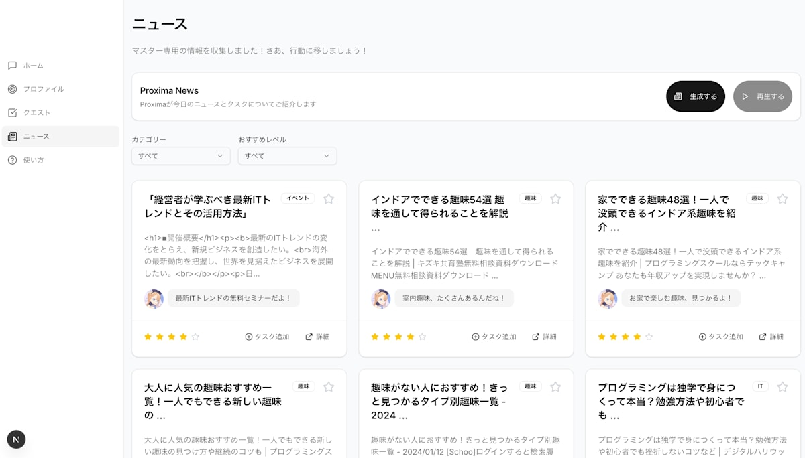
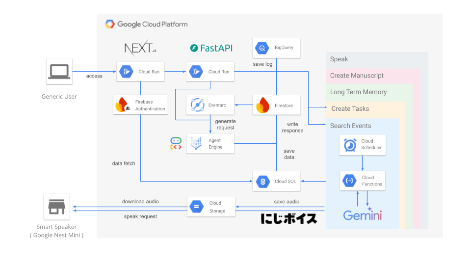
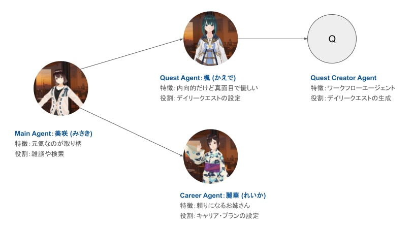
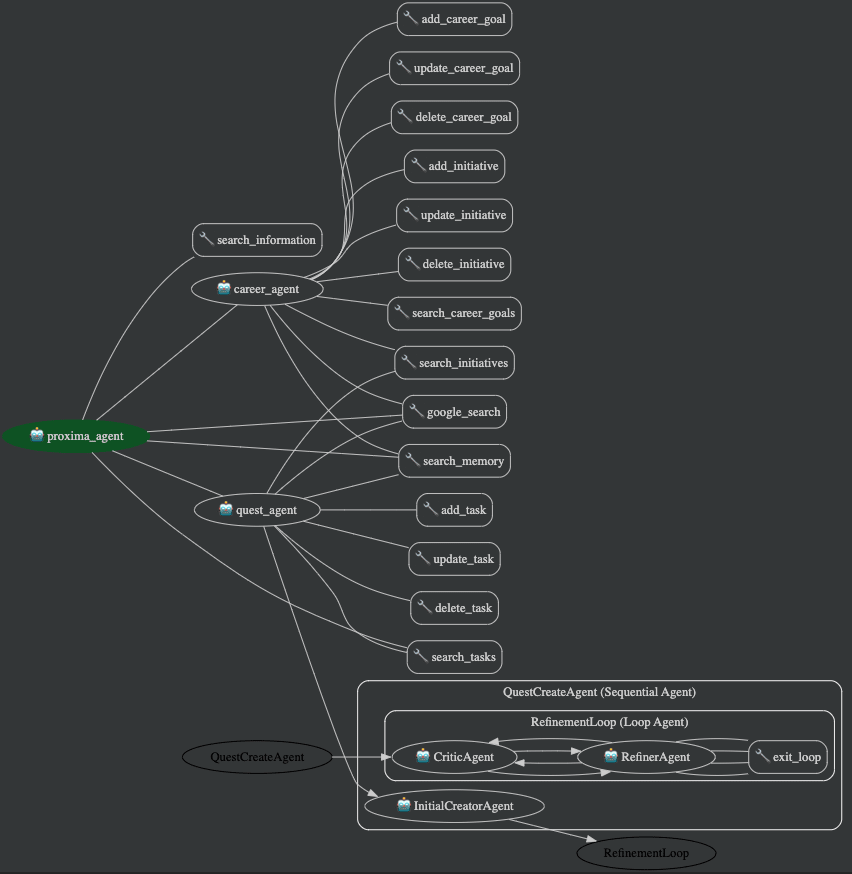
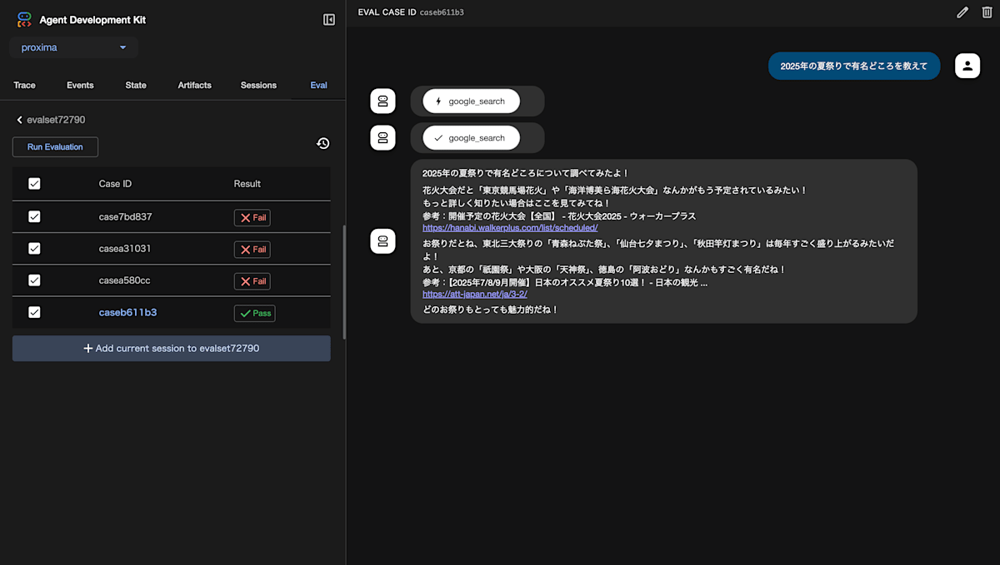

<https://youtu.be/zQzvaDkrN8k>

<https://github.com/takkuhiro/proxima>

##  1\. Proximaが目指すもの

「エンジニアとして成長したい」  
「素晴らしいサービスやプロダクトを生み出したい」

そんな思いを持ちながらも、具体的に何から始めればいいのか分からない。  
このような悩みを抱えるエンジニアは多いのではないでしょうか。

そこで、エンジニアの成長を後押しし、一歩を踏み出すきっかけを作るAIエージェント「Proxima」（プロキシマ）を開発しました。

##  2\. 現状の課題

###  行動することの難しさ

私の周りの素晴らしいエンジニアの方々は段違いに行動量が多いです。新しい技術が世の中に出るといち早く試し、終業後は勉強会に参加しています。社内発表には率先して手を挙げ、好きな分野のカンファレンスに多く参加しています。このことから、エンジニアとして成長するためには**行動すること** が重要であると考えます。

しかし、行動を阻害する要因は多々あります。当日はやる気に満ち溢れていても次の日にはモチベーションが下がっていたり、遠すぎる未来の計画を設定した結果何から始めて良いかわからなかったりしてしまいます。特にこのご時世、世の中には素晴らしい学習コンテンツが充実しており、素晴らしい方々と直接出会うことができる勉強会などのイベントも沢山ありますが、その選択肢が多いことは、何から始めたらよいかという迷いに繋がります。そこで、Proximaでは学習そのものではなく、成長を促進するための**行動** そのものを支援します。

###  AIによるエンジニアの働き方の変革

近年AIの発展によりエンジニアの働き方は大きな変革が起こりました。コーディングやデザイン生成などの多くにAIを用いたツールが導入されており、AIを使うことが民主化されたと言えます。このような世の中では、洗練された情報をいち早く取得し、すぐに行動に移して試行錯誤し、その結果をもとにエンジニア自身が学習することが重要です。

##  3\. Proximaの機能紹介

ここから具体的な機能内容を紹介します。

###  チャット

Proximaはユーザー情報や収集した情報に基づいて会話します。アプリにログインすると、会話は必ずProximaから話しかけ、デイリークエストのリマインドや、ユーザー情報に基づいて収集した情報を提供します。Proximaはチャットの内容から必要な情報を記憶し、情報収集や次の会話に活用します。そのため、ユーザーは技術的なトピックだけでなく、趣味や好きなことなど多くのことをProximaと話すことで、最大限Proximaを活用することができます。また、Proximaで扱う多くの情報（キャリア、プラン、デイリークエストなど）はチャットを通して自然言語で確認・変更できます。

###  プロファイル

キャリアとプランという2つの情報と、Proximaからのアドバイスを表示しています。

  * **キャリア**  
数年単位の長期的な計画を表します。例えば、「10年後BigTechでテックリードとして大規模プロダクトのマネージャーになる」や「5年後にAIの専門家として発信力と影響力を持つ」などが挙げられます。ユーザーにはチュートリアルにて1つ以上設定してもらう項目となっており、Proximaはこの実現に向けての行動計画を作成します。

  * **プラン**  
キャリアをブレイクダウンして考えた時に、数ヶ月から数週間単位で取り組む中期的な計画を表します。例えば、「9月末までにハッカソンに出場して優勝する」や「年内にXで登録者1万人を達成する」などが挙げられます。具体的なKPIが設定でき、明確に達成したかを判断することができます。チュートリアル時に設定することができるだけでなく、Proximaはキャリアをもとにプランを自動生成します。

  * **Proximaからのアドバイス**  
キャリアとプランの実現に向けて、今ユーザーは何をすべきか、何が足らないのかを分析して生成します。生成には Reasoning Model である`gemini-2.5-pro`が利用されており、キャリア、プラン、デイリークエストの達成状況、Proximaの記憶が入力され、分析結果が出力されます。毎週金曜日の夜に自動生成されます。

ユーザーはデイリークエストをこなしていくことで、キャリアプランの実現に近づくことができます。

###  デイリークエスト

キャリア・プランなどの情報を元に、Proximaは毎日こなすべきクエストを毎朝自動生成します。デイリークエストの内容は具体的な行動を伴う内容で、5分から最大60分で完了できるものが設定されます。

デイリークエストを完了したらユーザーはクリックして完了マークをつけます。デイリークエストの達成度はページ下部の振り返りカレンダーで確認することができます。

また、毎日変わるデイリークエストと異なり、毎日継続することで成長につながる内容もあります。そこで、習慣化したい内容は「ルーティーン」に追加します。もしデイリークエストの中で習慣化したい内容があれば「習慣化」ボタンを押すことでルーティーンに追加できます。

###  ニュース

毎朝ユーザーの情報に基づき以下の情報をそれぞれ収集し推薦します。

  * 興味・キャリアに合わせた技術記事
  * 興味・キャリアに合わせた[Connpass](https://connpass.com/)上のイベント情報
  * 趣味に関する情報

エンジニアにとって、勉強会などのイベントへの参加は、情報交換や人脈形成といった観点で特に重要であると考えます。そのため、より高品質な情報を収集するために[Connpass API](https://connpass.com/about/api/v2/)を利用しています。

!

Connpass APIの利用には申請が必要です。

ニュースにはそれぞれおすすめ度とProximaからの一言が付与されており、ユーザーが取捨選択しやすいようになっています。あとで読みたいものがあれば「タスク追加」ボタンを押すことで、デイリークエストにニュースを読むことを追加できます。

###  スマートスピーカーでのアナウンス

Proximaは、ユーザーの継続的な学習をサポートするため、毎朝の音声アナウンス機能を提供しています。その日のデイリークエストやニュースの要約を[にじボイスAPI](https://platform.nijivoice.com/)で音声化し、Google Nest Miniなどのスマートスピーカーを通じて届けます。朝一番に耳にする親しみやすい声で、その日やるべきことを確認できることで、行動を起こすきっかけを作ります。

##  4\. 技術構成・アーキテクチャ

ProximaはGoogle Cloudを中心に、複数のAI・クラウドサービスを組み合わせて構築しています。

各インスタンスの役割

  * **Cloud Run** （Next.js, FastAPI）: Web/APIサーバー
  * **Firebase Authentication** : ユーザー認証
  * **Firestore** : チャットのリアルタイムDB
  * **Eventarc** : Firestoreへの書き込みに応じたトリガー
  * **Agent Engine** : AIエージェント
  * **CloudSQL** : 行動履歴・情報推薦・記憶管理
  * **BigQuery** : AIエージェントのプロンプト調整のためのログ分析
  * **Cloud Scheduler** : 定期実行
  * **Cloud Run Functions** : 定期情報収集・定期リマインド・デイリークエスト生成・長期記憶生成・原稿生成
  * **Connpass API** : イベント情報の収集
  * **にじボイスAPI** : キャラクター音声ファイルの生成
  * **Cloud Storage** : 音声ファイルストレージ
  * **スマートスピーカー** : ニュースとタスクの音声リマインド

AIエージェントは [Agent Development Kit (ADK)](https://google.github.io/adk-docs/) を用いて構築し、Agent Engineにデプロイしています。キャリア・プラン・デイリークエストなどの主要な情報はCloud SQLに、チャットはFirestoreに保存しています。

##  5\. マルチエージェントシステム

3体のAIエージェントからなるシステムを採用し、ADKで開発しました。Web UIではどのエージェントと話しているかがわかるように、表示するVRMモデルとアイコンを切り替えています。

Agent Development Kitにおけるエージェントのアーキテクチャ図

###  デイリークエストを作成するワークフローエージェント

デイリークエストはすぐに行動でき、かつ、キャリアやプランを考慮されたものでなければなりません。そこで、デイリークエストの生成には、Review/Critiqueパターン（参考: [Multi agent systems](https://google.github.io/adk-docs/agents/multi-agents/)）を採用し、複数のエージェントが評価と修正を重ねることで質の高い提案を実現しています。その後、ユーザーが承認するとデイリークエストが保存され、変更要望を返すとさらに修正されます。

###  セッション管理と記憶管理

長時間の会話は対話AIの性能低下を引き起こすことが[LLMs Get Lost In Multi-Turn Conversation](https://arxiv.org/abs/2505.06120)で報告されています。特にProximaのような対話型システムでは、雑談に発展しやすい傾向があります。そこで、セッションを1時間で自動的にリセットすることで、会話の質を維持しています。

一方で、ユーザーとの会話内容を適切に記憶することも重要です。Proximaでは記憶を以下の2種類に分けて管理しています：

  1. **短期記憶** ：直近2日以内の会話内容

     * すべての会話をエージェントに入力
  2. **長期記憶** ：2日以上前の重要な情報

     * 毎晩、古い会話から重要な情報をLLMで抽出してCloud SQLに保存

この2段階の記憶管理により、自然な会話の流れを保ちながら、重要な情報を長期的に活用できる仕組みを実現しています。

###  エージェントに動的な情報を渡す

Agentにユーザーのタスクの進捗具合などの動的な情報を与える必要があるため、`<INFORMATION>...</INFORMATION>`タグで囲われた情報は補足情報であることをプロンプトに記載し、セッション開始時にこれらの情報を与えています。これにより、エージェントが補足情報とユーザーの入力を分けて扱えることを期待しています。

###  Proximaで大切にするAIエージェントの考え方 〜能動性〜

AIエージェントの設計における思想は数多く提案されています。その一つとして、[What are AI agents? Definition, examples, and types](https://cloud.google.com/discover/what-are-ai-agents?hl=ja)ではAIエージェントの特徴として「自立性」「複雑さ」「学習」が挙げられています。これらを踏まえた上で、エンジニアを支援するためにProximaではさらに「能動性」を大切に考えています。例えば、ProximaではすべてのチャットはAIエージェントから開始されます。また、スマートスピーカーでのアナウンスを通して、ユーザーが何もしなくてもProximaと接触する機会を作っています。このようにAIエージェントが能動的に行動することで、ユーザーの負担を減らしつつ接触頻度を上げることができ、結果的にアプリケーションを長く使ってもらえるのではないかと考えています。

###  ADKを用いた開発とプロンプトの改善

Agent Development Kit（ADK）の活用により、マルチエージェントシステムの開発を効率的に進めることができました。特に以下の点で開発効率が向上しました：

  1. **迅速な開発環境の構築**

     * `adk web`コマンド一つでチャットUIを起動
     * プロンプトの調整からフロントエンド開発まで、すぐに着手可能
  2. **プロンプトの継続的な改善**

     * BigQueryでユーザーとの対話ログを収集
     * ADKのEvaluate機能で対話品質を評価
     * Web UIから直接評価を実行し、素早くプロンプトを改善

特にキャラクター性のある対話システムでは、プロンプトの微調整がユーザー体験に大きく影響します。ADKのツール群により、プロンプトの評価と改善を効率的に繰り返すことができ、より自然な対話の実現に役立ちました。

##  6\. 今後の展望

Proximaは「行動支援」という理念を核に開発を進めてきました。この理念をさらに深化させるため、今後は以下の機能開発に注力していく予定です：

  * **エンジニアの成功パターンの分析と体系化**  
エンジニアの成長に寄与する具体的な行動パターンを分析し、より効果的な行動支援を実現します。

  * **SNS連携によるキャリア設計機能の拡充**  
各種SNSプラットフォームとの連携を強化することで、より多くのユーザー情報が取得でき、より包括的なキャリア設計支援を提供します。

  * **スマートフォンアプリの開発**  
いつでもどこでもProximaにアクセスできる環境を整備し、より身近な行動支援を実現します。

さらに、Proximaが可視化するエンジニアの行動データは、企業の採用・育成活動にも新たな可能性をもたらします。現状、エンジニアの評価はGitHubでの活動や論文などの公開情報に依存しがちですが、これらの機会に恵まれないエンジニアにとっては不利な状況となっています。Proximaは、エンジニア個人の日々の努力や成長プロセスを可視化することで、より公平で多面的な評価基準を提供できる可能性があります。これにより、エンジニア個人の成長支援と、企業の人材育成・採用活動の双方に貢献できると考えています。

##  7\. おわりに

Proximaは、私自身のエンジニアとしての成長への切実な思いから生まれたプロジェクトです。現在はエンジニアを対象としていますが、「行動支援」という基本理念は、他の専門分野や職種においても有効に機能すると考えています。
