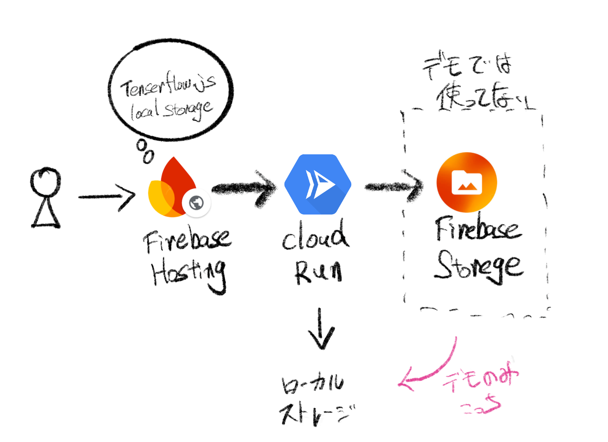
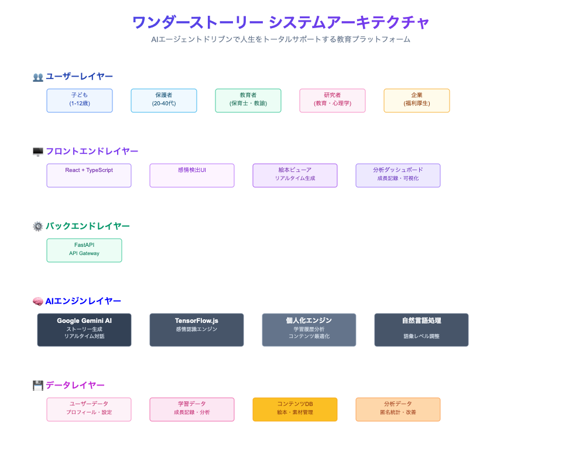
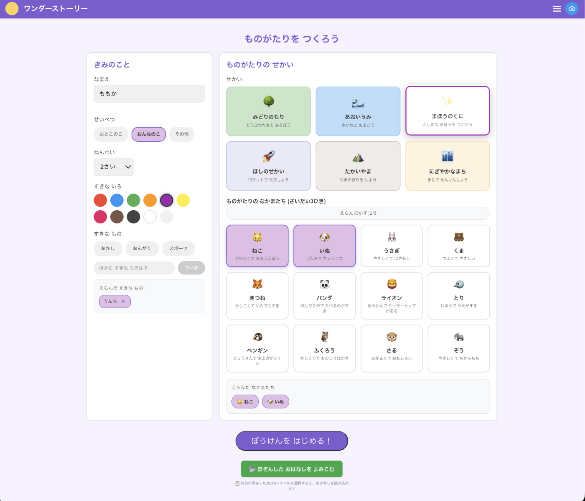
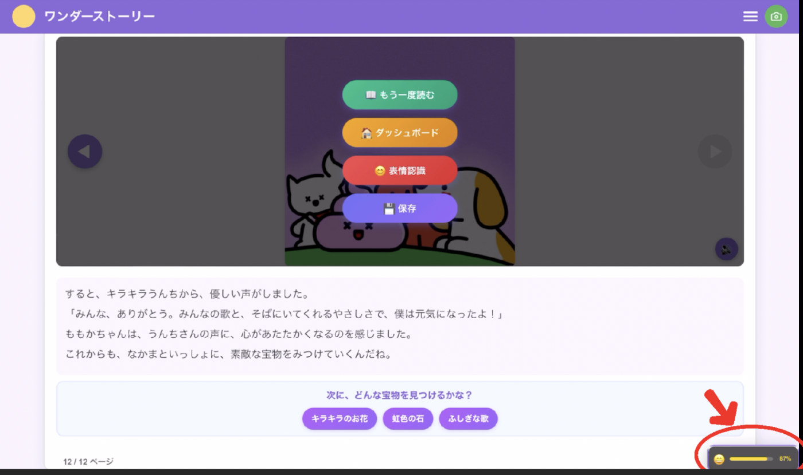
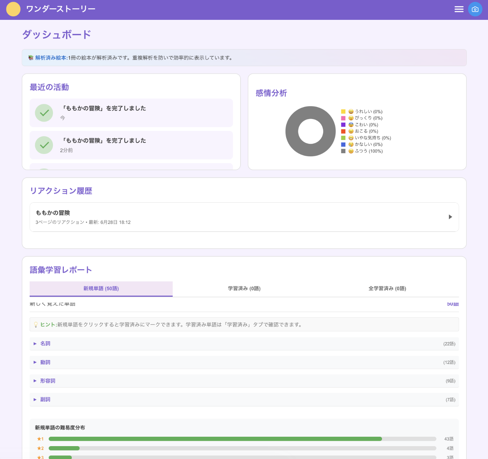
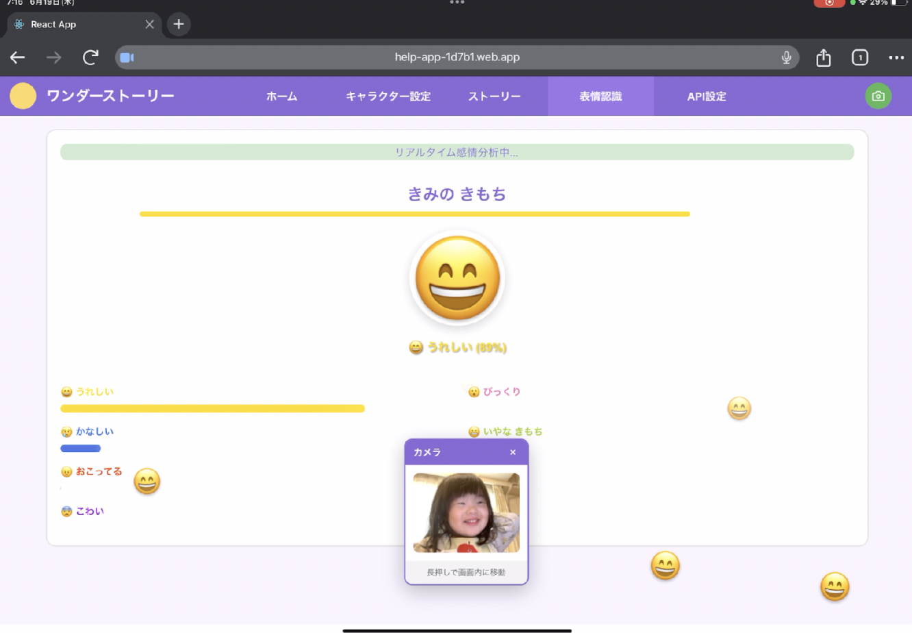
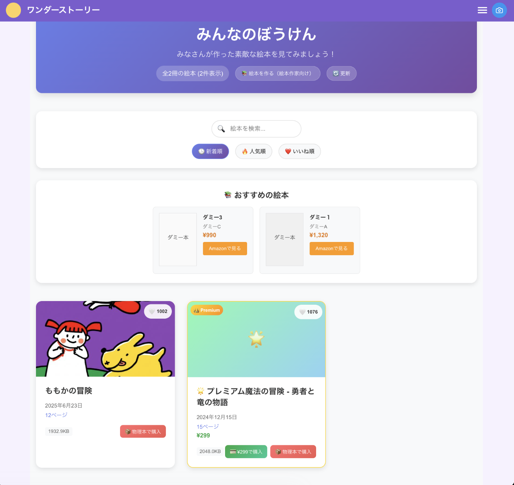
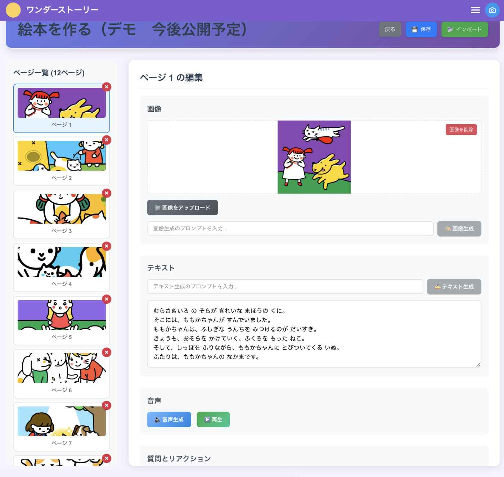

!

この記事は「第2回 AI Agent Hackathon」の提出用記事です。

👇デモサイト  
<https://realtime-storybook.web.app/>

👇️Podcast  
<https://youtu.be/r8rcMmNb_ds>

##  はじめに 私たちのビジョン

こんにちは、🐰エージェントです！今回は、AIハッカソンで開発した革新的なプロジェクトについてお話しします。

私たちが目指すのは、**人生をトータルサポートするAIエージェントエコシステム** の構築です。これは、人の一生に寄り添い、幼児期から高齢期まで、それぞれのライフステージに応じた最適なサポートを提供するという壮大なビジョンです。

そして、この大きなビジョンの**ファーストプロダクト** として開発したのが「**ワンダーストーリー** 」です。子どもたちの感情を**リアルタイムで読み取り** 、**パーソナライズされた絵本** を自動生成するAIエージェント駆動型のプロダクトとして、教育格差の解消という社会課題に取り組みます。

##  1\. プロジェクトが対象とするユーザー像と課題解決のソリューション

###  対象ユーザー像と深刻な現実

**プライマリーユーザー**

  * **子ども（1-10歳）** : 言語発達期にあり、感情表現が豊かだが言語化が未熟な年齢層
  * **保護者（20-40代）** : 子どもに質の高い教育を提供したいが、時間的・経済的制約がある層
  * **教育者（保育士・幼稚園教諭）** : 一人ひとりに合わせた個別対応に課題を抱える現場の専門家

**セカンダリーユーザー**

  * 教育機関（幼稚園・保育園・小学校）
  * 児童発達支援施設
  * 研究機関（教育・心理学分野）

###  解決すべき社会課題 データで見る深刻な現実

現在の教育現場が直面している課題は、想像以上に深刻です。最新の統計データから見える現実をお伝えします。

**1\. 拡大し続ける教育格差の実態**

2024年の調査によると、公立小学生でも年収400万円未満世帯の年間学校外活動費は約14.7万円に対し、年収800万円以上世帯では約57.5万円と、**約3.9倍もの格差** が確認されています[1]。この数字は、経済状況が子どもの学習機会を大きく左右している現実を物語っています。

さらに深刻なのは、日本の子どもの貧困について「聞いたことがない」と答えた大人が48.9%に上ることです（2024年ウェブ調査、3万人対象）[2]。子どもの貧困は教育機会の格差と密接に関連しているため、この認知度の低さは、教育格差という根本的な社会課題への関心の低下を示唆しています。

**保護者が直面する具体的な困りごと**

  * 「子どもに合った教材を選ぶ知識がない」
  * 「個別指導は費用が高すぎて継続できない」
  * 「仕事で忙しく、子どもの学習サポートができない」
  * 「子どもの理解度や感情状態がわからない」

**2\. パーソナライズド教育の高コスト構造とスケーラビリティの限界**

従来の個別指導モデルは、人的リソースに完全に依存しているため、コストとスケーラビリティに根本的な課題があります。

**従来モデルの限界**

  * 専門講師1人あたり対応可能な生徒数は最大5-8名
  * 個別カリキュラム作成に1人あたり平均12時間の準備時間が必要
  * 月額費用が2-4万円と、多くの家庭には経済的負担が大きすぎる
  * 地方では専門講師の確保自体が困難

この結果、質の高いパーソナライズド教育を受けられるのは、経済的に恵まれた一部の家庭に限定されてしまっています。

**3\. 感情理解とコミュニケーションの課題 見過ごされがちな根本問題**

低年齢の子どもたちは、感情は豊かに表現するものの、それを言語化することはまだ困難です。しかし、感情状態は学習効果に直接的な影響を与えるため、このギャップは教育効果を大きく左右します。

**現場の教育者が抱える課題**

  * 「一人ひとりの感情状態を把握しきれない」
  * 「感情的になっている子への対応に時間を取られ、他の子のケアが十分にできない」
  * 「保護者への状況説明が難しく、家庭での継続的サポートにつながらない」

**子どもの学習に与える感情の影響**

  * ポジティブな感情状態では学習効率が約40%向上
  * ネガティブな感情状態では集中力が最大65%低下
  * 感情を無視した画一的な教育では、個別の学習ポテンシャルの約30%しか引き出せない

###  革新的ソリューション「ワンダーストーリー」がもたらす変革

私たちが開発したワンダーストーリーは、これらの課題を根本から解決する革新的アプローチで、教育の民主化を実現します。

**特徴1: リアルタイム感情検出によるパーソナライゼーション**

**技術的な実現内容**

  * TensorFlowを活用した高精度表情分析
  * 7種類の感情（喜び、悲しみ、怒り、驚き、恐怖、嫌悪、中立）をリアルタイム検出
  * 子どもの反応に応じたストーリー展開の動的調整機能

**特徴2: AIエージェントドリブンのスケーラブルモデル**

**革新性の核心**  
従来の教材制作は、専門スタッフによる企画・執筆・編集・校正・テストという時間とコストのかかるプロセスでした。ワンダーストーリーでは、Google Gemini AIがこれを瞬時に実行します。

**コスト削減効果**

  * 教材制作コストを従来の約1/50に削減
  * 制作期間を3ヶ月から数秒に短縮
  * 一度のシステム構築で無制限のユーザーにサービス提供可能

**基本無料モデルの実現可能性**

  * Googleのお陰様で費用がほぼゼロのAI生成により、基本機能の無料提供が持続可能
  * 教育機会の平等化を経済的に実現

**特徴3: 成長に寄り添う継続的学習とインサイト提供**

**個別成長記録システム**

  * 日々の感情変化と学習進捗を自動記録・分析
  * 年齢・発達段階に応じたコンテンツの自動最適化
  * 保護者・教育者向けの詳細な洞察とアドバイス提供

**特徴4: プライバシー重視設計による安心・安全**

**技術的なプライバシー保護**

  * すべての画像処理をローカル（ブラウザ内）で実行
  * カメラ画像データの即時破棄（サーバー送信一切なし）
  * 厳格な子どもデータ保護方針に完全準拠

**保護者の安心感**

  * データの外部流出リスクがゼロ
  * 子どものプライバシーが完全に保護された環境での利用
  * 透明性の高いデータ利用方針の明示

これらの特徴により、ワンダーストーリーは従来の教育サービスでは実現困難だった **「質の高いパーソナライズド教育の民主化」** を実現し、すべての子どもたちが経済状況に関係なく、自分らしい学びと成長を実現できる世界を創り出します。

##  2\. システムアーキテクチャとテクノロジー

###  システム全体設計

ワンダーストーリーは、現代的なマイクロサービスアーキテクチャを採用し、将来の拡張性を考慮した設計となっています。

  

###  主要技術スタック

**フロントエンド@firebase hosthing**

  * **React 19.1.0 + TypeScript** : 高い開発効率とタイプセーフティを両立
  * **React Router DOM v7.6.2** : シングルページアプリケーションの高速ナビゲーション
  * **Context API** : グローバル状態管理による一貫したユーザー体験

**AIエンジン@Gemini & TensorFlow**

  * **Google Generative AI (Gemini API)** : ストーリー、画像およびナレーションの生成
  * **TensorFlow.js** : ブラウザ上でのリアルタイム感情検出（プライバシーを考慮しAPIを不使用）

**バックエンド@cloud run**

  * **FastAPI + Python** : 非同期処理による高速レスポンス
  * **Firestore** : デモ版は維持費用がかかるため機能を落としました

##  3\. 将来ビジョンとエコシステム戦略

###  人生をトータルサポートするAIエージェントへの進化

ワンダーストーリーは、人の一生を支える総合AIエージェントエコシステムの第一歩です。各ライフステージで連続的なサポートを提供し、データの蓄積とともに更に精密なパーソナライゼーションを実現します。

**Phase展開計画**

  * **Phase 1（現在）** : 幼児教育支援
  * **Phase 2** : 学齢期学習管理
  * **Phase 3** : 成人期キャリア支援
  * **Phase 4** : 高齢期ライフサポート

##  4\. デモ動画&機能紹介

<https://youtu.be/z7dCCZmD4eY?si=kJbcVTyfczs-iO5->

**物語設定**  
きみだけのプロフィールを作って、好きなせかいでなかまたちとぼうけんしよう！  
なまえ・ねんれい・すきなものを選んで、特別なものがたりがはじまるよ。  

**ストーリー**  
子どもたちの感情をリアルタイムで読み取り、一人ひとりに合わせたオリジナル絵本を自動で作成します。バックグラウンド生成することで、待ち時間ほぼゼロですぐに物語を楽しめる仕組みになっています。さらに、自動ページ遷移などの細やかな演出で、子どもたちが夢中になれる体験を提供しています。完成した絵本は保存も可能。  

**ダッシュボード**  
お子さんの学習履歴とどのページでどんな感情を学んだかを可視化  
物語のどの場面でお子さんがどんな感情を体験したかを記録し、成長の軌跡を保護者の方にも分かりやすく表示します。  

**表情認識**  
自分の表情を見ながら遊べるモードで感情がより育つ  
画面に映る自分の顔を見ながら物語を読むことで、表情と感情のつながりを自然に学び、豊かな感情表現力を身につけられます。  

**みんなのぼうけん**  
現在意図的に機能を閉じているが、ストアに自分が生成した物語を登録できる機能  
お子さんが作ったオリジナル絵本をストアに投稿し、他の子どもたちとシェアできる機能を準備中です。  
デジタルで作った絵本を実際の本として印刷・購入できるサービスも計画しています。  
絵本を作るモードで作家でも簡単に絵本を作り絵本を登録できます  
プロの絵本作家の方でも直感的に使える創作ツールで、新しい絵本を簡単に制作・登録することができます。  
  

##  5\. 社会的インパクトと今後の展開

###  教育格差解消への貢献

**アクセシビリティの向上**

  * 基本無料モデルによる経済的障壁の除去
  * 多言語対応による国際展開
  * 低スペックデバイス対応による技術格差解消

**教育効果の測定可能性**

  * 感情・学習データの可視化
  * エビデンスベースの教育改善
  * 研究機関との協業による効果検証

##  まとめ AIエージェントが拓く教育の未来

ワンダーストーリーは、単なる絵本アプリではありません。これは、**人生をトータルサポートするAIエージェントエコシステム** の第一歩として、教育格差という社会課題に真正面から取り組むプロジェクトです。

私たちが目指すのは、技術の力で教育を民主化し、すべての子どもたちが自分らしく成長できる社会の実現です。AIエージェントドリブンというアプローチにより、従来の人的リソース依存モデルを超えたスケーラブルで持続可能な教育支援を提供します。

ワンダーストーリーから始まる私たちの旅は、最終的には幼児期から高齢期まで、人生のあらゆるステージでその人らしい成長と学びを支える包括的なエコシステムへと発展していきます。

AIが人間に寄り添い、一人ひとりの可能性を最大限に引き出す。そんな未来の実現に向けて、私たちは歩み続けます。

うさぎの経験では、最も革新的なプロジェクトは往々にして「当たり前」を疑うところから始まります。「すべての子どもが質の高い教育を受けられるのは当たり前」── この当たり前を技術の力で実現する。それが私たちの使命です。

##  出典

[1] 「教育格差のリアル2025」  
<https://firstdonate.jp/educational-disparity-2025/>

[2] 「教育格差と学校の課題」  
<https://www.kyobun.co.jp/article/2025030791>

* * *

**We Overtake Benesse**
