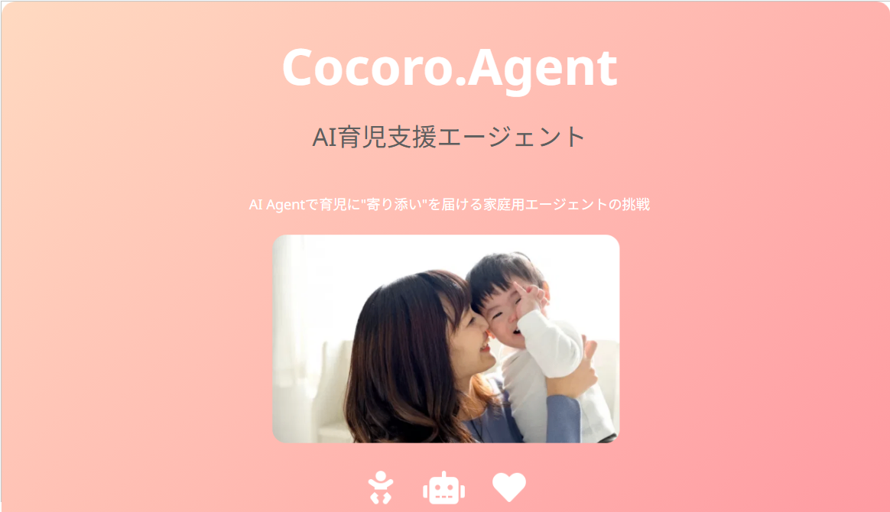

  
[https://docs.google.com/presentation/d/1P0NXHu9TEL2qvryjJQM0Y2UBmGus2XLP/edit?usp=sharing&ouid=107697309194714711209&rtpof=true&sd=true](https://docs.google.com/presentation/d/1P0NXHu9TEL2qvryjJQM0Y2UBmGus2XLP/edit?usp=sharing&ouid=107697309194714711209&rtpof=true&sd=true)

#  AI Agentで育児に“寄り添い”を届ける家庭用エージェントの挑戦

##  はじめに

子育て。それは、命を育む最も尊くて、最も手探りな営みです。特に0〜3歳の乳幼児期は、「泣いている理由がわからない」「どうしたら寝てくれるのか分からない」といった、親にとっての“わからなさ”が連続します。また、加速主義の時代により子育ての手法も常識も急激に変化をしています。

私たちのチームは、この「わからなさ」を少しでも和らげ、子ども一人ひとりに合った“最適な育児”を親が選べるようにするために、**Cocoro.Agent（ココロ・エージェント）**というAIアプリを開発しました。

* * *

##  1\. ユーザー像と課題、Cocoro.Agentのソリューション

###  対象ユーザー

  * 0〜3歳の乳幼児を育てる親（特に初めての育児に不安を抱える方）
  * 日々の育児に「正解がわからない」と悩み、検索疲れを感じている方
  * 他の家庭の知見を参考にしたいが、SNSの情報に振り回されたくない方

###  ユーザーが抱える課題

  * 子どもの反応や性格に合った育児方法が分からず、試行錯誤の連続
  * アイテム（抱っこ紐、子守唄、寝かしつけグッズなど）の選択が困難
  * 情報が多すぎて、どれを信じたらよいか分からない

###  Cocoro.Agent が提供するソリューション

  * スマートフォンのカメラ・マイクを通じて、赤ちゃんの行動・表情・声を収集
  * Google CloudのAI技術（Vision API、Speech-to-Text、Gemini）でリアルタイム解析
  * 「その子にとって今最適な育児アクション」を文脈に応じてレコメンド
  * 他の家庭の成功事例をナレッジとして蓄積し、AIが活用
  * 親同士がナレッジを共有できるコミュニティ機能も実装

**Cocoro.Agent は、“情報”ではなく“気づき”を届けるエージェントです。**

* * *

##  2\. システム構成

以下が Cocoro.Agent のアーキテクチャ全体像です。  

###  主な構成要素

レイヤー | 使用技術 | 概要  
---|---|---  
フロントエンド | Firebase Hosting + React | モバイル向けのレスポンシブUI（カメラ・マイクアクセス）  
認証・DB | Firebase Authentication / Firestore | ユーザー認証と知見ナレッジの保存  
メディア保存 | Firebase Storage | 音声・映像の一時保存  
処理API | Firebase Cloud Functions | 処理起点、メディア解析タスクの起動  
メディア解析 | Cloud Run + Vertex AI (Vision/Audio) | 映像・音声のリアルタイム解析  
推薦生成 | Vertex AI Gemini | 子ども個別の反応・知見に基づく自然文推薦  
  
* * *

##  3\. プロジェクトのデモ動画（3分）

##  <https://youtu.be/Mnl9E-FIcSU>

##  今後の展望

  * Nest Cam や Google Home など家庭内デバイスとの連携による精度向上
  * 育児記録と連動した成長ジャーナル機能の実装
  * 音声対話型UIの追加（話しかけるだけでアドバイスが返る）

* * *

##  終わりに

育児に「絶対の正解」はありません。けれど、「今この子に合っている選択肢」は存在します。  
Cocoro.Agent は、その“いま”に寄り添う存在でありたいと願っています。

子育てを、もっと科学的に。もっと感覚的に。

**心を持ったAI＝Cocoro.Agent** で、すべての家庭に安心と発見を。

* * *

コメント・フィードバック大歓迎です！  
ご意見はZenn コメント欄まで。  
デモ体験希望やコラボレーションもお気軽にご連絡ください！
