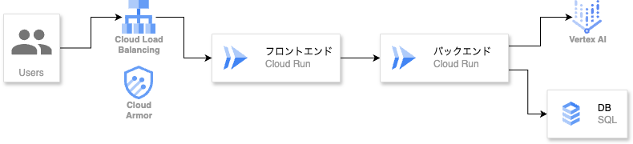

##  背景

日記は、単なる出来事の記録にとどまらず、心の動きや思考の変化を可視化し、自分を深く理解するための優れた手段です。  
しかし多くの人にとって、日記を **「継続的に書き続ける」** という行為には高いハードルが存在します。特に、忙しい日々の中で毎回文章を考える負担や、時間を確保する面倒さが挫折の原因となっています。

##  課題

  * 書く時間・気力の確保が難しい
  * 「何を書けばいいのか分からない」という迷いが継続を阻む
  * 書き溜めたとしても、活用方法が限定的（読み返す以外に使い道がない）

自分自身、日記を続けようとして何度も挫折してきました。  
「今日あったことを、ただ書くだけ」でいいはずなのに、  
毎回何を書けばいいか悩んだり、時間がなくて書けなかったりで、気づけば白紙のまま数日、数週間が経ってしまう。

それでも、ふと書けた日の文章を読み返してみると、  
「あのとき何を考えてたか」「どう悩んでいたか」が言葉になっていて、  
その蓄積が自分の理解につながる感覚がありました。

書けたときの価値は確かにある。でも、書き続けるのが難しい。

それなら、「書くこと」自体をもっと軽く、自然にできる仕組みがあればいいな。  
そう思ってたどり着いたのが、**AIエージェントとの対話による“話す日記”** という形です

##  アプリの特徴

日記を書くという行為は、単に出来事を残すためだけのものではありません。  
それは自分自身の感情や思考を言語化し、可視化するプロセスでもあります。

特に、忙しい日常の中では「なんとなくモヤモヤしていた」「言葉にできない疲れがあった」といった感覚が曖昧なまま流れてしまいがちです。  
でも、そうした曖昧な感情こそ、書き留めておく価値がある。

AIaryでは、こうした日々の心の動きを、AIとの対話を通して無理なく言葉にしていく仕組みを提供しています。  
ユーザーは深く考え込まなくても、問いに答えていくだけで思考を整理でき、  
その結果として、自分自身への理解が少しずつ積み上がっていきます。

###  日記機能

AIアシスタント連携: Gemini APIを使用したAI対話形式の日記作成  
感情トラッキング: 絵文字による感情記録機能  
日付別管理: 日付ごとの日記作成・編集・削除  
自動日記生成: AIが対話内容から日記を自動生成

###  表示・管理機能

カレンダービュー: 月単位でのビジュアル表示  
統計ダッシュボード: 記録統計と実績バッジシステム  
レスポンシブUI: Tailwind CSSによるモダンなデザイン

##  ユースケース

AIaryでは、日記の入力方法として「文字入力」と「音声入力」の2つを用意しています。  
これにより、ユーザーはその日の状況や気分に応じて、より自然な形で日記を書けるようになっています。

* * *

###  🚃 仕事帰りの電車で、静かに1日を振り返る

仕事終わり、帰りの電車の中。  
周囲に人はいても、スマートフォンで静かに文章を打つことはできる。そんなときは文字入力が最適です。

その日の出来事を振り返りながら、AIからの問いかけに少しずつ答えていくことで、自然と日記が形になっていきます。

「今日はどんな一日だった？」「印象に残っていることは？」  
無理に書こうとしなくても、問いに応じて思考が整理されていく感覚があります。

* * *

###  🏠 おうちでまったり、話すだけのながら日記体験

家に帰ってホッと一息ついたタイミングで、音声入力をオンにしてAIと会話を始めることもできます。  
このモードでは、AIが順に質問を投げかけ、それに声で答えるだけで日記が自動生成されます。

一度音声入力を開始すれば、やり取りを終えるまで手を使う必要はありません。  
家事をしながら、ソファでくつろぎながら、「ああ今日こんなことがあったなあ」と話すだけ。  
文体や構成は気にしなくてOK。AIが適切な文章にまとめてくれます。

「うまく話せない」「思いつかない」と感じるときも、AIの問いかけが思考を引き出してくれるので、まるで“心の整理を手伝ってくれる会話相手”のような存在になります。

* * *

こうした「状況に応じた日記体験」を提供することで、  
**日記は“書く”ものから、“話せる・応えていける”ものへと進化** します。

AIaryは、忙しい日常の中でも、あなたが自分と向き合う時間を自然に生み出すサポーターです。

##  技術スタック

フロントエンド: Next.js 15 + TypeScript + React 19  
バックエンド: Rust + Axum + PostgreSQL  
AI: Google Gemini 2.0 Flash API  
認証: NextAuth.js + Google OAuth  
データベース: PostgreSQL with SQLx  
コンテナ: Docker対応（フロント・バック両方）

##  システムアーキテクチャ

##  システム構成について

本アプリケーションは、すべてのコンポーネントをCloud Run上で動かしています。  
フロントエンド（Next.js）とバックエンド（Rust）をそれぞれ分離し、独立したCloud Runサービスとしてデプロイすることで、開発とデプロイの自由度を高めています。

通信経路としては、Cloud Load BalancingとCloud Armorを使って外部からのリクエストを一元的に受け、WAF（Web Application Firewall）ルールを通したうえで、フロントエンドへルーティングされます。  
バックエンドへのアクセスは、原則としてフロントエンド経由とし、Cloud RunのIAM設定で`allUsers`を制限。内部的にはサービスアカウントによる呼び出しのみ許可することで、セキュリティを担保しています。

バックエンドからは、Cloud SQL（PostgreSQL）に対してPrivate IP経由でアクセスを行っています。  
この構成を選んだ理由は主に以下の2点です：

  * 通信をVPC内部に限定することで、Cloud SQLのパブリックIPを開けずに済む
  * IAMによる認可を利用し、サービスアカウントベースで接続管理が可能

TerraformでVPCネットワーク、VPC Connector、Private Service Connect、サブネット構成（Private Google Access有効化）などを定義し、Cloud SQLへのセキュアな通信を確保しています。

また、バックエンドからはVertex AIへのアクセスも行います。  
ユーザーとの対話から得られた情報を、LLMに送って自然言語での整形や要約、キャラクター的な返答などに活用しています。

Vertex AIとの通信はインターネット経由になりますが、同様にVPC内からのegressを許可するFirewallルールを定義し、最小限の範囲でHTTPSトラフィックを許可するようにしています。

こうした構成をTerraformで一括管理することで、手動操作のミスを減らしつつ、今後のスケーラビリティにも対応できる基盤を整えています。

##  サービスデモ

<https://youtu.be/v2-hajSn1Ws>

##  開発にあたっての思い・苦労した点など

AIとの対話をベースにした日記アプリという構想が形になったのは、近年の技術革新と、ChatGPTやGeminiのような大規模言語モデルが日常に浸透しつつある今だからこそ、だと思っています。

私自身、日頃からChatGPTを使って考えを整理したり、もやもやした感情を言語化したりしています。  
その中で特に印象的だったのは、AIとの会話の中でふと返ってくる一言が、自分の心の奥にあった想いを代弁してくれるような体験です。

「あ、それが言いたかったんだよな」  
そんな瞬間が、何度もありました。

この感覚は、AIを単なるツールではなく「思考を共につくる相手」として捉えるきっかけになりました。  
その体験が、AIとの対話で日記を“構築していく”という発想につながったのです。

実は開発初期の構想では、AIと英語で日記を書く「英語学習ツール」としての活用を考えていました。  
日記を書くことは言語習得に効果的と言われていますが、実際に英語で日記を書こうとすると多くの人が挫折します。

  * 「この表現、合ってるのかな？」
  * 「そもそも、これって英語で何て言うんだっけ？」
  * 「添削してくれる人もいないし、続けられる気がしない…」

こうした不安や面倒さがハードルとなって、習慣化しにくい。

そこにLLMを組み合わせることで、「継続できる英語日記体験」が提供できるのでは？というのが、AIaryの出発点でした。  
でも開発を進めていくうちに、“まず日記を気軽に書ける”という体験自体に大きな価値があることに気づき、現在の形へと機能を絞っていくことになりました。

こうした軌道修正をしやすいのは期間の長めに設定されているハッカソンだからこそできたことだと思います。

###  セキュリティとインフラまわりの落とし穴

アイデアはシンプル。対話で日記をつくる。それだけなら技術的に難しいことはない。  
…そう思ってた時期が、私にもありました。

デモアプリ自体は比較的すぐに動きました。  
Cloud Runでフロントとバックを分け、Cloud SQLと繋ぐ。LLMとの対話部分もGemini Flashでサクサク。

でも、実際に動かす環境を本番に近づけようとした瞬間、**Cloud Run同士のIAM認証・VPC周り・Cloud SQL接続制限・Private Google Accessの有無…** と、地味だけど確実に詰まるポイントのオンパレード。

業務でもインフラには触っていたのですが、認証周りは整備済みの環境を触るだけだったので、  
**“サービスアカウントがどう繋がるか”とか、“VPC Connectorのegress設定でAPIが塞がる”** といったリアルな落とし穴には、なかなか気づけませんでした。

今となっては「Cloud SQLにアクセスできない＝Private Google Accessが有効化されていない」が一瞬でわかるようになりましたが、当時は  
「え、なんで403なん？？」と深夜にはまりまくってました（笑）

こんなふうに、AIaryは **「理想を形にするには、地味で泥臭い試行錯誤が必要」** ということを教えてくれたプロジェクトでもあります。  
同時に、自分の思い描いた体験を、自分の手で届けられる喜びも味わえました。

デプロイ後には会社の同僚や友人たちに触ってもらって、いいフィードバックが聞けてすごく嬉しかったです。

##  今後の展望

現在のAIaryは、ユーザーが日々を記録し、自分を見つめ直すための“きっかけ”を提供する段階にあります。

今後は、記録された日記データから感情の傾向やテーマを抽出し、週単位や月単位の振り返りを自動生成するような、  
**自己分析支援ツール** としての発展も考えています。

また、対話エージェントが過去の日記という文脈を踏まえた質問ができるようにすることも、よりユーザー体験を高めるために目指しています。

“日記を通じて自分を理解する” その第一歩を、より優しく、楽しくすることがこのアプリの目標です。

  * 数ヶ月後、自分の感情の傾向が可視化されて気づく変化
  * 思考のクセを知り、意思決定がラクになる体験
  * AIが“過去の自分”の言葉を引用してアドバイスしてくれる未来

こうした未来はまだ理想の途中かもしれませんが、  
小さな一歩として、AIaryは“いまこの瞬間の自分”に丁寧に向き合う手助けから始めていきます。

「1ヶ月前のあなたは、こんな言葉を残していましたよ」  
そんな風に、AIが自分の変化に気づかせてくれる日が来たら、  
日記は単なる記録ではなく、“自分を支える存在”になるのかもしれません。
