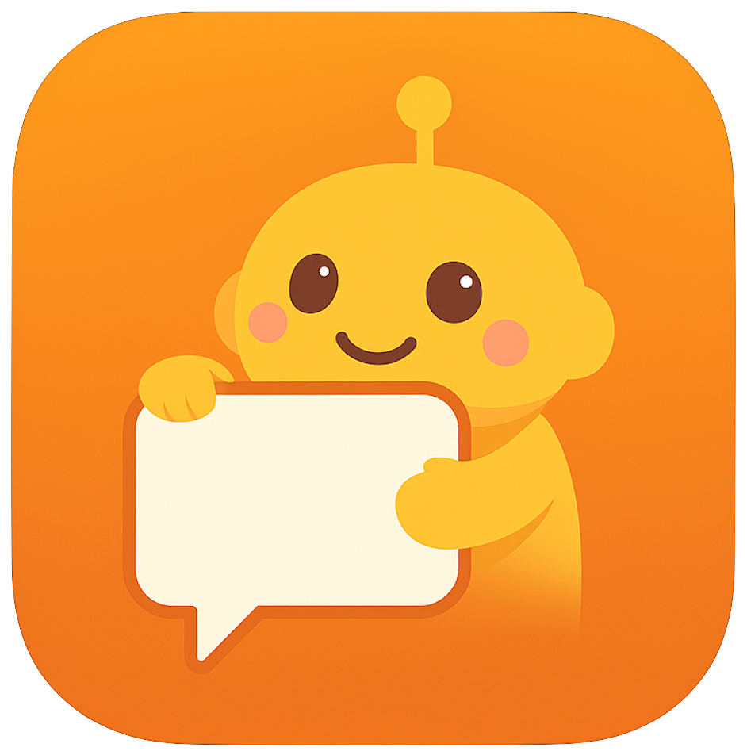
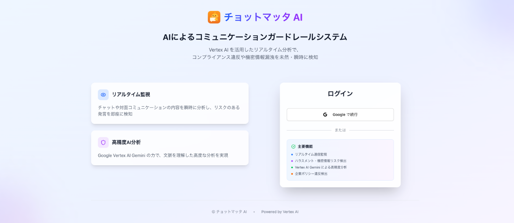
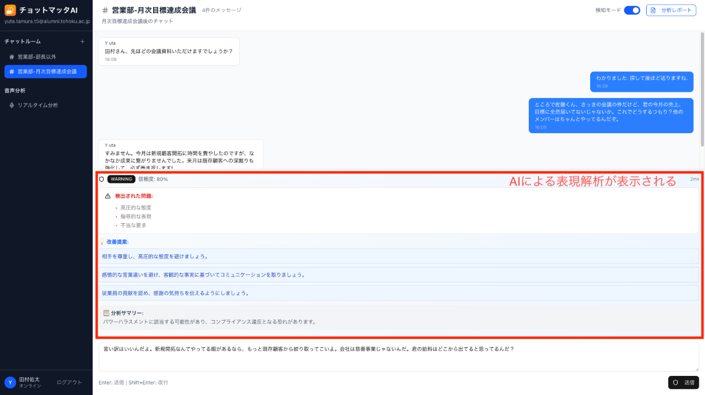
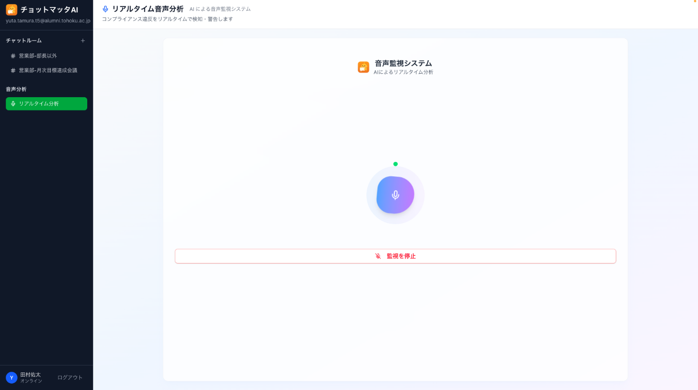
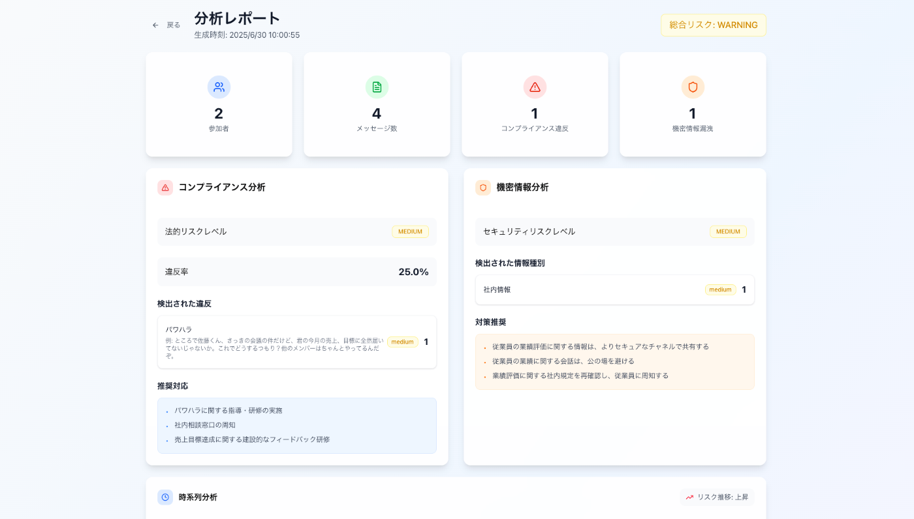
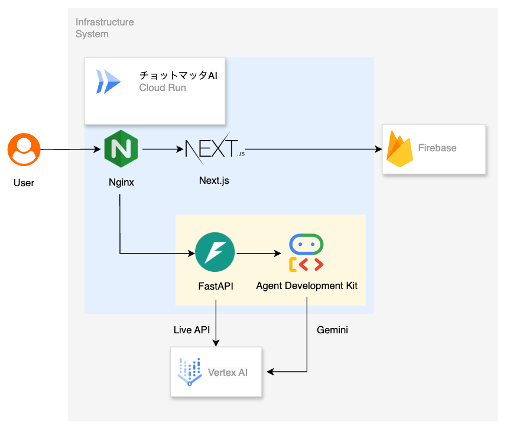
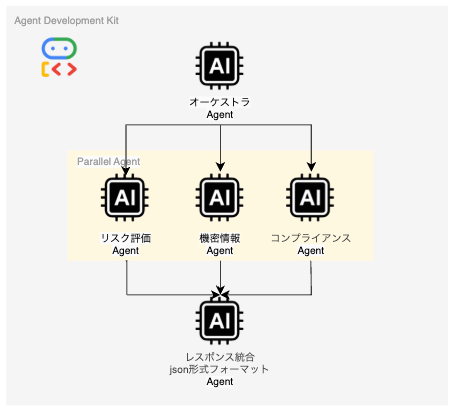

##  🌟 はじめに

<https://www.youtube.com/watch?v=8zPlaifACog>

突然ですが、職場でのコミュニケーションってチャット・対面に関わらずなんだか難しいですよね💦  
私も日々実感しているのですが、「ハラスメント発言」と「機密情報漏洩」なんかは昨今の絶えないコミュニケーション課題なんじゃないかなと思っています! ご存知の方もいらっしゃると思いますが、現在多くの企業が**ハラスメント問題** と**機密情報漏洩** という深刻な課題に直面しています(詳細は後述)。

そこで、私たちは「**チョットマッタAI** 」開発しました！🥳  
このプロダクトは、**Agent Development Kit・Gemini in Vertex AI・Live API** を活用し、これらの課題をリアルタイムで解決する**AI監視型コミュニケーションガードレールシステム** です。

↑ AIがコミュニケーションをやさしく守っているイメージです

##  🎯 プロジェクトが対象とするユーザー像と解決する課題

###  👥 対象ユーザー像

**プライマリーユーザー**

  * **企業の人事・労務管理者** : 職場でのハラスメント防止とコンプライアンス強化を求める責任者
  * **従業員** : 安全で健全なコミュニケーション環境を望む全ての社員
  * **管理職** : 適切なマネジメントスキル向上を目指すリーダー層

###  🚨 解決すべき社会課題

現代の職場が直面する深刻な問題を、データとともに見ていきましょう。

####  1\. 🔴 職場ハラスメントの深刻化

厚生労働省の最新調査データによると、職場のハラスメントは深刻な社会問題となっています：

**📊 統計データで見る現状（2024年最新発表）**

  * **個別労働紛争相談件数** ：**279,210件** （令和5年度、うちいじめ・嫌がらせが**86,570件** で最多）
  * **セクシュアルハラスメント相談件数** ：**7,317件** （令和5年度）
  * **精神障害の労災認定件数** ：**710件** （令和4年度、うち「いじめ・嫌がらせ」が原因のもの**308件** ）
  * **ハラスメント被害経験率** ：過去3年間で**28.2%**の労働者がハラスメントを経験（令和2年度調査）

**⚠️ 特に深刻な課題**

  * **1on1やチャットでのモラハラが見逃されがち** : 密室での発言や文字でのやり取りは第三者の目が届かず、被害が表面化しにくい
  * **ハラスメントが原因での退職者の増加** : 貴重な人材の流出が企業の競争力低下を招く
  * **被害者が声を上げにくい環境** : 権力関係や組織の構造により、相談をためらうケースが多い
  * **企業の対策不足** : ハラスメント防止措置を講じていない企業が依然として存在

> **参考データ源** :
> 
>   * [厚生労働省「職場のハラスメントに関する実態調査」（令和5年度）](https://www.mhlw.go.jp/stf/seisakunitsuite/bunya/0000165756.html)
>   * [厚生労働省「あかるい職場応援団」](https://www.no-harassment.mhlw.go.jp/)
>   * [厚生労働省「ハラスメント防止対策に関する調査」](https://www.mhlw.go.jp/)
> 

####  2\. 🔓 機密情報漏洩リスクの拡大

デジタル化とリモートワークの普及により、**意図しない機密情報の漏洩** は企業にとって致命的なリスクとなっています：

**情報セキュリティ統計データ（2023年度）**

  * **情報セキュリティインシデント報告件数** ：年間**1,794件** （NISC調査、前年度比22%増）
  * **個人情報漏洩事故の経済損失** ：1件あたり平均**3億1,200万円** （日本ネットワークセキュリティ協会調べ）
  * **内部不正による情報漏洩** ：全体の**15.7%**を占める（IPA情報セキュリティ白書2023）

**現代特有のリスク要因**

  * **日常会話での機密情報の言及** : 何気ない会話の中で重要な情報が外部に漏れる可能性
  * **リモートワーク環境での情報管理の困難** : 在宅勤務中の会話や画面共有での意図しない情報開示
  * **チャット・メールでの誤送信** : 宛先間違いや添付ファイルの取り扱いミス
  * **事後対応による組織ダメージ** : 問題発覚後の対応では、すでに情報が拡散している可能性

> **参考データ源** :
> 
>   * [内閣サイバーセキュリティセンター（NISC）「政府機関等のサイバーセキュリティ対策の実態調査」](https://www.nisc.go.jp/)
>   * [IPA（情報処理推進機構）「情報セキュリティ白書2023」](https://www.ipa.go.jp/security/)
>   * [JNSA（日本ネットワークセキュリティ協会）「情報セキュリティインシデントに関する調査報告書」](https://www.jnsa.org/)
> 

##  🚀 「チョットマッタAI」がもたらす変革

###  ✨ ソリューションの特徴

**🤖 リアルタイムAI監視 + 予防的コミュニケーション支援システム**

私たちのソリューションは、従来の「事後対応型」から「予防型」へのパラダイムシフトを実現します！  
普通は監視できないプライベートなコミュニケーションも、AIであればいつでも見守ってくれます！

##  主要機能

###  1.💬リアルタイムチャット分析

チャット送信前にAIが内容をチェックし、以下を検知・提案：

  * ハラスメントに該当する可能性のある表現を検知
  * 機密事項を参照し、含まれる可能性のあるメッセージを検知
  * より建設的なコミュニケーションのための表現アドバイス

###  2.🎤音声リアルタイム監視

1on1やミーティング中に：

  * セクハラ・モラハラの兆候を感知
  * 不適切な発言に対する即座の介入
  * 「**ちょっと待った！その言い方、相手さんどう思うやろか？** 」といった関西弁での自然な注意喚起

###  3.📊詳細レポート生成

  * コミュニケーション傾向の可視化
  * リスク要因の特定と改善提案
  * 組織全体のコンプライアンス状況の把握

##  🏗️ システムアーキテクチャ

###  🛠️ 技術スタック

####  ✅ Google Cloud Service

  * **アプリケーション** : Cloud Run
  * **AI** : Agent Development Kit (ADK) ⭐️, Gemini API in Vertex AI, Live API

####  🎨 フロントエンド

  * Next.js (App Router + TypeScript)
  * Nginx

####  ⚙️ バックエンド

  * Fast API

####  🤖 Agentについて(余談)

  * Agent Develpment Kitを使いましたが、並列・直列Agentが強力でした！
  * 今回の実装では、並列実行させた結果を直列で繋いで、出力を整形するというやり方のシンプルな構成にしました

##  🌍 社会的インパクトと今後の展望

###  📈 期待される効果

####  ⚡ 即座の効果

  * **ハラスメント発生率の大幅削減** : リアルタイム介入による予防効果で**70-80%**の削減を目指す
  * **機密情報漏洩リスクの最小化** : 送信前・発言前のチェック機能で**誤送信事故を90%削減**
  * **従業員の心理的安全性向上** : 安心してコミュニケーションできる環境の構築で**離職率20%改善**

####  🌱 中長期的効果

  * **組織文化の改善** : 建設的なコミュニケーションの定着により**生産性向上15-25%**
  * **法的リスクの軽減** : コンプライアンス違反の事前防止で**訴訟リスク80%削減**
  * **人材定着率の向上** : 健全な職場環境による離職率低下で**採用コスト50%削減**
  * **企業評価の向上** : ESG評価における「S（社会）」スコア改善

> **試算根拠** :
> 
>   * [厚生労働省「職場のハラスメント対策に関するコスト調査」](https://www.mhlw.go.jp/)
>   * [リクルート「中途採用実態調査2023」](https://www.recruit.co.jp/)
>   * [東京商工リサーチ「従業員の離職に関する企業の負担調査」](https://www.tsr-net.co.jp/)
> 

###  🔮 今後の発展方向

  1. **多言語対応** : グローバル企業での活用拡大
  2. **業界特化型カスタマイズ** : 各業界の特性に応じたルール設定
  3. **感情分析の高度化** : より細やかな心理状態の把握
  4. **研修連携機能** : 検知された問題に基づく個別研修プログラムの提案

##  🎉 まとめ

チョットマッタAIは、単なる監視システムではありません。**すべての従業員が安心して働ける環境の実現** を目指す、予防型コミュニケーション支援システムです。

ADKとVertex AI Gemini APIの最新技術を活用することで、これまで解決困難だった職場のコミュニケーション課題に対して、実用的で効果的なソリューションを提供します!

私たちが目指すのは、技術の力で**人間らしい、温かみのあるコミュニケーション** を守り、育てていくこと。AIが人間に寄り添い、より良い職場環境の構築に貢献する。そんな未来の実現に向けて、私たちは歩み続けます!

##  📋 データソースについて

本記事で引用した統計データは、すべて日本国政府機関および信頼できる調査機関の公式発表に基づいています。最新の社会課題を正確に把握し、適切なソリューション提案を行うため、以下の原則でデータを選定しています：

  * **政府機関の公式統計** : 厚生労働省、内閣サイバーセキュリティセンター等
  * **業界団体の調査報告** : 日本ネットワークセキュリティ協会、情報処理推進機構等
  * **最新性の確保** : 2022-2024年の直近データを優先的に採用
  * **出典の明記** : すべての統計データに対して出典URLを明記

* * *

_このプロジェクトは「第2回 AI Agent Hackathon」において開発されました。職場のコミュニケーション課題解決という社会的意義の高いテーマに、最新のAI技術で挑戦した成果です。_
