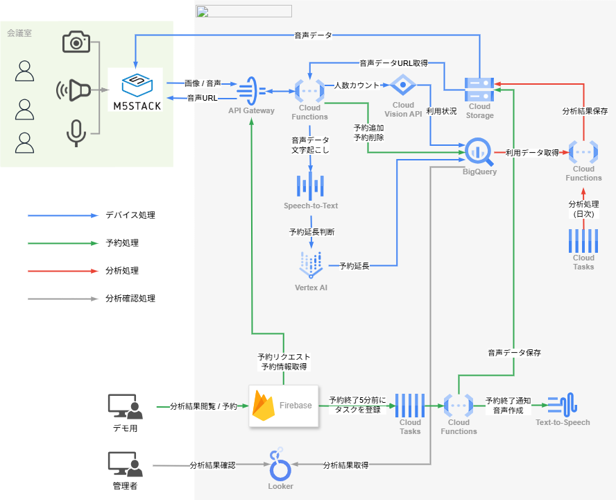

#  RoomBot

<https://youtube.com/shorts/XT_Puz_A5Rk>

#  1\. 背景

##  会議室管理における課題

現代のオフィスでは会議室の効率的な運用が求められますが、以下のような問題が顕在化しています：

  * **ゴースト予約** ：予約されながら実際には使われていない会議室
  * **稼働率の不透明性** ：どれだけ使われているかの実態が把握しにくい
  * **手動運用の非効率性** ：管理者による目視確認や予約の手動調整
  * **リアルタイム対応の困難さ** ：突然の空き確認や延長手続きが煩雑

##  解決策：IoTとAIの融合

これらの課題に対し、IoTデバイスとGoogle CloudのAIサービスを活用した「RoomBot」システムを開発しました。M5Stackによる画像・音声の取得とAI分析により、会議室の利用状況を自動で把握・可視化・通知します。

#  2\. RoomBotってなに？

RoomBotは、会議室に設置されたIoTデバイス（M5Stack）とGCPを連携させたスマート監視・対話システムです。

##  どんなことができるの？

  * **自動監視** ：5分ごとに画像を撮影し、利用状況を検知
  * **AI分析** ：Google Cloud Vision APIで人数を自動検出
  * **音声対話** ：音声による延長確認や通知に対応
  * **リアルタイム可視化** ：Firebaseで稼働状況を即時表示

##  使っている技術

領域 | 技術  
---|---  
デバイス | M5Stackシリーズ  
クラウド | Google Cloud Platform  
AIサービス | Vision API / STT / TTS  
データベース | BigQuery  
フロントエンド | React + TypeScript + Vite  
可視化 | Firebase  
  
#  3\. 仕組みの紹介

##  3.1 主要機能

###  📷 自動画像分析

  * 5分間隔で画像撮影
  * Vision APIで人数を検出しBigQueryに保存

###  📅 予約管理

  * 予約情報（時間・人数など）を記録
  * 画像との突合でゴースト予約を検出
  * 稼働率を自動算出

※デモ用に自作システムを実装  
Googleカレンダーとの連携を想定

###  🗣 音声対話機能

  * 会議5分前に音声で通知
  * 音声入力で延長確認を実行
  * TTS/STTで自然な日本語対話に対応

###  📊 リアルタイムモニタリング

  * 利用状況をダッシュボードで可視化
  * 15分単位で平均人数を集計
  * 日次レポートで利用傾向を分析

##  3.2 どう動いているの？

###  構成図

###  データフロー概要

  1. M5Stackが画像を撮影しCloud Runに送信（青線）
  2. Cloud RunでVision APIによる解析を実施（青線）
  3. 結果をBigQueryへ保存（青線）
  4. リアルタイム統計（15分単位）・日次分析を実行（赤線）
  5. Firebaseで可視化（灰線）

###  BigQuery スキーマ設計

テーブル名 | 内容  
---|---  
`meeting_rooms` | 会議室の基本情報  
`reservations` | 予約情報（room_idクラスタ）  
`room_logs` | 人数検出ログ  
`analysis_results` | 日次分析結果  
`mv_daily_room_stats` | 日次統計ビュー  
`mv_recent_occupancy_15m` | 15分単位のリアルタイム統計  
  
##  3.3 どんなふうに作ったの？

###  会議室（M5Stack）

  * Wi-Fi接続（プライマリ/バックアップ対応）
  * IDトークン認証
  * 画像撮影と音声通知
  * 音声による延長確認（マイク/スピーカー）

###  バックエンド（Cloud Run/FastAPI）
    
    
    # 代表的なエンドポイント
    /upload         # 画像アップロード
    /messages       # 通知メッセージの取得
    /response       # 音声応答の処理
    /reservations   # 予約情報の管理
    /rooms          # 会議室情報の管理
    /analysis       # 分析結果の取得
    

###  フロントエンド（Firebase/React）

  * ダッシュボード表示
  * 予約・稼働状況の管理UI
  * 分析結果確認表示

#  4\. こんなふうに動きます（予定の動画）

  * 人数カウントの流れ（デバイス → AI解析）
  * 5分前の音声通知
  * 音声による延長確認
  * Firebaseでの分析画面
  * UI構成と予約画面の説明

#  📝 まとめ

RoomBotは、IoTとAIの技術を組み合わせることで、オフィスの会議室管理をもっと「かんたんで、わかりやすく」するために生まれたシステムです。

##  ✅ どんなことができるようになったか

  * **使われなかった会議室（ゴースト予約）を発見**  
実際に何人使ったかをカメラとAIでチェックし、予約とのズレを見つけられるようになりました。

  * **リアルタイムに状況が見える**  
使われているかどうかが、いつでもダッシュボードで確認できます。急な会議にもすぐ対応できます。

  * **声でやりとりができる**  
会議の延長も、わざわざパソコンを開かなくても、声で簡単に対応できます。日本語で自然に話せるのもポイントです。

  * **使い方の傾向がわかる**  
毎日どれくらい使われているかを自動でまとめてくれるので、無駄がない使い方に見直せます。

##  🔧 技術面の工夫

  * **安くて小さい機械でもしっかり動く**  
M5Stackという手のひらサイズのデバイスでも、クラウドとつないで高機能に。

  * **たくさんの会議室でも安心**  
会議室が増えても、Google Cloudでしっかり対応できる仕組みにしました。

  * **シンプルでわかりやすい構成**  
作る側も使う側も、ムダが少なく保守しやすい仕組みにこだわっています。

##  🚀 これからの展開

  * **Googleカレンダーと連携して本格運用へ**  
デモでは自作の予約システムを使っていますが、今後は実際のスケジュールとつないで使えるようにします。

  * **もっとパーソナルに**  
顔認識やユーザー情報を使って予約者が使っているかを判断する（実は違う人が使っているを判断する）

  * **会議室以外にも広げていきたい**  
休憩スペースやフリースペースなど、オフィス全体を見守る仕組みに発展させていく予定です。

* * *

このRoomBotプロジェクトは、「会議室が埋まっていて使えない。けど誰もいないよね？会議室をもっと便利に使えたらいいのに」という思いから始まりました。最先端の技術を、誰でも使えるかたちで届けることで、これからのオフィスの働き方が少しでも快適になることを目指しています。
