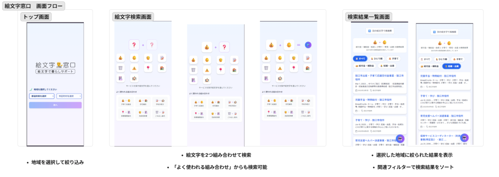
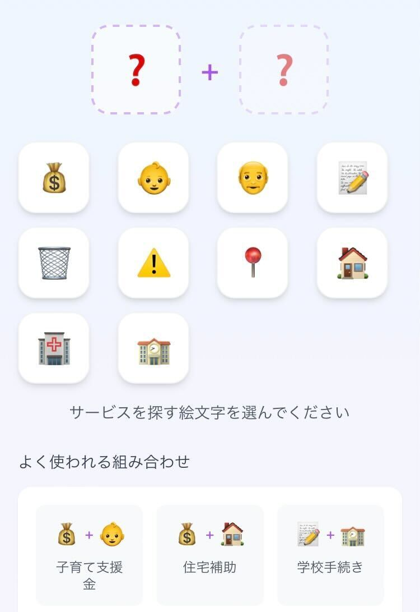
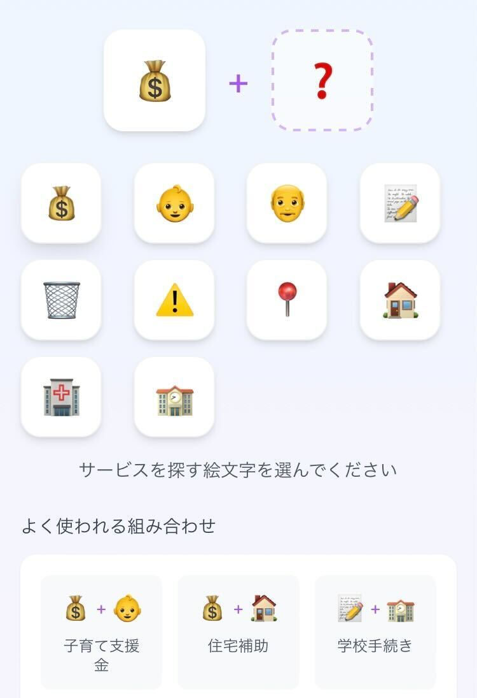
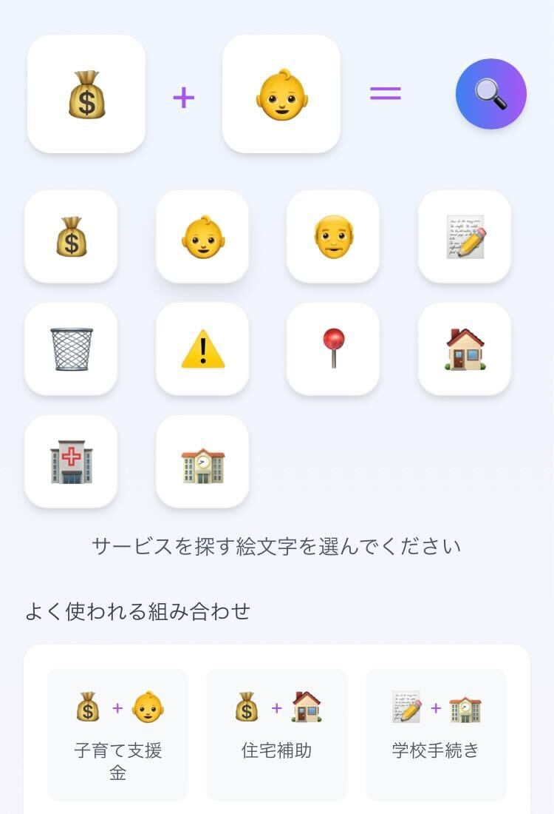
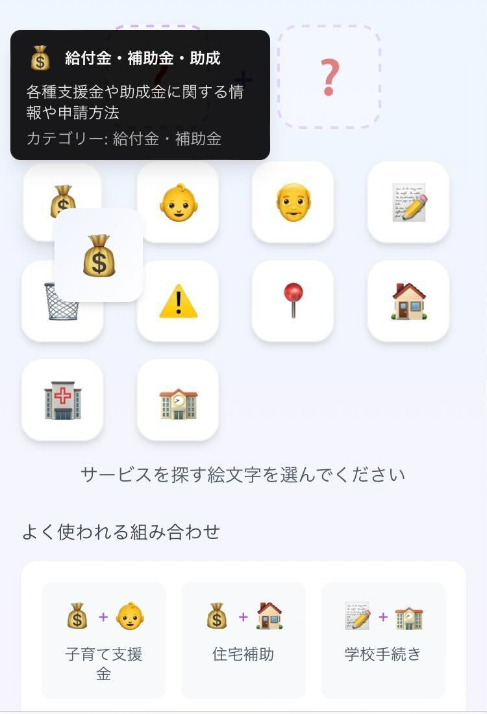
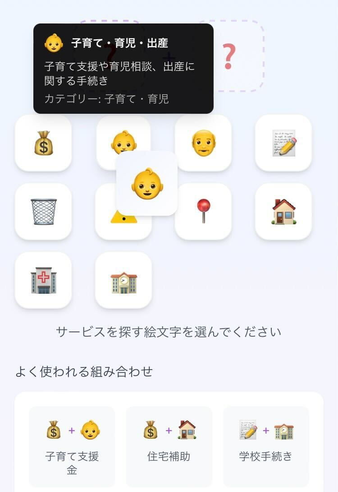
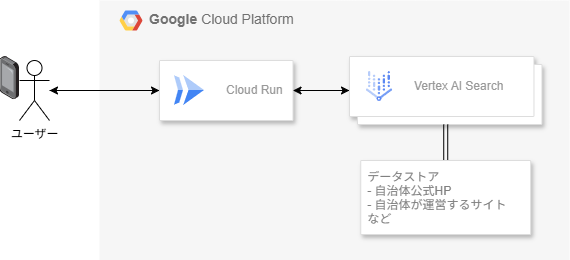
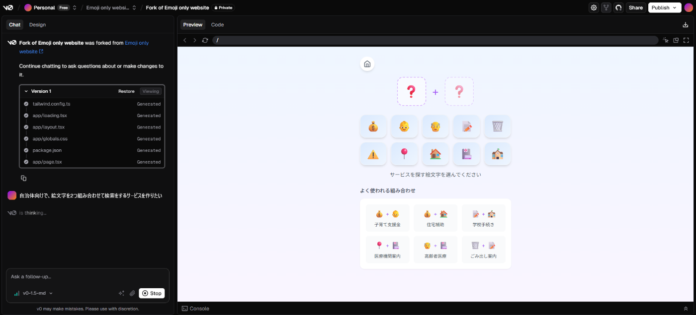

#  はじめに

この記事では「第2回AI Agent Hackathon with Google Cloud」に提出したサービスを紹介しています。  
<https://zenn.dev/hackathons/google-cloud-japan-ai-hackathon-vol2>

初めに、このサービスの特徴と、どのようなユーザーを対象としているのかを説明します。  
次に、技術スタックやアーキテクチャ、実装の詳細について説明します。  
最後に、将来的な機能追加や今後の展望について説明します。

#  「絵文字窓口 -絵文字で暮らしサポート-」

自治体の制度や補助金、地域の医療機関についてすべてを把握することは非常に困難です。  
それらについて検索したとしても、むずかしい行政用語が使われていたり馴染みのない言葉や資料しかヒットせず「調べたけどよくわからなかった」となった経験があるのではないでしょうか。

「絵文字窓口」は、**「絵文字」を使って自治体・行政についての検索を行い、誰でも簡単に情報へアクセスできるようになる** ことを目的としたスマホ向けサービスです。  
直感的なUIにより、日本語での検索や行政文書の理解に不安がある高齢者、外国人住民、若年層でも迷わずサービスを検索・利用できます。

#  デモ動画

<https://youtu.be/ZZ-dbXw33KQ>

###  なぜ絵文字なのか？

絵文字は日本だけでなく世界でも広く使われていますが「感情を表す記号」としての用途で使われることがほとんどです。ですが絵文字にはまだまだ秘めたポテンシャルがあるのではないかと考え、新しく「検索」させるという役割を与えることにしました。

##  このサービスの特徴

###  1️⃣視覚的・直感的なデザイン

絵文字を選んで検索する画面では「文字」を減らすデザインを心がけました。ユーザーの知識面・身体面における識字能力に依存しづらいという特徴があります。

###  2️⃣単語を入力しない検索のメリット

絵文字を使った検索方法は、あいまい検索に近いです。  
具体的な制度の単語を知らなくても自分に必要な情報を見つけられるのは大きなメリットです。

###  3️⃣各自治体・地域に特化

検索結果にヒットするのはあらかじめデータストアに格納されたサイトのデータに限られます。  
現在は東京都狛江市と福島県矢吹町のみ地域を選ぶことができます。

本当は市民へ届けたい情報なのに一般的なGoogle検索では埋もれてしまう。  
こういった情報を届けやすくしています。

###  4️⃣AIリソースのハック・不正利用を防ぐ

ユーザーが入力可能なのは用意された絵文字のみです。  
自由入力からAIリソースをハック・不正利用されるリスクを回避しています。  
受け付ける入力は少なく、出力は多くを目指しました。

#  ユーザー像と課題

##  ユーザー像

「日本語での検索や行政文書の理解に不安を感じる人」を主な利用対象としています。  
具体的には、以下の層を想定しています。

###  高齢者

  * スマートフォンの操作にはある程度慣れていると考えられるが、漢字入力や検索キーワードの入力には抵抗を感じる場合がある

そのため、複雑な行政用語を避けたいというニーズがあると想定している

###  外国人住民

  * 日本語が第一言語ではない人にとって、行政手続きや情報収集において言語の壁を感じる場面が多いと考えられる

そのため、文字情報に依存しすぎない、直感的で視覚的なUIの方が理解しやすいと想定している

###  若年層（中高生〜大学生）

  * 長文を読むことよりも、視覚的・感覚的な操作に慣れている世代と考えられる

そのため、SNSのように直感的に使えるUIや、スピーディに情報へアクセスできる構成を好む傾向があると捉えている

###  →視覚的な情報で簡単にアクセスできるようにしたい

##  課題

行政サービスが抱える根本的な課題として、「わかりにくい」「探しづらい」「とっつきにくい」というイメージが挙げられます。これは、堅くなりがちな行政サービスを、より親しみやすく、使いやすい形に変えるという『絵文字窓口』の目的に繋がっています。  
これらの課題を解決し、誰もが行政サービスを「迷わず」「気軽に」「安心して」使えるようにすることが、このサービスの目指す姿です。

###  課題へのソリューション

ほとんど絵文字のみのUIで、日本語での入力が苦手な方でも迷わず直感的にサービスを検索・利用できます。絵文字は世代を問わず馴染みやすく、言語の壁を解消します。  
また、検索結果画面にAIチャットボットを配置し、ユーザーの質問に即座に、かつ根拠に基づいた高精度な回答を提供します。これにより、行政サービスの「とっつきにくさ」を解消し、情報の充実を図ります。

#  画面構成・使い方

**1\. トップ画面（地域選択）**  
**2\. 絵文字検索画面**  
**3\. 検索一覧画面**

全体の画面構成はこのようになっています。

絵文字窓口の画面構成の画像（Figma-Figjam）  

##  使い方

###  1\. 地域選択

トップ画面にあるプルダウンから地域を選択できます。  
位置情報と連携できたらもっと便利だなあと思っています。

###  2\. 絵文字検索

絵文字のアイコンを2つ組み合わせて、詳細な条件検索が可能です。

🤔「お金の制度で子育てに関連するものを調べたいなあ…」  
例えばこういう場合だったら…

お金の絵文字をタップします。次に、

子どもの絵文字をタップします。  
これで検索の準備が整いました。

ちなみに絵文字がどのような意味をもっているか知りたい場合はその絵文字を長押しします。

  

すると、絵文字の意味がポップアップで表示されます。

では、検索してみましょう。

###  3\. 検索結果

選択した絵文字の組み合わせに基づき、vertex ai searchを利用した検索結果が表示されます。

ユーザーが欲しい情報により近づけるためにフィルター機能も用意しています。

検索結果を見たユーザーがもっと詳しい情報を得られるようにRAGを利用したAIアシスタントも実装予定でしたが、今回は時間の都合で実装できませんでした。  
設計やVertexAIのツールをもう少し調査して実現したいと考えています。

#  使用技術

##  アーキテクチャ図

  * Cloud Run: Reactアプリケーションをホスト
  * Vertex AI Search: 絵文字による検索結果の出力に利用

##  実装の詳細

今回はチーム開発を行いました。（チーム名：Chronos）  
コミュニケーションツールとしては、SlackとNotionを使用しました。

###  設計段階

基盤のフロント画面設計はV0を使用しています。  
V0はプロンプト次第で爆速でUIが作れてとても使いやすかったです。  
「自治体向けで、絵文字を2つ組み合わせて検索できるサービス」といったように、用途や目的を具体的に伝えると、理想の画面をすぐに生成してくれました。  
ChatGPTでプロンプトを整えてから投げるのも良かったです。また、「あなたはUIデザイナー」と役割を与えると、より意図が伝わりやすかったと思います。  
無料版でも約50回の調整で満足いくUIが完成しました。

###  CloudRunの設定

Github Actionsでデプロイするworkflowを設定しています。

###  Vertex AI Searchの設定

「カスタム検索（一般）」に自治体のHPリンクを登録し、検索対象としました。  
コンソール上から簡単に設定できたので検証までが早く非常に助かりました。  
「AI モードでのサイト内検索」との差異は未検証のため、今後の課題として残しています。

#  今後の展望

今回の第2回AI Agent Hackathon with Google Cloudに向けて、一からアイデアを考えて開発をしてきました。このサービスを通して、行政サービスを誰もが気軽に利用できるきっかけになればと考えています。  
しかし、まだまだ改善の余地があるため、今後はより多くのユーザーにとって使いやすく、情報の信頼性と深さを両立させたサービスを目指して、以下の点に注力していく予定です。

  * ###  全国対応に向けた地域の拡充

現在対応している地域に加え、今後は選択できる地域の数を増やし、日本全国どこにお住まいの方でも活用できるサービスへと進化させていきます。  
これにより、特定地域に限定されない、より広範な情報アクセスが可能になります。

  * ###  検索体験のさらなる向上

AI Search におけるデータの「チャンク（分割単位）」を調整することで、ユーザーが求める情報がより的確にヒットするように改善します。これにより、より直感的で目的に沿った検索体験を実現します。  
また、検索結果に関連するカテゴリや情報を自動で抽出し、ユーザーが興味を持ちそうな関連情報も一緒に表示できるようにすることで、情報の幅と深さを広げます。

  * ###  AIエージェントとの連携による情報の充実化

AIエージェントとAI Searchのデータストアに登録されている情報を連携させ、より自然な対話形式での情報提供や、質問に対する精度の高い回答を実現したいと考えています。これにより、ユーザーはただ検索するだけでなく、疑問や不安をその場で解消できるような体験を得られるようになります。  
今後も、ユーザー視点に立った改善を重ねながら、誰もが必要な情報に迷わずアクセスできる公共情報のプラットフォームを目指していきます。

  * ###  その他、追加したい機能

  * AIエージェント: 検索結果一覧画面に設置しているAIAgentで、今後特に導入を予定している機能

  * 位置情報連携: ユーザーの現在地に基づいて自治体を判定し、検索する

  * Google Map連携: お店や施設の所在地をマップ上で表示する

  * レコメンド機能：検索内容に関連する情報や他の利用者がよく見る情報を自動で提案し、検索体験をより便利にする

  * お気に入り登録や履歴の保存機能: ユーザーがお気に入り登録したり、検索履歴を保存したりする

#  最後に

「絵文字窓口」は、自治体サービスを絵文字だけで検索・利用できるスマホ向けサービスです。  
文字入力が苦手な高齢者や外国人住民、視覚操作に慣れた若年層を主な対象とし、絵文字２つで詳細検索が可能です。  
Google CloudのVertex AIを活用して、誰でも迷わず、気軽に、安心して行政サービスへアクセスできるよう支援します。
