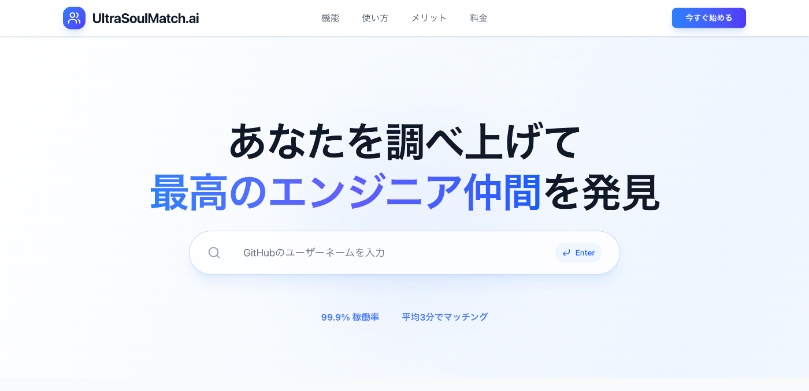
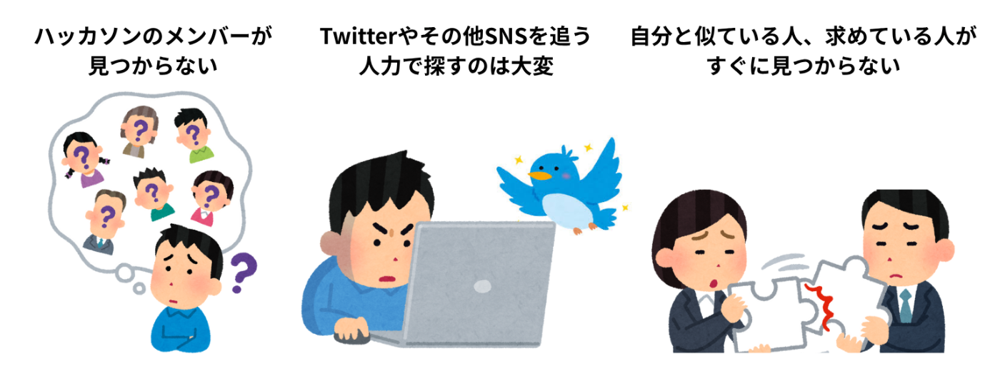
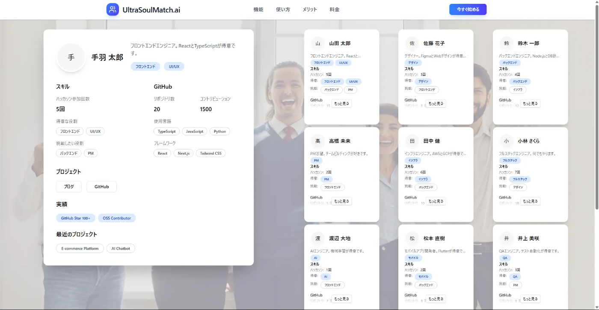
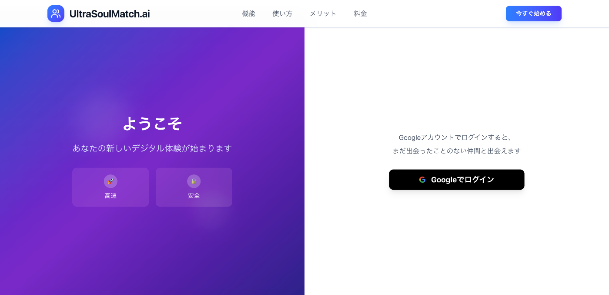
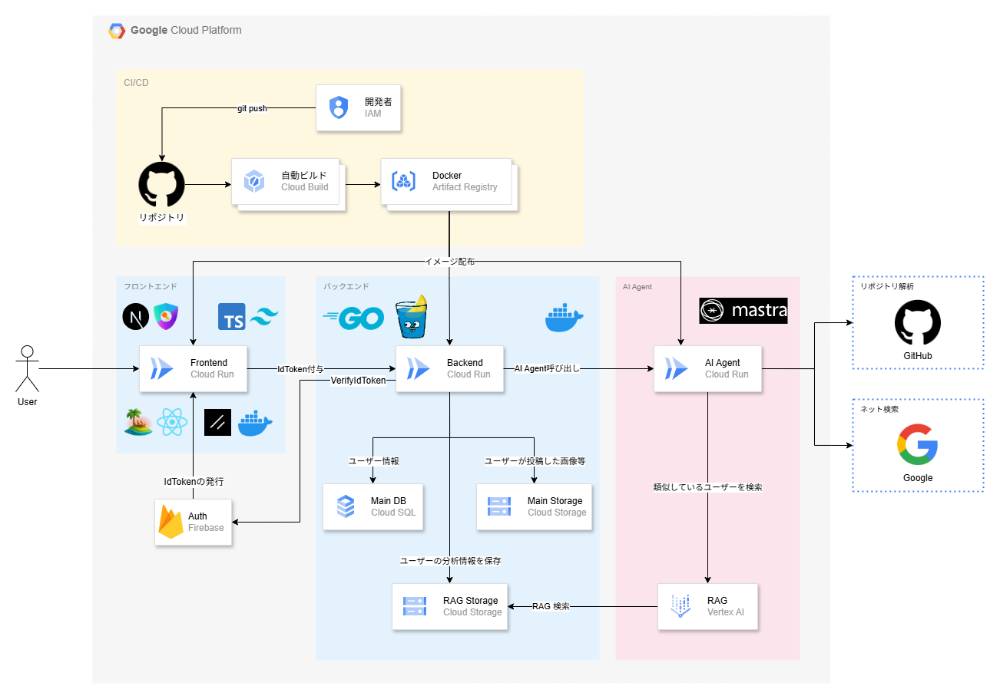
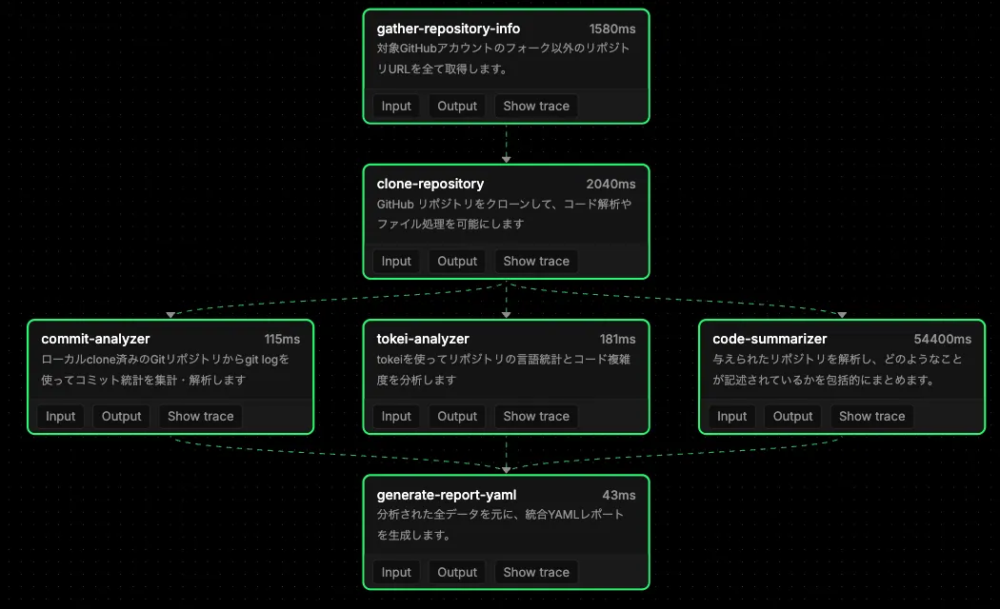

#  デモ動画

<https://youtu.be/Li5LIJ4_TCY>

#  作品概要

  
Tru-S3という5人チームで開発した「UltraSoulMatch.ai」は、自分のGithubやサイトなどのURLを入力するだけで、自分と似たエンジニアや求めているエンジニアを探すことができる「エンジニアマッチングサービス」です。このサービスは、既存のサービスとは全く違い、

  * URLを貼るだけで自分のことを全て調べ上げてくれる
  * 独自のAI Agentが高精度で分析する
  * 登録されているユーザー同士で長期的にマッチングや活動ができる

以上のような新規性と技術的優位性を持っています。

#  誰のどんな課題を解決するのか

  
早速、新規性を紹介していきます。まずは誰のどんな課題かを深堀します。

  * 誰の 
    * エンジニア
    * よりパワーアップしたい人
    * よい出会いやハッカソン仲間を探している人
  * どんな課題を解決するのか 
    * 自分では調べ上げることのできないビッグデータから人を検索
    * 自分の思想や技術力に近い人を全世界から検索
    * ハッカソン仲間を見つける

近年、生成AIを活用した開発が進み、vibe coding や AI Agent によって個人でプロダクトを完成させる事例が増えています。しかし、真の成長には人と人とのつながりが欠かせません。そこで私たちは、AI Agent を用いてエンジニア同士をマッチングする新サービスを立ち上げました。開発スピードが飛躍的に向上する今こそ、優れたアイデアを共に磨き合える強力な仲間が必要なのです。

#  機能

※詳細は一番上のデモ動画をご覧下さい！

##  Landingページ

##  Searchingページ

##  Demoページ

##  Loginページ

#  技術（こだわり）

##  アーキテクチャ

  * フロントエンド 
    * 言語：TypeScript
    * フレームワーク：Next.js(React)
    * UI：shadcn
    * 認証認可：NextAuth
    * API取得：Tanstack Query
    * スタイリング：Tailwind CSS
  * バックエンド 
    * 言語：Go
    * フレームワーク：Gin
    * 環境：Docker
  * インフラ 
    * Cloud Run
    * Cloud SQL
    * GCS
  * AI Agent 
    * 言語：TypeScript
    * フレームワーク：Mastra
    * RAG：Vertex AI Search

##  フロントエンド

###  featuresアーキテクチャを使った高凝集かつ疎結合な実装

フロントエンドにはNext.js 15のApp Routerを採用しており、ディレクトリ構造はfeaturesアーキテクチャを採用しています。内容はシンプルで、src/featuresフォルダの配下にauthやuserなどの機能をまとめ、それぞれの機能に関連するUIやAPIを全てそのフォルダの中で実装するアーキテクチャです。  
例：

  * features 
    * users 
      * api
      * components
    * profile 
      * api
      * components

このアーキテクチャを使うことによって、

  * App Routerのpage.tsxからは機能ごとのcomponentsやAPIを呼び出すだけになる 
    * →全体的に疎結合になる
  * 機能ごとにフォルダで隔離されているため、contextを追いやすく、変更も追跡も簡単になる 
    * →凝集度が高くなる

以上のような強力なメリットがあります。実際の構造は[こちら](https://github.com/TRu-S3/frontend/tree/develop/src/features)から見れます。

###  認証認可

  * Firebase Auth
  * NextAuthを使ったSession管理（[コード](https://github.com/TRu-S3/frontend/blob/56a7951ee95348923a877144d4a74fffbe7f5cf4/src/features/auth/config/authOptions.ts#L24-L77)）

##  バックエンド

###  オニオンアーキテクチャによる堅牢で拡張性の高いシステム

オニオンアーキテクチャは、ビジネスロジックを中心に据え、外部依存を完全に排除する設計手法です。内側の層が外側の層を知らない「依存性逆転」が最大の特徴です。

このシステムでは、以下の6つの主要ビジネスドメインを統一されたアーキテクチャパターンで実装し、各ドメインが完全に独立しながらも一貫性を保っています。

  * User
  * Contest
  * Hackathon
  * File
  * Matching
  * Bookmark

特にこだわったのは、45個以上のRESTfulエンドポイントを`/api/v1/{domain}`の統一パターンで設計し、Create/Read/Update/Delete操作を全ドメインで一貫して提供している点です。

###  充実したドキュメント体系

ドキュメントについては、総計6,594行を超える圧倒的な充実度を誇り、企業レベルのドキュメント体系を構築しています。以下の15個のMarkdownファイルで構成されています。

  * メインREADME
  * API仕様書
  * 環境構築ガイド
  * デプロイメント手順書
  * アーキテクチャ仕様書
  * トラブルシューティングガイドなど

###  設計思想

  * ハンドラー層では`BaseHandler`を軸とした継承パターンを採用し、各ドメインハンドラーが共通機能を継承しつつ特化処理を実装することで、コードの重複を排除しながら各ドメインの特性を活かした設計
  * 依存性逆転については、ドメイン層でRepositoryインターフェースを定義し、インフラ層（GCS、PostgreSQL）で具象実装することで、ビジネスロジックが外部システムに一切依存しない完璧な抽象化を達成
  * データベース設計では、各ドメインを独立したパッケージで管理しながらも、複雑な関係性を外部キー制約とカスケード操作で適切に表現

特に、以下のドキュメントで詳細を文書化し、開発者体験を最大化する徹底したドキュメント駆動開発を実践しています。

  * `GO_ARCHITECTURE_SPECIFICATION.md`でClean Architectureの実装詳細
  * `DATABASE_SPECIFICATION.md`でスキーマ設計
  * `DEPLOYMENT_OPERATIONS.md`で本番運用手順

##  あなたのことを調べ上げるAgent

###  Mastraを使ったAI Agent構築

  
GitHubのアカウント名からユーザーの技術スタックや活動履歴を自動で分析するAI Agentを開発しました。

以下の手順で動きます：

  1. ユーザーがGitHubのアカウント名を入力する
  2. AI Agentがアカウント名をもとにリポジトリを洗い出す
  3. 調査結果をレスポンスに返す

こだわりポイントはズバリ以下の3つです！

  1. 大量の情報をLLMが取捨選択することで、速度と精度の両立を実現  
ファイルサイズなどの単一の特徴量やランダムな選択に頼るのではなく、LLMに取捨選択を行わせることで、より総合的な分析を行いました。

[調査するリポジトリの選別箇所](https://github.com/TRu-S3/ai-agent/blob/96bfa38b434d61cf68bdfb5edfb3e1c88d518784/src/mastra/tools/github/gatherRepositoryInfo.ts#L90)

[調査するリポジトリ内のファイル](https://github.com/TRu-S3/ai-agent/blob/96bfa38b434d61cf68bdfb5edfb3e1c88d518784/src/mastra/tools/github/summarizeCodebase.ts#L82)

  2. コードの構造や内容を文脈で理解できるLLMの特性を活かした技術スタックの解析

[ファイルを実際に読み、情報の要約を行う](https://github.com/TRu-S3/ai-agent/blob/96bfa38b434d61cf68bdfb5edfb3e1c88d518784/src/mastra/tools/github/summarizeCodebase.ts#L147)

  3. ユーザー情報の保護を意識  
GitHubのトークンを使うことでprivateリポジトリも分析対象にできる機能を備えているため、セキュリティ面を意識した実装を行いました。

[解析後にクローンしたリポジトリの削除を行う](https://github.com/TRu-S3/ai-agent/blob/96bfa38b434d61cf68bdfb5edfb3e1c88d518784/src/mastra/workflows/step6.ts#L91)  
[publicとprivateのリポジトリが混在しないように出力情報の分離を行う](https://github.com/TRu-S3/ai-agent/blob/96bfa38b434d61cf68bdfb5edfb3e1c88d518784/src/mastra/workflows/step6.ts#L35)

###  YAML → インターネット検索 → 推薦の仕組み

  1. YAMLデータ構造化解析  
まず、GitHubリポジトリから生成されたYAMLデータを構造的に解析し、ユーザーの技術スタック（使用言語、フレームワーク、関連トピックなど）を正確に特定します。
  2. インターネット検索による開発者発見  
特定された技術スタック情報に基づき、Geminiがインターネット検索を実行します。これにより、類似技術を持つアクティブな開発者を効率的に発見します。

###  技術的特徴とアルゴリズム

推薦エンジンは、多次元のマッチングアルゴリズムを採用しており、以下の要素を重み付けして評価し、互換性スコアを算出します。

  * 言語分布: 例：JavaScript 40%、TypeScript 30%など
  * フレームワーク使用状況
  * コミットパターン
  * トピックタグ

特に、単なる技術の一致に留まらず、深層マッチングに注力しています。具体的には、コミット頻度（例：週12回）やピーク活動日（例：火曜日）といった行動パターンまで考慮に入れています。

#  まとめ

私たちTru-S3は、AI AgentとGCPの最新技術を用いて、今まで実現できなかったエンジニア同士のマッチングを実現するサービスを開発しました。このサービスがtoB, toCの領域で使われるようにマネタイズやマーケティングを行いつつ、我々もAgentやGCPの学習を続けます。実際、MastraでAgentを作ることやVertex AIが初めてということもありました。

それこそ、Zenn AI Agent Hackathonは私たちのようなAI AgentやGCPが大好きなエンジニアが集まる場所なので、ぜひ次回のZenn AI Agent Hackathonなどでこのサービスを使ってもらえるように頑張っていこうと思います。

#  チームメンバー

  
SecHack365修了生（NICT-情報通信研究機構主催）の個性豊かな仲間達で開発しました！！  
チーム名：Tru-S3（皆の頭文字）
