#  はじめに

はじめまして、株式会社日新でDX推進業務に従事している折原です。プログラミング歴は約2年で、これまで趣味レベルでアプリケーション開発を行ってきました。

今回、直属の上司からの勧めもあって、「第2回 AI Agent Hackathon with Google Cloud」に参加させていただきました。今回、社会人になってから海外も含めると１３回引っ越しした経験から、住環境選択における情報の非対称性を解決するシステム「Location Insights」を構想し、開発しました。本記事では、その技術的な実装内容について記述します。

このプログラムの構成はこんな感じです。

住所入力で総合評価：住所を入力すると、その地域の住みやすさを100点満点で評価  
例では新宿区新宿3-1-1で94.7点（Sランク）という高評価  
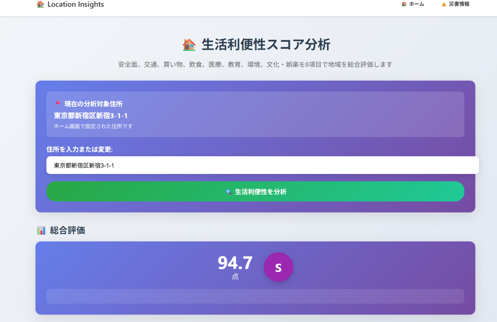

8項目での詳細分析

安全性、交通利便性、買い物、飲食、医療、教育、環境、文化・娯楽の8つの観点  
各項目で具体的な施設数や距離を表示  
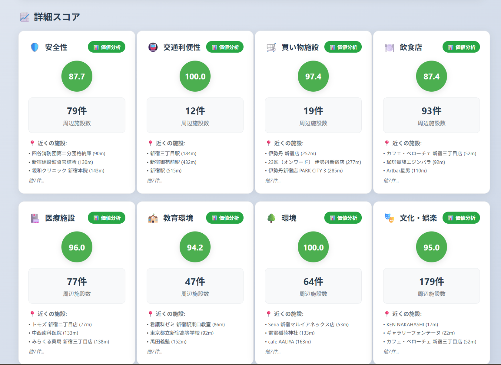  
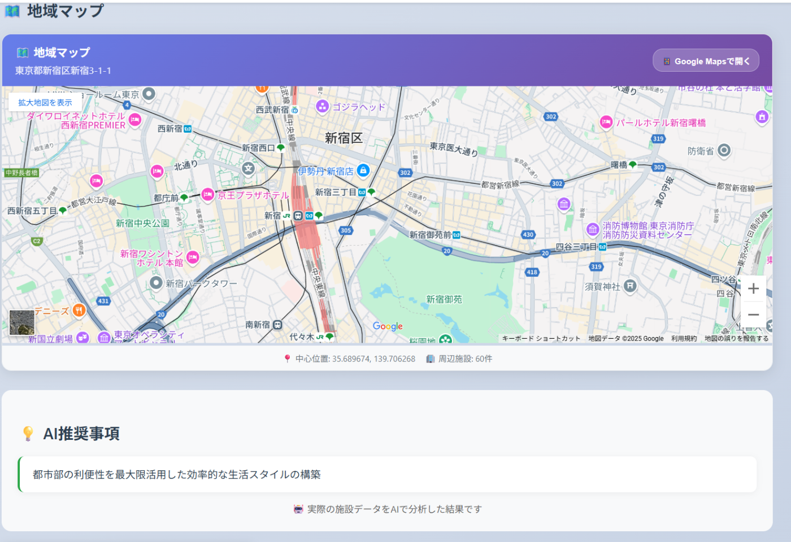

AIによる実用的な情報提供  
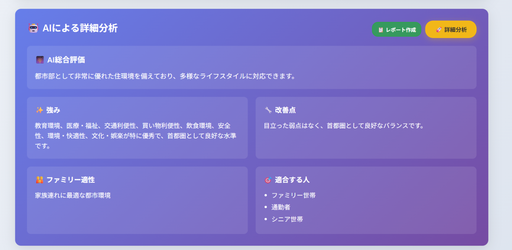

居住者タイプ別の適合度分析（単身者、ファミリーなど）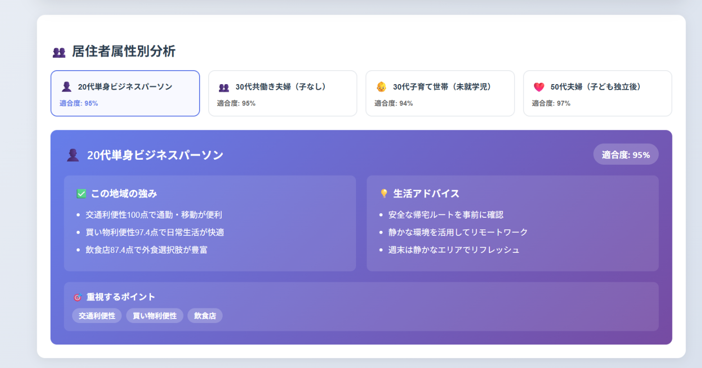  
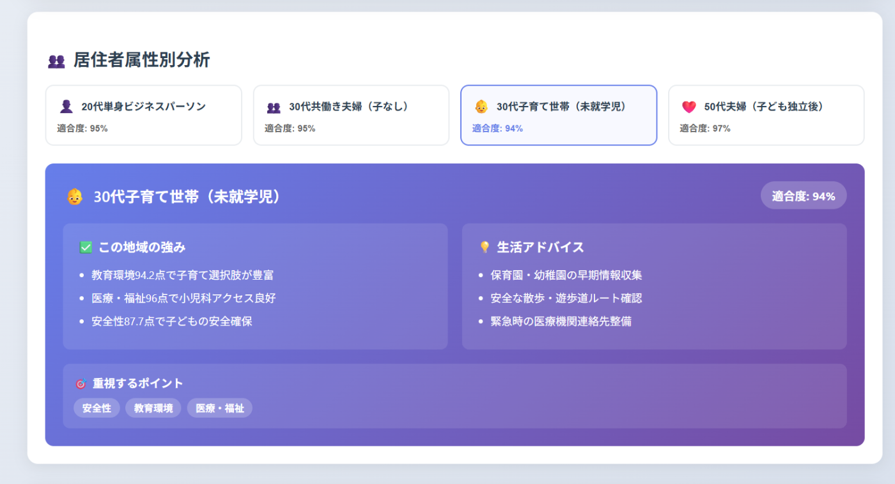

地域の人口統計データ  
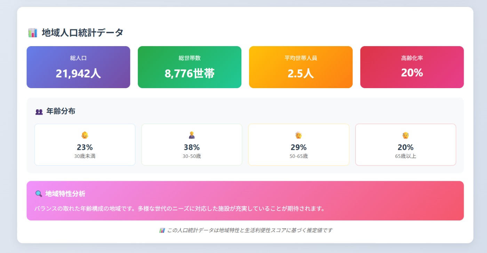

Google Places APIの実際のレビューを感情分析  
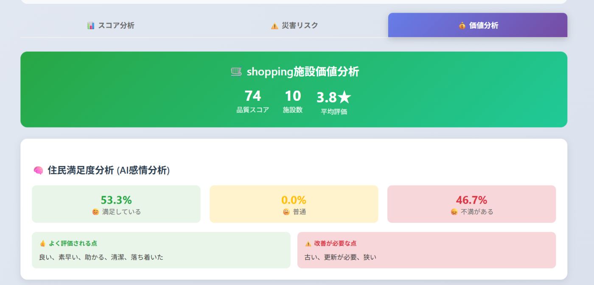  
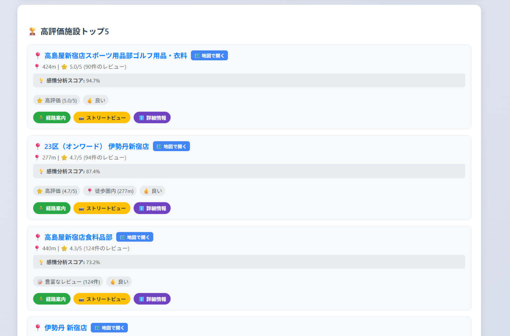

国土交通省データを使った不動産価格推定  
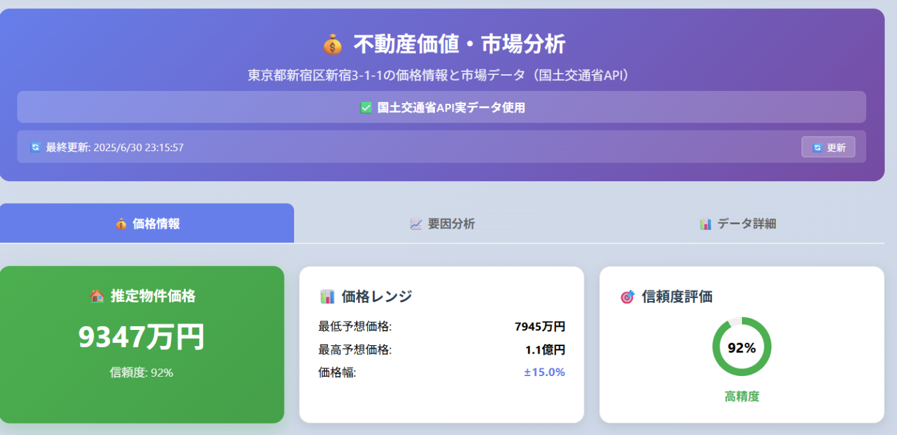  
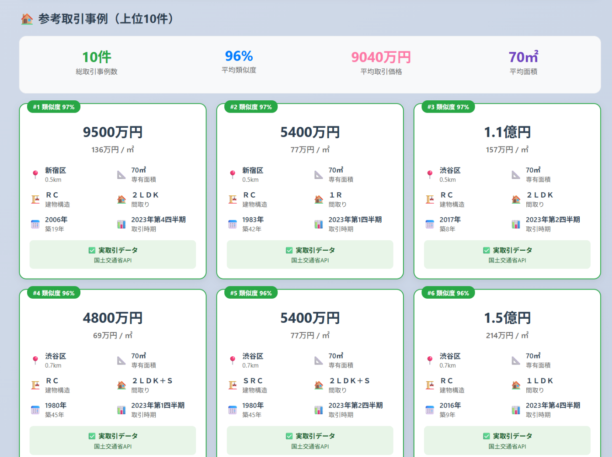

災害リスク情報  
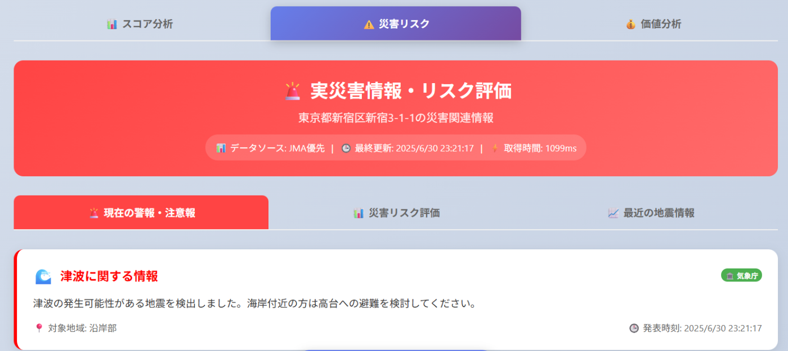  
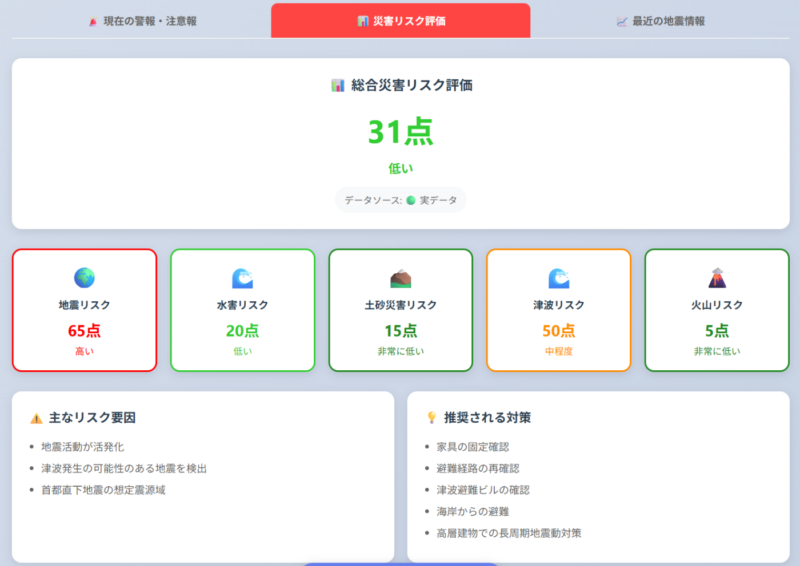  
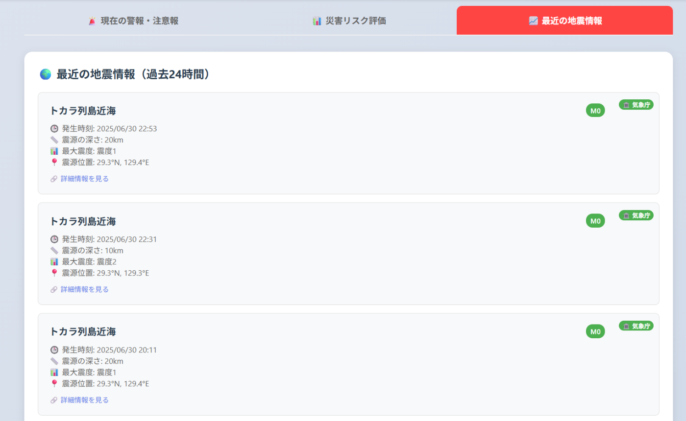

住まい探しや引っ越し検討、投資判断などに活用できる、データに基づいた客観的な住環境評価ツール  
となっています。  
・

##  解決する課題とソリューション

###  対象ユーザーと課題

現在の住環境選択は主観的で断片的な情報に依存している現状があります。  
以下4つのユーザー層の課題を特定しました。

####  転勤・転職による住環境選択が必要な社会人

**課題**

  * 新しい土地の客観的情報の不足
  * 限られた時間での意思決定
  * 通勤利便性と生活環境のバランス評価の困難さ

**ソリューション**  
住所入力により3分以内で8項目の住環境分析を実行。Google Maps APIとVertex AI Geminiを使用し、0-100点スコアとS+からDまでの10段階グレードで評価結果を提供。

####  子育て世帯

**課題**

  * 学校の質や安全性の客観的評価の困難さ
  * 教育環境と周辺安全性の総合的な判断

**ソリューション**  
教育施設、安全性、文化施設、公園・緑地を総合分析。Vertex AIによる子育て世帯向けカスタマイズ解説を提供。

####  高齢者

**課題**

  * 身体的制約を考慮した住環境選択
  * 緊急時医療アクセスと日常利便性の確保

**ソリューション**  
医療機関距離、公共交通アクセス性、緊急時対応力を数値化。包括的な分析結果を提供。

####  不動産投資家

**課題**

  * 客観的データに基づく投資判断の困難さ
  * 将来的資産価値変動の予測

**ソリューション**  
国土交通省実取引データ、地域統計、将来性指標を統合し、投資観点での住環境価値を可視化。

##  システムアーキテクチャ

Location Insightsは下記の構成で実装しています。

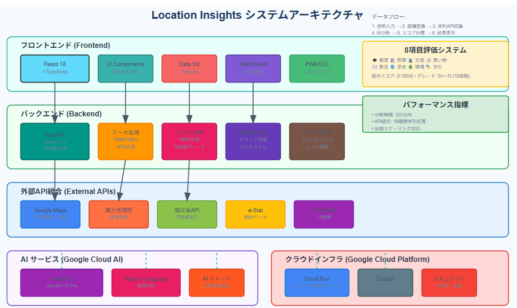

###  技術スタック

**フロントエンド**

  * React 18 + TypeScript
  * Tailwind CSS
  * Recharts（データビジュアライゼーション）
  * WebSocket（リアルタイムチャット）

**バックエンド**

  * FastAPI + Python 3.11
  * aiohttp（非同期HTTP通信）
  * Pydantic（型安全なデータバリデーション）

**Google Cloud Platform**

  * Cloud Run（コンテナベース自動スケーリング）
  * Vertex AI（Gemini-1.5-Pro）
  * Google Maps API
  * Natural Language AI

##  デモ動画

実装したシステムの動作を以下のデモ動画で確認できます。  
<https://youtu.be/ykQRQqqy2hY>

**デモ内容**

  1. 住所入力による分析開始
  2. 設定したAPIからのデータ収集（約２０秒
  3. 8項目スコア表示
  4. 10段階グレード評価
  5. Vertex AI Gemini-1.5-Proによる自然言語解説
  6. WebSocketを使用したリアルタイムチャット機能

##  主要機能の実装

###  8項目包括分析システム

住環境を以下8項目で分析します：

  * **🎓 教育環境** : 小中高校、大学、専門学校の充実度
  * **🏥 医療環境** : 病院、クリニック、薬局のアクセス性
  * **🚆 交通利便性** : 最寄り駅距離と利用可能路線数
  * **🛒 買い物利便性** : スーパー、コンビニ、商業施設密度
  * **🍽️ 飲食環境** : レストラン、カフェの多様性
  * **🛡️ 安全・防災** : 警察署、消防署距離と災害リスク
  * **🌳 環境・緑地** : 公園、緑地、自然環境の充実度
  * **🎭 文化・娯楽** : 図書館、美術館、スポーツ施設充実度

###  Vertex AI統合実装
    
    
    # Vertex AI Geminiを使用した住環境分析
    model = GenerativeModel("gemini-1.5-pro")
    response = model.generate_content(
        f"""
        以下の住所の住環境について詳細分析してください：
        住所: {address}
        施設評価スコア: {scores}
        
        分析観点：
        1. 総合的な住みやすさ評価
        2. 特に優れている点
        3. 改善が期待される点
        4. 適合する世帯タイプ
        """,
        generation_config={
            "max_output_tokens": 1500,
            "temperature": 0.7,
            "top_p": 0.8,
            "top_k": 40
        }
    )
    

##  技術的工夫と課題解決

###  パフォーマンス最適化

**非同期並列処理**  
複数API（Google Maps、国土地理院、国土交通省の不動産情報のAPI、気象関係のAPIなど）を非同期並列実行することで処理時間を大幅短縮。

**距離フィルタリングアルゴリズム**  
Google Places APIが返す遠距離施設を排除するため、1.5km以内制限の独自フィルタリングを実装：
    
    
    ABSOLUTE_MAX_RADIUS = 1500  # 1.5km制限
    for place in places:
        distance = calculate_distance(coordinates, place_location)
        if distance <= ABSOLUTE_MAX_RADIUS:
            filtered_places.append(place)
    

###  可用性・エラーハンドリング

**APIフォールバック機能**  
Google Maps API障害時の国土地理院API自動切り替え機能を実装。

**グレースフルデグラデーション**  
一部API障害時でも利用可能データでの分析継続機能を実装。

###  評価システム

**10段階グレードシステム**  
10段階（S+, S, A+, A, B+, B, C+, C, D+, D）の評価表示：
    
    
    # 10段階グレード計算
    if total_score >= 95:
        grade = "S+"
    elif total_score >= 90:
        grade = "S"
    elif total_score >= 85:
        grade = "A+"
    # 以下省略
    

###  WebSocketチャット機能

位置情報コンテキストを保持したリアルタイムチャット機能：
    
    
    @router.websocket("/ws/chat/{session_id}")
    async def websocket_chat_endpoint(websocket: WebSocket, session_id: str):
        await chat_manager.connect(websocket, session_id)
        # 位置情報ベースの対話処理実装
    

##  国土交通省API統合

実取引データ取得のため国土交通省不動産情報ライブラリAPIを統合：
    
    
    async def fetch_mlit_real_estate_data(
        session: aiohttp.ClientSession,
        x: int, y: int, z: int,
        from_period: str = "20231",
        to_period: str = "20252"
    ) -> Dict:
        url = "https://www.reinfolib.mlit.go.jp/ex-api/external/XPT001"
        # GeoJSON形式での実取引データ取得実装
    

##  データ処理・分析ロジック

###  施設データ正規化
    
    
    def calculate_comprehensive_scores_with_safety_8items(
        education_data: Dict, 
        medical_data: Dict, 
        transport_data: Dict, 
        shopping_data: Dict,
        dining_data: Dict,
        disaster_data: Dict, 
        crime_data: Dict,
        environment_data: Dict,
        cultural_data: Dict,
        safety_facilities_data: Dict
    ) -> Dict[str, float]:
        # 8項目スコア計算ロジック実装
    

###  類似性スコア計算

物件類似性評価のため面積、築年数、距離を考慮したスコア計算を実装：
    
    
    def calculate_similarity_score(target_area: float, area: float, 
        target_year: int, year: int,　distance_km: float) -> float:
        area_score = max(0, 1 - (abs(target_area - area) / target_area / 0.5))
        year_score = max(0, 1 - (abs(target_year - year) / 20))
        distance_score = max(0, 1 - (distance_km / 5.0))
        return (area_score * 0.4 + year_score * 0.3 + distance_score * 0.3)
    

##  デプロイ・運用

Google Cloud Runを使用したコンテナベースデプロイ：
    
    
    FROM python:3.11-slim
    WORKDIR /app
    COPY requirements.txt .
    RUN pip install --no-cache-dir -r requirements.txt
    COPY . .
    EXPOSE 8080
    CMD ["uvicorn", "main:app", "--host", "0.0.0.0", "--port", "8080"]
    

##  まとめ

Location Insightsは以下の技術的特徴を持つシステムです：

  * **Vertex AI Gemini-1.5-Pro** による自然言語分析
  * **複数API** の非同期並列処理
  * **8項目** による包括的住環境評価,Google Mapから★評価、コメントを感情分析し住んでいる  
人の満足度を数値化し可視化
  * **1分以内** での分析完了
  * **WebSocket** によるリアルタイムチャット  
住所周辺の情報をチャットを通じてAIに問いかけ、そのエリアについて答えてくれる。  
(こなれた会話ができるOpenAIをモデルをチャットの窓口に設定し、そこからVertex AIを通じて  
エージェントワークを行わせる構想であったが時間と技量不足で断念。会食やホテル予約、  
ショッピング、旅行計画提案、チケット購入等の実現を目指したい。Google Map上の口コミ情報から  
信頼性のあるコメントを要約するなどで、”ここ住みやすそうだよ”的なコメントをだせれば可）
  * **Cloud Run** での自動スケーリング対応

プログラミング歴2年での初ハッカソン参加でしたが、Google Cloud AIの活用により  
一旦はある程度実用的なシステムを構築することができました。
