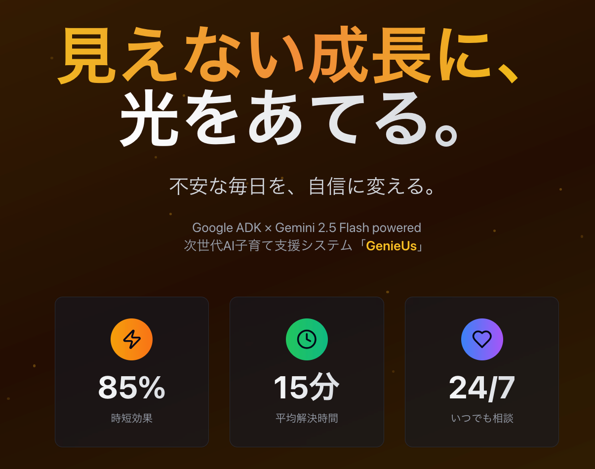
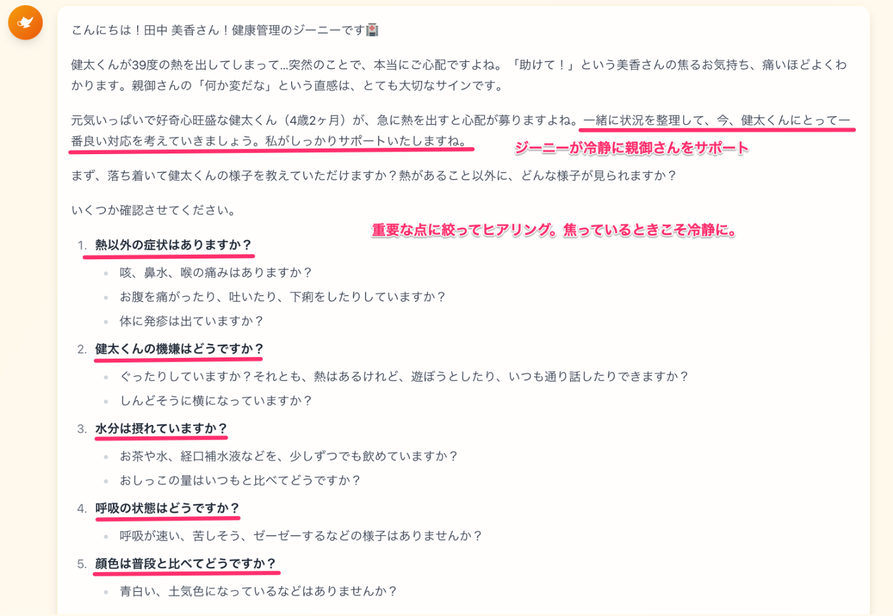
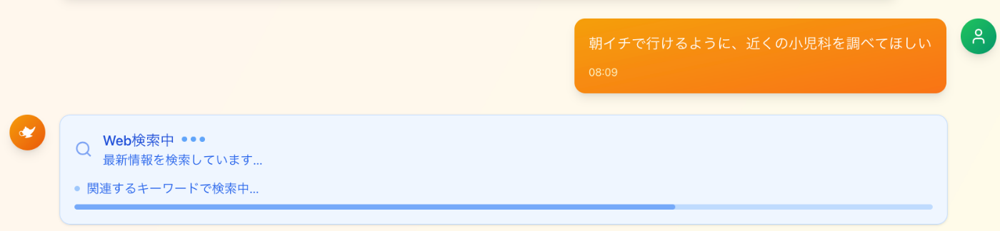
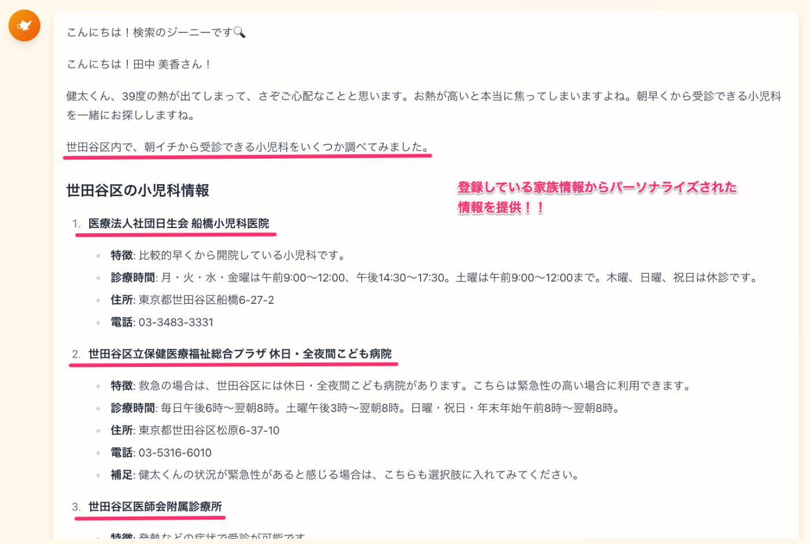
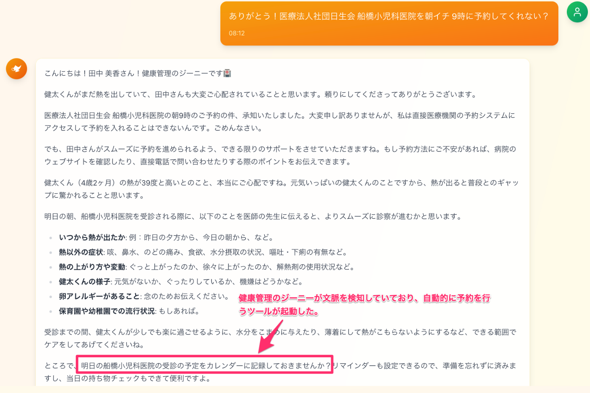
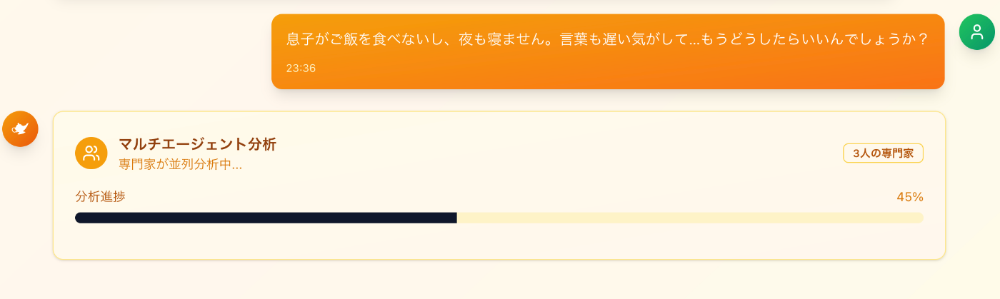
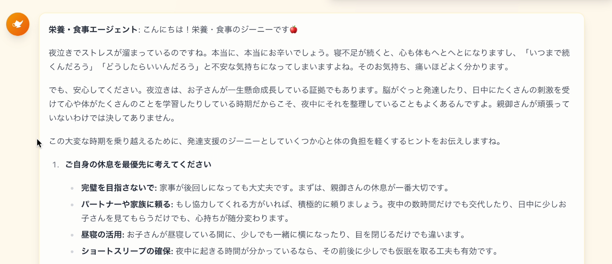
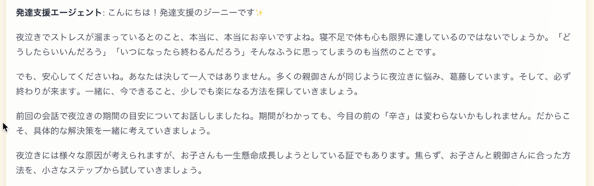

第2回AI Agent Hackathon with Google Cloud 投稿作品です！

###  1\. GenieUsが解決する課題とソリューション

####  対象ユーザー像と課題

本プロジェクトは、日々奮闘するすべての**子育て世代の保護者** を対象としています。特に、以下のような「見えない痛み」を抱える方々に寄り添うことを目的としています。

  * **情報過多による不安** : ネットには情報が溢れているのに、「うちの子に合った正解」がわからず、常に不安を感じている。
  * **突発的な問題へのパニック** : 子どもの急な発熱など、予測不能な事態に直面した時、どう対処すべきかわからずパニックに陥ってしまう。
  * **報われない努力による徒労感** : 時間と愛情をかけて食事を用意しても食べてくれないなど、努力が報われず、心が折れそうになっている。
  * **社会からの孤立と自己肯定感の低下** : 日々の頑張りを誰にも認められず、「自分はちゃんとできているのだろうか」という孤独感と自己肯定感の低下に悩んでいる。

####  ソリューションと特徴

GenieUsは、最新のGoogle Cloud AI技術を駆使し、これらの課題を解決する、**家族一人ひとりに寄り添うAIパートナー** です。

その最大の特徴は、単なる情報提供やタスク管理ツールに留まらない点にあります。ユーザーの家族情報や過去の対話といったコンテキストを深く理解し、まるで人間のように**共感し、励まし、共に成長する** 体験を提供します。

  1. **不安を「具体的な次の一手」に** : 抽象的な悩みに対し、パーソナライズされた具体的なアドバイスを提示し、保護者の冷静な判断と行動をサポート
  2. **孤独な努力を「分かち合う喜び」に** : 面倒な記録を自動化し、日々の頑張りと子どもの成長を「物語」として可視化。家族のコミュニケーションを促進し、保護者の自己肯定感を育む
  3. **AIとの対話を通じた「自己発見」** : GenieUsとの対話は、保護者が自分自身の感情や状況を客観的に見つめ直し、前向きな気持ちを取り戻すきっかけを創出する

####  プロジェクトデモ動画

GenieUsがもたらす新しい子育ての体験を、ぜひこちらの3分間の動画にて！

（[デモ動画]<https://youtu.be/8VhQgsBWAyo>)

* * *

###  2\. 2つの物語で見るGenieUsの体験

GenieUsが、実際の育児のワンシーンでどのように家族に寄り添うのか。2つの物語を通してご紹介します。

####  シナリオ1：深夜2時、39度の絶望

深夜2時。静寂をナイフで切り裂くような甲高い泣き声に、私と夫は同時にベッドから飛び起きた。1歳の息子・健太が、体をエビのように反らせて泣きじゃくっている。触れた体は尋常じゃなく熱く、体温計は**「39.0℃」**を示していた。

頭が真っ白になる。「どうしよう」「救急車？」夫婦そろって完全にパニックだった。  
私は震える手でスマホを握りしめ、GenieUsのチャット画面に文字を打ち込んだ。

**「助けて！子どもが39度の熱で…！どうしたらいいんだろう！？」**  

GenieUsのエージェントたちがお互いに連携しあい、すぐに健康管理のジーニージェントからのアドバイスが表示された。

> **健康・医療専門エージェントに繋ぎます。落ち着いてください。まずはお子さんの状態を確認しましょう。**
> 
>   * 意識ははっきりしていますか？水分は取れていますか？
>   * けいれん等がなければ、ご自宅で応急処置をしながら朝まで様子を見るという選択も有効です。
> 

AIの具体的で冷静な指示が、私たちの頭をクールダウンさせていく。私たちはアドバイスに従い、冷静に応急処置を始めた。

少し落ち着きを取り戻した私は、続けてGenieUsに尋ねた。  
「朝イチで行けるように、近くの小児科を調べてほしい」

すると今度は「検索エージェント」が起動し、近隣の小児科リストをいくつか提示してくれた。その中から「□□こどもクリニック」に目星をつける。  
（よし、明日の朝、ここに電話しよう…）  

そう思った私の心を見透かすように、GenieUsが次の提案をしてきた。

> **予約忘れを防ぐために、『クリニックに電話』というタスクを、明日の朝10時にカレンダーへ登録しますか？**

**「はい」**と返答すると、GenieUsのカレンダーにその予定が自動で追加された。  
パニックの中から冷静な判断力を取り戻し、未来のタスク管理までサポートしてくれる。最高に頼れるパートナーだ。

####  シナリオ2：バラバラだった悩みが、1本の線で繋がった日

1歳半の息子、湊（みなと）のこと。最近、私の悩みは限界に達していた。

まず、**ご飯を全然食べてくれない。** そのせいか、**夜もぐずって何度も起きる。** そして、周りの子より**言葉の発達が遅れている気もする…。**

栄養相談、睡眠相談、発達相談…。どこから相談すればいい？全部、繋がっている気もするし、別々の問題な気もする。もう、何が原因で、どうすればいいのか、全くわからなかった。

途方に暮れた私は、GenieUsにすべての悩みを打ち明けてみた。  
**「息子がご飯を食べないし、夜も寝ません。言葉も遅い気がして…もうどうしたらいいんでしょうか？」**

すると、GenieUsから意外な提案が返ってきた。

> **美咲さん、それは複雑なお悩みですね。複数の専門分野にまたがっているようです。**  
>  **こういう時こそ、**マルチエージェント分析モード** を試してみませんか？最大3人の専門家が、同時にこの問題を分析します。**

画面には、専門家を選択するUIが表示された。私は迷わず、3人のジーニーをタップした。

> **選択中: 3 / 3人**
> 
>   * **栄養のジーニー**
>   * **睡眠のジーニー**
>   * **発達のジーニー**
> 

分析ボタンを押すと、「各専門家が連携して分析中です…」というメッセージが表示された。少し待つと、驚くべき分析結果が届いた。

> **【マルチエージェント 統合分析レポート】**
> 
> **😴 ＜睡眠のジーニーより＞**  
>  夜間覚醒のパターンから、日中の活動エネルギーが発散しきれていない可能性があります。体力が有り余っていると、寝つきが悪くなったり、夜中に目が覚めやすくなります。
> 
> **🧠 ＜発達のジーニーより＞**  
>  1歳半は、自我が爆発する「イヤイヤ期」の入り口です。食事の拒否は、その代表的な自己主張。これは順調な発達の証拠です。言葉については、今はたくさんインプットしている時期。焦らなくて大丈夫ですよ。
> 
> **🍎 ＜栄養のジーニーより＞**  
>  日中の活動量が少なく、イヤイヤ期も重なると、食欲は自然と落ちます。今の湊くんに必要なのは、栄養価の高い食事より「食べるって楽しい！」という体験です。
> 
> **💡 【GenieUsチームからの総合提案】**  
>  美咲さん、バラバラに見えた悩みは、実はすべて繋がっています。  
>  鍵は**「日中の活動量」**です。
> 
> **①まず、お昼寝の前に15分だけ公園で遊び、体を疲れさせてみましょう。（睡眠の問題）**  
>  **②すると、夜ぐっすり眠れるようになり、日中の機嫌が良くなります。（発達の問題）**  
>  **③体を動かせばお腹も空き、食べる意欲が湧いてきます。（栄養の問題）**
> 
> この好循環を作ることが、今の湊くんと美咲さんにとって、一番の近道かもしれません。

私は、息をのんだ。  
まるで、専門病院のチームカンファレンスを受けたみたいだ。悩みの根本的な原因と、具体的な最初の一歩が、たった一つの回答で示されている。

「そっか…まず、公園に行けばいいんだ」

絡まっていた思考の糸が、すっとほどけていく。暗闇のなかに、確かな光が見えた瞬間だった。

<それぞれの回答イメージ>  

* * *

###  3\. システムアーキテクチャと技術スタック

これらの魔法のような体験は、ハッカソンの必須条件であるGoogle CloudのアプリケーションサービスとAI技術を密に連携させることで実現しています。

####  技術仕様詳細

  1. **Vertex AI Agent Development Kit (ADK)によるマルチエージェント構成**  
本システムの中核はADKです。私たちは15体の専門分野を持つAIをそれぞれシングルエージェントとして構築。ADKの組み込み機能である**Coordinating Agent** が、ユーザーからの問い合わせ内容を判断し、最適な専門エージェントへ自動でルーティングします。これにより、複雑な悩みに対しても、専門家チームのように連携して対応するマルチエージェント構成を実現しています。

  2. **強力なツール連携（FunctionTool）**  
ADKの**ファンクションツール機能** を活用し、各エージェントに特殊な能力（ツール）を持たせています。

     * **Google Search（ネイティブ）** : 最新かつ正確な情報検索を実行。
     * **画像分析ツール（カスタム）** : 食事の写真から食材や栄養素を解析。
     * **スケジュール登録ツール（カスタム）** : カレンダーアプリと連携し、予定を自動登録。
     * **食事記録ツール（カスタム）** : データベースに食事内容や写真を記録。
  3. **パーソナライゼーションの核：コンテキスト保持**  
最初に登録された家族情報（子どもの月齢、性格など）は、**すべてのプロンプトにコンテキストとして含まれます。** これにより、Geminiは常にユーザーの家族状況を完全に理解した上で応答を生成するため、究極のパーソナライゼーションが実現されています。

  4. **並列エージェントによる多角的分析**  
今後の拡張機能として、ADKの**並列エージェント機能** も活用可能です。これにより、例えば「この一週間の成長について」という一つの指示に対し、複数の専門エージェントが、それぞれの視点から同時に分析レポートを作成し、より多角的な洞察を提供できます。

  5. **Google Cloud インフラスタック**

     * **AI/ML** : **Vertex AI (Agent Development Kit)** , **Gemini 2.5 Flash**
     * **Computing** : **Cloud Run** (Frontend/Backend)
     * **Database** : Cloud SQL
     * **Storage** : Cloud Storage  

* * *

###  4\. おわりに：私たちが目指す未来

深夜のパニック、日中の奮闘、そして週末の涙。  
これらはすべて、現代の子育てが抱える「見えない痛み」の象徴です。

私たちは、GenieUsで3つの変革を目指します。

  1. 漠然とした**不安** を、**「具体的な次の一手」**に。
  2. 誰にも知られない**孤独な努力** を、**「分かち合う喜び」**に。
  3. 記憶から消えていく**混沌とした毎日** を、**「実感できる成長の物語」**に。

子育ては、社会の未来を創る、最も尊い仕事の一つです。しかし、その担い手はしばしば孤独です。私たちはGenieUsを通して、その孤独を解消したい。すべての親が「私は、ちゃんとやれている」と胸を張れる社会。AIが人と競うのではなく、人の最も人間的な部分を支え、励ますパートナーとなる未来。それが、私たちの目指す世界です。

GenieUsは、単なるアプリケーションではありません。  
子育てのあり方を変え、家族の形を豊かにする、新しい革命の第一歩であると、私たちは確信しています。
