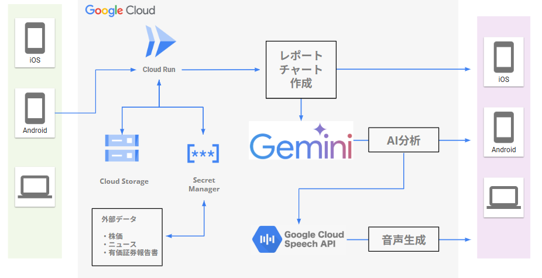

#  【第2回 AI Agent Hackathon】若年層向け投資パートナーAIエージェント「Investallia」

##  はじめに

この記事は、Zenn主催・Google Cloud協賛の「第2回 AI Agent Hackathon with Google Cloud」への応募作品として執筆しています。

解決したい課題とユーザー像としては「若年層の投資に対する不安」です。  
2024年、新NISA制度の開始は日本の投資市場に大きな変化をもたらし、特に若い世代を中心に数百万人が新たに資産形成の世界へ足を踏み入れています。

しかし、この投資ブームの裏側で、多くの初心者が知識、経験、そして相談相手の不在という大きな課題に直面しています。

本記事では、まず日本の若年層投資家が直面する課題をデータと共に深く掘り下げます。

次に、その解決策である「Investallia」が実現する未来の投資体験を動画でご紹介し、最後にその心臓部であるAIエージェントの仕組みと、それを支える技術について詳述します。

##  第1章：データで見る、日本の若年層投資家が直面する「3つの壁」

多くの若者が投資を始める一方で、その前には見過ごされがちな「3つの壁」が立ちはだかっています。これらは感覚的なものではなく、データによって裏付けられた深刻な課題です。

新NISAが始まった2024年は1年でNISAが**約436万口座（約17%）増加** したとのことですが、

####  逆に言えば今まで投資をしたことがない人が数百万人が投資の世界に足を踏み入れたということです。

投資はうまくいけば資産が増えますが、大事なお金を失う可能性もあります。

###  壁1：知識の壁 - 脆弱な金融リテラシー

投資判断には金融知識が不可欠ですが、日本の若年層の知識レベルは十分とは言えません。「金融リテラシー調査」によると、  
18～29歳の正答率は **41.2%** と、全体の平均（55.7%）を大きく下回っています。

特に「金融取引の基本的な内容に関する問題」の正答率はわずか **46.8%** に留まり、基本的な知識が不足したまま市場に参加している実態が浮き彫りになります。

###  壁2：孤独の壁 - 相談相手の不在

日本では伝統的にお金に関する話を公にしにくい文化的背景があります。資産形成について「相談すべき相手が分からない」と感じている人は全体の**62.6%** に上ります。

この傾向は、若者が気軽に経験を共有したり、初歩的な質問をしたり、自身の判断を客観的に評価してもらったりする機会を奪い、孤独な意思決定を強いています。

####  仲のいい親友でもお金のことは相談しにくいというのは欧米に比べ日本では顕著に出ると思います。

###  壁3：経験の壁 - 市場の厳しさを知らない世代

現在の若年層投資家の多くは、アベノミクス以降の比較的安定した上昇相場や、コロナショックのような急落後の急速な回復しか経験していません。

しかし、例えば[バブル経済絶頂期の1989年末に日経平均株価で積立投資を開始した場合、](https://www.nomura.co.jp/wealthstyle/article/0135/)元本を回復するまでに実に**23年以上** を要したという歴史的事実があります。

「長期・積立」でさえ、市場環境によっては深刻な低迷期が存在しうるのです。

この経験不足は、将来の大きな下落局面において、冷静な判断を妨げるパニック売りを誘発する重大なリスクとなります。

###  余談

またこれはセルサイド（業者側）の問題なのですが、個人投資家が売買の中心である小型株はほぼ証券アナリストがついておらず、上場企業の**約7割** は、分析レポートが存在しません。

スタンダード市場やグロース市場では、そのカバレッジ率はわずか**15.3%** にまで低下します。  
85%は証券業界が分析をしません。

証券会社が大口の投資家をメインととらえ、若年層などの投資家を小口投資家とほぼ顧客として考えていません（ネット証券などは一部違いますが）。

##  第2章：デモ動画、まずご覧ください

この深刻で根深い課題に、AIの力で何とかしようというのが今回の挑戦です。

「Investallia」の理想は、単なる情報ツールではなく、若年層の投資の孤独を解消し、知識を補い、人間の限界を超える分析力で若年層をサポートする、**新次元の投資パートナー** になることです。

今回の課題解決とは少し離れますが、投資に関する詐欺がどんどん増えてます。

後からやり取りなど見れば、明らかに詐欺だよね！とわかるんですけど、その時の当事者は自分に限っては大丈夫と思ってて。。  
周りに相談できる人がいれば簡単に騙されることないんですけど、投資のこととなると周りに相談しにくいというのが現状だと思います。

Investalliaが実現する未来の投資体験を、3分間の動画に凝縮しました。まずは、こちらをご覧ください。

<https://youtu.be/0iQW-z4h_ZA>

##  第3章：Investalliaの心臓部：新次元AIエージェントの仕組み

動画でご覧いただいた未来の投資体験は、いかにして実現されているのか。ここでは、Investalliaの心臓部であるAIエージェントの仕組みを、より詳しく解説します。

###  ソリューション：人間の限界を超える「パートナー」

Investalliaは、ユーザーに代わって投資判断を行うロボアドバイザーではありません。  
あくまで最終判断はユーザー自身が行います。

その判断が最高の後悔のないものになるよう、人間の限界を超える分析力と、心に寄り添う共感力でサポートする **「パートナー」** となることです。

####  売買を全て任せて儲けようという人向けではないです。

####  気軽に相談できる相手となり、投資の知識を少しづつ増やしていくことを目的にしています。

####  特徴1：専門家集団が宿る「マルチペルソナAI」

Investalliaの最大の特徴は、複数の専門家ペルソナ（人格）が、あなたの相談内容や状況に応じて最適な形で情報を届けてくれる点です。

  * **金融アナリスト** : 企業の財務データを冷静に分析し、専門的な視点を提供します。
  * **行動経済学者** : 「なぜ今売りたいと感じるのか？」といった投資家の心理的なバイアスを指摘し、冷静な判断を促します。
  * **FP（ファイナンシャルプランナー）** : 長期的なライフプランの視点から、資産配分についてアドバイスします。
  * **ライトノベル作家** : 難解な分析結果を、あなたを主人公にしたショートノベルに仕立て直し、エンターテイメントとして提供します。

この多角的な視点を、ただの箇条書きレポートではなく、**チャットや物語という形式で届ける** ことで、ユーザーは楽しみながら自然と知識を吸収できるのです。

今後もっと魅力のあるキャラクターを登場させたり、推し活のように好きなキャラクターを持ってもらえるとますますいろんな声に傾けてくれるのではないかと考えています。

####  また自分の投資行動をトレースしたうえで、物語を生成することはより共感・没入感が得られるのではと考えています。

####  特徴2：AIが分析コードを自動生成する「自律的データ分析」

一番AIエージェントらしい機能だと思うのがステップ10の銘柄スクリーニング機能です。ユーザーが「IT業界で、配当利回りが3%以上の企業は？」と自然言語で質問すると、

１． 抽出エージェント：有価証券報告書から関連する項目を抽出し、dfにします。

２． 戦略エージェント：抽出されたdfとその項目の統計データを渡し、AIがデータ処理の戦略を複数提示します。

３． 実行エージェント：複数の戦略からユーザーが選んだものを実行するコードを作成します。

４． 分析エージェント：最終的に実行され出来上がったデータとユーザーの質問を分析し、ユーザーに回答します。

トータルでのユーザーの質問への対応完了はまだ7割程度（途中のエラーや満足いかない答え）ですが、仕組みが出来上がってプロンプトが強化できれば自然言語とSQLの組み合わせで色々なところで活用できるかと考えています。

##  第4章：すべてを支える技術：Google Cloudアーキテクチャ

この高度なAIエージェント機能は、以下のアーキテクチャ図の通り、Google Cloudのサービス群を全面的に採用することで実現しています。

  * **エントリーポイントと実行環境 (Cloud Run)**
    * バックエンドはStreamlitで構築され、コンテナとして**Cloud Run** にデプロイされています。

    * **AI分析 (Gemini)** : 整形されたデータは、本プロジェクトの頭脳である**Gemini** に渡されます。Geminiは、与えられたコンテキスト（ユーザーのポートフォリオ、市場データ、質問内容など）を基に、多角的な分析、レポート生成、チャット応答、物語の創作など、あらゆる知的タスクを実行します。

      * **内部処理としてのRAG** : Geminiの回答精度を高めるため、内部ではRAG技術を一部応用しています。アナリストの知見などを事前に格納し、質問と共にGeminiへのプロンプトに付与することで、根拠のある専門的な回答を生成します。また複数のペルソナを作成し、登場人物としてAIに物語を捜索させますが、そのデータも合わせて渡します。
    * **音声生成 (Google Cloud Speech API)** : Geminiが生成したテキスト（レポートや物語）は、**Google Cloud Speech API** に渡されます。AIが内容を把握し**音声合成マークアップ言語(SSML)** のコードに変換し、ボイスの種類や間などの情報を付加したうえで自然な音声データが生成されます。

##  第5章：Investalliaの使い方と機能一覧

Investalliaは、専門知識がない方でも直感的に使えるよう、ステップバイステップのインターフェースを採用しています。

  * **Step1：ポートフォリオ分析**

    * 保有資産を入力するだけで、ポートフォリオ全体のパフォーマンスと市場平均をグラフで比較。AIが関連ニュースの収集から総合的な診断までをワンクリックで行います。
  * **Step2：取引履歴のAI診断**

    * 取引履歴CSVをアップロードするだけで、AIが全取引を分析しあなたの投資スタイルを診断。行動経済学に基づき、自分では気づきにくい取引の癖や改善点を明らかにします。
  * **Step3：AIによる個別銘柄の深掘り分析**

    * 気になる銘柄を指定するだけで、財務・業績・ニュースを網羅した詳細な分析レポートをAIが自動生成。複数サイトを巡る手間なく、銘柄の全体像を瞬時に把握できます。
  * **Step4：AIチャットシミュレーション**

    * あなたの状況を理解した複数のAIペルソナが、注目銘柄についてチャット形式で議論。専門家たちの多角的な視点を、リアルな会話シミュレーションを通じて楽しく学べます。
  * **Step5：AIが執筆するショートノベル**

    * 難解な分析レポートを、AIがあなたを主人公にしたオリジナル短編小説として再創作。物語を通じて、投資や経済の知識をエンターテイメントとして体験できます。
  * **Step6：音声で楽しむ**

    * AIが生成したレポートや小説を、自然な音声で読み上げ。通勤中や家事をしながらなど、耳で情報をインプットする「ながら学習」を可能にします。
  * **Step7：データ抽出**

    * LLMに質問を投げかけ、それに対して全銘柄の財務データから銘柄を抽出します。
    *   * **Step8：高度なテクニカル分析**

    * 多数のテクニカル指標や分析期間を自由に組み合わせ、高度なチャートをインタラクティブに表示。さらに、そのチャートが示すシグナルや傾向をAIが専門家の視点で解説します。
  * **Step9：EDINET公式財務データの分析**

    * 金融庁の公式データベース「EDINET」からAPIで信頼性の高い有価証券報告書データをAIが自動で分析。企業の公式な財務状況を手軽に、深く理解できます。
  * **Step10：自然言語での全銘柄スクリーニング**

    * 「ROEが高くて割安なIT企業」といった日常会話の言葉で質問するだけで、AIが有価証券報告書から条件に合う銘柄を抽出。直感的な操作で高度なスクリーニングを実現します。

##  おわりに

自己紹介：大手証券会社に十数年勤務、証券アナリスト資格・FP資格 保有

今回初めてハッカソンに挑戦しました。  
挑戦して苦労も多かったですが学ぶこともそれ以上にありました。GitHubも使ったことなく、デプロイという言葉すら知らなかったとこからスタートして、自分で立ち上げたサイトができたときは感動しました。  
今回の経験を1回きりとせず今後も挑戦していこうと思います。

最後までお読みいただき、ありがとうございました。
