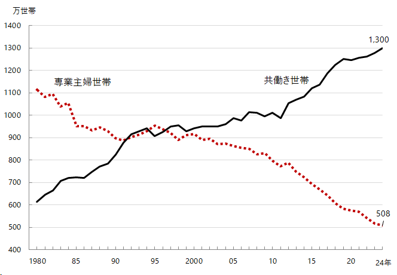
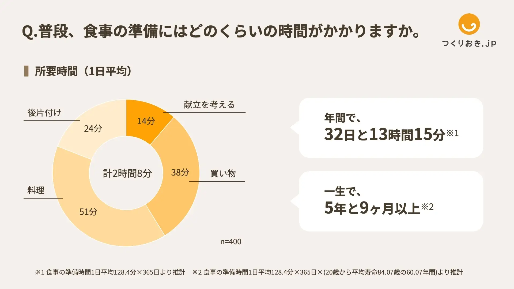

##  デモ動画

<https://youtu.be/WIgmzcmZGAw>

##  はじめに

私たちは「毎日の献立を考える時間やコスト」を解決するために、献立を自動で提案する「おなかプランナー」を開発しました。利用者は、簡単な条件入力するだけで、気分や予算に応じてロスを最小限に抑えた自炊の提案を受けることができます。

##  プロジェクト概要

###  対象ユーザー

  * 時間がないけどしっかりと食事を楽しみたい方
  * 自分のスタイルにあった食事をとりたい方

###  解決したい課題とソリューション

解決したい課題は「毎日の献立を考える時間やコスト」です。「節約したいけど、健康やおいしさは妥協したくない」というニーズは高まっており、食事に関する意思決定や買い物の手間は生活満足度にも影響を与える要素となっています。

####  課題1：共働き世帯増加による家事負担の増加

共働き世帯は2024年時点で1,300万世帯と、専業主婦世帯（508万世帯）を大きく上回り、年々差は拡大しています。家事、とりわけ「料理」が時間も負担も大きい。料理関連の家事には1日あたり2時間8分を費やしており、そのうち 献立を考えるだけで14分。年間換算で32日以上、生涯では5年9か月もの時間を“今日何を作るか”に費やしていると報告されています。  
  

####  ソリューション1：生成AIによる献立提案

「おなかプランナー」は、“今日何を作るか”を考えることに時間がかかる課題に対して、生成AIを活用した献立提案機能を提供します。これにより、これまで14分かかっていた献立提案を最短1分に短縮することができます。また、デモグラ情報を簡単に設定できるようにし、複数人分の献立提案という複雑なタスクも短時間で考案することできます。

####  課題2：食費高騰と節約志向の高まり

買い物中にスーパーマーケットに並ぶ食品の値札を眺めていると、物価の高騰を実感します。特に、2024年の夏からコメの価格が急騰しており、2025年現在では記録的なコメの品薄が続いています。コロナ禍ではフードデリバリーサービスが流行しましたが、今では自炊による食費の節約が求められています。

####  ソリューション2：

私たちの開発した「おなかプランナー」は、献立を考えるにあたって、スーパーのチラシの特売情報を取り込むことができます。マルチモーダル入力に対応したGenimi 2.5 Flash にスーパーのチラシ画像を入力して、商品名・数量・値段・特売日を取得し、その情報をソリューション2での献立提案時にGemini に与えます。これによって、チラシに基づいた低コストな献立を提案することができます。

##  機能詳細

  1. ユーザー情報入力  
人数・性別・年齢・アレルギー・嗜好・調理時間・気分など、個人の食の条件を入力するだけで、ぴったりなレシピを探してくれます。
  2. チラシ連携機能  
近所のスーパーの特売チラシをアップロードすると、その情報をもとに、お得な食材を使ったレシピを提案してくれる便利機能です。
  3. レシピの自動提案＆保存  
入力内容からAIがレシピを考えてくれて、気に入ったものはマイレシピとして保存可能。

##  システムアーキテクチャ図

##  使用技術・クラウドサービス

  * Flutter：Flutter  
ユーザーインターフェースを制作するために使用。
  * Compute：Cloud Run  
レシピ生成やチラシ画像の処理など、各種ロジックをサーバレスで実行。
  * Database：BigQuery  
解析結果や在庫情報などのデータを蓄積・管理。
  * CI/CD：GitHub Actions  
コードのビルドからデプロイまでを自動化。
  * デプロイ先：Firebase Hosting  
認証・認可を見据えて選定。
  * Storage：Firebase Storage  
アップロードされたチラシ画像を格納。

##  実装の詳細

###  CI/CD（開発工程の効率化）

GitHub Actionsを用いたCI/CDパイプラインを構築し、品質管理とデリバリーの自動化を実現しています。  
項目

####  使用技術

  * CI/CDプラットフォーム：GitHub Actions
  * インフラデプロイ先：Google Cloud Run
  * パッケージ管理：uv(Python仮想環境＋高速依存解決)

####  CI（継続的インテグレーション）

**対象ブランチ**

  * main ブランチへの push または pull request
  * backend/ 配下の変更に反応して自動実行されます

**実行ステップ**

  1. Python仮想環境のセットアップ（uv)
  2. 依存パッケージのインストール（requirements.txt）
  3. 自動テスト（pytest）
  4. コード品質チェック（black, isort, flake8, mypy）

**成果**

  * テストおよび静的解析の自動実行により、コードの品質と一貫性を担保

####  CD（継続的デプロイ）

**対象ブランチ**

  * main

**実行条件**

  * CI（testジョブ）が成功した場合のみ実行

**実行ステップ**

  1. Docker イメージのビルド
  2. GCP Container Registry へのpush
  3. Cloud Run サービス（meal-planner-api）への自動デプロイ（asia-northeast1 リージョン）

**認証方法**

  * GitHub Secrets に登録されたサービスアカウントキーを使用して、GCP  
への認証を行っています。

###  API関連

Cloud Run上に用意された複数のAPIサービスを通じて、ユーザー情報の登録・レシピ生成・保存といった各処理を連携させています。各APIは、決められたURLにデータを送信するだけで簡単に使える仕組みになっており、アプリ全体の処理フローを支えています。

**1\. デモ情報登録（submit-demo）**

  * メソッド：POST
  * パス： /submit
  * コンテンツタイプ：application/JSON
  * 概要： 
    * ユーザーが入力したデモグラ情報を受け取り、BigQuery上のテーブルに保存。この情報はレシピ生成時に利用されます。ユーザーごとに最適化された提案を可能にします。

**2\. メニュー生成API（menu-generate）**

  * メソッド：POST
  * パス：/generate_menu_from_flyer
  * コンテンツタイプ：application/JSON
  * 概要： 
    * このAPIでは、画像×テキストのマルチモーダル生成により、商品の価格・季節性・嗜好性を加味したレシピを自動で生成します。完成形の料理画像も返却され、UI上にわかりやすく表示されます。

**3\. レシピ保存API（save-recipe）**

  * メソッド：POST
  * パス：/save_recipe
  * コンテンツタイプ：application/JSON
  * 概要：  
Geminiによって生成されたレシピ情報（基本情報、栄養情報、材料、手順）をBigQueryの各テーブルに保存します。保存されるレシピ情報は以下のように分割してテーブル管理されます。 
    * created_menu：レシピ名や合計カロリーなどの基本情報
    * ingredients：食材とその分量・単価など
    * instructions：手順・所要時間など  
これにより、「Myレシピ」として再利用したり、履歴から分析したりする拡張性を持たせています。

###  チラシ画像から商品情報を抽出

スーパーのチラシ画像から商品情報（商品名・数量・価格・特売日）を自動抽出する機能を搭載しています。画像認識には、マルチモーダルな入力に対応したGemini 2.5 Flashを使用し、ユーザーがアップロードしたチラシ画像をもとに、構造化された商品データを自動生成・蓄積しています。

####  処理の流れ

  1. 画像アップロード  
ユーザーがスーパーのチラシをアップロードすると、その画像はFirebase Storageに保存されます。

  2. 最新画像の取得  
Firebase Storage内から、「最新の日時の画像データ」を判定、対象画像を取得します。  
取得した画像は、Geminiに入力するためバイナリ形式に変換されます。

  3. Gemini 2.5 Flashによる画像解析  
バイナリ形式へ変換した画像をGemini 2.5 Flashに入力し、プロンプトにより以下の4項目を抽出するよう指示します。

  * 商品名
  * 数量
  * 値段
  * 特売日  
出力は以下のようなJSON形式として設計しています。

sample.json
    
    
    {'商品': 'ほうれん草', '数量': '1束', '値段': '¥129', '特売日': '5/23金'}
    

  4. BigQueryへの保存  
抽出されたJSON形式の商品データは、BigQueryのfiyer_dataテーブルとして保存され、レシピ提案時の価格考慮に利用されます。

###  Flutterによる動的フォームの実装

選択した人数に応じて、ユーザー情報の入力欄（性別・年齢・アレルギー・宗教）を動的に生成する設計を採用しています。

**実装のポイント**

  * 人数に応じた入力欄の生成  
ユーザーが人数を選ぶと、List.generateを用いてその人数分の入力フォームが表示されます。例えば、「3人」を選択すると、3人分の入力項目が生成され、それぞれに対して個別の条件（例：アレルギーなど）を入力できます。

  * 状態管理  
人数を変更した際に、setStateにより入力項目を再生成・初期化。これにより、前回の入力値が残ったままになることを防ぎ、UIの整合性を保ちます。例えば、2人から4人に変更した場合、4人分の入力欄が生成され、それぞれが空の状態から始まります。

  * 複数選択への対応  
アレルギーや食の嗜好の入力には、MultiSelectDialogFieldを用いることで、複数選択を行えるように実装。

##  今後の実装

**パーソナライズされたレシピ提案の実装・拡充**

  * 作成したレシピの保存機能  
ユーザーが作成したレシピを保存し、「Myレシピ」としていつでも見返せる機能を追加予定です。お気に入りの献立を繰り返し使用することができます。

  * 栄養管理・カロリー可視化  
ユーザーの属性（体質や目標）に応じて、必要な栄養素や摂取カロリーを調整・提案できるようにします。運動量やライフスタイルを考慮し、過去の食事履歴との比較もできるようにすることで、日々の食生活の改善をサポートします。

  * レシピ提案数の増加・買い物リスト生成  
毎日の献立を考える手間を減らし、時間とコストの削減をサポートします。まとめて1週間分のメニューを提案することで、買い物の効率化だけでなく、栄養バランスの取れた食生活や、飽きの来ないバラエティ豊かな食卓も実現できます。

##  まとめ

今回の開発では、複数人でひとつのプロダクトを作る難しさや、ドキュメント整備の重要性を改めて実感しました。認識のズレや役割分担の曖昧さがあると、思っていた以上にスムーズに進まないこともあり、「チームとしての働き方」を学びました。

一方で、普段業務では触れる機会の少ないFlutterやCloud Run, Gemini APIなどの技術をキャッチアップできたことは大きな収穫でした。構想を形にする中で、「時間が足りない」という焦りもありつつ、企画・実装・デプロイまで一気通貫してやりきる楽しさと達成感を味わうことができました。

今後も、こうしたプロジェクトを通じて、スキルアップやチーム開発力を磨き、世の中の課題解決に貢献していきたいです。

今回のプロジェクトでお世話になった皆様に心より感謝申し上げます。

#  リンク

  * [デプロイ先](https://dal-ai-agent-hackathon.firebaseapp.com/)

#  参考文献リンク

  * <https://www.jil.go.jp/kokunai/statistics/timeseries/html/g0212.html>
  * <https://prtimes.jp/main/html/rd/p/000000047.000039>

