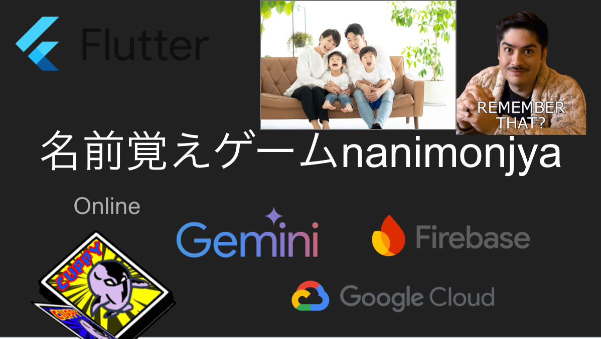
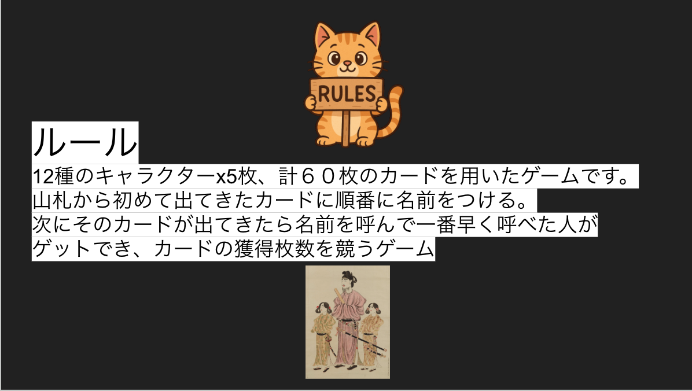
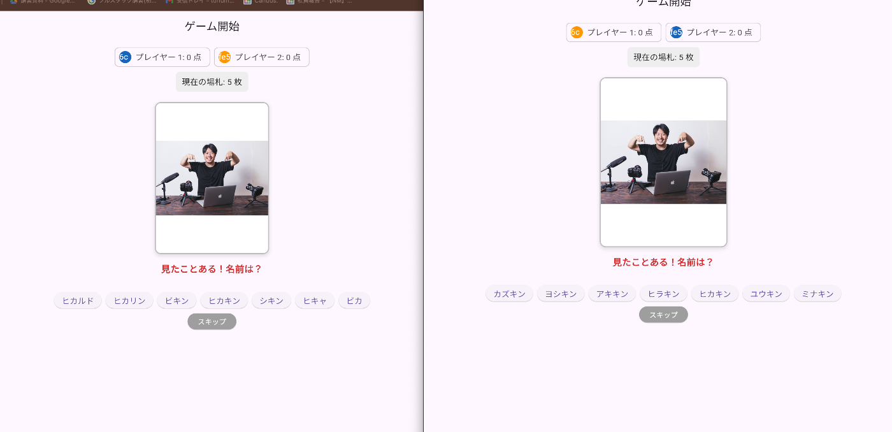
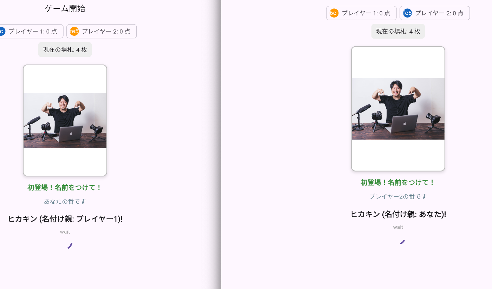
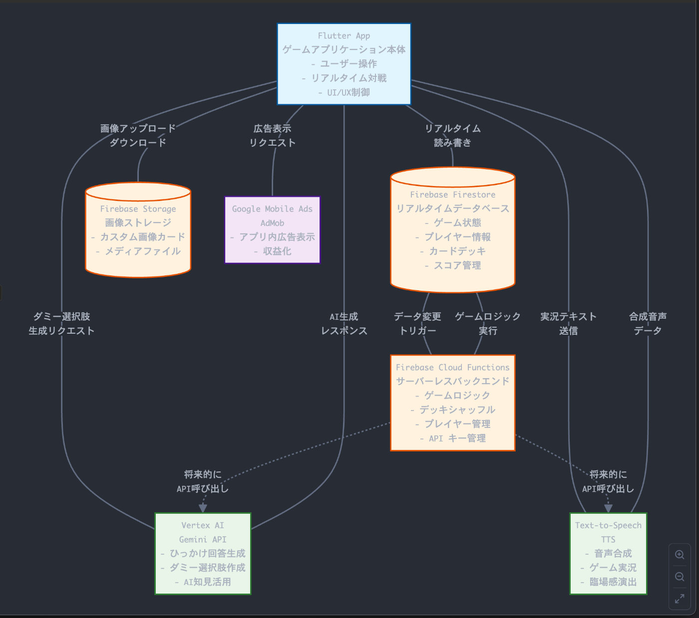

デジタルカードゲーム「nanimonjya」  
<https://play.google.com/store/apps/details?id=com.nanimonjya>  
：AIとクラウドで広がる新しい遊び方  
はじめに  
本記事では、カードゲーム「ナンジャモンジャ」からインスパイアされた、「nanimonjya」についてご紹介します。特に、Google Cloud の技術と AI エージェントの活用により、どのようにしてゲーム体験を向上させ、オンラインでの新しい遊び方を提案しているかに焦点を当てます。

ナンジャモンジャというのは  
12種のキャラクターx5枚、計６０枚のカードを用いたゲームです。  
山札から初めて出てきたカードに順番に名前をつけて、次にそのカードが出てきたら名前を呼んで一番早く呼べた人がそれまでのカードをゲットでき、カードの獲得枚数を競うゲームです。  
子供でもわかりやすいルールになっています。  
新宿のボーリング場にこのゲームが置いてあり、友人とやった時待ち時間の１時間ほどでもルールを覚えみんなで楽しめたのが印象に残っています。  
  
  
  
<https://youtu.be/ghB4jRfOxgA>  
動画では名前をつけたあと他の人が確認できていませんが修正しました。  
  

ⅰ. プロジェクトが対象とするユーザー像と課題、課題へのソリューションと特徴をまとめた説明文  
対象とするユーザー像と課題  
「ナンジャモンジャ」は、ユニークなキャラクターに名前をつけ、再度登場した際にその名前をいち早く叫ぶことで得点を競う、シンプルながらも白熱するカードゲームです。しかし、既存のオフライン版には以下のような課題がありました。

物理的な制約: 友人や家族と集まる必要があり、遠隔地のプレイヤーとは一緒に遊べない。

画像資産の限定性: 提供されるカードの種類が固定されており、飽きが生じやすい。また、特定のカードが偏って出たり、デッキの準備が面倒に感じたりすることがある。

公平性の担保: 口頭での判定や得点計算において、誤解やトラブルが生じることがある。

ゲームマスターの負担: カードをめくる、名前を判断する、得点を数えるといった役割が必要で、プレイヤーの負担となることがある。

これらの課題は、特に現代の多様なライフスタイルにおいて、人々が気軽にボードゲームを楽しむ機会を制約していました。

課題へのソリューションと特徴  
本プロジェクト「ナンジャモンジャ風ゲーム（Androidアプリ名：nanimonjya）」は、これらの課題に対し、Flutter と Google Cloud Platform (GCP) の技術を組み合わせることで、以下の画期的なソリューションと特徴を提供します。

手軽なオンライン対戦機能:

Flutter で開発されたクロスプラットフォームアプリとして提供され、インターネット環境があればどこからでも、誰とでも参加可能です。

Firebase Firestore をリアルタイムデータベースとして活用し、ルームの作成、参加、プレイヤーの状態、ゲーム進行状況、各プレイヤーのスコアなどをリアルタイムで同期します。

合言葉を使ったルーム参加により、プライベートな空間で友人と簡単にプレイできます。

Firebase Cloud Functions を利用し、ルーム内のプレイヤーが2人以上集まった後、任意で「ゲーム開始」ボタンを押すことでスムーズにゲームをスタートさせるバックエンドロジックを処理します。

オンラインゲーム終了後も、同じルームでメンバーとそのまま再戦を開始できる機能を実装し、遊びのサイクルを中断させません。

無限のキャラクター画像資産とカスタマイズ性:

プレイヤーは自身のスマートフォンから画像をアップロードし、カスタムキャラクターとしてゲームに使用できます。これにより、ゲームの画像バリエーションを無限に広げ、プレイヤーの創造性を刺激します。

アップロードされた画像は Firebase Storage に安全に保存され、ゲーム内で利用されます。既存のオフライン版で提供されるキャラクター画像もデフォルトとして選択でき、手軽にゲームを開始することも可能です。

公平性とゲームマスターの自動化、そしてAIによるエンターテイメント性の向上:

ゲーム進行のほとんどをシステムが自動で行うため、カードをめくる手間や得点計算のミスがなくなります。

各プレイヤーのスコアは Firestore 上で正確に管理され、各プレイヤーのポイントがリアルタイムで表示されるため、公平な勝敗判定が保証されます。

特に、Google Cloud の AI サービスを連携させることで、ゲーム体験を飛躍的に向上させています。

Google Cloud Text-to-Speech (TTS) によるゲーム実況: ゲームの進行状況（例: 「次のカードをめくります！」「〇〇さんが正解！」）やリードしているプレイヤーを自然な音声で実況し、ゲームマスターの役割を自動化。これにより、ゲームの臨場感とエンターテイメント性を格段に向上させ、プレイヤーはよりゲームに集中し、白熱した対戦を楽しむことができます。

Vertex AI (Gemini API) によるダミー選択肢生成: キャラクターの名前を当てる際に、AIが文脈や文字種（英語、漢字、ひらがななど）を理解し、正しい名前以外に「ひっかけ」となるようなダミーの選択肢を生成します。これにより、ゲームの難易度と面白さが増し、プレイヤーの思考力を刺激します。

収益化と持続可能性:

Google Mobile Ads (AdMob) を導入することで、バナー広告をゲーム画面に表示し、持続的なサービス運営のための収益源を確保します。

ⅱ. システム アーキテクチャ図の画像  

zenn.dev  
図の簡単な説明:  
クライアント: Flutter を使用したモバイルアプリケーション（iOS/Android）。

Firebase バックエンド:

Cloud Firestore: ゲームの状態（ルーム情報、プレイヤーリスト、デッキ、場札、各プレイヤーのスコアなど）のリアルタイム同期。

Firebase Storage: ユーザーがアップロードするカスタムキャラクター画像の保存。

Firebase Cloud Functions: ゲーム開始のトリガーロジック（プレイヤー数に応じた自動開始など）。

Google Cloud AI Services:

Vertex AI (Gemini API): アプリからのリクエストに基づき、ゲームのひっかけ回答となるダミー選択肢を生成。入力されたキャラクター名と同じ言語・文字種で出力を調整。

Text-to-Speech (TTS): アプリからの実況テキストを受け取り、高品質な音声データに変換してアプリに返すことで、ゲーム実況を実現。

AdMob: アプリ内に広告を表示し、収益化をサポート。

ⅲ. プロジェクトの 3 分以内のデモ動画

技術的な実現  
本プロジェクトは、AIとクラウド技術を基盤とした堅牢で拡張性の高いシステムとして実現されています。

フロントエンド: Flutter (Dart) を採用し、iOS および Android の両プラットフォームに対応するクロスプラットフォーム開発を実現しています。これにより、単一のコードベースで幅広いユーザーにリーチ可能です。

データベース: Cloud Firestore を中心に据え、オンライン対戦におけるリアルタイムなデータ同期を実現しています。プレイヤーごとのスコア管理や、ゲームの状態管理を効率的に行い、トランザクションを用いた安全なデータ更新を実現しています。

ストレージ: Firebase Storage を用いて、ユーザーがアップロードする多様な画像ファイルを効率的に管理しています。これにより、ゲームのキャラクター資産を無限に拡張できるカスタマイズ性を提供します。

バックエンドロジック: Node.js で記述された Firebase Cloud Functions を利用し、サーバーレスでスケーラブルなバックエンド処理を提供しています。これにより、ゲーム開始時のデッキシャッフルや、プレイヤーがルームに参加する際の安全なデータ操作など、サーバー側で厳密に制御すべきロジックを実行し、公平性を担保しています。

AI/音声合成: Google Cloud の最先端の AI 技術を積極的に活用しています。

Google Cloud Text-to-Speech API を利用し、ゲームの進行状況をリアルタイムで音声実況としてプレイヤーに提供します。これにより、ゲームの没入感を高め、視覚情報だけでなく聴覚情報によるゲーム体験の豊かさを追求しています。

Vertex AI (Gemini API) を用いて、カードの名前を当てる際のダミー選択肢を動的に生成します。Gemini API の高度な自然言語生成能力により、入力されたキャラクター名（英語、漢字、ひらがななど）の言語や文字種を考慮した、より巧妙で説得力のある「ひっかけ」回答を提供し、ゲームの戦略性と面白さを増幅させています。このAI連携は、プレイヤーが毎回新鮮な気持ちでゲームを楽しめる重要な要素です。

収益化: Google Mobile Ads (AdMob) を統合することで、持続的なサービス運営のための収益源を確保し、長期的なプロジェクトの発展を可能にしています。

今後の展望  
本プロジェクトはまだ発展途上ですが、将来的には以下のような機能拡張を検討しており、AIとクラウド技術のさらなる可能性を追求していきます。

Gemini API とのより深い連携:

キャラクター画像そのものを AI が解析し、画像に応じたユニークな名前の自動生成・提案機能。

AI がキャラクターの性格や背景、さらには短いストーリーを自動生成し、ゲームの深みを増す。

AI ゲームマスターによるプレイヤーへの個別ヒント、状況に応じたインタラクティブな実況、感情を読み取ったリアクション。

ひっかけ回答の難易度調整機能。

ソーシャル機能の強化: 友人リスト、ルームの検索、過去の対戦履歴の閲覧、リプレイ機能など。

ゲームモードの追加: 新しいルールセットの導入や、ソロプレイモード、チャレンジモードなど、多様な遊び方を提供。 歴史上の人物を覚える、会社の人の名前を覚える。卒業アルバムをアップロードして同級生の名前を思い出して友達と遊ぶ。みたいなモードを作りたいです。

UI/UX のさらなる向上: より滑らかなアニメーションの追加や、視覚的に魅力的で直感的な操作性の追求。

おわりに  
「ナンジャモンジャ風ゲーム」は、古典的なボードゲームに現代のテクノロジーと AI の力を融合させることで、場所や時間の制約を超えて楽しめる新しいエンターテイメント体験を提供することを目指しています。特に、Google Cloud の Vertex AI と Firebase のシームレスな連携は、アイデアの迅速な具現化と、将来的な拡張性の両立を可能にしました。本プロジェクトが、AI とクラウド技術の可能性を広げ、多くの人々に新しい「遊び」の価値を届ける一助となれば幸いです。

Geminiさんにはコード生成やデプロイ方法、エラーの解消でお世話になりました。御礼申し上げます。  
[https://x.com/sougohollow/status/1939563301446586615?s=46&t=Rz95Hx8CyEob361uQeHP1w](https://x.com/sougohollow/status/1939563301446586615?s=46&t=Rz95Hx8CyEob361uQeHP1w)  
#aiagentzenn #googlecloud
