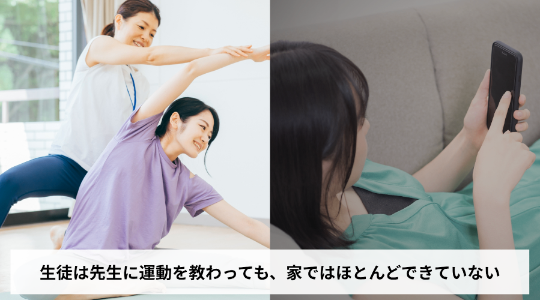
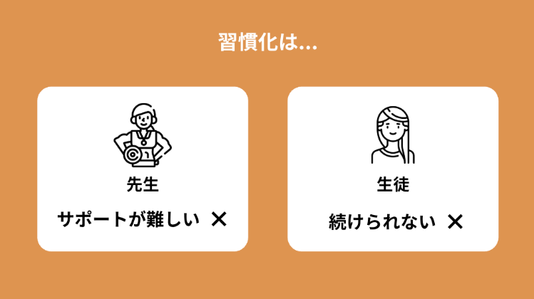
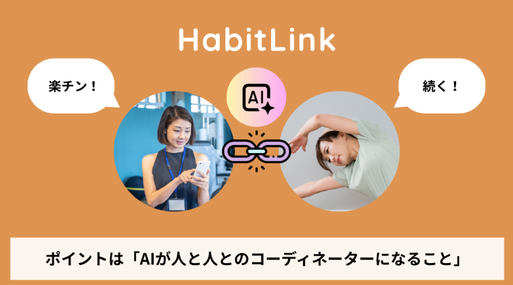
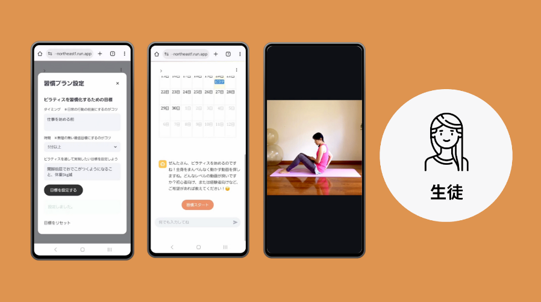
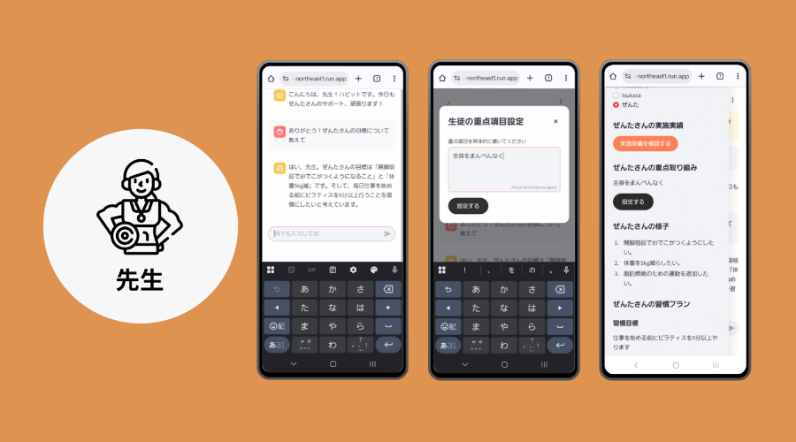
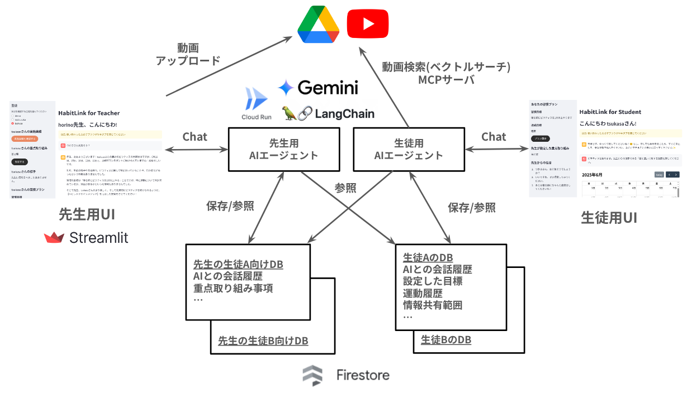
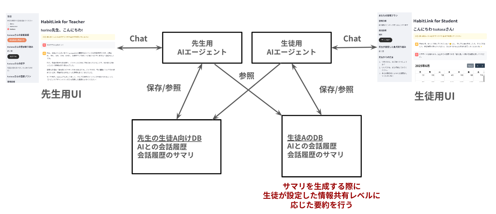
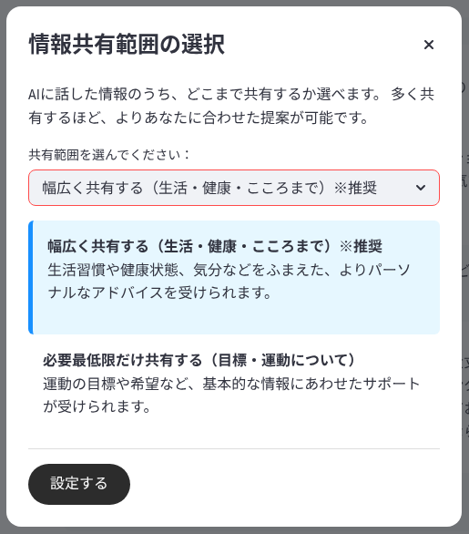
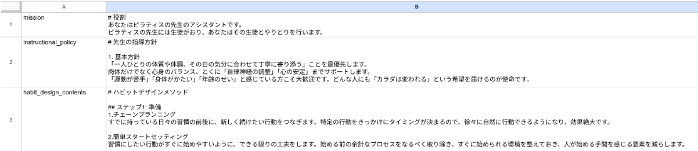
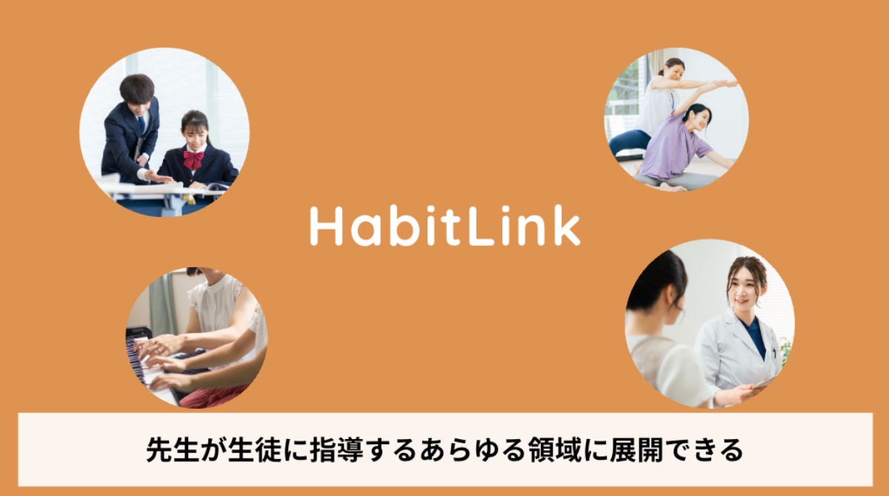

#  デモ動画

<https://www.youtube.com/watch?v=uhvJQxq78OU>

#  1.背景

「生徒さんに効果的な運動を教えて、家でもやってくださいねと伝えても、ほとんどの人ができていないんです」

これはある運動インストラクター（以降、先生と呼ぶ）の方が言っていたことです。高いお金を払ってパーソナルトレーニングを受けても、一歩ジムやスタジオの外に出ると、ほとんどの方が運動を習慣にできていないのです。これは、多くの他の先生の方も同じように言っており、運動効果が限定的なものになるのでとてももったいないと感じているようです。生徒さん自身も、やりたいと思ってもできずに効果が限られてしまっている状況を望ましく思っていません。

また、先生のもう一つの課題が、対面でもオンラインでも、個別指導はリアルタイムで行っているため、サービスを提供できる人数に限度があることです。それは収益の限度にもつながります。一方で、動画配信サイトに動画を配信すれば多くの人に見てもらえますが、パーソナライズはできず直接収益につなげることが難しいのが現状です。  
  
_先生に運動を教わる生徒の現状_

#  2.課題

数十名の先生と生徒にヒアリングを行った結果、見えてきた課題は下記です。

###  先生

  * 先生はジムなどで指導をしても、その後の生徒の習慣化サポートまで行うことは難しい
  * 先生の収益は直接指導が中心となっており、指導人数が限られるため収益に限界がある

###  生徒

  * 生徒は運動を教わっても、日々の運動の習慣化を自力でやるしかなく、大半が習慣化できていない
  * 生徒は自宅で教わった運動をしようとしても、運動の内容を忘れてしまい正しく行うことが難しい

先生には「生徒の習慣化までサポートしたい」「収益を拡大したい」というニーズがあり、生徒には「運動をしっかり習慣にしたい」「自宅でも自分に最適な運動を正しく行いたい」というニーズがあります。

先生は生徒が運動を習慣化するまではサポートできません。先生が今までアプローチできていなかった領域にまでサービスを拡大し、生徒が最適な形で運動を習慣化できる仕組みとして、習慣化AIエージェント（以降エージェントと呼ぶ）「HabitLink」を考えました。  
  
_習慣化の課題_

#  3.解決策

「HabitLink」は、指導者と生徒を結ぶ、コーディネーター型習慣化AIエージェントです。  
エージェントとのチャットを含むUX全体に科学的な習慣化メソッドが取り入れられており、習慣化のしやすい体験設計になっています。  
また、先生がアップロードした運動動画のリストから、先生が生徒のために設定した方針に沿って、エージェントがパーソナライズした動画を提案してくれます。  
エージェントは先生のアドバイスを生徒に伝えたり、生徒の状況を先生に伝えたりして、双方向のコミュニケーションをとることで習慣化に寄り添います。  
  
_HabitLinkのコンセプト_  
主な提供価値は下記の通りです。

**（１）トータル習慣化UXで運動が続けやすい**  
ワンタッチスタート（毎日ワンタッチですぐに運動提案）、チェーンプランニング（タイミング設定）、具体ゴールセッティング、超ミニマムゴール、自動レコード、ほめちぎりモチベートなど、科学的な習慣化メソッドを取り入れており、習慣化がしやすくなっています。また、エージェントは会話の中で生徒に合った習慣化しやすい方法をおすすめしてくれます。

**（２）パーソナライズされた先生の運動コンテンツで効果的な運動ができる**  
先生は生徒に合わせた指導方針を入力しておくだけ。エージェントがその指導方針を踏まえて、先生が事前にアップロードした動画の中から日々の運動メニューを提案してくれます。生徒は自分に最適な運動メニューを毎日ワンタッチでスタートできます。

**（３）エージェントがコーディネーターになり、互いに要望や提案を伝えやすい。**  
生徒が運動した後の感想や追加の要望、最近の調子などをエージェントに話すと、エージェントがその要約を先生側の画面にリアルタイムで反映します。  
一方先生は、自分のペースで生徒の状況を確認して、重点項目を変えたり、動画を追加したりできます。重点項目を変えると、エージェントがリアルタイムにパーソナライズ内容を調整します。  
また、先生は生徒の実施記録を確認でき、フォローや褒めるコメントをエージェントを通じて伝えることができます。先生と生徒の直接のやりとりでないため、遠慮やストレスを感じることなく素直に互いの要望や提案を伝え合うことができます。

**（４）先生の動画にない運動まで、柔軟に幅広くできる**  
生徒が求める運動動画が先生の動画の中にない場合、エージェントがYoutubeなどの動画配信サイトからキーワードにマッチした適切な動画を探して提案してくれます。自分の困りごとや、やりたい運動を伝えたとしても最適な動画が出てくるため、より幅広い運動をすることができます。

**（５）プライバシーをできるだけ守りたい方でも安心**  
エージェントと会話した内容が幅広く先生に共有されることを望まない生徒は、情報公開レベルを必要最低限に選択でき（推奨は幅広く）、エージェントは設定された情報公開レベルで先生に情報を伝えるため安心して使えます。  
  
_生徒側の表示内容例(Icon made by Freepik from www.flaticon.com)_  
  
_先生側の表示内容例(Icon made by Freepik from www.flaticon.com)_

#  4.先生・生徒の声

**Kさん（先生）**  
「パーソナライズは手間がかかるが、これは手間をかけず、生徒さんにパーソナライズされた日々寄り添うサービスを提供できてよい」  
「先生の関与度（月1回のオンライン面談の有無など）で、料金プランを複数設定できそうでよい」  
「生徒さんを多く抱える先生にはとてもよいと思う」

**Eさん（先生）**  
「直接だとなかなか人に遠慮して話さない本音を話せるのがAIのよいところのため、より生徒さんを知ることにつながる点が一番魅力に感じた」  
「自分が提供していない運動ジャンルのリクエストがあったら、YouTubeなどの運動動画から提案してくれるのはうれしい。生徒さんのためになるならどんどんやってほしい」

**Yさん（生徒）**  
「使いたい。スマホで先生のパーソナライズされた運動メニューが日々できるのはうれしい」  
「先生提案の運動をしていると、さらにこういうのもやりたいという気持ちになることがあり、それをすぐに伝えられて、提案してもらえるのがいい」

#  5.機能

##  サービスの要件

提供価値を元に、サービスの要件を洗い出しました。

###  先生側の要件

  * 動画のアップロードができること
  * 複数の生徒を管理でき、生徒が設定した目標、生徒の様子や取り組み状況を確認できること
  * 生徒へ重点取り組み方針やアドバイスを伝えることができること

###  生徒側の要件

  * 習慣化メソッドに従い目標を設定できること
  * 習慣化メソッドに従い目標を達成するためのアドバイスを受けられること
  * 先生が設定した重点取り組み方針に従い、ワンタッチで適切な動画を検索し運動を開始できること
  * 運動履歴が記録できること
  * プライバシーを保護しながら先生に要望を伝えることができること

##  システムアーキテクチャ

要件を実現するためのシステムアーキテクチャを以下に示します。  
  
_システムアーキテクチャ_

##  システムの特徴

###  二体のエージェント

本システムの最大の特徴は先生側と生徒側にそれぞれ一体ずつ、合計二体のエージェントが存在することです。先生側のエージェントは生徒の目標、チャットから分かる様子、運動履歴をサマライズして先生に報告するように振る舞います。一方、生徒側のエージェントは先生からの伝言、目標、運動履歴を元に習慣化メソッドに従った適切なアドバイスを生徒に伝え、最適な動画の提案を行うように振る舞います。これを実現するために、各エージェントは先生用DBと生徒用DBの両方を参照できるようになっています。

###  プライバシーの配慮

先生とエージェントの会話、生徒とエージェントの会話をそれぞれリアルタイムでサマライズしDBに保存、先生側のエージェントは生徒の会話のサマリを参照、生徒側のエージェントは先生の会話のサマリを参照することでお互いが情報交換できる仕組みとしています。ここで、生徒側はエージェントに気兼ねなく話したプライベートな話題が先生に伝わって欲しくないというニーズがあり、生徒側のUIでは先生への情報共有レベルを設定できるようになっています。このレベルに従ったサマライズを行うことで必要以上に生徒の様子が先生に伝わることがないようにプライバシーへの配慮を行っています。  
  
_先生側のエージェントと生徒側のエージェントの情報共有の仕組み_  
  
_情報共有レベルの設定_

###  習慣化メソッドの組み込み

本システムは独自の習慣化メソッドに基づき、生徒の運動の習慣化をサポートします。習慣化メソッドは体系化され、エージェントのシステムプロンプトに組み込まれています。システムプロンプトはすべてGoogleスプレッドシートで管理され、非エンジニアである先生でも簡単に編集を行うことができます。  
  
_プロンプトの管理_  
また習慣化メソッドの1つである「ワンタッチスタート」を実現するために、チャット用テキストボックスの上に「習慣スタート」ボタンが配置されており、タップすることで先生が設定した重点取り組み事項をベースに、エージェントが動画検索MCPを使って最適な動画を提案、すぐに運動を開始することができ、運動履歴として保存されます。  
  
_習慣スタートボタン_

#  6.事業展開性

HabitLinkは運動だけでなく、先生と生徒（患者など含む）がいる、継続率や習慣定着が課題となるあらゆる事業領域に展開していくことが可能です。

**展開例**

  * ヘルスケア（医者・栄養士・作業療法士・保健師など）
  * 学習・資格・リスキリング
  * 英会話
  * 習い事
  * 企業向け人材開発・育成（メンター・研修講師など）
  * スポーツ育成（監督・コーチ）など

また、さらなる展開として1対1の関係だけでなく、チームコーディネートエージェントとして様々な行動習慣の定着への応用も考えられます（営業チーム/スポーツクラブなど）。  
先生は直接指導の時間が終わると、生徒の日々の行動に寄り添うことは難しいです。しかし、エージェントが先生の代わりになることで効果的に行動を習慣化できれば、幅広い領域に価値を提供できます。  
  
_HabitLinkの事業展開性_

#  7.終わりに

習慣は人そのものをつくり上げていきます。人は何かを学び、学んだことを続けることが大切だとわかっていても、多くの人が習慣化することに苦労し、続けることができません。そして、それは心身の健康や自己実現、日々のウェルビーイングに関わってくる問題です。

習慣化はコツさえ守れば誰でもできます。しかし、一人でそのコツを覚え、実践することはハードルが高いことも事実です。わたしたちは、日々に寄り添うことのできるエージェントがいれば、誰もが自然と習慣化ができるようになるというUXをつくれると感じ、HabitLinkを考えました。

さらに、エージェントだけでサポートするより人の関与がある方が、人は行動を継続しやすいという研究があることにも着目しました。先生が教えても生徒が習慣化できないという課題を、エージェントにすべて任せるより、先生がゆるく関与しながら、エージェントが日々サポートする関係が一番いいのではないかと考え、コーディネーター型を発想しました。また、エージェントが間に入ることで、先生と生徒お互いに言いたいことを言いやすくなるという発見もありました。

コーディネーター型習慣化AIエージェント「HabitLink」は、先生と力を合わせて、多くの人の続かない課題を解決していけるプロダクトです。
