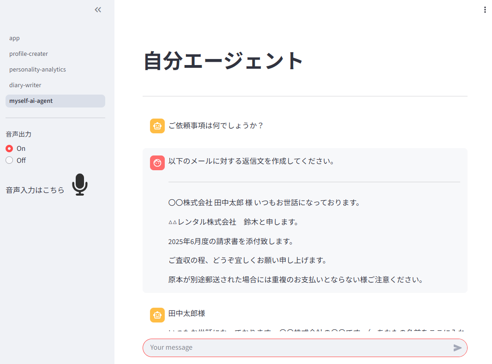
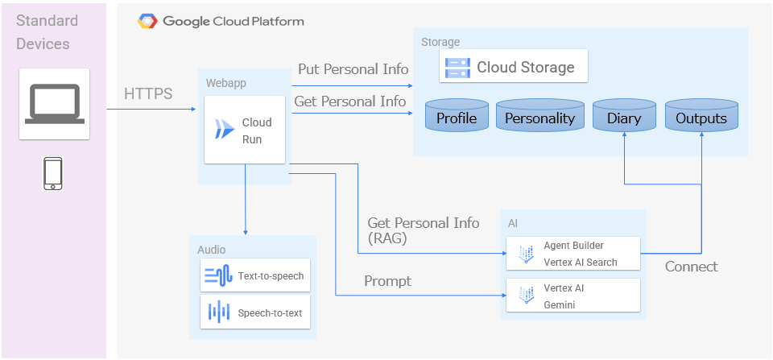
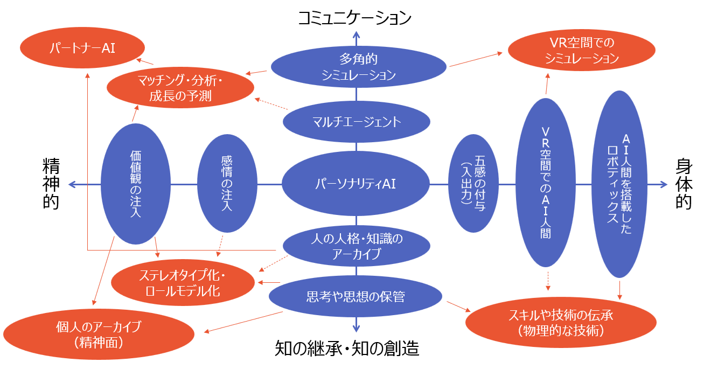

#  (第2回AI Agent Hakkathon) 自分エージェント

##  自分エージェントとは

自分エージェントとは、自分の思考やクセを理解し、自分をサポートしてくれるエージェントです。  
皆さん、こんな悩みはありませんか？

‐ 生成AIでメールの返信文を生成したけど、何か自分っぽくない。  
‐ チャットで応答文のレコメンドが表示されるけど、自分が返している応答文っぽくない。  
‐ 自分と同じ思考や価値観のAIがあれば、自分の代わりに会議に出てもらいたい。

ビジネスパーソンの仕事の中で、大きなウェイトを締めているのが、人とのコミュニケーション（メールやチャット、会議）です。  
本アイディアは、思考レベルで自分をサポートしてくれる秘書のようなエージェントを作りたいと考え、開発しました。

##  パーソナリティ（個性）とは

ここから少し学術的な話になりますが、パーソナリティ（個性）とは何かについて、深堀って行きたいと思います。そこで、私が参考にしたのが、小塩真司先生が執筆された「はじめて学ぶパーソナリティ心理学」という書籍です。  
[はじめて学ぶパーソナリティ心理学:個性をめぐる冒険](https://www.amazon.co.jp/%E3%81%AF%E3%81%98%E3%82%81%E3%81%A6%E5%AD%A6%E3%81%B6%E3%83%91%E3%83%BC%E3%82%BD%E3%83%8A%E3%83%AA%E3%83%86%E3%82%A3%E5%BF%83%E7%90%86%E5%AD%A6-%E5%80%8B%E6%80%A7%E3%82%92%E3%82%81%E3%81%90%E3%82%8B%E5%86%92%E9%99%BA-%E5%B0%8F%E5%A1%A9%E7%9C%9F%E5%8F%B8/dp/4623056848)

私の解釈がどこまで行き届いているかは、非常に心配ではありますが、私はこの本を読んで、以下の2つの観点から、パーソナリティを表現できるのではないかと考えました。

  * ビッグファイブ・5因子モデルによるパーソナリティ特性
  * 「行動」を観測することで、パーソナリティを推測する（環境や状況も多分に影響する）

詳細はここでは割愛しますが、興味がある方はぜひ書籍を読んでみてください。  
とりあえず、本テーマはここが出発点であることを共有いたします。

##  今までのハッカソンからの継続性

まず、AI Hakkathon(前々回)では、ParsonalityAI as a Serviceのテーマで、世の中の性格診断（例：[16Personalities](https://www.16personalities.com/ja/%E6%80%A7%E6%A0%BC%E8%A8%BA%E6%96%AD%E3%83%86%E3%82%B9%E3%83%88%EF%BC%89)を使ったパーソナリティの評価を行いました（まずまずの精度）。こちらの評価により、ビッグファイブ・5因子モデルによるパーソナリティ特性を生成AIにある程度埋め込めたと思っています。

次に、AI Agent Hakkathon（前回）では、PartnerAIのテーマで、「日記をつける（ふりかえり）」ことで、その日の「行動」をアーカイブ（RAG：AI Agent Builder）することを目指しました。

そして、今回は、いよいよ、生成AIで自分のパーソナリティを表現できるかを試行してみました。  
今回のポイントは以下となります。

  * 外部の性格診断ではなく、生成AIにビッグファイブ診断をしてもらう。
  * 「行動」の切り口を以下の3つの要素でアプローチする。 
    * 長期的な行動：個人の基本情報やキャリア・経歴など
    * 短中期的な行動：日記をつける（ふりかえる）
    * 行動の結果：メールやチャット、会議での発言などのアプトプット

##  今回開発した機能のご紹介

今回開発したプロダクトの主な機能は以下となります。

  1. ビッグファイル・5因子モデルの診断をしてくれるエージェント（今回開発）
  2. 個人の基本情報やキャリアなどをヒアリングするエージェント（今回開発）
  3. 日記をつけるエージェント（前回の作品をそのまま流用）
  4. メールやチャット・会議での発言などを収集するエージェント（今回はCloudStorageに手動で配置）
  5. 自分エージェント（今回開発）

■ プロダクトの画面イメージ  

■プロダクトの紹介・デモ動画  
<https://youtu.be/liKOLLR7pKA>

##  プロダクトが対象とするユーザ像と課題

本プロダクトが対象とするユーザ像は、以下となります。

【ユーザ像】

  1. いつも会議参加やチャット返信などに追われ、自分の時間がなかなか持てない人
  2. コミュニケーション疲れで疲弊している人
  3. 自分の思考や価値観、クセを理解し、自分と同じように動いてくれるエージェントが欲しい人

また、上記のユーザが持っている課題として、以下を想定しました。

【課題】

  1. 会議やチャットなどのコミュニケーションが追われ、自分の時間が持てない。
  2. コミュニケーション過多で疲弊しており、パフォーマンスが上がらない。
  3. 生成AIから自分の思考や価値観を反映した回答がなかなか得られない。

##  課題へのソリューションと特徴

前項で上げた課題へのソリューションとして、以下の機能を持ったプロダクトを開発しました。

  1. 個人の基本情報をヒアリングするエージェント。
  2. パーソナリティ分析を行うエージェント。
  3. 内省を手伝い、日記を残してくれるエージェント。
  4. 自分の個性をもったエージェント（自分エージェント）。

本プロダクトで意識したポイント（特徴）は以下となります。

  * 心理学をベースとした、パーソナリティの確立。
  * 日頃のアウトプット情報（メール・チャット・会議スクリプト等）をRAG化することによる本人に近いアウトプットの生成。

##  アイディアの中で特に意識したこと

単に自分っぽいメールの返信文やチャットの応答文を生成するだけであれば、アウトプット物（実際に自分が送信したメール文面やチャット内容）をRAG化して、それを参照すればよいと思いました。  
しかし、実現したかったのは、自分専用の代理人であることに気づき、単なるツールとしてのAIエージェントではなく、人に近い代理人としてのAIエージェントであり、個性や人格を生成AIで表現できないかを考えました。  
人のエージェントも、クライアントの意を汲んで、クライアントの言いたいたいことを見事に表現して、クライアントの代わりに交渉したり、タスクをこなしたりしますよね。  
自分エージェントとは、誰にでも、自分の意を汲んでくれる代理人（エージェント）を提供したいという思いで生まれたプロダクトになります。

##  システム・アーキテクチャ

本プロダクトのアーキテクチャを以下に示します。

  * 本プロダクト本体は、Cloud Run上にWebアプリ（Streamlit x Langchain）で配置されています。
  * 音声インターフェースを実現するために、text-to-speechとspeech-to-textのAPIを実行することで、音声会話を実現しています。
  * 要約された日記（テキスト）は、Cloud Storageに日単位で保存しています。
  * Cloud Storage（日記情報とアプトプット情報）をデータソースとして、Vertex AI Agent Builder（VertexAISearch）を用いて、RAG環境を構築します。
  * 自分エージェントは、CloudStorage、および、Vertex AI Agent Builder（VertexAISearch）経由で、パーソナリティ情報を取得・検索しています。

##  本プロダクトの使い方

本プロダクトは主に以下の2フェーズがあります。

  1. パーソナリティ情報を収集する
  2. 自分エージェントを使う。

###  パーソナリティ情報を収集する

まず、GitHubに記載通りの構築手順で環境を構築してください。

次に、以下の4つの作業を実施してください。

  1. 本ページの左メニューから、"profile-creater"を選択して、あなたの基本情報を入力してください（生成AIによるヒアリング）。
  2. 同様に、"pesonality-analytics"を選択して、あなたの性格情報を分析してください（生成AIによるヒアリングと分析）。
  3. 同様に、"diary-writer"を選択して、日々の日記をつけ、ふりかえり（内省）情報を蓄積してください（生成AIに話しかけるだけでOK）。
  4. GCPのCloudStorageの"myself-ai-agent"バケット内の"output-info"フォルダに、メールやチャットのやりとり、会議のスクリプトなどのテキストファイルを保管してください（ここだけ手動ですいません・・・）。

日記の情報とアウトプット情報は、Vertex AI Agent Builder（VertexAISearch）で自動的にRAG化されます。

###  自分エージェントを使う

  1. 本ページの左メニューから、"myself-ai-agent"を選択し、依頼したい内容を入力してください。

あなたのパーソナリティ情報をベースに、生成AI（自分エージェント）が応答してくれます。  
また、具体的な記憶（日記）や類似するアウトプット情報があれば、その情報も加味して、回答してくれます。

上記のように、パーソナリティ情報や行動を加味したエージェントを使用することで、  
よりあなたにより沿ったエージェントが提供されます。

##  実装コードについて

プロダクトコードは、GitHubに公開していますので、GitHubをご確認ください。  
  
<https://github.com/INTREPIDA1979/myself-ai-agent.git>

##  想定されるユースケース

自分エージェントの想定ユースケースを以下に3つ提示します。

  * **メールの返信**
    * メールの返信ボタンを押すと、自分が返信しそうな文章が瞬時に生成される。  
後は、内容に不備がないかを確認して、送信ボタンを押すだけ。
  * **チャットへの返信**
    * チャットで連絡がくると、自分が返信しそうな文章の候補が2～3提示される。  
後は、自分の意に沿った文章を選択するだけ。
  * **Web会議の代理**
    * Web会議中の突然の呼び出しに対して、自分エージェントが代理で出席してくれる。  
参加者は、本人と同じような発言をもらえるので、会議を停滞させることなく、スムーズに進行できる。  
本人は自分エージェントから会議結果共有（会議の内容・自分の発言）を受ける。

上記以外にも、本人と同じようなAIでも代替できることは沢山あると思います。

また、余談ですが、Web会議の代理のケースでは、「エージェントの発言＝本人の発言になってしまうのでは？」とも思いましたが、人のエージェントも、本人の意見を代弁するケースがあり、本人との認識が異なることもあります。  
なので、代理人との認識合わせや情報共有が必要なのは、人もAIも変わらず、Web会議の代理をAIに頼むときも、「自分の意見はこれこれだから・・・」と事前にAIに伝えておけばよいのだと思いました。

##  本プロダクトの改善点と今後の方向性

今回の期間で実装しきれなかった改善点を以下に記載します。

  * **精度評価とプロンプト改善**
    * 自分で利用している感覚としては、それなりの精度は出ており、実用もできそうだが、きちんとした精度評価やプロンプト改善をしていないので、その点は対応したい。
  * **API化**
    * 本プロダクトは実際には、メールやチャット、Web会議などから、Callされることを想定しているため、チャット形式のUIだけでなく、API提供できるようにしたい。
  * **パーソナリティ情報の拡充**
    * 今回は、基本情報・パーソナリティ分析・日記（ふりかえり）・アウトプット情報という4つの要素で個人のパーソナリティを表現してみましたが、他にもパーソナリティ情報はたくさんあるので、他のパーソナリティ情報も拡充していけるようなアーキテクチャにしていきたい。

##  中長期的な目標

今回のテーマである"自分エージェント"は、PersonalityAIとして、想像していた個性（パーソナリティ）を表現していく、第1歩になったと思っています（まだまだ改善・改良は必要ですが💦）。

AIでパーソナリティ（個性）を表現できるようになると、下図のように、多方面での拡張・活用が想定でき、AIによって、様々なことが実現されていくんだろうな⋯と妄想にふけっていますw

直近の妄想では、今回開発した自分エージェントと前回開発したパートナーAIを対話させて、相互学習させると、自分エージェントはより本人らしく振る舞うようになるのか、パートナーAIは本人をより深く理解したうえでサポートしてくれる存在になるかを検証してみたいと思っています（LangGraphを使って）。

本記事を最後まで読んでいただき、ありがとうございました。  
そして、私の妄想に最後までお付き合いいただき、本当に感謝です。

また、新しいアプトプットができましたら、投稿させていただきたいと思います。
