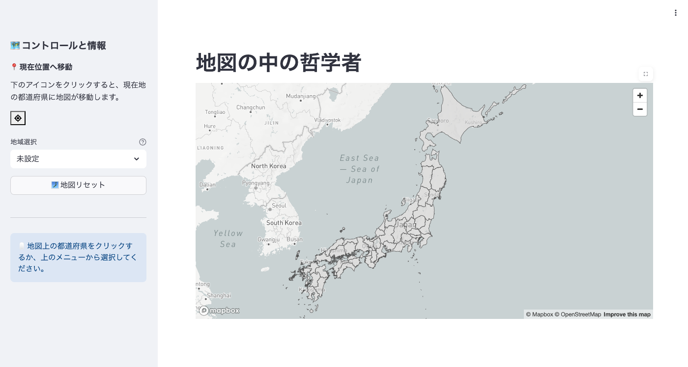
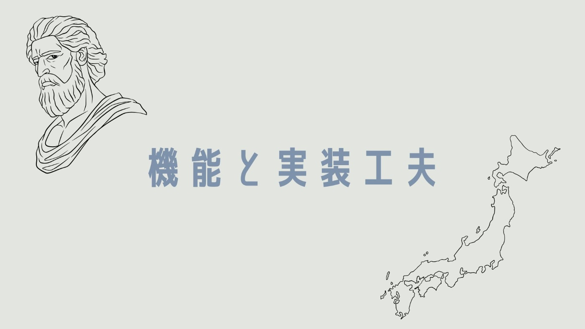
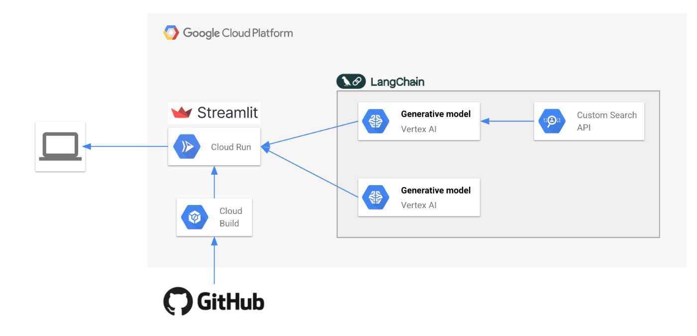
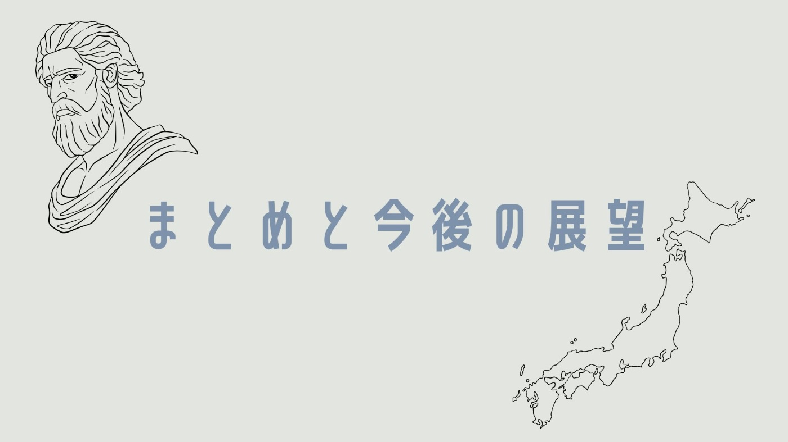

本記事はZennが主催する第2回 AI Agent Hackathon with Google Cloudにエントリーするプロダクトについての紹介記事です。

<https://zenn.dev/hackathons/google-cloud-japan-ai-hackathon-vol2>

#  はじめに

本プロジェクトは、日本の多くの地域が直面する社会課題「**地方の過疎化** 」に挑みます。この問題は根深く、解決の糸口を見つけるのは容易ではありません。

日本の人口減少と高齢化が進む中、特に地方では**コミュニティの維持が年々困難に** なっています。この過疎化は、経済やインフラの縮小に留まらず、担い手不足による祭りの途絶や伝統技術の衰退など、地域が育んできた固有の文化をも失わせています。

しかし、私たちは信じています。どんな地域にも、まだ光の当たっていない、人々を惹きつける魅力が必ず眠っている、と。そして、その輝きをテクノロジーの力で再発見できるはずだと考えています。

この想いを形にするため、私たちは**AIエージェントの開発** に着手しました。AIの力で地域の隠れた魅力を掘り起こし、**人々の「行ってみたい」「住んでみたい」という気持ちを喚起する** 。それが、私たちのプロジェクトの原点です。

#  プロダクト概要：「地図の中の哲学者」

「地図の中の哲学者」は、地域の新たな魅力を発見し、その物語を紡ぎ出すためのAIエージェントです。

ユーザーは日本の地図から気になる都道府県を選ぶだけ。すると、AIがその土地の本質的な特徴や文化を深く読み解き、象徴的な画像や地域ゆかりの名言と共に、示唆に富んだ一つの物語を紡ぎ出します。

これは、単なる情報提供を超えた、**新しい地域発見の体験** です。

この「哲学者」という名には、私たちがAIに託した願いが込められています。私たちのAIは、単なる情報処理マシンではありません。それは、地域の歴史や文化の文脈を深く理解し、物事の本質を問い、新たな視点を示唆する「**知的なパートナー** 」です。

ユーザーがAIとの対話（記事の生成）を通じて、まるでその土地の賢者と語り合うかのように、地域の奥深い魅力や新たな視点を見つけ出す。そんな**知的な探求体験** を提供します。

▼デモ動画  
<https://www.youtube.com/watch?v=alPOffrh-Ns>

こちらに登場する哲学者は、「Imagen 3」を用いて生成した画像を「Hailuo AI」を用いて動画として動かしています。

##  ターゲットユーザー

本エージェントは、地域の「外」から未来の関係を求める人々を主なターゲットとしています。

  * **未来の暮らしを探す、移住検討者** : 制度や統計データだけでは見えない、その土地の文化や雰囲気といった「暮らしの質感」を伝え、納得感のある意思決定を支援します。

  * **まだ見ぬ物語を求める、旅人** : ガイドブックには載っていない地域の歴史や文化を「旅のテーマ」として提案し、より深い体験のきっかけを提供します。

##  ソリューション

「地図の中の哲学者」は、AIが地域の代弁者となり、その土地ならではの「物語」を紡ぎ出すことで、課題解決の糸口を探ります。

統計データや観光情報だけでは伝わらない、その土地の歴史、文化、そして人々の営みが織りなす「空気感」。「地図の中の哲学者」は、AIの力でこの**目に見えない価値を「物語」として言語化** し、記事形式で分かりやすく提供します。

移住を考える人には暮らしのイメージを、旅する人には訪問の動機を、それぞれパーソナルな形で提示することで、**人と地域の新たな関係性を構築します** 。ユーザーは、このAIとの対話を通じて、まるでその土地の賢者と語り合うかのように、地域の奥深い魅力を探求することができるのです。

##  特徴

  * **手軽な「物語」の発見** : ユーザーはキーワード検索すら不要です。地図を選ぶだけで、AIエージェントがWeb上の散在する情報源から文脈を読み解き、一つのまとまった記事として再構成します。

  * **魅力が伝わるコンテンツ表現** : 分かりやすい文章と、地域の風景を切り取った印象的な画像、そしてその土地の文脈に合った名言を組み合わせ、多角的に地域の魅力を伝えます。

  * **ユーザーはワンタッチで記事を作成** : 複雑な設定や操作は一切不要です。地図上で興味のある地域を選んでボタンを押すだけで、AIエージェントが情報収集、分析、執筆、画像選定までを自律的に行い、一つの完成された記事として提供します。

#  機能と実装工夫

ハッカソンという限られた時間で、この体験の質と安定性を両立させるため、以下の設計と実装を行いました。ここでは、本プロダクトで実現した機能と、その裏側にある技術的な工夫のポイントをご紹介します。

##  システムアーキテクチャ図

##  使用技術

カテゴリ | 技術スタック | 役割  
---|---|---  
フロントエンドフレームワーク | Streamlit | WebアプリケーションのUI（ユーザーインターフェース）を構築  
アプリケーションサーバー | Cloud Run | Streamlitで作成されたアプリケーションをコンテナとして実行・ホスティング  
CI/CD | Cloud Build | GitHub上のソースコードからコンテナイメージを自動でビルド  
ソースコード管理 | GitHub | アプリケーションのソースコードを管理  
AIオーケストレーション | LangChain | 複数のAIモデルやAPIを連携させ、自律的な処理フローを制御  
AIモデル（テキスト生成） |  `gemini-2.0-flash-lite-001` on Vertex AI | 記事本文、タイトル、名言などのテキストコンテンツを生成  
AIモデル（画像生成） |  `imagen-3.0-generate-002` on Vertex AI | 記事を彩る4コマイラストや挿絵などの画像を生成  
API | Custom Search API | LangChainエージェントがWeb情報を検索するために使用するツール  
  
##  主要機能

私たちが目指したのは、ユーザーがストレスなく地域の物語に没入できる体験です。そのために、以下の主要機能に特に注力しました。

**直感的でスムーズな地図体験**

  * **インタラクティブ・マップUI** : 複雑な操作を排し、日本地図から直感的に都道府県を選択、その地名情報を取得する機能を実装。これにより、ユーザーの偶発的な興味を誘発し、「知らなかった地域」との出会いを創出します。
  * **現在位置情報ボタン** : ワンタッチでユーザーの現在地を地図上に表示し、「自分が今いる場所」の新たな魅力を発見するきっかけを提供。日常の風景が、探求の対象へと変わる瞬間を演出します。

**待つ時間も体験の一部にする記事生成**

  * **ワンクリック自動記事生成** : 「記事生成」ボタン一つで、バックエンドのAIエージェントが自律的に処理を実行します。
  * **ローディングUIの実装** : AIの思考プロセスには一定の時間がかかります。ユーザーをただ待たせるのではなく、処理の進行状況（「情報収集開始」「記事構成を検討中」など）をテキストで表示し、期待感を持って待てるよう、ワークフローに合わせた丁寧なローディング画面を実装しました。

**多角的な魅力が伝わるコンテンツ表現**

  * **洗練された記事デザイン** : 生成されたコンテンツが最も魅力的に伝わるよう、読みやすさと視覚的な美しさを両立した記事デザインを追求しました。
  * **4コマイラストとセクションごとの画像生成** : AIが記事全体のテーマを理解し、その地域の特性を反映した起承転結のある4コマイラストを生成。さらに各小見出しの文脈に合った画像を自動生成することで、視覚情報を通じて地域の物語をより豊かに、直感的に伝えます。
  * **哲学者の一言（名言生成）** : 記事の冒頭に、その地域ゆかりの偉人の言葉や、記事テーマに合った哲学的な名言を掲げます。これにより、記事全体のテーマを象徴的に提示し、読者をこれから始まる物語の世界観へと引き込み、深い思索のきっかけを与えます。

##  技術的な工夫

円滑なチーム開発と高品質な生成AI体験を実現するため、以下のような工夫を行いました。

**開発基盤の整備とプロジェクト管理**

短期間での開発を成功させるため、何よりもまず開発の土台固めを重視しました。初期段階でDockerによる開発環境の統一、Git-flowに基づいたブランチ戦略の策定、そして詳細なタスク分割とスケジュール計画を実施。これにより、チームメンバー全員が迷いなく、かつ自律的に開発に集中できる体制を構築しました。

**LangChainによる自律的エージェントの設計**

良質な記事の生成は、「検索」「分析」「執筆」「コンテンツ統合」という複数のステップが連携する複雑なプロセスです。私たちはこの一連の流れを、LangChainを用いて自律的に実行するエージェントとして設計しました。

単一の巨大なプロンプトに頼るのではなく、各ステップを個別のタスクとして定義し、それらをエージェントがReAct（Reason-Act）の思考プロセスに基づき、状況に応じて自律的に呼び出すことで、柔軟性と拡張性、そして一貫した品質を担保しています。

**プロンプトエンジニアリングによる生成品質の管理**

高品質なアウトプットを引き出すため、プロンプト設計に特に注力しました。LLMには「親しみやすい賢人」というペルソナ（役割）を与え、単なる事実の羅列ではなく、読者の知的好奇心を刺激し、思索を促すような示唆に富んだ文章を生成するよう、役割とゴールを明確に定義することで、その能力を最大限に引き出しています。

また、画像生成においては、単に地名を与えるだけでは凡庸な画像しか得られません。そこで、「地域の特徴」「記事のメインタイトル」「各セクションの小タイトル」を動的に組み合わせ、アートスタイルまで含めた詳細なプロンプトを自動生成する仕組みを実装しました。この多角的な情報に基づいたプロンプトこそが、コンテンツ全体の説得力と芸術性を高める鍵となっています。

#  まとめと今後の展望

「地方の過疎化」という根深い課題に、AIで何ができるのか。この問いに挑むため、私たちはAIエージェント「地図の中の哲学者」を開発し、本ハッカソンでそのプロトタイプを完成させました。地域の魅力を再発見し、人々が訪れ、住みたくなるきっかけを生み出すのが、このエージェントの役目です。

この挑戦は、AIが私たちの最高のパートナーになり得ることを教えてくれました。作業を効率化するだけでなく、私たちの知的好奇心を刺激し、忘れられつつある文化の価値を見つけ出してくれる存在です。

私たちの旅は、まだ始まったばかりです。これから、以下の展望を実現することで、この「地図の中の哲学者」を、日本中の地域を元気にするエージェントへと育てていきます。

  * **対話機能の本格実装** : 生成された記事について、ユーザーが「この歴史を詳しく教えて」などの質問を投げかけると、AIが対話形式で回答します。これにより、一人ひとりの興味に合わせた、より深い探求体験を提供します。

  * **地域住民からの知識獲得機能** : 地域の方々が、地元の物語や隠れた名所などの情報をAIに直接「教える」ことができる仕組みを構築します。これによりAIは、ネットだけでは得られない生きた知識を学習し、その地域ならではの魅力を語れるようになります。

  * **多言語対応** : 生成する記事を多言語化し、海外からの観光客にも日本の地方の奥深い魅力を届けます。これにより、これまで知られていなかった地域への関心を高め、新たな観光需要を創出します。

このプロジェクトが、少しでも多くの人と地域を繋ぐ架け橋になれば幸いです。さあ、地図を開き、あなただけの賢者との対話を始めましょう。ありがとうございました。
