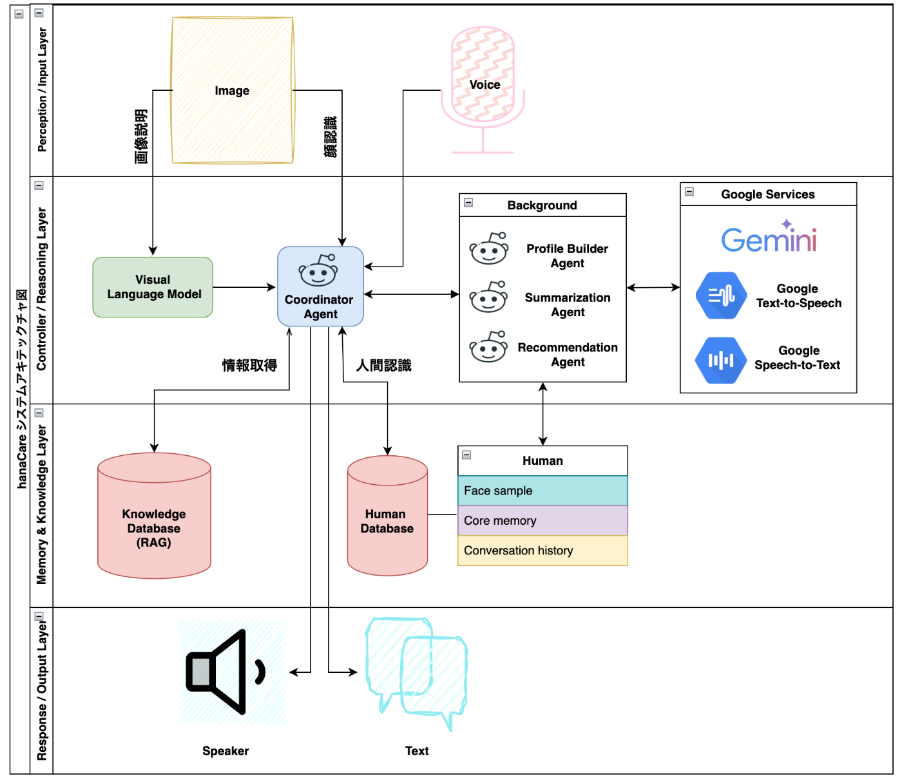
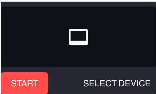
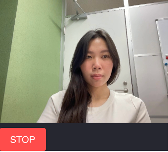
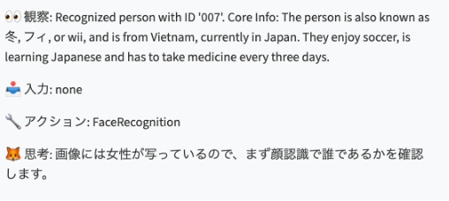
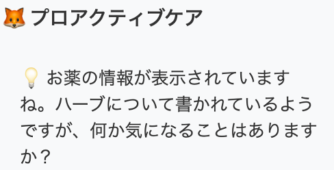
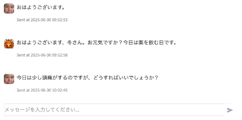
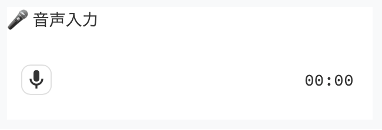

**高齢者支援の“もうひとりの家族”**

* * *

###  はじめに：高齢化社会の課題

世界的に高齢化が進む中、日本をはじめとする多くの国々では、介護資源の不足、核家族化、地域コミュニティの希薄化によって、高齢者の孤立が深刻化しています。  
2050年には、世界の60歳以上の人口は21億人を超えると推計され、高齢者への医療・介護・家族支援の制約は社会問題となっています。  
多くの高齢者が「孤独」「服薬ミス」「認知機能低下」「緊急時対応の欠如」に悩まされており、離れて暮らす家族は見守りに不安を感じ、介護者は身体的・精神的負担を負っています。  
このような状況を背景に、hanaCareは“もうひとりの家族”として高齢者を支え、孤独を和らげ、安全で規則正しい生活を促すことを目指しています。

* * *

###  プロジェクトの目的と社会的価値

hanaCareは単なるスマートスピーカーやチャットボットではなく、以下の5つの柱を備えた「人間らしい」AIパートナーです：

  * **マルチモーダル認識（顔・声）**
  * **自然言語対話**
  * **パーソナルメモリ**
  * **長期的な関係構築**

これにより、次のような社会的価値を提供します：

  * 高齢者の生活の質（QOL）向上
  * 家族・介護者の負担軽減と安心感の創出
  * 地域包括ケアへの貢献（介護におけるDX推進）
  * 一人暮らし高齢者の社会的孤立の防止
  * 安全な軽量AIインフラの実現

* * *

###  システムアーキテクチャ

* * *

####  全体構成レイヤー

  * Perception / Input Layer
  * Controller / Reasoning Layer
  * Memory & Knowledge Layer
  * Response / Output Layer

各レイヤーは非同期・疎結合モジュール構成で、拡張性・再利用性に優れています。

####  1\. Perception / Input Layer

画像・音声など多様な入力データを収集・前処理します：

  * 顔認識（InsightFace, OpenCV）→ 埋め込みベクトル生成
  * Google STT → 音声特徴 + テキスト化
  * ヴィジュアル言語モデル → 表情やコンテキストに応じた理解

####  2\. Controller / Reasoning Layer

  * 各種入力信号を統合し、適切なモジュールへルート
  * ReAct（Reason and Action）(Gemini 搭載)というフレームワークを用いてリアルタイム意思決定（服薬リマインド、来訪者検知など）
  * メモリや知識ベースからのデータ取得
  * **Profile Builder Agent** ：会話・行動ログからのメモリ構築・更新（Gemini API）
  * **Summarization Agent** ：主要イベントや気分変化を要約、介護者への提供
  * **Recommendation Agent** ：データに基づく共感的な応答生成（Gemini API + RAG）

####  3\. Memory & Knowledge Layer

  * **Human Database** ：ユーザープロフィール（顔埋め込み、基本情報、趣味、会話ログ）
  * **Knowledge Database** ：医療ガイド、ルーティン、外部ドキュメント（RAG）

####  4\. Response / Output Layer

  * **Response（TTS）** ：Google TTSを使った自然な音声出力
  * **出力先** ：スピーカー、テキスト

* * *

###  特徴と価値

原則 | 実装例  
---|---  
軽量かつ効率的 | エッジデバイス実行  
プライバシー重視 | VMローカル保存（GCE）  
モジュラー設計 | 機能モジュールの追加が容易  
クラウド×エッジのハイブリッド | ローカル即時処理＋クラウドで重厚処理  
利用者中心設計 | 感情理解と関係構築重視  
  
* * *

###  将来の機能拡張：3つの重点領域

####  1\. 入出力の高度化（感情・健康インサイトの向上）

  * 顔・音声を活用した**感情検出** の実装
  * 行動パターンや音声ログからの**健康リスク予測**
  * 緊急時に即時反応できる**緊急対応機能** の強化

####  2\. アプリ・外部サービスとの連携強化（ケアエコシステムの拡張）

  * **家族通話機能付きモバイルアプリ** の提供（iOS／Android）
  * **SNSとの連携** によるコミュニケーション促進
  * レポートや通知機能の**Webアプリ化**
  * ユーザーに合わせた**エージェントギャラリー（性格や話し方のカスタマイズ）** の導入

####  3\. 利用環境への最適化（高齢者の生活スタイル対応）

  * **介護施設入居者** 用に最適化された共有モード／多ユーザー対応機能の追加

* * *

###  対象ユーザー

**直接ユーザー：**

  * 一人暮らしの高齢者

**間接ユーザー：**

  * 遠方に住む家族
  * 訪問介護者・看護師
  * 自治体・介護支援センター・保険会社

* * *

###  技術スタック概要

  * **入力：** InsightFace＋ArcFace（顔）、Google STT
  * **推論：** ReAct（Reason and Action）フレームワーク
  * **LLM：** Gemini API、カスタムRAG
  * **メモリ：** Elasticsearch、GCE VM上のローカルDB
  * **出力：** Google TTS

* * *

###  日常ユースケース例

* * *

####  1\. 朝のルーティン（7:00頃）

  * **きっかけ**  
ユーザーが挨拶したり、ボタンを押したり、アプリで操作した時

  * **会話例**  
ユーザー：「おはよう」  
システム：「おはようございます、鈴木さん。今日は晴れそうですね。  
天気と予定をお知らせしますか？それとも水分補給のリマインダーがよろしいですか？」

  * **動作**  
ユーザーが内容を指定するまで待機  
要望があれば、天気・予定・水分補給を案内

* * *

####  2\. 服薬リマインダー

  * **きっかけ**  
服薬時間にユーザーが質問／操作した時

  * **会話例**  
ユーザー：「薬は飲む時間？」  
システム：「はい、血圧の薬を飲む時間です。ご準備はよろしいですか？」

  * **動作**  
ユーザーの確認を待つ  
要望があればリマインドやフォロー  
服薬を完了したら記録し、家族へ通知も可能（同意がある場合）

* * *

####  3\. 食事提案

  * **きっかけ**  
食事時間にユーザーが質問／操作した時

  * **会話例**  
ユーザー：「何を食べたらいい？」  
システム：「食事の提案をしますか？それとも食事の時間をお知らせしましょうか？」

  * **動作**  
ユーザーの要望があるまで待機  
依頼に応じてメニュー提案やリマインドを提供

* * *

####  4\. 新しい人との会話（社会的つながり促進）

  * **きっかけ**  
ユーザーが「誰かと話したい」と希望したとき

  * **システムの対応**  
他の高齢者と1対1の安全なチャットをセッティング  
事前承認済みプラットフォームを使用し、プライバシーと安全を確保

  * **メリット**  
交流を広げ、孤立を防ぐ

* * *

####  5\. 医療アドバイス（受動的ユースケース）

  * **きっかけ**  
健康に関する質問や不調をユーザーが相談

  * **システムの対応**  
一般的で根拠に基づくアドバイスを提供  
例：「咳が続く場合は水分をとり安静にしてください。数日続く、または呼吸が苦しい場合は医師に相談しましょう。」  
服薬に関する質問には登録済みスケジュールを参照して回答  
緊急性が高い場合、遠隔診療や家族・医師へつなぐ提案

  * **メリット**  
ユーザーの不安を軽減し、必要な時に専門家へ早期連携  
受動的モニタリング（健康データのパターン解析）と組み合わせ可能

  * **例：対話**  
ユーザー：「頭痛とめまいがします。どうしたらいい？」  
システム：「ご気分が優れないのですね。まず座って水をお飲みください。  
めまいが続くようでしたら、医師またはご家族に連絡しましょうか？」

* * *

###  結論

hanaCareは単なるソフトウェアではなく、“共に暮らす” AI パートナーです。  
高齢者・家族・介護者・医療をつなぎ、「尊厳」「安心」「心の支え」を備えた社会を目指します。  
**「テクノロジーが思いやりを加えると、人と人との距離は縮まる。」**  
この一歩を、我々と一緒に踏み出しましょう。

###  システムの使い方

**ステップ1：カメラを起動**  
「スタート」ボタンを押してカメラをオンにする。  
→ 数秒でhanaCareが認識を始める。  
  
「スタート」ボタンをクリック  
  
・カメラを許可すると、ユーザーが新しいかどうかを判別  
・初めての方：hanaCareは画像と会話情報（名前など）自動的にユーザ登録  
・登録済みの方：hanaCareは知っているユーザとして会話  
**ステップ2：推論モードを開始**  
「推論を開始」ボタンをクリックすると、顔を認識し状況を分析する。  
分析後、hanaCareが稼働する。  
  
「推論開始」ボタンをクリック  
  
推論モードが開始され、ユーザーを認識し記憶に基づいた対応を行う  
  
ユーザーに最適な内容を出力  
**ステップ3：会話実施**  
音声ボタンで話すか、チャットでメッセージを入力して、hanaCareとやりとりできる。  
  
チャットでシステムとやりとり  
  
音声でシステムとやりとり  
メッセージを受け取った後、システムはまずテキストで返答し、その後音声に変換するまでに少し時間がかかります。  
音声での返答が終わる前に次の質問をすると、応答が重なってしまう可能性がありますので、必ず音声が終わるまでお待ちください。

* * *

###  デモビデオ
