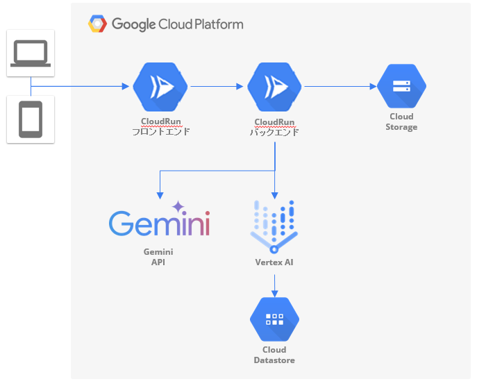

#  1\. はじめに（導入）

####  記事の目的

本記事は、Google が主催する開発コンテスト「AI Agent Hackathon with Google Cloud」へのエントリー作品であるプロダクトについて、その概要や技術的な工夫、社会的背景などを紹介することを目的としています。

近年、生成AIやクラウド技術の進化により、生活に身近な課題に対してもテクノロジーの力で新しい解決策を提供することが可能となっています。本プロダクトもその一環として、住まい選びにおける「ミスマッチ」という課題に焦点を当て、ユーザーのライフスタイルに適した住宅選定を支援する新しいAIエージェントの形を提案します。

#  2\. 開発したアプリの概要

####  アプリ名

次の住処 ～住宅ミスマッチ防止bot～

####  一言で言うと？

「住居や地域の情報をAIが多面的に解析し、自分の価値観にフィットする住まいを提案してくれるパートナーのようなアプリ」です。

####  解決したい課題

住まい選びは、人生において非常に重要な意思決定の一つですが、情報の非対称性や可視化の難しさから、しばしばミスマッチが発生しています。たとえば、入居して初めて気づく「騒音」「日当たり」「湿気」「通信環境」といった生活インフラ面での不満や、近隣住民との相性、地域コミュニティの雰囲気など、数値化・事前確認が難しい要素が大きなギャップ要因になります。

さらに、不動産情報は業者によって加工されており、客観性に乏しく、生活の実感が伴わない情報になっていることも珍しくありません。本アプリは、こうしたミスマッチの原因に着目し、AIの力で「生活に合うかどうか」を事前に診断・提案することを目的としています。

####  ペルソナ

ターゲットユーザーは、例えば以下のような特徴を持った方々です：

-都内や都市圏への引越し・転居を検討しているが、土地勘がなく不安  
-子育て世帯、共働き世帯、在宅勤務などライフスタイルが明確  
-内見だけでは把握できない生活環境（周辺の商業施設や騒音、治安、施設密度など）に懸念がある  
-業者から提供される情報だけでは判断材料が足りず、後悔したくないという強い思いを持っている

こうしたユーザーに対し、本アプリは「価値観」「ライフスタイル」「周辺環境」などを多角的に分析し、定量データと定性情報の両面からマッチ度を診断・提案します。

####  主要機能

住宅ミスマッチ防止botは以下の機能をもちます

##### 1.ユーザはWebフォームに不動産情報サイトの物件URLを入力する

このURLには物件の基本情報が含まれており、AIの解析対象となります。

##### 2.リクエストをCloudRunが受け取り、情報サイトに記載された情報に加え、ハザードマップ、行政、治安や周辺の店舗情報などを取得する

Gemini APIを通じてURL内の物件情報を自然言語処理により解析し、まとめます。その後まとめた情報をもとにVertex AIはデータベースから周辺施設、治安、行政データ、ハザード情報などを自動収集します。

##### 3.取得結果をwebページとして生成し、表示する

ユーザーは、物件単体ではなく、その物件が位置する「街」や「環境」も含めて多面的に判断できます。

##### 4.ユーザーにとっての"価値観スコア"を表示

騒音・利便性・安全性・コミュニティ適合度などの観点からスコアリングし、価値観とのマッチ度をわかりやすく表示します。

####  デモへのリンク

<https://youtu.be/0ai8L0HBYXM>

#  3\. アプリの技術スタック（使った技術）

####  システムアーキテクチャ

####  採用技術

種別 | 仕様技術  
---|---  
フロントエンド | CloudRun, React  
バックエンド | CloudRun, FastAPI  
物件情報検索 | Gemini API  
地域情報の格納先 | Google Cloud Storage Data Store  
結果の格納先 | Google Cloud Storage  
  
###  自然言語による物件検索：Gemini APIの活用

本アプリケーションの中核となるのが、Google の生成AI「Gemini API」を用いた自然言語処理（NLP）です。  
ユーザーは物件情報サイトのURLなど、物件概要が記載されたwebページのURLを入力します。これをバックエンドで受け取り、Gemini API を使って以下の処理を行います：

  * 入力文から物件の条件を抽出
  * 抽出された条件について、周辺情報、行政情報、ハザードなどのデータをデータベースや外部APIに対して照会

Gemini のゼロショット／少数ショットの文脈理解能力を活かすことで、ルールベースでは難しい柔軟な意図解釈を実現しています。

###  地域情報の格納と再利用：Google Cloud Datastore

地域ごとの統計情報（治安、学校、交通利便性など）は、あらかじめ Google Cloud Datastore に格納しています。Geminiが抽出した地域キーワードを使って、このDatastoreから該当エリアのメタ情報を取得し、検索結果に付加情報として表示します。

###  結果のキャッシュと永続化：Google Cloud Storage

検索結果は、再利用や分析、ユーザー履歴の保存を目的として、JSON形式で Google Cloud Storage に保存しています。これにより、同じ検索条件に対して迅速なレスポンスが可能になるほか、将来的にはユーザーごとのレコメンドや行動分析にも活用できます。

#  4\. 期待する成果

本プロダクト「次の住処」は、ユーザーの価値観やライフスタイルに合った住環境の提案を通じて、「想像と違った住まい」による後悔を防ぐことを目的としています。

具体的には、以下のような成果を想定しています：

  * ユーザーが興味を持っている物件をAIが精緻に解釈・検索に変換できること
  * 地域のリアルな生活環境（治安・騒音・周辺施設など）に関する情報を統合・可視化し、内見だけでは得られない理解を支援すること
  * 物件や街の印象をデータと住民の声から補強し、ユーザーにとっての「暮らしやすさ」の予測精度を高めること

このように、単なる不動産検索ツールを超え、「生活の質に着目した住まい提案AI」として機能することが本アプリのコアバリューです。

#  5\. 今後の展望・改善点

本アプリのプロトタイプを起点に、今後は以下のような発展・展開を視野に入れています：

  1. ユーザー適応型AIエージェントへの進化  
ユーザーの検索履歴やフィードバックを蓄積し、パーソナライズされた住環境スコアやレコメンデーションを提示できるよう進化させます。将来的には「この人にはこの街が合いそう」という逆引き提案も視野に入れています。また、自然言語での入力（1LDK、キッチンとLDは分離されていて、災害リスクが低く周辺の治安がよく、かつ東京駅までドアドア30分など）を可能にします。

  2. 不動産業界との連携  
不動産仲介業者の営業支援ツールとして組み込み、ミスマッチ率の低減と顧客満足度の向上に貢献します。物件紹介時に「このお客様は〇〇に不安を感じやすい」という気づきを提供できれば、提案の質が大きく向上するはずです。

  3. 行政・移住支援サービスとの連携  
自治体が保有するオープンデータ（子育て支援、交通インフラ、防災情報など）と連携し、移住促進や地域活性化への応用も検討しています。住まいの選択肢に「暮らしの質」を反映させることで、より納得感のある移住判断が可能になります。

  4. Map APIとの連携  
Gemini から得られた検索結果には、住所情報が含まれます。  
この住所情報をもとに、Map API（Google Mapsなど）を用いて以下の情報を補完・表示します

  * 緯度・経度座標の取得
  * 地図上へのピン表示
  * 最寄り駅や周辺施設の情報の取得  
これらを利用し、視覚的に物件の立地を把握できるUIを提供します。

  5. 非構造データの活用  
また、今後の構想として、エージェントとの対話型の検索機能や、実際の居住者の口コミ・SNSデータなどの非構造データを活用した分析にも取り組みたいと考えています。これにより、さらにリアルな生活実感に基づいたマッチング精度の向上を目指します。「住まい選び」に不安を抱えるすべての人に寄り添い、より良い意思決定を後押しするAIツールとして、引き続き進化を続けていきます。

#  6\. おわりに（まとめ）

本記事では、Google Cloud × Gemini API を活用した AI エージェントアプリ「住宅ミスマッチ防止bot」について紹介しました。

私たちは、「どこに住むか」が人生の質を大きく左右する時代において、より直感的で納得感のある住まい選びをサポートするツールの必要性を強く感じています。  
特に、内見だけでは見えづらい「生活感」や「地域性」といったソフトな要素を、データとAIの力で補完・可視化することに価値があると考えています。

今回のプロジェクトでは、Gemini API による自然言語処理、Map API との連携、Cloud Storage を活用した地域データ統合といった技術を組み合わせることで、暮らしのリアルに寄り添う住まい探し支援の第一歩を実現しました。

このアプリが、より多くの人にとって「自分らしく暮らせる場所」に出会うきっかけとなれば幸いです。  
今後も改善と拡張を続けていきますので、ぜひ応援・フィードバックをよろしくお願いします！
