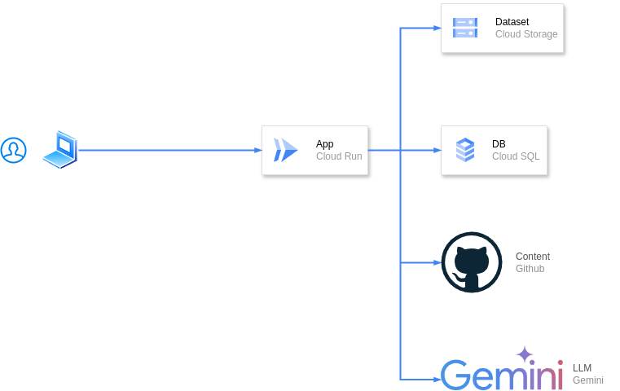

#  BI Chatbot

BI Chatbotは、ビジネスインテリジェンス（BI）ツールのデータを自然言語でクエリし、分析結果をチャット形式で提供するAIチャットボットです。ユーザーは、BIツールのデータに対して自然言語で質問をすることで、迅速に洞察を得ることができます。

##  デモ動画

<https://youtu.be/QA5JhNRnT10>

##  プロジェクトをデプロイしたURL

<https://bi-chatbot-880873538213.asia-northeast1.run.app>

##  対象とするユーザー像

###  レポート閲覧者

  * ビジネスアナリスト

###  レポート作成者

  * データサイエンティスト
  * データエンジニア

##  課題と課題へのソリューション

課題 | ソリューション | 説明  
---|---|---  
ダッシュボード・チャート設定がバージョン管理できない | evidenceを参考にして、データフォーマットとしてMDXで管理する。MDXをGitHubで管理して直接アプリから読み出し、表示する | 当時利用していたBIツールでは、ダッシュボードやチャートの設定はUI上で行う必要があり、GitHubなどのバージョン管理システムでの管理ができなかった。Gitを使ったレビュープロセスとは別にダッシュボードをレビューしたり、チャート設定をBIツールに反映させたり、手間がかかっていた。  
チャート・SQLの作成をより効率的にしたい | AIにSQLを生成してもらうAIにチャート設定を生成してもらう | データ分析のためのSQLクエリを作成するのは、習得に時間がかかり、専門的な知識が必要であった。  
  
これらの課題は、私がデータ基盤を構築するプロジェクトに携わることになったときに感じたものです。当時利用していたBIツールは、metabaseというOSSのBIツールでした。metabaseは、WebUI上でSQLを書いて、その結果として得られたデータをチャートで表示することができました。しかし、チャートの設定やSQLは、WebUI上で行う必要があり、GitHubなどのバージョン管理システムでの管理ができませんでした。そのため、ダッシュボードやチャートの設定をレビューしたり、変更を反映させるために手間がかかっていました。  
また、SQLのクエリを作成するのは、簡単なものであれば書けるものの、複雑なクエリを作成するには専門的な知識が必要でした。そこで、AIにSQLを生成してもらうことで、より効率的にチャートやSQLの作成を行うことができるのではないかと考えました。また、チャートの設定もAIに生成してもらうことで、より効率的にチャートを作成することができるのではないかと考えました。

##  プロダクトの特徴

  * レポート表示機能 
    * GitHubに保存されているMDX形式のレポートを表示
  * チャットによる自然言語クエリ 
    * AIがレポートドキュメントを生成 
      * DBスキーマに基づいたSQLを生成
      * Chartの設定を生成
      * Artifactとしてチャット内でプレビュー表示
    * チャット履歴の保存と表示
  * ユーザ独自のデータセット 
    * DB初期化SQLをユーザが定義できる
    * 自然言語によるデータセットの説明をユーザが定義できる
    * DuckDBを利用したデータアクセス 
      * Cloud Storageに保存したデータ（CSV, JSON, Parquetなど）を利用可能
      * DuckDBの拡張によって、BigQueryやPostgreSQLなどのDBも利用可能
  * ユーザー認証

##  システム アーキテクチャ

システム アーキテクチャ図を以下に示します。

###  システム アーキテクチャ図

###  説明

登場人物 | 説明 | インフラ  
---|---|---  
ユーザー | BI Chatbotを利用するユーザー | -  
App | BI ChatbotのWebアプリケーション | Cloud Run  
DB | BI Chatbotのデータベース  
チャットの履歴、ドキュメント、ユーザ情報を保存 | CloudSQL  
LLM | 大規模言語モデル | Gemini2.5 Flash  
Dataset | BIがアクセスできるデータセット | Cloud Storage  
Content | コンテンツストレージ | GitHub  
  
###  アプリの主な技術スタック

  * フロントエンド 
    * React
    * TypeScript
    * Tailwind CSS
  * バックエンド 
    * Node.js
    * Next.js App Router
    * DuckDB
    * drizzle with Postgres
    * auth.js
    * AI SDK by Vercel

###  設計の背景と検討したこと

####  Chat SDK

このプロジェクトは、Chat SDKをベースにしており、VercelのサーバーレスアーキテクチャやVercel Blob, Neon, xAIのGrokを前提としていますが、BI ChatbotはGoogle Cloudとコンテナを中心に構成しています。具体的には、Google Cloud Run, Cloud SQL, Geminiを使用しています。  
今回のChatを介してSQLを生成したり、カスタムアーティファクトでチャートを表示するという機能は、Chat SDKの機能が提供しているところで、適当だと思いました。実際には、最初から搭載されているコード生成や画像生成などは不要だったので、大部分を削除しています。プラグインのように、機能の追加・削除が容易ではありませんでしたが、チャット機能の大部分はChat SDKをそのまま利用しています。

####  Business Intelligence as Code

レポートの表示はMDX形式です。これは、[Evidence](https://evidence.dev)というBIツールを参考にしています。evidenceが静的にデータ取得してmarkdownからレポートを生成してブラウザ上でDuckDB WASMを使って表示するのに対して、BI ChatbotはサーバーサイドでDuckDBを使ってSQLを実行しています。

最近になって分かったのですが、[Evidence Studio](https://evidence.dev/blog/evidence-studio)というクラウドサービスが2025年6月？から提供されており、これはブラウザでDuckDBを実行するのではなくサーバーサイド上でクエリを実行するようで、さらにAIエージェントと連携することができるので、今回作っているものと近しいものになっています。

####  プロンプト vs Semantic Layer

前述の課題解決の方法として、別の選択肢も検討していました。それは、dbtやcubejsなどのSemantic Layerを利用することです。  
Semantic Layerが定義したメトリクスやディメンションを利用して、AIにクエリを生成してもらうという方法です。プロトタイプとしてcubejsをセルフホストして、AIにクエリを生成してもらうことを試みました。それはうまくいって実際に取得したデータでチャートを表示することはできました。しかし、cubejsには既にd3というプロダクトがAIエージェント機能を搭載していましたので、今回はSemantic layerの上にAIエージェントを作る意義が無いと判断しました。他のSemantic LayerでOSSで目立ったものがないので、この方法は諦めました。また、Semantic Layerで定義するメトリクスやディメンションは、定義した通りにクエリをすることができるので、間違いをすることはないですが、メトリクスなどの定義には専門的な知識が必要だと思いました。これはSemantic Layerの知識なので、dbt, cubejs, LookerMLなどツールによって異なります。一方で直接SQLを生成する方法は、SQLの知識があれば、どのツールでも使えるので、より汎用的だと思いました。メトリクスの定義などは、プロンプトで補足できるとは思いますが、どちらが優れているかはまだわかりません。

####  MCPサーバー

最終的にMCPサーバーは実装しませんでした。  
ハッカソンという関係上、デモとして実際にすぐ触れるものを作ろうとすると、利用者にMCPの設定や、MCPサーバーを建てるという手間をかけさせるのは難しいと判断しました。

ただし、ユースケースとしては有用だと思います。MDXを作成してGitで管理するという性質上、普段利用しているエディターでMDXを編集して、GitHubにプッシュすることで、BI Chatbotのレポートを更新したいと考えられます。

####  DuckDB

DuckDBは、BI Chatbotのデータアクセスに利用しています。DuckDBは、軽量で高速な列指向のデータベースであり、特に分析クエリに適しています。  
AIとの親和性として、複数のDialectでSQLを生成するより、単一のDialectでSQLを生成する方が、AIの利用に適していると考えました。また、拡張によってBigQueryやPostgreSQLなどのDBも利用可能です。これは、ニアリアルタイムでデータにアクセスする必要がある場合に有用です。  
一方で、バッチで処理する日次集計済みのデータなどは、S3やCloud Storageに保存したデータにアクセスすることが適していると思います。

####  ECharts

チャートの表示には、EChartsを利用しています。EChartsは、強力なデータ可視化ライブラリであり、さまざまな種類のチャートをサポートしています。AIが生成したチャート設定をEChartsのオプションとして利用することで、柔軟なチャート表示が可能です。

##  まとめ

データ分析と可視化を行うBI Chatbotを開発しました。あくまでPoCですが、コンセプトを示すプロトタイプは作れたと思います。ソースコードはかなり雑なので、参考にはしないでほしいと思います。  
Evidenceや他のBIツールなどと比べると、全然機能は足りませんが、AIにスキーマを読ませて、分析についてアドバイスしてもらったり、  
SQLのクエリを書かせて、可視化ができるようになるとレポーティングなどの作業は、今後のAIに任せられるようになると思います。  
使ってみて思ったことは、やはりChatのUIだけでなく、すでにBIツールで搭載されているようなUIで操作できるようにする必要は、あるなと感じました。
