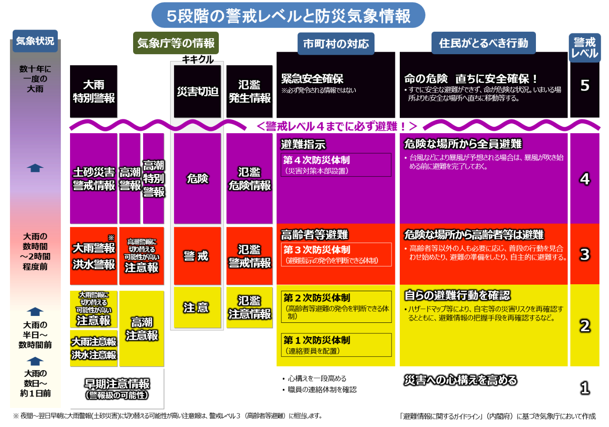
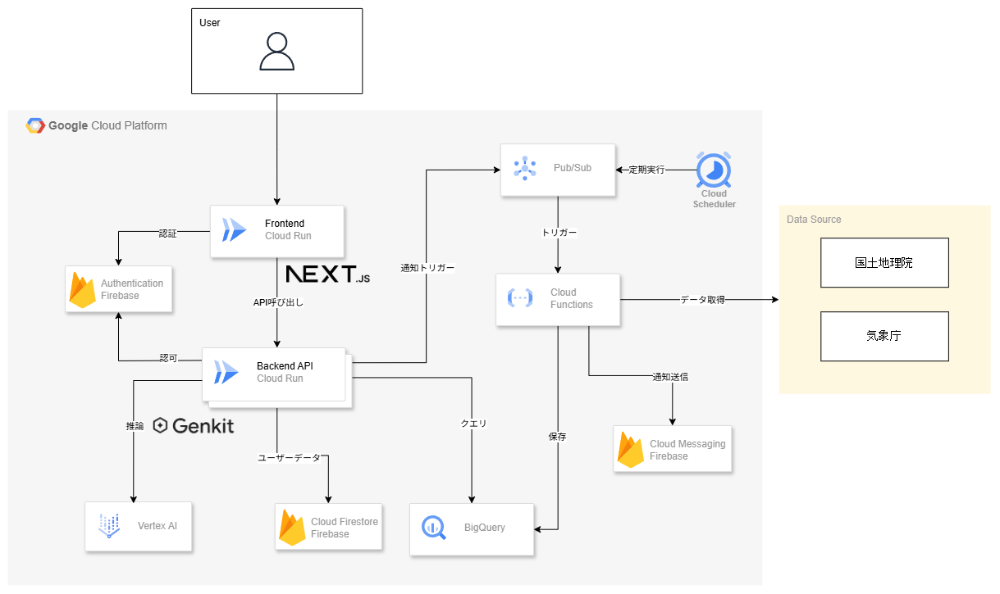
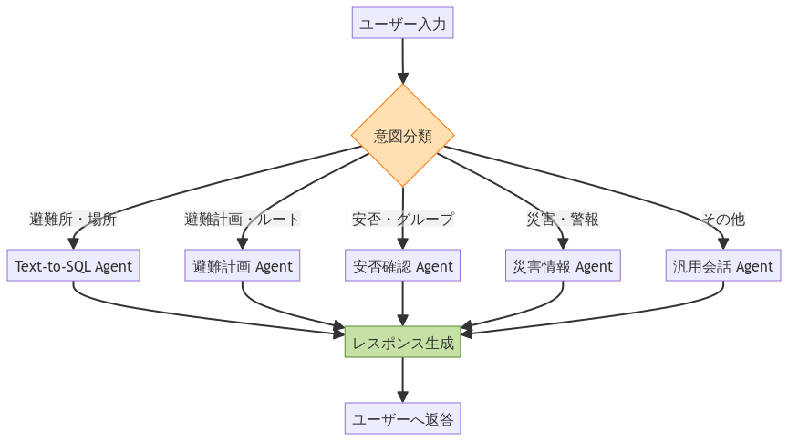
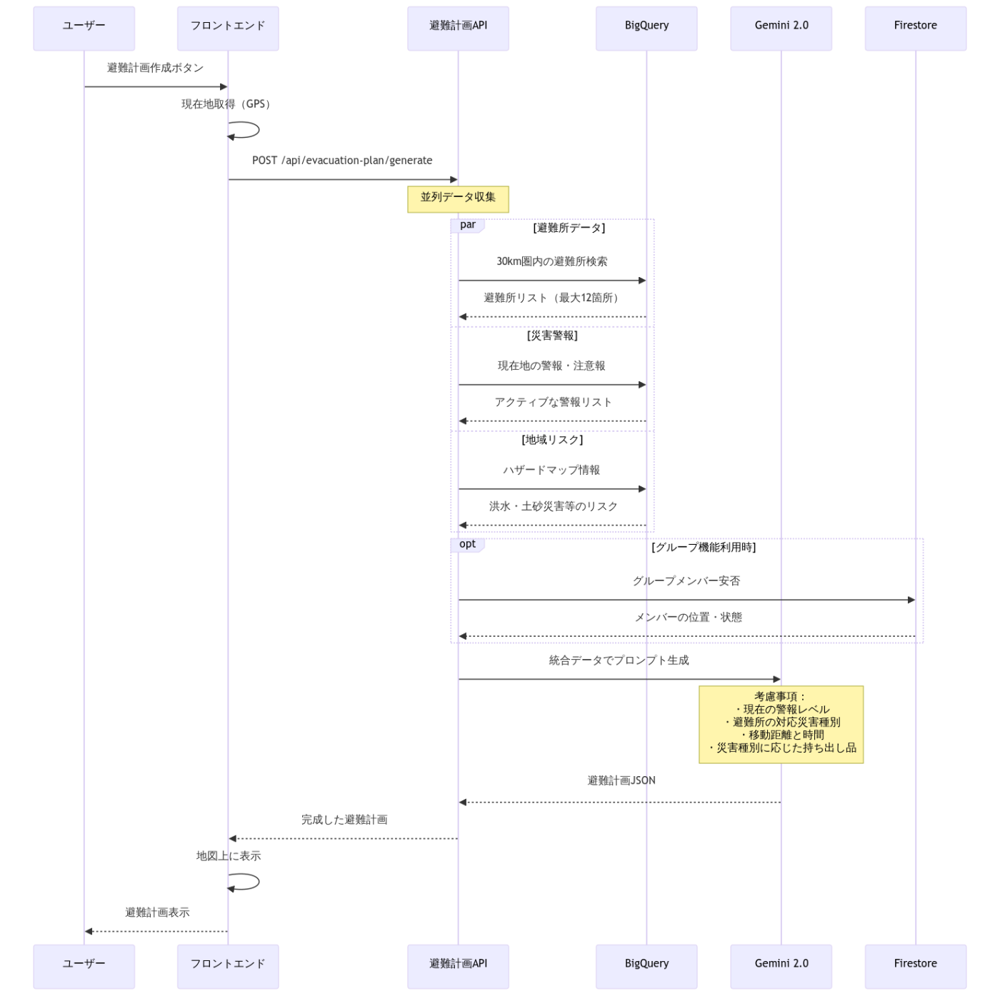

#  はじめに

いつ、どこで起こるかわからない自然災害。日本では、地震や台風、豪雨など、毎年さまざまな災害が私たちを脅かしています。こうした状況で、もしもの時に自分や大切な人を守るためには、日頃からの備えと、いざという時の適切な行動が不可欠です。しかし、「何をすればいいのか分からない」「準備はしているつもりだけど、本当にこれで良いのかな」と感じる方も多いのではないでしょうか。

そんなあなたの不安に寄り添い、災害時の「みちしるべ」となるべく開発されたのが、AI防災支援Webアプリケーション「**Michishiru** 」です。最新のAI技術とユーザーの視点を取り入れることで、Michishiruはあなたの防災意識を高め、緊急時にも迷わず行動できるようサポートします。

本記事では、Michishiruが日本の災害時に見られる行動傾向や防災意識の課題にどのように対応し、その独創的なアイデア、明確な問題解決能力、そして高い実現性を兼ね備えているかをご紹介します。

<https://www.youtube.com/watch?v=b8fbgRGO1lY>

#  災害時の傾向と防災意識へのアプローチ

日本の災害時における行動傾向と防災意識には、「喉元過ぎれば熱さ忘れる」現象や避難行動の遅れ、家族間の安否確認の課題など、さまざまな特徴が見られます。**Michishiru** は、これらの課題に対し、以下のアプローチで対応します。

###  1\. 不安の認識と備えのギャップの解消

多くの人が災害に不安を感じつつも、具体的な備えができていない現状に対し、**Michishiru** の「避難計画」機能は、AIが個人の状況に応じた**推奨避難所と代替案** 、そして**非常持ち出し品チェックリスト** を提示します。これにより、漠然とした不安を具体的な行動計画に落とし込み、備えのギャップを埋める手助けをします。

###  2\. 「喉元過ぎれば熱さ忘れる」現象への対策

災害発生直後の防災意識の高まりが時間とともに薄れる現象に対し、Michishiruは「ホーム - 最新災害情報」で常に最新の災害情報やAIによる危険度分析を表示し、ユーザーの関心を維持します。また、プッシュ通知機能を通じて、安否状態の変更を通知したり、メンバーの安否確認を要求したりすることで、災害への意識を継続的に喚起します。

###  3\. 避難行動の遅れや誤った判断の抑制

「自分は被害に遭わない」という正常性バイアスや、情報不足による避難の遅れに対して、**Michishiru** の「ホーム - 最新災害情報」は、**現在地周辺の災害情報をワンクリックで取得** し、AIによる**5段階の危険度分析** と**重要アラート・推奨行動** を即座に表示します。さらに、「避難所マップ」では、**ハザードマップ** を表示することで、視覚的に危険を認識させ、適切な避難行動を促します。

###  4\. 家族の安否確認への意識と現実のギャップの克服

家族との安否確認の重要性は高いものの、具体的な話し合いが不足している現状に対し、「安否確認」機能では、**グループ作成・メンバー招待** 、**4段階の安否ステータス共有** 、**位置情報・メッセージ送信** 、**リアルタイム更新通知** を提供します。これにより、家族間の安否確認を容易にし、災害時のコミュニケーションを円滑にします。

###  5\. 日常の中での防災（フェーズフリー）の促進

防災を非日常の特別なことと捉えるのではなく、日々の生活の中で意識し、行動に取り入れる「フェーズフリー」の考え方を促進するため、「AIチャット」機能を提供します。Gemini 2.0 Flashによる防災相談は、ユーザーが日常的に感じる防災に関する疑問や不安を気軽に解消できる場を提供し、防災をより身近なものにします。

#  Michishiruが持つ3つの強み

**Michishiru** は、単に災害情報を提供するだけでなく、ユーザーが実際に役立つと感じ、継続して利用したくなるようなアプリを目指しました。そのために、以下の3つの点に特に注力して開発を進めています。

###  1\. パーソナライズされたAI防災アシスタント

Michishiruは、単なる情報提供アプリではありません。Googleの最新AIモデルであるGemini 2.0 Flashを搭載した「AIチャット」機能により、ユーザー一人ひとりの疑問や状況に応じた**パーソナライズされた防災相談** を可能にします。これにより、一般的な情報では解決しにくい具体的な不安や疑問に対し、まるで専門家と話すように気軽に質問し、適切な回答を得ることができます。また、「避難計画」機能では、AIが個人の現在地や状況を考慮した**最適な避難計画を自動生成** し、推奨避難所や非常持ち出し品リストを提示することで、具体的な備えを強力にサポートします。

###  2\. 直感的で分かりやすい危険度と行動の可視化

災害時に最も重要なのは、刻一刻と変化する状況を正確に把握し、それに対応する最適な行動を迅速に判断することです。しかし、この判断は非常に困難な場合があります。気象庁が指摘するように、大雨の降り方と災害発生の危険度との間には、時に感覚とのズレが生じ、これが避難の遅れに繋がることもあります（参考：[気象庁「防災気象情報とその効果的な利用」](https://www.jma.go.jp/jma/kishou/know/ame_chuui/ame_chuui_p8.html)）。Michishiruでは、この課題に対し、「ホーム - 最新災害情報」におけるAIによる**5段階の危険度分析** と**重要アラート・推奨行動** の表示、さらに「避難所マップ」での**ハザードマップ** 表示を組み合わせることで、数値や言葉だけでは伝わりにくい危険度を視覚的・直感的に伝え、「自分のこと」として災害を捉え、適切な行動へと促します。これにより、ユーザーは迷うことなく適切な避難行動をとることが可能になります。  

<https://www.jma.go.jp/jma/kishou/know/ame_chuui/ame_chuui_p8.html>

###  3\. いざという時に繋がる安心のコミュニケーションツール

災害時、家族や大切な人との安否確認は非常に重要です。しかし、実際に災害時に連絡が取れないという課題も多く報告されています。Michishiruの「安否確認」機能は、家族や友人とグループを作成し、**4段階の安否ステータスを共有** できるほか、位置情報やメッセージの送信も可能です。また、安否状態の変更を通知したり、手動で安否確認を要求したりする**プッシュ通知** 機能により、離れていても確実な連絡手段を確保できます。これにより、災害時の不安を軽減し、互いの安全を確認し合うことで、精神的な安心にも繋がります。PWA対応により、オフライン時でも一部の基本機能が利用できるため、通信が途絶えた状況でも最低限の情報を確認できる実用性も兼ね備えています。

#  システム概要

Michishiruは以下の主要な機能を提供する防災情報プラットフォームです：

  * **防災情報の統合** : 気象庁防災情報XMLや国土地理院の避難所データを自動収集・統合
  * **AI支援機能** : Vertex AI (Gemini 2.0 Flash) による自然言語での情報検索、避難計画作成支援
  * **リアルタイム配信** : プッシュ通知による緊急情報の即時配信
  * **コミュニティ機能** : グループ単位での安全確認、情報共有

#  技術スタック

##  クラウド基盤

  * **Google Cloud Platform** : インフラストラクチャ全体
  * **Vertex AI** : AI推論エンジン（Gemini 2.0 Flash）
  * **BigQuery** : 大規模データウェアハウス
  * **Cloud Functions** : サーバーレス処理
  * **Cloud Run** : コンテナベースのバックエンドAPI
  * **Cloud Pub/Sub** : 非同期メッセージング
  * **Cloud Scheduler** : 定期実行タスク管理

##  アプリケーション層

  * **フロントエンド** : Next.js 15, React 19, TypeScript, shadcn/ui, Tailwind CSS, DuckDB-Wasm
  * **バックエンド** : Node.js, Express, Genkit（AIフレームワーク）
  * **データベース** : Cloud Firestore（チャット履歴、ユーザーデータ）
  * **認証** : Firebase Authentication
  * **通知** : Firebase Cloud Messaging
  * **地図** : Google Maps Platform

#  システムアーキテクチャ図

#  チャットシステムアーキテクチャ

意図分類システムは、キーワードベースの高速判定とAIによる精密分析を組み合わせたハイブリッドアプローチを採用しています。

##  メリット

  * レスポンス速度: 明確な質問は即座に処理
  * コスト削減: API呼び出しを最小限に抑制
  * 高可用性: ネットワーク遅延時も基本機能は高速動作

##  エージェント選択ロジック

#  個人避難計画システムアーキテクチャ

個人避難計画システムは、ユーザーの現在地、地域のリスク情報、リアルタイムの災害情報を総合的に分析し、AIが最適な避難計画を自動生成する機能です。さらに、グループメンバーの安否状況や位置情報も考慮し、負傷者への対応や離散したメンバーとの合流地点の提案など、グループ全体として最適な避難行動を支援します。現在地から最適な避難所を選定し、具体的な避難手順と持ち出し品リストを提供します。

##  処理フロー

#  まとめ

防災は技術だけでは解決できない課題も多くあります。

地域住民の相互支援、防災訓練への参加、そして「自助・共助」の精神。これらは、どんなに高度な技術システムでも代替することはできません。

しかし、技術が果たせる役割も確実に存在します。複雑な防災情報を分かりやすく伝達すること。誰もがアクセスできる情報配信の仕組みを提供すること。災害時の安否確認を迅速化すること。

技術は万能ではありませんが、人々の防災への取り組みを支援し、より多くの命を守ることに貢献できる。そう信じて、技術開発に取り組んでいます。

最後までお読みいただき、ありがとうございました！
