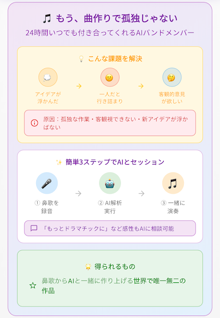
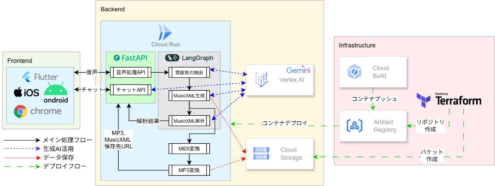
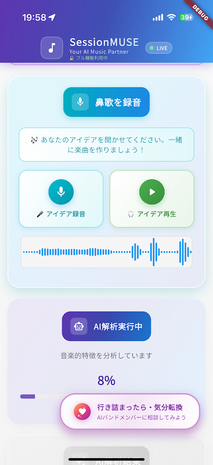
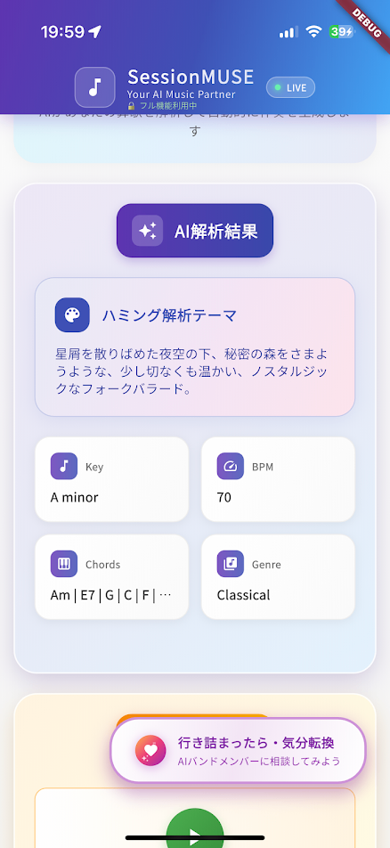
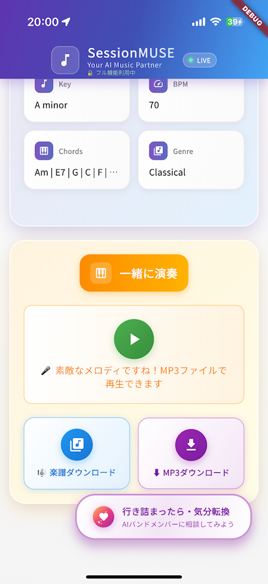
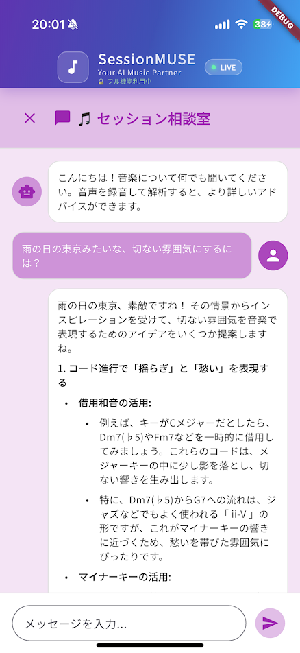

##  はじめに：創造的な孤独に寄り添うパートナー

音楽制作、特に作曲やアレンジのプロセスは、しばしば孤独な探求の旅です。ふと浮かんだメロディ、心に響いたギターリフ。その小さなアイデアの種を一つの楽曲へと育て上げる過程で、多くのクリエイターが「創造的な孤独」という壁に直面します。

「この方向性で合っているのだろうか？」  
「アイデアが枯渇して、次の一手が見えない…」

バンドメンバーやプロデューサーがいれば得られる客観的なフィードバックや、予期せぬインスピレーション。しかし、誰もがその環境に恵まれているわけではありません。

この、すべてのミュージシャンが抱える普遍的な課題を解決するため、私たちはAI音楽パートナー「Session MUSE」を開発しました。これは単なるツールではありません。あなたの創造性に火を灯し、24時間365日、いつでもアイデアに付き合ってくれる最高のバンドメンバーです。

**鼻歌から、AIと一緒に作り上げる、世界で唯一無二の作品。**

ユーザーがアップロードした鼻歌や楽器の演奏をAIが聴き、バッキングトラックを即座に生成。対話を通じて次の展開を一緒に考えてくれます。本記事では、第2回 AI Agent Hackathon with Google Cloudで開発した本プロダクトのアイデア、それを支える技術、そして成果を詳しく紹介します。

🏆 **プロジェクトの成果概要**

  * **Gemini 2.5 Flash Lite Previewの活用:** 「鼻歌から直接楽曲制作」するAIを実現。
  * **堅牢なアーキテクチャ:** Cloud RunとLangGraphによるサーバーレス・ワークフロー駆動型アーキテクチャ。
  * **クロスプラットフォーム開発:** Flutterによる高効率なマルチプラットフォーム対応。

##  1\. プロジェクトの概要

###  対象ユーザーと「創造の壁」

Session MUSEが対象とするのは、自宅で楽曲制作に打ち込む「ベッドルーム・プロデューサー」、個人で活動するミュージシャン、そして趣味で音楽を創るすべての人々です。彼らは情熱に溢れていますが、共通して創作プロセスでの行き詰まりを経験します。

**ユーザーペイン（実際の声）**

> "ふと浮かんだメロディを録音したけど、そこから先どうしたらいいかわからない"  
>  "DTMソフトは使えるけど、アレンジのアイデアが出てこない"  
>  "バンドメンバーがいないから、一人でセッションの練習ができない"

この行き詰まりの根本原因は、**「客観的な視点の欠如」** と **「アイデアの枯渇」** にあります。

###  ソリューション：24時間付き合ってくれるAIバンドメンバー「Session MUSE」

Session MUSEは、これらの「壁」を打ち破るAIバンドメンバーです。

**従来手法との違い**

従来のAI作曲ツール | Session MUSE  
---|---  
テキストプロンプトから生成 | **鼻歌から直接解析**  
完成品を一気に出力 | **段階的に一緒に制作**  
機械的な対話 | **感性的な要望も理解**  
音楽理論の知識が必要 | **専門知識不要**  
  
####  🎧 特徴1：「聴く」AI - 鼻歌から音楽の設計図へ

ユーザーが録音した鼻歌やギターリフの音声ファイルをアップロードするだけで、AIはその最初のひらめきを捉えます。この機能の核心は、**Googleの最新AIモデルGemini 2.5 Flash Lite Preview** のネイティブなマルチモーダル理解能力です。従来のシステムのように音声をテキストに変換する多段階の処理を経ず、音声ファイルを直接「聴いて」音楽の雰囲気やテーマを理解するため、「明るくエネルギッシュなJ-POP風」といった人間的で直感的な音楽理解を実現しています。

####  🎸 特徴2：「演奏する」AI - 即席のバッキングトラック

音楽の設計図が手に入れば、次はセッションの始まりです。Session MUSEは、解析されたテーマに基づき、音楽理論を組み込んだアルゴリズムでバッキングトラックを自動生成します。これは、メロディという一本の線に、リズムとハーモニーという立体感を与えるプロセスです。これまで一人でフレーズを練っていたミュージシャンも、まるでバンドメンバーと演奏しているかのようにアイデアを試せます。  
（バッキングトラック生成時間：**平均16秒** ）

####  💬 特徴3：「対話する」AI - 創造性の壁打ち相手

Session MUSEが単なる自動作曲ツールと一線を画すのが、この対話機能です。音楽理論に基づいた「このコード進行をもっとドラマチックにできる？」といった具体的な質問はもちろん、その真価は抽象的・感情的な要望を解釈する能力にあります。

「雨の日の東京みたいな、切ない雰囲気にするには？」

このような詩的なリクエストに対し、AIは「それなら、ディレイとリバーブを深めにかけて音に余韻を持たせるのがおすすめです」といった、感性を具体的な音作りに落とし込むヒントを与えてくれます。この高度な対話は、GeminiとLangGraphによるステートフルなワークフロー管理で実現しています。

##  2\. Session MUSEを支える技術

###  技術的特徴：鼻歌を「言語」経由で楽曲に翻訳するAIパイプライン

本プロジェクト最大の技術的挑戦は、鼻歌という曖昧な入力から音楽的に意味のあるバッキングトラックを生成する点でした。当初、生成AIに鼻歌の音階やリズムを直接推定させようと試みましたが、これは極めて困難でした。しかし試行錯誤の中、AIは鼻歌の持つ「雰囲気」や「曲調」を**言語で的確に捉えられる** ことを見出しました。

この発見に基づき、私たちは音声から直接楽曲を生成するのではなく、一度「言語」を介する独自のパイプラインを実装しました。

  1. **音声 → 言語（雰囲気の抽出）** : Geminiが鼻歌を聴き、「明るく弾むようなポップス」といった雰囲気をテキストで抽出。
  2. **言語 → 楽譜（MusicXMLの生成）** : 抽出したテキストをプロンプトとし、雰囲気に合った楽譜データ（MusicXML）を生成。
  3. **楽譜 → 音源（バッキングトラックの合成）** : 生成されたMusicXMLをMIDIに変換し、SoundFont音源でレンダリング。このステップでは確立された技術を用いることで、安定した品質を確保しました。

この **「音声 → 言語 → 楽譜 → 音源」** という流れが、現在の生成AIの制約を乗り越える現実的なアプローチです。

###  システムアーキテクチャ

このAIパイプラインは、以下のGoogle Cloudサービス群を組み合わせたイベント駆動型アーキテクチャで実現しています。

  * **メイン処理** : Cloud Run上のFastAPIがリクエストを受け付け、LangGraphが上記パイプラインの一連の処理を非同期ワークフローとして管理します。
  * **生成AI活用** : 楽曲のコアとなる「雰囲気の抽出」と「MusicXML生成」は、Vertex AI上のGeminiが担います。
  * **CI/CDとIaC** : Terraformでインフラをコード管理し、Cloud BuildとArtifact RegistryによるCI/CDパイプライン経由でCloud Runへ自動デプロイします。

##  3\. デモンストレーション

<https://www.youtube.com/watch?v=29eVG9dW0fA>

###  シナリオ：ユーザー「Takeshi」の創作セッション

####  制作フロー

  1. **鼻歌アップロード** : 15秒程度のポップ調のメロディを録音・アップロード。
  2. **AI解析** : AIが「明るくエネルギッシュなポップロック風」というテーマを抽出。
  3. **音楽生成** : テーマに基づき、30秒のバッキングトラックMP3を自動生成。
  4. **対話セッション** : ユーザーが「もっとドラマチックに」「雨の日の東京みたいに」と要求。AIは具体的なコード進行やエフェクトを提案。
  5. **最終結果** : アレンジ済みのバッキングトラック、MusicXMLデータ、テーマ解析結果がダウンロード可能に。

####  実際の画面フロー

 |  |  |   
---|---|---|---  
  
##  4\. 技術的挑戦と学び

###  ハッカソンにおける挑戦

  1. **リアルタイム性の追求** : ユーザーがストレスなくアイデアを試すため、非同期アーキテクチャによるレイテンシ最小化は必須要件でした。
  2. **音楽品質の確保** : シンプルなパターンでも音楽的に自然に聴こえるよう、ジャンル別のパターンデータベースと音楽理論アルゴリズムを組み合わせる工夫をしました。
  3. **AIのハルシネーション対策** : Geminiの解析結果に対し音楽理論ベースのバリデーションロジックを導入し、出力の安定性を高めました。

###  プロジェクトから得た学びと成果

  1. **マルチモーダルAIの可能性** : Gemini 2.5 Flash Lite Previewの音声理解能力は予想以上に高く、従来の複雑な音声処理パイプラインを大幅に簡略化できることを実証しました。
  2. **ワークフロー駆動アーキテクチャの威力** : LangGraphとCloud Runの組み合わせにより、スケーラブルでコスト効率の高いAIアプリケーションを迅速に構築できることを確認しました。
  3. **ユーザーエクスペリエンスの重要性** : 技術の先進性だけでなく、ユーザーが直感的に使えるインターフェースこそが、プロダクトの価値を決定づける最重要要素だと再認識しました。

##  5\. 今後の展望：パートナーから、創造性のエコシステムへ

今回のハッカソンで開発したSession MUSEは、壮大なビジョンの第一歩です。私たちはこのAI音楽パートナーを、さらに強力な「創造性のエコシステム」へと進化させたいと考えています。

  * **リアルタイムセッション機能** : 究極の目標は、ユーザーの演奏にリアルタイムで追従し、まるで人間のようにセッションできるAIバンドメンバーの実現です。
  * **DAW連携機能** : 生成したMIDIデータを、Logic ProやAbleton Liveなどプロの制作フローへシームレスに統合。
  * **音楽の民主化** : 専門知識や高価な機材がなくても、鼻歌というアイデアの源泉から一つの楽曲を生み出せる世界の実現を目指します。

##  おわりに

共に創り上げた仲間たちに感謝します。

「人間の創造する力がAI Agentによって格段に向上することを実感しました。この可能性は無限大で、今後さらに面白い物が生まれることを確信しています。」 by Keisuke Karijuku

「音楽×AIの領域にまだまだ大きな伸びしろを感じました。今後この分野がより盛り上がっていくことを期待しています。」 by Takafumi Kubota
