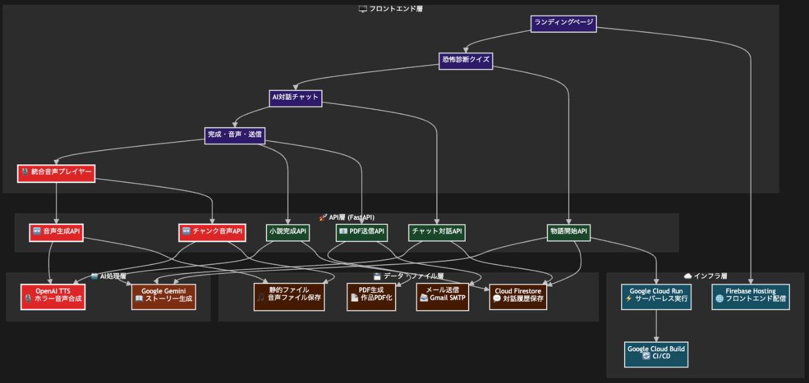
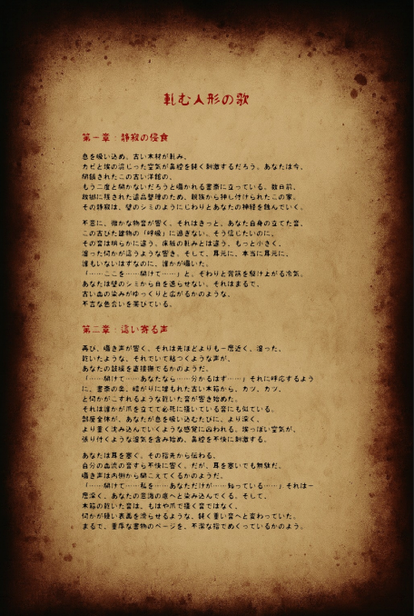

#  はじめに

この記事は **[「第2回 AI Agent Hackathon with Google Cloud」](https://zenn.dev/hackathons/google-cloud-japan-ai-hackathon-vol2?tab=overview)** に合わせ、開発プロジェクト _Your Horror Novel_ の概要を整理したものです。  
普段は読む専門でしたが、せっかくの機会なので初投稿に挑戦してみました。  
以下、ハッカソンの提出要件に合わせてプロダクトのコンセプトと実装ポイントを、記述したいと思います。

##  アプリ概要

**Your Horror Novel** は、AI とのセッションを通じて “あなた好み” の短編ホラー小説を共作できる Web アプリです。

  * 10 問の診断クイズ → 個人の“恐怖プロファイル”を生成
  * AI（Gemini API）と 4 ターン対話しながら物語を共同執筆
  * 完成作品は **TTS 朗読** ・**PDF（メール送付）** で鑑賞／保存

> _余談ですが、AIの急速な進化そのものが「最も身近なホラー」だと最近、感じています。 そうした背景もあり、本アプリは、その“薄暗い違和感”を物語体験に昇華し、楽しみながら思考を促す小さな実験でもあります。_

##  💡 対象ユーザーと課題・解決策

ユーザー像 | 直面する課題 | 本アプリのソリューション  
---|---|---  
没入感を求めるホラーファン | テキストだけでは恐怖が単調 | 音声・AI 対話で五感を刺激  
AI×エンタメ嗜好層 | 既存の生成AIは“ワンショット鑑賞”が中心で、双方向性・没入度が物足りない | 診断・選択・対話を即時フィードバックし、シーン演出・分岐を“ライブ共創”で生成  
マルチメディア創作志向 | 自作ホラーの敷居が高い | プロンプト不要で共同制作  
  
_また、本アプリは「AI というホラーと向き合うリハーサル」にもなり得ます。AI が語る物語を恐れると同時に操る――その両義的な立場を体験することで、テクノロジーとの距離感を自分なりに測る機会になると考えます。_

* * *

##  🚀 主要機能（抜粋）

  1. **科学的恐怖診断** – 10 軸で嗜好をスコアリング
  2. **Gemini AI 動的生成** – 対話内容を即時ストーリーに反映
  3. **TTS 朗読** – ホラー専用プロンプトで低速・低音ボイスを合成
  4. **PDF 出力 & メール送信** – 作品をコレクション化

* * *

##  🏗️ システムアーキテクチャ

層 | 主技術 | 役割  
---|---|---  
フロント | React / TypeScript | 診断→対話→閲覧 UI  
API | FastAPI | ストーリー生成／音声生成／PDF 化  
AI・音声 | Vertex AI (Gemini) / OpenAI TTS | 小説生成／朗読  
データ | Cloud Firestore | 対話履歴・音声・PDF  
インフラ | Cloud Run / Firebase Hosting | デプロイ・スケール管理  
  
* * *

##  ⚙️ 実装ハイライト

###  1\. TTS ホラー音声
    
    
    HORROR_PROMPT = (
        "このホラー小説を深く不気味な声で読み上げてください。"
        "恐怖シーンでは声を低くささやくように、"
        "サスペンスシーンでは劇的な間を取り、"
        "緊張感を高めるためにゆっくり話してください。"
        "感情を込め、聞き手を恐怖の世界に引き込んでください。"
    )
    
    def synthesize_horror_audio(client, text: str, *, voice="onyx", speed=0.8):
        return client.audio.speech.create(
            model="gpt-4o-mini-tts",
            voice=voice,
            input=text,
            instructions=HORROR_PROMPT,
            speed=max(0.5, speed - 0.1),
            response_format="mp3"
        )["audio"]
    

###  2\. 恐怖プロファイル生成
    
    
    def create_personality_prompt(answers: dict) -> str:
        mapping = {
            "q1": {"a": "閉鎖的な洋館", "b": "日常の歪み", "c": "自然の闇"},
            "q2": {"a": "心理的恐怖", "b": "直接的恐怖", "c": "超常的恐怖"},
            # …以下略
        }
        prefs = {k: mapping[k][v] for k, v in answers.items()}
        return "## 恐怖プロファイル\n" + "\n".join(f"- {k}: {v}" for k, v in prefs.items())
    

###  3\. 動的ストーリー制御
    
    
    async def generate_response(self, quiz_answers: Dict[str, str], chat_history: List[Dict[str, str]]) -> str:
        user_turns = len([msg for msg in chat_history if msg["role"] == "user"])
        is_final_turn = user_turns >= 9  # 最終ターンの判定
        
        prompt = f"""
        {'これは物語の最終ターンです。恐怖のクライマックスと結末を書いてください' if is_final_turn else '物語を続けてください'}
        ユーザーの恐怖の好み: {personality}
        これまでの物語: {conversation}
        """
    

###  4\. ホラーテーマデザインシステム
    
    
    const HorrorButton = styled.button`
      background: linear-gradient(145deg, var(--color-blood), var(--color-dark-red));
      box-shadow: 0 6px 25px rgba(139, 0, 0, 0.4);
      text-shadow: 2px 2px 4px rgba(0, 0, 0, 0.8);
      
      &:hover {
        transform: translateY(-3px);
        box-shadow: 0 8px 30px rgba(139, 0, 0, 0.6);
        filter: drop-shadow(0 0 15px var(--color-blood));
      }
      
      animation: flicker 3s infinite alternate;
      
      @keyframes flicker {
        0%, 100% { opacity: 1; }
        50% { opacity: 0.8; }
      }
    `;
    

##  🎬 デモ動画

> ダーク UI → 10 問診断 → AI 対話 → 朗読

<https://youtu.be/oobWL3f3jug>

> メールに送信されるPDF例（3-5枚）

##  Hackathon 要件への適合

区分 | 採用技術 | 補足  
---|---|---  
Google Cloud 実行基盤 | **Cloud Run** | コンテナデプロイ  
Google Cloud AI | **Gemini API** | パーソナライズ小説生成  
追加 AI | **OpenAI TTS** | ホラー特化朗読  
データストア | **Firestore** | NoSQL／リアルタイム  
フロント配信 | **Firebase Hosting** | CDN + SSL  
  
##  まとめ

> **受動的な読書** から **能動的な共創とマルチメディア没入** へ。  
>  _そして “AI と人間の境界” をエンタメとして探る試みへ。_

Google Cloud の AI 技術を “置き換え” ではなく “増幅” として活用し、ユーザーごとの恐怖体験を具体化しました。AI が物語を紡ぎ、人がそれを操作する――そのねじれた関係自体が現代的ホラーであり、本プロジェクトのもう一つのテーマです。

##  🔗 プロジェクトリンク

  * GitHub: <https://github.com/your-username/Your-Horror-Nobel>
  * Demo: <https://your-horror-nobel.web.app>
  * 動画: <https://youtu.be/oobWL3f3jug>

> 興味のある方はぜひ触れてみてください。  
>  （この記事はハッカソン提出要件に基づいて執筆しています。）
