!

本記事は「第 2 回 AI Agent Hackathon with Google Cloud」の提出物となるプロジェクト説明です。

<https://youtu.be/koVrE56KlWs>

<https://frontend-8279078048.asia-northeast1.run.app/first-setting>

##  1\. 課題：日記が続かない

みなさん、日記を書いたことがありますか？

私はあります。  
が、毎度、三日坊主で終わりました。  
ひどい時は、日記帳だけ買って永遠に白紙だったこともあります。

あるアンケートでは、**89%もの人が日記の挫折経験がある** と回答しています。

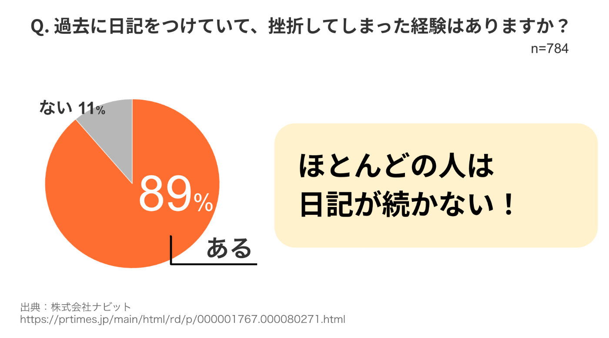

なぜ、これほど多くの人が日記を続けられないのでしょうか？  
主な原因は次であると考えられます。

  1. **出来事が思い出せない** : 日々の出来事を振り返り、記憶を辿るのがめんどう
  2. **言葉が思いつかない** : 自分の感情や考えをどう表現すれば良いかわからない
  3. **書くのがめんどくさい** : 実際に文章にする作業が億劫

要は、めんどくさくなってしまう。ということです。

そこで今回作成したのが、「らくらく日記」です。  
「らくらく日記」は統計情報、感情モデル、生成 AI を活用し、めんどくさがり屋でも無理なく、そして楽しく日記が続けられるサービスです。

##  2\. 対象とするユーザー像（ペルソナ）

「日記を書きたいけれど、なかなか続かない」ユーザーをターゲットにしています。  
具体的には、以下のペルソナを想定しています。

###  ペルソナの詳細

  * **内気な中学生サキちゃん（14 歳・中学 2 年生）**
    * 感情表現が苦手なので、**自分の気持ちを知りたい** 内気な中学生。

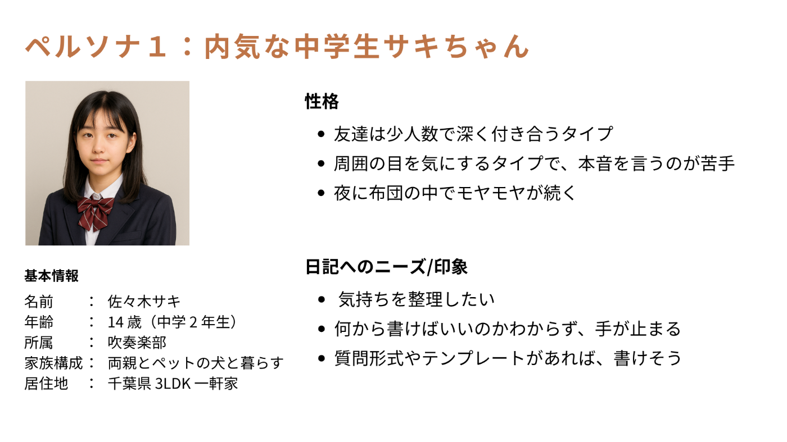

  * **人事部リーダーのナオトさん（35 歳・人事部）**
    * 仕事と育児の忙しい日々の中、**自分の思考を短時間で整理したい** 父親。

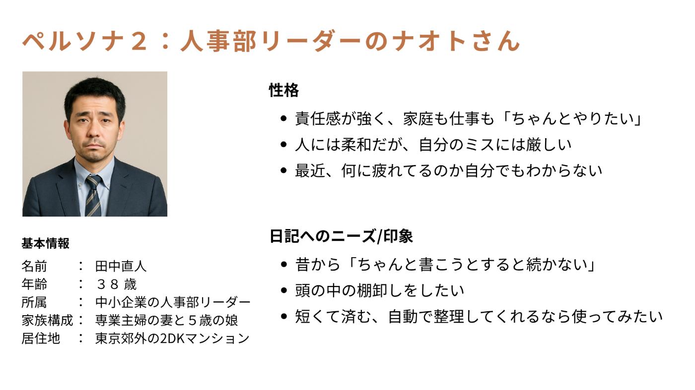

###  なぜこのペルソナに日記が必要なのか？ 【キーワード：メタ認知】

自分自身を一段高い視点から観察し、深く振り返る認知能力を「**メタ認知** 」といいます。  
日記は自身の行動や思考、感情を言語化することから、メタ認知向上に役立てることができます。

上記で挙げたペルソナはそれぞれ、「自分の気持ちを知りたい」「自分の思考を短時間で整理したい」というウォントを持っています。  
これらは共通して「自分を客観視したい」という願望です。

自分を客観視する（＝メタ認知を高める）ツールとして、  
「らくらく日記」は**ユーザーのメタ認知をサポートする分析機能も備えています** 。

####  余談

余談ですが、メタ認知が高い人は主観的幸福感を抱きやすいという研究結果[1]もあります。  
日記を書く習慣は、幸福度を向上させる可能性も秘めているのです。

##  3\. 課題へのソリューション 【メイン機能】

###  【メイン機能】 らくらく日記作成機能

「らくらく日記」は、日記が続かないという課題を解決するため、  
徹底的に手間を省いています。

具体的には次の３つのポイントで、ユーザーの日記作成をサポートします。

  1. ユーザーに合わせた話題の提供
  2. 感情の気づきをサポート
  3. 生成 AI による文章の拡張

###  ポイント1. ユーザーに合わせた話題の提供

日記の書き始めに「何を書こう？」と悩む時間を解消するため、「らくらく日記」では**ユーザーの年代・性別に基づいた話題候補を提示** します。

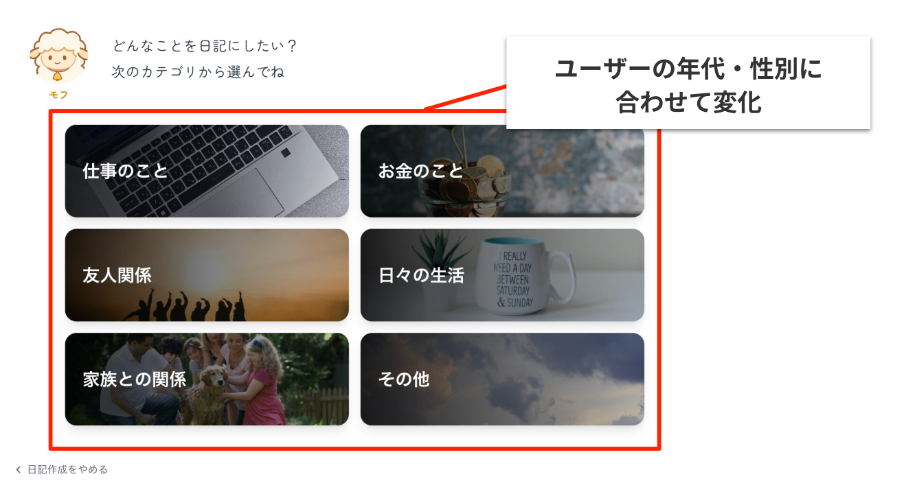

この話題候補は、厚生労働省の国民生活基礎調査における「悩みやストレスの原因」調査結果[2]に基づいています。

####  年代・性別による関心ごとの違いとは？

関心ごとの違いといってもピンとこないかもしれないので、具体例を紹介します。  
次は、20 代前半と 40 代後半の男性の「悩みやストレスの原因」のランキングです。

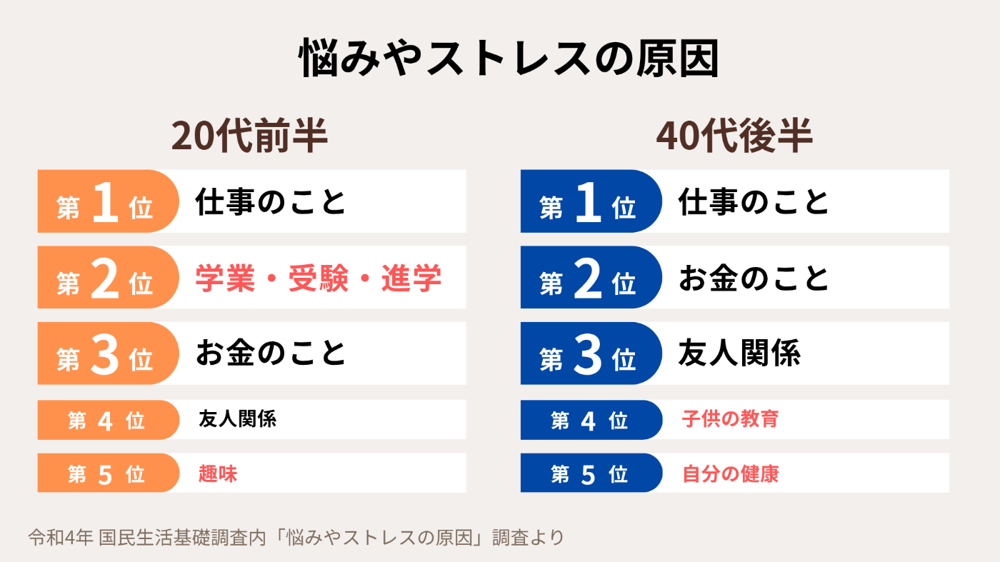

両年代で「仕事のこと」が共通して一位にありますが、詳細を見ると次の違いがあります。

  * 20 代前半には「学業・受験・進学」「趣味」がランクイン
  * 40 代後半には「子供の教育」「自分の健康」がランクイン

ここから、**年代ごとに関心ごとが異なる** ことがわかります。

また、「家事」「育児」は女性のみがランクインする一方で、  
男性は「友人関係」が上位に来やすいなど、**性別によっても関心ごとに違いがあります** 。

このように、**年代・性別に合わせた話題候補を提供することで、日記の書き始めのハードルを下げています** 。

###  ポイント2. 感情の気づきをサポート

「自分の気持ちがわからない」と感じることは少なくありません。  
そこで、「らくらく日記」では、ユーザーが記入または選択した話題に対し、**Gemini が対応する感情を推測します** 。

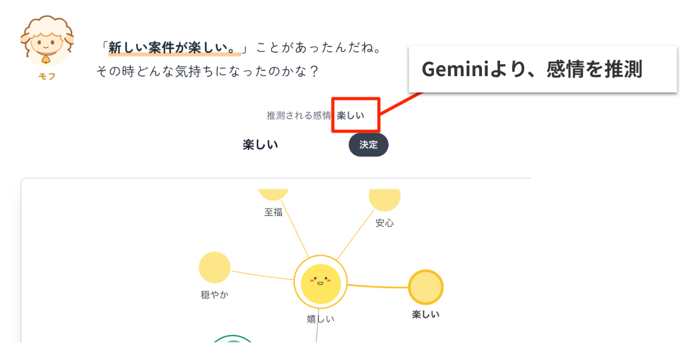

もちろん、ユーザー自身が自由に選択・記入することも可能です。

####  プルチックの感情の輪

感情の選択肢は、**「プルチックの感情の輪」モデル** を参考にしています。  
この感情モデルは人間の感情には 8 つの主要な一次感情があり、それらが混じり合うことで多様な感情が生まれるという考え方です。

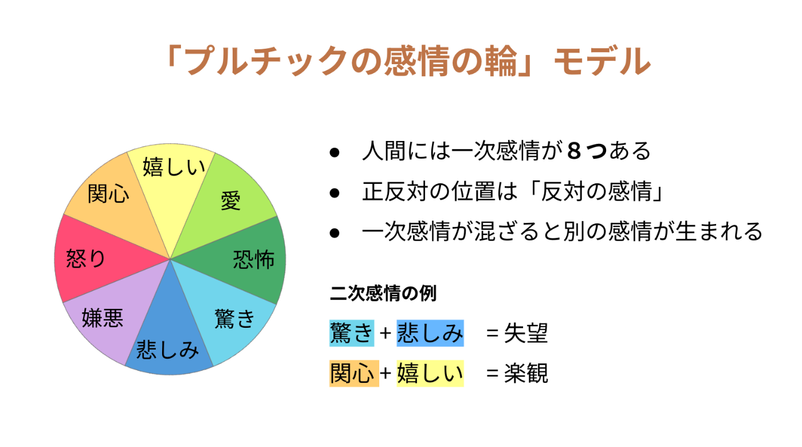

感情の選択肢では、「プルチックの感情の輪」の一次感情とその語句を提示することで、  
直感的に感情を選べるよう工夫しています。

####  なぜ日記に「感情」を記録する必要があるのか？

日記を書く上で、「事実」と「感情」の両方を記録することは、文章に深みを与え、後で見返した時により多くの気付きを与えることができます。

  * 「自分はこういう行動をした結果、こんな気持ちになったんだな」
  * 「この出来事に対してこんな感情を抱いていたのか、自分でも意外だな」

というように、**客観的に自身の行動と感情を結びつけることで、自己理解（=メタ認知）を深めることができます** 。

###  ポイント3. 簡単な入力で文章を自動拡張

「書くのがめんどくさい」という日記継続の課題を解決するため、「らくらく日記」では次のステップで簡単に日記を作成できます。

  1. 出来事の概要を記入、または候補からの選択
  2. 感情を選択
  3. 上記 1 と 2 の情報から、Gemini が**タイトルの作成と日記の内容を自動で拡張**

これにより、ユーザーは一から文章を考える手間が省け、提示された文章を**添削する感覚で簡単に日記を作成** できます。

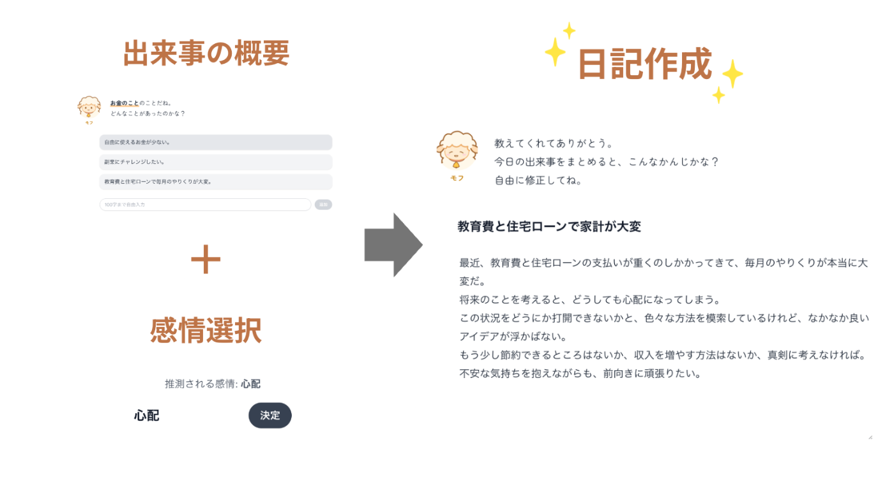

##  4\. 課題へのソリューション 【サブ機能】

###  【サブ機能】 モフからのお手紙

「らくらく日記」には、案内役キャラクター「モフ」からの返事機能が備わっています。

この機能では、ユーザーが書いた日記の内容に対し、  
モフが共感と理解を示す手紙を作成します。

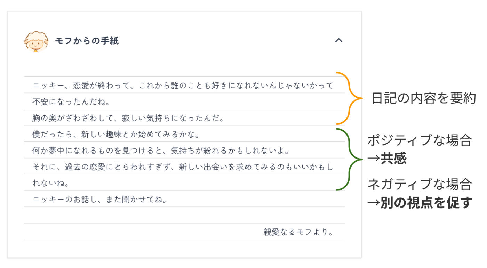

これは、カウンセリングなどで用いられる「**傾聴** 」のテクニックを使っています。  
傾聴とは、相手の立場になって相手の気持ちに共感しながら聴くことです。

モフからの手紙にて、ユーザーの発言を言い換えたり、繰り返したりすることで、「自分の話がきちんと理解されている」という安心感をユーザーに与えます。

「モフからのお手紙」機能は、ユーザーが返事を通して自己開示を深め、自身の感情や考えと向き合う手助けをします。

###  【サブ機能】 メタ認知分析

「らくらく日記」には、ユーザーが日記を振り返り、  
新たな気づきを得るための「メタ認知分析」機能が備わっています。  
作成された日記から、以下の分析結果を確認できます。

  * 感情の解説
  * 感情分析
  * 日記解析（エンティティ解析）

####  ■ 感情の解説

ユーザーが選択した感情について、詳細な解説を表示します。  
ここでは、「プルチックの感情の輪」モデルに基づき、感情の段階を知ることができます。

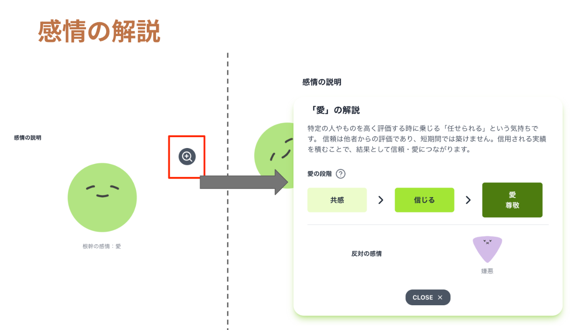

選んだ感情がどの段階にあるのか、そして気持ちが強くなると、  
どのように感情が変化するのかを把握できます。  
（例：「心配」が強くなると「恐怖」に発展するなど）

####  ■ 感情分析

感情分析では、日記の内容がポジティブかネガティブか、  
そしてその強度を-1.0 から 1.0 の間で数値化します。

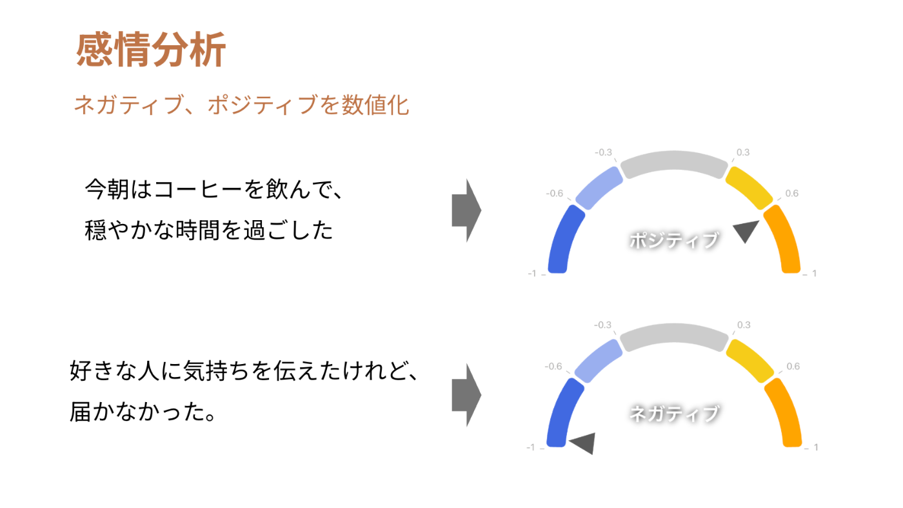

感情の強弱を客観的に把握できるため、自分の感情パターンを考えるきっかけになります。

####  ■ 日記解析(エンティティ解析)

日記解析（エンティティ解析）は、入力された日記のテキストから、  
既知のエンティティ（人物、場所、組織、商品、イベントなどの固有名詞）を抽出し、表示します。

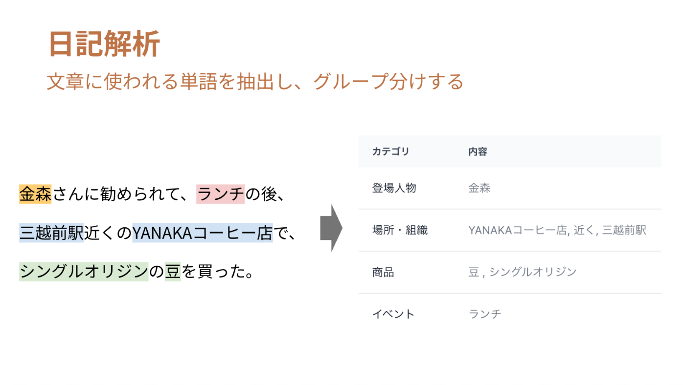

この機能により、自身が日々の生活で何に意識を向けているのかがわかります。  
例えば、特定の人物や場所が頻繁に登場する場合、  
それがユーザーにとって重要な要素の可能性が高いです。

##  5\. 🚀 技術スタック

###  システムアーキテクチャ

技術構成は次のようなマイクロサービス アーキテクチャとなっています。

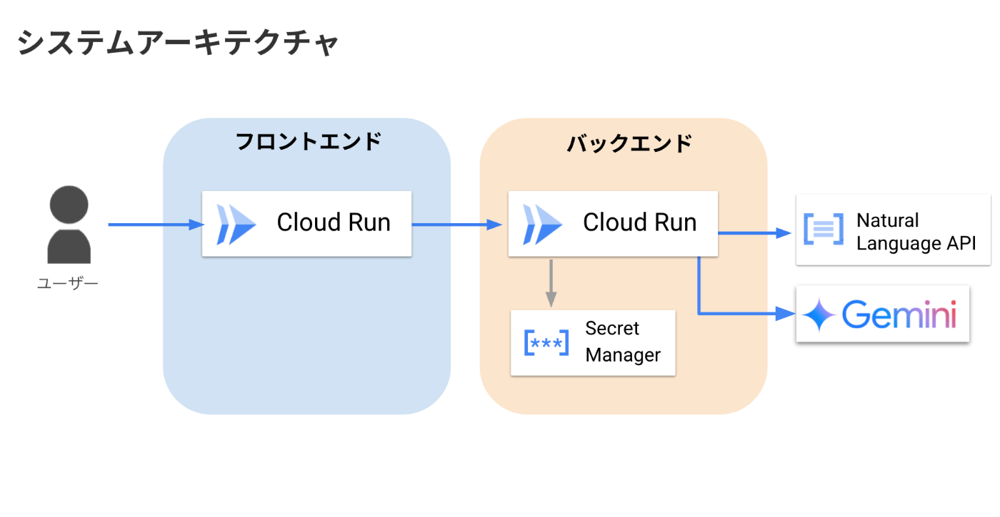

画面表示はフロントエンド、「Gemini API」および「Natural Language API」との通信は バックエンドで行っています。  
外部 API のシークレットキーは Secret Manager から取得しています。

###  採用フレームワーク/外部 API

種別 | 使用技術  
---|---  
フロントエンド | React, Vite, Node.js, Docker, Cloud Run  
バックエンド | FastAPI, Uvicorn, Docker, Cloud Run, Secret Manager  
外部 API | Gemini API, Natural Language API  
  
###  外部 API の選定と活用ポイント

####  ✅ Gemini API（ gemini-2.0-flash / gemini-2.0-flash-lite）

  * 用途：感情予測、タイトル生成、本文補完、モフからのお手紙

####  Gemini API を採用した理由

次の理由で、Vertext AI ではなく、 Gemini を採用しました。

  * JSON スキーマ対応で、FastAPI との親和性が高い
  * 型安全なレスポンスをすぐ利用できるため、開発スピードが向上する

##### JSON スキーマによる型指定の例

Gemini API は スキーマクラスをそのまま戻り値の型として使うことができます。
    
    
    # スキーマクラス
    class OneLineText(BaseModel):
        text: str = Field(..., example="こんにちは！")
    
    response = self.client.models.generate_content(
        model="gemini-2.0-flash",
        contents=prompt,
        config={
            "response_mime_type": "application/json",
            "response_schema": OneLineText, # 戻り値の型指定ができる
        },
    )
    # データ処理なしですぐに使える
    data: OneLineText = response.parsed
    

####  ✅ Natural Language API

  * 用途：感情分析、エンティティ解析

テキスト解析に特化したサービスである Natural Language を使うことで、日記のメタ認知分析の精度を向上させています。

##  6\. 💪 頑張ったポイント

###  📚 大量のインプットによる課題理解

「日記とは何か？」「どうすればスムーズに日記が書けるか？」「感情とは何か？」  
といった根本的な問いに向き合うため、日記、文章術、感情に関する書籍を**計 8 冊読破** しました。

制作期間の約 1 ヶ月をこの読書に費やし、  
**単なる直感に頼るのではなく、確かな根拠に基づいた設計判断** を重ねています。

これにより、「らくらく日記」の機能や UI の一つひとつに、  
意味と目的を持たせることができました。

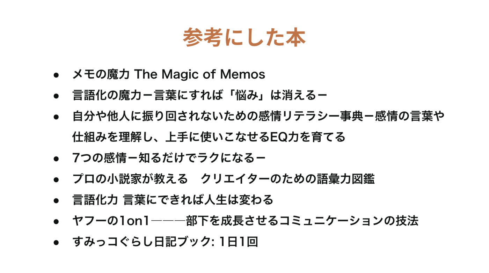

###  🎨 デザインの意図と工夫

「らくらく日記」は、"めんどくさがり屋のための日記サービス"というコンセプトに基づき、デザインにもこだわっています。

ユーザーが「どのボタンを押せばいいのか」と迷う手間をなくすため、入力に集中できるシンプルな画面構成を意識しています。

また、案内役キャラクターの「モフ」や感情選択キャラクターは、シンプルかつ可愛らしくすることで、ユーザーがリラックスして日記作成できるよう意識しています。

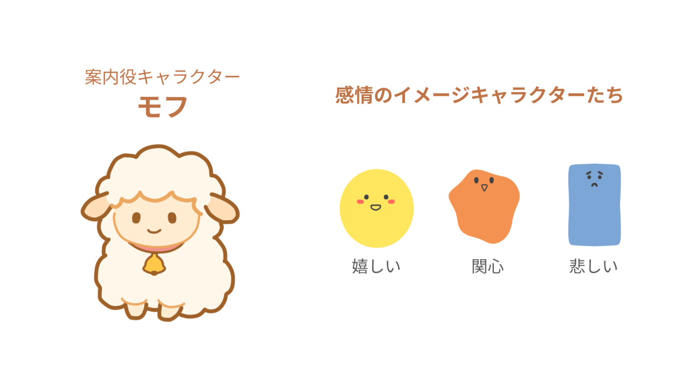

##  7\. 🔭 今後の展望

「らくらく日記」は簡単に日記を続けられるをテーマに、次の機能を追加予定です。

####  メタ認知分析の拡張

日記のメタ認知分析をその日記だけでなく、複数の日記と掛け合わせたバージョンに拡張します。時間軸を追加することで、内容の変化を可視化し、ユーザーがメタ認知しやすくします。

####  音声入力の対応

より手軽に日記を記録できるよう、音声からの自動文字起こし機能を追加予定です。

####  ユーザー同士の匿名共有モード

希望者は日記の一部を匿名で他ユーザーと共有し、共感や気づきを得られる機能を追加することで、「書くこと」の孤独を減らす仕組みを構想中です。

##  8\. まとめ

「らくらく日記」は、「日記を続けたいけれど、めんどう」という課題に対し、統計情報、感情モデル、そして生成 AI を活用してアプローチしました。

日記は単なる記録ではなく、「自分を知る」ための大切な手段です。  
しかし、続けることが、何より難しい。。。

だからこそ、「書かなくても、自然と日記になる」「気づけば、自分が見えてくる」、  
そんな体験を提供するのが、「らくらく日記」です。

今後も、ユーザーの気持ちに寄り添いながら、日記という文化をもっと自由で楽しいものに変えていきたいです。

* * *

脚注

  1. 大学生の主観的幸福感におけるメタ認知及び家族機能の影響 京都教育大学教育実践研究紀要 第 17 号 2017 ↩︎

  2. 国民生活基礎調査 / 令和元年国民生活基礎調査 / 健康 全国編 / 世帯人員（12歳以上），悩みやストレスの有－悩みやストレスの原因（複数回答）－無・性・年齢（５歳階級）別 ↩︎

