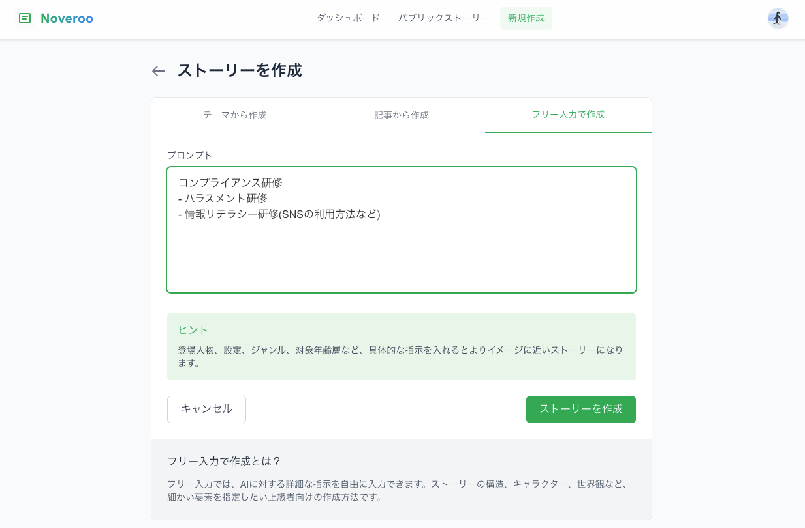
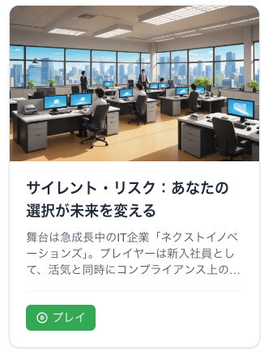
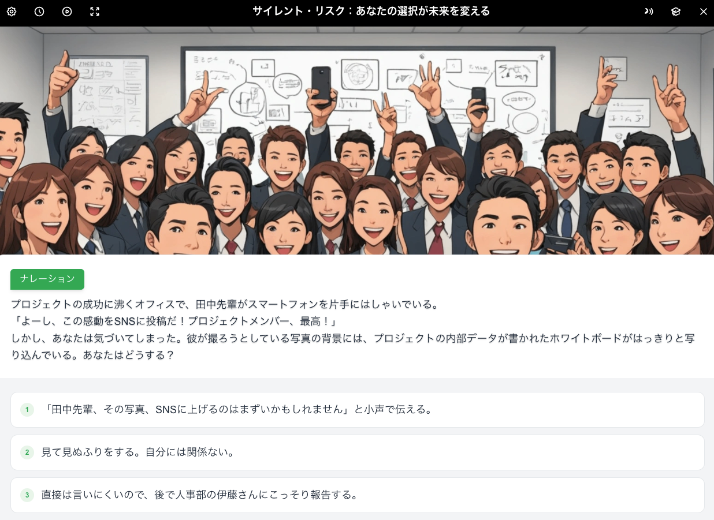
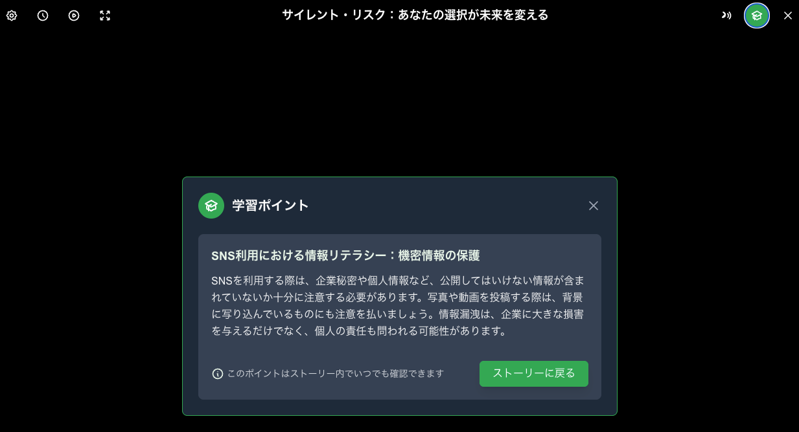
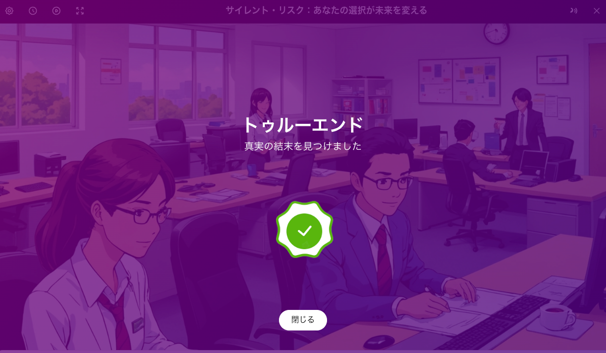
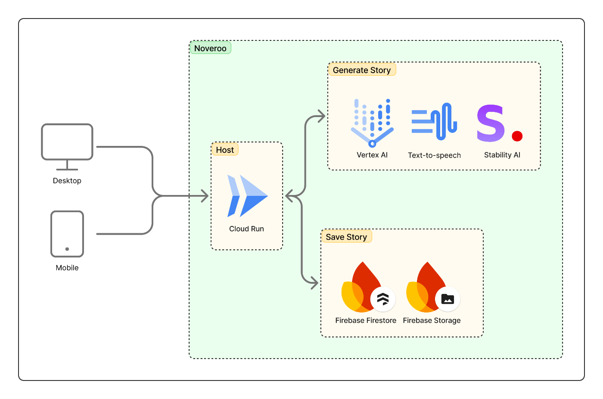

#  1.【背景】その勉強、学んだ気になっているだけじゃないですか？

日々学びをしている人は多いと思います。  
YouTubeでの解説動画、ChatGPTを使った検索、質問、オンライン研修や参考書の読書など、社会人になってからも勉強する機会はたくさんあります。  
しかしこの勉強、学んだ気になっているだけではないでしょうか？  
実際、以下の調査では研修受講者のうち明確に「研修内容を職場で実践した」と答えた人は13.5%に留まり、半数以上は「ある程度実践した」が、約3割は「ほとんど実践していない」と回答しています。  
[https://www.re-current.co.jp/column/organization-learning/7254/#:~:text=研修・教育施策受講者に、研修で学んだ内容を実際に仕事で使ったり役立てたりしているか聞いた。 「ある程度実践した」（50](https://www.re-current.co.jp/column/organization-learning/7254/#:~:text=%E7%A0%94%E4%BF%AE%E3%83%BB%E6%95%99%E8%82%B2%E6%96%BD%E7%AD%96%E5%8F%97%E8%AC%9B%E8%80%85%E3%81%AB%E3%80%81%E7%A0%94%E4%BF%AE%E3%81%A7%E5%AD%A6%E3%82%93%E3%81%A0%E5%86%85%E5%AE%B9%E3%82%92%E5%AE%9F%E9%9A%9B%E3%81%AB%E4%BB%95%E4%BA%8B%E3%81%A7%E4%BD%BF%E3%81%A3%E3%81%9F%E3%82%8A%E5%BD%B9%E7%AB%8B%E3%81%A6%E3%81%9F%E3%82%8A%E3%81%97%E3%81%A6%E3%81%84%E3%82%8B%E3%81%8B%E8%81%9E%E3%81%84%E3%81%9F%E3%80%82%20%E3%80%8C%E3%81%82%E3%82%8B%E7%A8%8B%E5%BA%A6%E5%AE%9F%E8%B7%B5%E3%81%97%E3%81%9F%E3%80%8D%EF%BC%8850)  
多くの受講者が研修を受けただけで満足し、「学んだつもり」になっていると思います。  
この「学んだつもり」になっている社会人（私含め）がより実務に活かせる学びに変える方法を考えました。

#  2.【解決策】シミュレーションゲームで「学んだつもり」から「体験」に

学びの定着には、「記憶」よりも「体験」が効果的だと言われています。  
自分自身、授業よりも体験したことの方が記憶に残っています。  
そこで考えた解決策が、シミュレーションゲームを使った勉強法です。  
シミュレーションゲームとは、プレイヤーが仮想の世界の中で様々な状況を体験できるゲームです。  
ユーザーがプレイヤーとして仮想の世界を体験します。  
例えば、「上司からパワハラ的な発言を受けた部下に対して、どう対応するか？」という場面で、選択肢を選びながらストーリーを進めます。  
こうした体験を通して学びを定着していきます。  
実際に、以下の記事ではシミュレーションゲームを活用することで学習定着率が60%向上したというデータもあります。  
<https://www.trainerhangout.com/gamification-corporate-training-success-stories/>  
学びたいことや研修をシミュレーションゲームにすることで、自分の選択による状況の変化が発生し、ただインプットするだけでなく経験しながら学ぶことができます。  
また、ゲーム要素で様々なエンディングを用意、都度選択肢を変更してみるなど、繰り返し体験する面白さを提供することで学びへのハードルも下げることができます。

#  3.【サービス詳細】「学んだつもり」を「体験」に変える。学びのためのシミュレーションゲーム生成AIサービス -Noveroo-

そこで今回開発したサービス「Noveroo」は、YouTube や ChatGPT、研修動画を見て「学んだつもり」になっているあなたの学びを、“体験”に変える新しい学習サービスです。  
テキストを読むだけ、動画を見ただけでは身につかない、そんな学びの壁を、あなた自身がプレイヤーとして体験するシミュレーションゲーム形式で乗り越えます！

###  3-1.利用の流れ

  1. 学びたいテーマを入力（例：「パワハラ研修」「ビジネスマナー」「英語での会議対応」）  

  2. AIがテーマを元に、オリジナルのシナリオを生成  

  3. シミュレーションゲームの中で選択肢を選びながら体験  

  4. 気になったシーンでは「学びポイント」を確認して学びを深める  

  5. エンディングを迎えて振り返り、知識を定着させて実務に活かします  

###  3-2.特徴

  1. プレイヤーの選択によってストーリーやエンディングが変化。楽しみながら学ぶことができ、何度もプレイしたくなります
  2. 短い抽象的なテーマから、具体的な業務フローまで様々な状況のシミュレーションゲームが作れます
  3. シナリオだけでなく背景画像や声の音声、BGMを流すことでより没入感のある体験が行えます

###  3-3.法人向け利用

  * 非公開でシミュレーションゲームを生成可能
  * 自社研修や業務に合わせた内容を入力することで独自のシミュレーションゲームを作成
  * 作成したゲームから編集も可能（現在は一部項目のみ対応してます）
  * 社内に限定したクローズな公開も対応予定

###  3-4.個人向け利用

  * 無料or登録制で誰でも利用可能
  * 無料で公開されているシミュレーションゲームを体験
  * 登録すれば興味のあるテーマを入力するだけで、AIがシミュレーションゲームを作ります
  * 作成したシミュレーションゲームは、「公開設定」にすることで他の人にも体験してもらえる
  * 今後は進捗機能やクリア率などの要素を追加予定

#  4.【ユースケース案】

##  4-1.社会人の研修

###  ユースケース①：コンプライアンス研修の体験化

  * 概要：セクハラ・パラハラ・情報漏洩などのケースを、ストーリー仕立てで擬似体験。
  * 特徴：選択によって状況が変わり、自分毎として記録が定着。元々研修に使っていた内容をそのままペーストするだけで簡単にストーリーが作成できる。

###  ユースケース②：新入社員向け研修

  * 概要：新入社員が入社後に実施する業務を体験。営業・カスタマーサポート・エンジニアなど個別に展開。
  * 特徴：各部署での実際にあった出来事をベースにシミュレーションゲームを作成可能。体験後に「なぜその選択が良くなかったか」をフィードバックできる。

###  ユースケース③：自社商品の理解向上

  * 概要：自社商品をお客様に提案する場面はFAQをシミュレーション。
  * 特徴：商品理解・活用パターン、セールストークを実際の現場をイメージしながら理解できる。

##  4-2.個人での検索・勉強の代わりに

###  ユースケース①：日常の情報収集

  * 概要：「結婚式の招待状の返信の仕方」や「引越し先の選び方」など、よくある忘れがちだけど調べたくなるようなコンテンツをシミュレーションゲームで体験
  * 特徴：自分ごととして体験することで記憶が定着。選択肢によって結果が変わるので自分がどうすべきかよりイメージしやすくなる

###  ユースケース②：英会話や外国語学習の会話練習

  * 概要：海外旅行・ビジネスシーンなどを舞台に英語で選択肢付きの対話をシミュレーション
  * 特徴：語彙や文法だけでなく、「どんな場面で使うか」をイメージできる

#  5.デモ動画

<https://youtu.be/vnxsi_POqzU>

#  6.システムアーキテクチャ

本サービスは、AIを活用してシミュレーションゲームをリアルタイムに生成・提供する、クラウドベースのWebアプリケーションです。以下にシステム構成図を記載します。  

###  6-1.フロントエンド/バックエンド:NextJS

  * 選定理由 
    * フロントエンドとAPIバックエンドを一体で開発できるフルスタックフレームワークであり、昨今のAI駆動開発と相性が良くモノレポで管理がしやすい
    * 一人の開発のため、できるだけ高速に開発・修正を行いたかった

###  6-2.認証・セッション管理:NextAuth

  * 選定理由 
    * OAuthベースの認証を最小工数で実現できる
    * 最低限のGoogleログインのみ対応し、個人向け利用のハードルを低くした
    * 未ログインでゲームを作れる構造だと、AIのAPIコストが大きくなりすぎる懸念から認証を強制することで多少制限した

###  6-3.ホスティング:Google Cloud Run

  * 選定理由 
    * Dockerベースのアプリケーションをシンプルに運用できるサーバレス環境
    * CLIでデプロイが可能で、CI/CDに組み合わせができた

###  6-4.データストレージ:Firebase Firestore & Storage

  * 選定理由:Firestore（シミュレーションゲーム本体の構造化データの保管） 
    * スキーマレスで柔軟な構造化データの保存が可能。複雑なシミュレーションゲームの構造をそのまま保存できる
  * 選定理由:Firebase Storage（画像・音声ファイルの保管） 
    * Firebase Storageは画像・音声のアップロードをAPI経由で簡単に実装できる
    * Firestore・Storegeそれぞれにセキュリュティルールを設定することでアクセス制限が可能
    * 少量なら非常に安価で使えるのでコスト面でも優秀

###  6-5.AI生成サービス:Gemini-2.5Pro & Text-to-Speech & Stability AI

  * 選定理由:Gemini-2.5 Pro（シミュレーションゲーム本体の生成） 
    * 複雑で長文のシナリオやエンディングを安定して出力可能
    * 男性・女性やキャラクターの位置などのパラメータを入力に加えることで、今後キャラクターに合わせた音声切り替えや背景のキャラクター固定などを可能に設計済み
  * 選定理由:Text-to-Speech（ナレーションやセリフの音声化） 
    * 簡単にテキストを音声に変換可能
    * カスタム音声を使うことでキャラクターにあった音声を設定可能
    * SSMLタグを使用して細かな調整もできる
  * 選定理由:Stability AI（ゲームの背景画像生成） 
    * 料金が安価、かつ料金に対する画像のクオリティが高い
    * 基本的に商用利用が可能

#  7.最後に

「Noveroo」は、友人が「結婚式で新郎が主役のシミュレーションゲームをプレゼントしたい」と言った言葉から思いつきました。  
そしてプロトタイプを作っていく中で、学びもこのような「体験」の形にしたらより身につくのではないかと思ったのです。  
このサービスは、**個人の学習** にも、**企業の研修** にも、**誰かに贈る特別な体験** にも使える可能性を秘めています。  
現在はプロトタイプ段階のため、機能の一部が制限されていたり、バグが含まれていたりと不完全な点があることもお伝えします。  
今後のアップデートにご期待頂きつつ、ぜひ一度触っていただけたら嬉しいです。  
<https://noveroo.zootech.jp/>  
最後まで読んで頂きありがとうございました！
