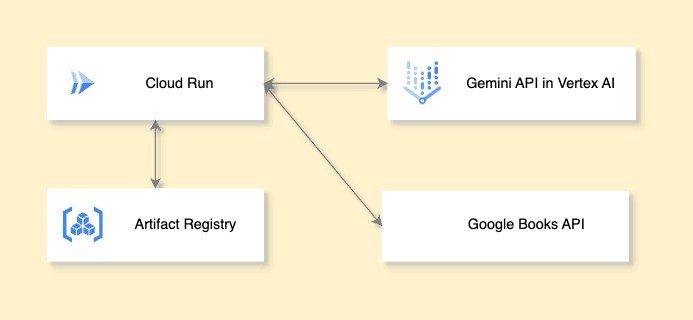

この記事は【第2回 AI Agent Hackathon with Google Cloud】への参加にあたり、作成したアプリケーションの紹介記事です。

##  はじめに

今回開発した「小説コンシェルジュ」は、忙しい毎日のなかでほんの少しでも「自分のための時間」を持ちたい、そんな思いに寄り添うアプリです。

ふとしたときに本を読みたくなる瞬間って、誰にでもあると思います。でも、世の中には本がありすぎて、「今の気分にぴったりの1冊」を探すのは意外と難しい。読みたい気持ちはあるのに、選ぶ時間がなくて諦めてしまったこと、ありませんか？

「小説コンシェルジュ」は、そんな日々のちょっとした“読書のきっかけ”をサポートしたいという思いから作成しました。

そのときの気分や、読書にかけられる時間、好きなジャンルに合わせて、あなたに合った1冊をAIがおすすめしてくれます。

「何を読もうかな？」と迷ったとき、気軽に立ち寄れる案内人のような存在になれたら――。

##  ターゲットユーザー像

小説コンシェルジュが対象としているユーザーは、次のような特徴を持つ人たちです:

  * 本を読みたい気分はあるが、ぴったりの本が見つけられない
  * SNSやレビューサイトの情報が大量で気持ちが消耗してしまう
  * 時間や気分に合わせて、パーソナライズされた本を知りたい
  * 忙しい中でも、短時間で感情に響く物語を手にしたい

これらのユーザーは「なんとなく本を読みたい」気持ちを、数個の言葉で表すことが多く、少ない情報から最適な本を推薦してくれるサービスを求めていました。

##  解決したい課題

このプロジェクトは次のような課題を解決することを目的としています:

  * 小さな手がかりでも、ユーザーの気分や読書時間に合わせて本を推薦したい
  * テキストベースでは表現しにくい気分や好みを形式化したい
  * LLM の自然語処理能力を活かして、実用的な「チャット型推薦エンジン」を実装したい
  * 固定的な推薦アルゴリズムではなく、会話を通して条件を自然に聞き出すことで、UX を向上させたい

##  ソリューション: チャット形式の推薦エンジン

「小説コンシェルジュ」は、ユーザーとの自然な対話を通じて、本当に求められている本を提示する仕組みです。以下のような流れで実現しています:

  1. ユーザーの発言から "emotion"（気分）、"genre"（ジャンル）、"reading_time"（読書時間）の情報を抽出
  2. 不足している項目があれば、それに応じた質問を返す
  3. 条件がすべてそろった時点で、Gemini API に推薦を依頼し、一冊の小説情報（タイトル・著者・あらすじ・おすすめ理由）を JSON で取得
  4. その結果を UI 上に美しく表示

この形式によって、ユーザーは「今日は泣ける話が読みたい」などと一言で伝えるだけで、その場にふさわしい作品に出会うことができます。

##  システム構成 (アーキテクチャ)

  * **Frontend** : Nuxt.js + Tailwind CSS により軽量かつ高速な SPA を構築
  * **Backend** : FastAPI によって非同期処理が可能なモダンバックエンドを実装
  * **LLM API** : Google Cloud の Gemini API（Vertex AI）を利用し、高精度な言語理解と出力を活用
  * **Google Books API** : Gemini APIにより出力された書籍の詳細情報を取得

##  システムアーキテクチャ図



##  デモ動画

<https://youtu.be/ypbTMwv6JRk>

##  技術的な工夫

###  1\. JSON形式の構造化出力

Gemini API から返ってくるテキストはそのままでは扱いづらいため、チャットプロンプトで「必ず JSON 形式で出力する」ように指示しています。これにより、解析不要な状態で結果を受け取り、安定した処理が可能になります。
    
    
        prompt = f"""
    あなたは小説コンシェルジュです。
    ユーザーの希望に応じて最適な小説を1冊おすすめしてください。
    
    **出力はJSON形式のみ**で行ってください。
    絶対にコードブロック記法（```json）や説明文を含めないでください。
    
    出力形式:
    {{
      "title": "タイトル名",
      "author": "著者名",
      "summary": "簡単なあらすじ",
      "reason": "おすすめの理由"
    }}
    
    ## 条件:
    気分: {current['emotion']}
    ジャンル: {current['genre']}
    読書時間: {current['reading_time']}
    """
    

###  2\. 条件のステート管理

Nuxt 側では `ChatEntry[]` をログとして保存しつつ、`currentConditions` に emotion, genre, reading_time をそれぞれ明示的に保持しています。これにより、各質問への回答を即座に判断し、次の質問をスムーズに生成できます。

###  3\. 型安全なデータモデル

TypeScript の導入により、フロントエンドでの型不整合を未然に防止。ユーザーの発言、AIの応答ともに構造を持つ `Result` 型に統一し、保守性を確保しました。

##  ユースケース紹介: 忙しい現代人の読書体験を変える

###  学生

テスト期間中の合間に「ほんの少し癒されたい」と思ったとき、ジャンルを選ばず「落ち着きたい」と入力するだけで、心を落ち着かせる小説と出会える。

###  社会人

出勤前や移動中に「30分以内で読める面白い話が読みたい」とリクエストすれば、限られた時間でも満足できる短編を提示してくれる。

###  高齢者

「懐かしい気持ちになれる小説を読みたい」という漠然とした気分にも対応可能で、推薦の柔軟性を感じられる。

##  Geminiプロンプト設計の工夫

Geminiは高精度な出力が期待できる一方で、出力の形式や文脈依存性が高く、プロンプト設計は重要です。本プロジェクトでは以下のように工夫しました:

  * **出力形式を明示** ：「必ずJSON形式で返す」「コードブロック記法を使わない」などのガイドを強調
  * **条件文の繰り返し強調** ：条件（気分、ジャンル、時間）を明確にプロンプトに記述し、LLMの出力のぶれを最小化

##  開発中の課題とその克服

  * **課題: Gemini からの不安定な出力**

    * **対応策** : 正規表現による出力抽出、冗長な文の除外、例外処理の導入
  * **課題: ユーザーがすべての条件を一気に入力することがある**

    * **対応策** : 初回入力から条件を一括抽出するロジック（自然言語解析）を補助的に導入

##  今後の課題

  * **課題: バックエンド側にロジックが集中しており、柔軟性に欠ける**

    * **背景** : 現在は「Gemini → GoogleBooks」という固定フローに基づいて動作しており、分岐や例外パターン（例えばGeminiの出力が不十分な場合など）には、すべて明示的なPythonロジックで対処している。

    * **今後の展望** : AIエージェント技術を導入し、Geminiが自身で「ツール（GoogleBooks APIなど）」を選択・活用できる構成に拡張することで、タスク駆動型かつ対話的な推薦フローを実現したい。LangChainやOpenAgentsといったLLMエージェントフレームワークの活用。

* * *

  * **課題: 単発的な会話に終始し、対話の深まりや履歴の活用ができていない**

    * **背景** : 現在の設計では、各リクエストが独立しており、ユーザーの意図や履歴を保持する仕組みが存在しない。

    * **今後の展望** : セッションごとの状態保持や、マルチターン対話の実装により、「前回の推薦はどうだった？」「他にも似た作品は？」といった自然な会話の流れを実現する。Geminiに対しても、会話履歴を含めたコンテキストを継続的に渡すアプローチへ拡張。

* * *

  * **課題: Geminiの活用が限定的になってしまっている**

    * **背景** : 現状ではGemini APIは、単に条件に応じて小説を出力する生成器としての役割に限定されている。

    * **今後の展望** : Geminiを「対話型知能エージェント」として再定義し、推薦だけでなく、条件の再確認・曖昧さの解消・検索リトライなどを含めた一連の思考と行動を自律的に担わせる。これにより、人間が都度フロー制御する必要のない、より自然なAIとのインタラクションを目指す。

##  おわりに

今回、ハッカソンという貴重な機会を通じて、はじめて一人でアプリケーションを一から設計・実装し、実際に動かすという一連のプロセスを経験することができました。

アイデアをかたちにしていく中で、手を動かす楽しさと同時に、思いどおりにいかないもどかしさや技術的な壁にも直面しました。

そうしたトライ＆エラーの連続は、自分の未熟さを実感する場面でもありましたが、それ以上に「ものづくりの面白さ」を再確認するきっかけにもなりました。

また、生成AIやLLM、そしてAIエージェントといった技術に実際に触れてみることで、単なるトレンドとしてではなく、「人の思考や創造を支える技術」としての可能性の広がりも強く感じました。

とくに、ツールとしてのAIではなく、タスクを遂行する“知能”としてのAIにどう向き合っていくかは、今後の開発者としての自分にとって大きなテーマになりそうです。

技術も知識もまだまだ発展途上ではありますが、これからも進化を続けるAIの世界に好奇心を持って飛び込み続け、学び、手を動かし、よりよいプロダクトの創出に少しでも貢献していけたらと思っています。

ぜひ次回はチームビルディングで参加したいです！  
最後まで読んでいただき、ありがとうございました。
