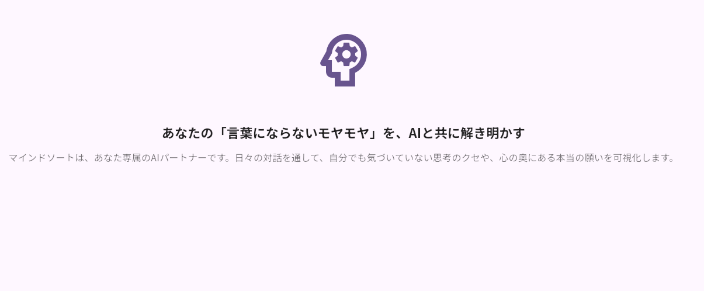
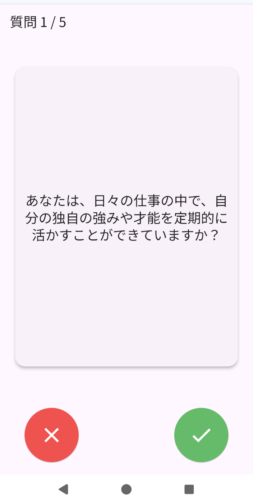
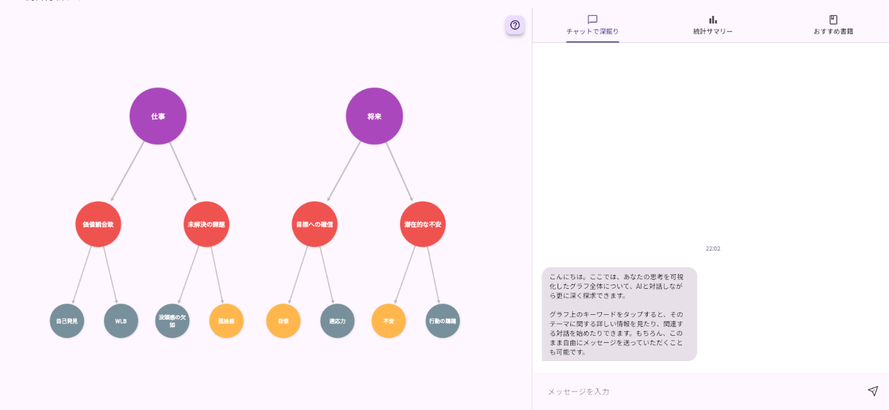
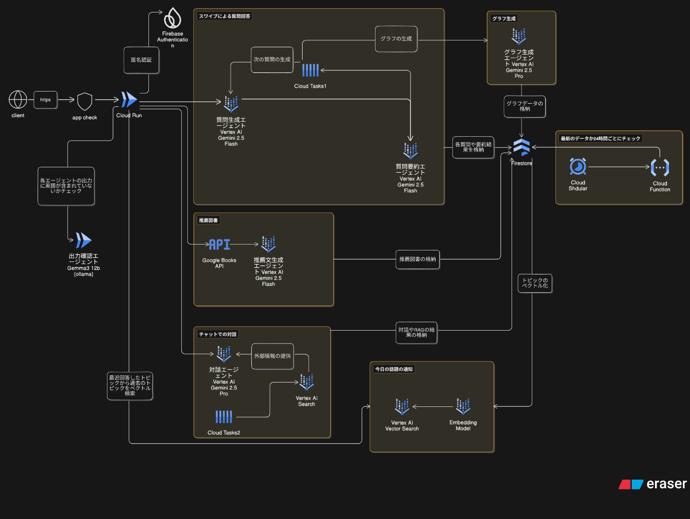

##  はじめに

**「頭の中がごちゃごちゃで、自分が何を考えているのか分からない……」**  
私たちの頭の中は、常に無数の思考の断片で溢れています。  
私たちの知り合いはよく「会話しているうちに自分が何を考えているのかが分かってくる」事が多いと述べており、自分の考えをすぐに言語化するということが苦手な人もいます。

生成AIを使った思考整理サービスもありますが、チャットボット形式が多く以下のような課題があります。  
1.スマートフォンだと長文を打てない  
2.言語化出来ていない状態では何を入力すれば良いか分からない  
思考を整理するためには継続的に利用することが重要ですが、上記の課題によって利用が続かないという問題点があります。

本チームが提案する **「マインドソート」** は、AIからの質問に**yes/noとカードをスワイプして答えるだけでこの問題点を解決し** 貴方の思考を整理（ソート）、そして自己理解を深めるための**新感覚ジャーナリングWebアプリ** です。  
漠然とした思考をAIが言語化してくれ、回答結果の要約、知識グラフによる思考の可視化、そして過去の回答を踏まえた書籍推薦、チャット画面での深堀り・検索、次回の質問セッションの話題提案といった、**パーソナライズ化** を意識したアプリになります。

###  キーワード

  * パーソナライズ化：個人の回答に合わせて提案を行う
  * Human-in-the-loop：yes/noの回答と結果要約をフィードバックすることで質問内容の洗練を意識

##  ユーザー像

  * 思考の整理や言語化が苦手な方
  * 自己分析や内省に関心はあるが、従来のやり方では続かなかった方。
  * 自分の考えを客観的に見つめ直し、新たな気づきを得たいと考えている方。

##  課題:

  * 頭の中にある考えや感情が整理されず、漠然とした不安や混乱を感じる。
  * 自分の考えを深掘りするきっかけがなく、表面的な思考に留まりがち。
  * 内省から得た気づきを、具体的な行動や学びにつなげるのが難しい。
  * 生成AIを利用した既存のアプリだとチャット形式が多く、特にスマートフォンだと打ちにくいため利用が続きにくい。

##  ソリューションと特徴:

「マインドソート」は、AIとの対話を通じて「思考の整理から次のアクションまで」をシームレスに支援します。

###  1\. AIからの質問に答えるだけ

ユーザーはホーム画面でトピックを選び、スワイプで質問をyes/noと直感的に答えることで、思考をアウトプットできます。**これにより手間をかけずに、どのような端末でも気軽に思考を整理することが出来ます。** `質問生成エージェント(Gemini 2.5 Flash)` が、ユーザーの過去の対話履歴を自律的に分析し、文脈に応じたパーソナライズされた質問を生成します。

###  2\. AIによる客観的な要約と深掘り

質問セッション後、`回答要約エージェント (Gemini 2.5 Flash )` が生成した客観的な要約を確認できます。さらに「深掘りする」ボタンを押すと、質問生成エージェントが呼ばれ、要約結果を基に作られた新たな質問を使って、最大5回までそのトピックの深堀りすることができます。  
**yes/noによってAIの質問結果をフィードバックしている** とも捉えることが出来、回答によって質問内容を洗練していく**Human-in-the-loop** を意識した作りになっております。

###  3\. 思考の全体像を可視化するダッシュボード:

分析統合ダッシュボードでは、複数のエージェントが協調して動作します。`グラフ生成エージェント (Gemini 2.5 Pro)` が知識グラフを生成し、`対話エージェント (Gemini 2.5 Pro)` がそのグラフに基づいてユーザーとの対話を深めます。

###  4\. ネクストアクションに繋げるための対応・提案：

過去のやり取りを踏まえて、ユーザーが次のアクションに繋げるために以下の支援を行います。

  * チャットUIで `対話エージェント (Gemini 2.5 Pro)` に対して、過去データを基に思考の傾向等の質問ができます。また、グラフのノードを押すとチャット上にトピックのキーワードが入力され、Vertex AI Search から取ってきたトピックに関するネット上の同じ悩みや改善案の提示も可能です。**自分の悩みが普遍的なものであると知り安心感を得たり、客観的な視点から解決への糸口を見つけることができます。**

  * 質問した回数やグラフでのトピック別の質問回数の可視化がされています。ユーザーがどのような事に関心があるのかをひと目で分かります。**自分がどれだけ質問を行い、どのようなトピックに興味があるのかを定量的に知ることが出来ます。**

  * 過去のやり取りのキーワードから `Google Books API` と `推薦文生成エージェント (Gemini 2.5 Flash)`による図書の推薦。**内省で得た気づきを、具体的な学びや行動へと繋げるネクストステップが明確になります。**

  * `Vector Search` を利用し、最近のトピックに関連する話題をホーム画面で提案し、そのトピックで質問のやり取りを行うことが出来ます。**自分が過去何について考えていたのか、そして現在そのトピックに対してどう考えているのかを知るきっかけ作りを行います。**

##  システムアーキテクチャ図

##  主要な技術スタック

  * **フロントエンド:** Flutter
  * **バックエンド:** Python, Flask
  * **インフラ:**
    * **フロントエンド** ：Firebase Hosting
    * **バックエンド:** Cloud Run
    * **データベース:** Firestore (セッションデータ、各種キャッシュ)
    * **非同期処理:** Cloud Tasks
  * **AI:**
    * Vertex AI Gemini 2.5 Flash: 高速な対話生成、要約、書籍推薦理由の生成
    * Vertex AI Gemini 2.5 Pro：知識グラフ生成、過去のデータを扱ったチャットボット
    * Gemma 3:12b on Ollama/Cloud Run：: 各主力エージェントの生成結果を監視し、出力が英語表記になっていないか確認する。
    * Vertex AI Text Embedding Models: 過去の結果をベクトル化
    * Vertex AI Vector Search: ベクトル化した過去の結果からユーザーに合わせた質問トピック提案のための検索
    * Vertex AI Search: RAGにおける外部情報検索
  * **認証・セキュリティ:** Firebase Authentication, Firebase App Check

##  技術的な工夫

###  Gemini 2.5 Flash、Proの使い分け

  * 質問生成や要約生成などユーザーが一番使用するシーンや、図書推薦文などの短い文章生成では高速かつ低コストな `Gemini 2.5 Flash` を利用しております。
  * 過去のデータを利用するグラフ生成やチャット形式での質問応答には `Gemini 2.5 Pro`を利用し、精度を担保させることを重視しております。  
**ユーザー操作への即時応答性と、深い分析に耐える高品質なインサイト提供の両立を、適切なモデル選択による費用対効果の最適化と共に実現しました。**

###  マルチタスクAIエージェントの構築:

「マインドソート」のAIは、単一の機能ではなく文脈に応じて複数のタスクを実行します。

  * **質問生成エージェント:** ユーザーの過去の対話履歴を考慮し、パーソナライズされた質問を生成します。
  * **質問要約エージェント:** 質問結果を要約しユーザーの考えを可視化します。また同じトピックで更に質問を行う際には、質問生成エージェントに要約結果をフィードバックし、回答結果に沿った質問を生成させます。
  * **推薦文生成エージェント:** 分析結果からキーワードを抽出し、Google Books APIで検索後、推薦理由を生成します。

###  FlutterとFirebaseによる高速なプロトタイピングと堅牢な基盤構築:

フロントエンドにFlutter、バックエンドの主要部分にFirebase (Hosting, Firestore, Authentication, App Check) を採用することで、アイデアを迅速に形にし、セキュアでスケーラブルな基盤を短期間で構築しました。特にFirebase AuthenticationとApp Checkを組み合わせることで、開発初期段階から高度なセキュリティを容易に実装できています。

###  出力結果の統一化 (Structured Output)

バックエンドにて定義した各SCHEMAに基づいて各エージェントはJSON形式で出力を返し、信頼性の高い構造化データを取得しています。**出力結果のバラツキによる動作の不安定さを解消させました。**

###  Cloud Tasksによる非同期処理:

ユーザー体験を損なわないよう、要約結果が表示されるタイミングなどで `Cloud Tasks` に非同期処理を依頼しています。

  * 質問の先読み: ユーザーが要約を読んでいる間に、次の対話で使われる可能性のある質問をバックグラウンドで生成・保存し、待ち時間をなくします。
  * 分析グラフの更新: 計算負荷の高いグラフデータの再生成を非同期で行い、ダッシュボード表示の高速化に貢献しています。  
**ユーザーにストレスを感じさせない軽快な操作感を目指しました。このアーキテクチャは、将来的にさらに重い分析処理を追加する際にも容易に拡張可能です。**

###  Vertex AI Searchによる深い洞察:

分析統合ダッシュボードでのチャット機能は単なる会話に留まらず、ノードを押すことでネット上にある同じ悩みを持つ事例や改善案をVertex AI Searchで外部情報を検索し、top3の内容を出力してくれます。**なるべくユーザーに合わせた提案ができるように心がけました。**

###  Vector Searchを使った過去の話題の振り返り提案

Vector Searchを利用して、最近使ったトピックと類似する過去のトピックを取り出し、「今日の話題の通知」としてホーム画面で質問のトピックを提案してくれます。**ユーザーに「過去こんな事を考えていたんだ」という気づきを提供することを意識しました。**

###  不自然な出力の対応

開発中、稀に出力が英語表記になることがありました。入力によっては質問文や応答に英語が突然含まれてしまい、不自然さをユーザーに与えます。そのため `Gemma3:12b` が各エージェントの出力に英語が含まれていないかチェックしております。軽量モデルの高速処理を活かして素早いチェックを行っております。**AIがAIの品質を担保することで、システム全体の信頼性を高めています。**

##  デモ動画

<https://youtu.be/mmlUvcvMXV8>

※ 動画の音声は[音読さん](https://ondoku3.com/ja/) を利用して用意しております。

##  課題

  1. **RAGのデータソースの洗練**

     * キーワードによっては提示するサイトの内容がズレていたり、上手くヒットしなかったりします。データソースにするサイトの洗練させる必要があります。
  2. **質問生成処理の重さ**  
質問生成の処理は速いとは言えないため、もう少しモデル選定・非同期処理の工夫が必要と考えられます。

  3. **分析の幅を広げる**  
「この１ヶ月、〇〇に関して考えていた」等の月次レポートや、質問に回答するまでの思考時間などの回答以外のデータも分析に取り入れることで、より独自性が増すと考えられます。  
(思考時間は当初要約生成時に取り入れていましたが、出力結果が回答結果に沿っていない内容になったため除外しました。)

  4. **UIデザインの強化**

  5. **匿名認証の追加**

  * 当初は実装していましたが、Web環境でのセッション維持に課題があり、今回は確実な動作を優先してメール認証等を実装しました。しかし、より気軽に利用してもらうためには匿名認証は不可欠です。Firebase Authenticationの知見を活かし、今後のアップデートで必ず実現したいと考えています。

##  まとめ

本アプリは、単に思考を記録するツールではありません。**AIとの直感的な対話を通じて、ユーザー自身も気づいていない心の奥底にある声に耳を傾け、それを客観的に可視化し、次の一歩へと繋げるための「思考のパートナー」です** 。
