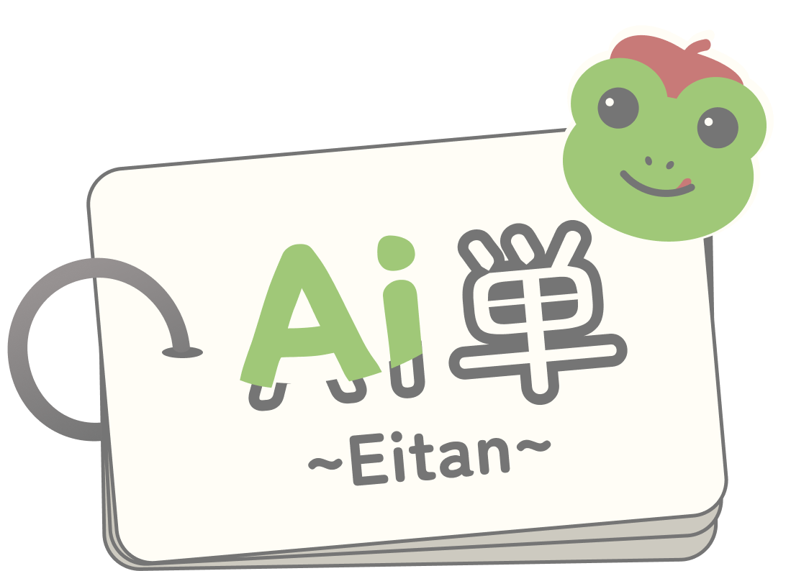
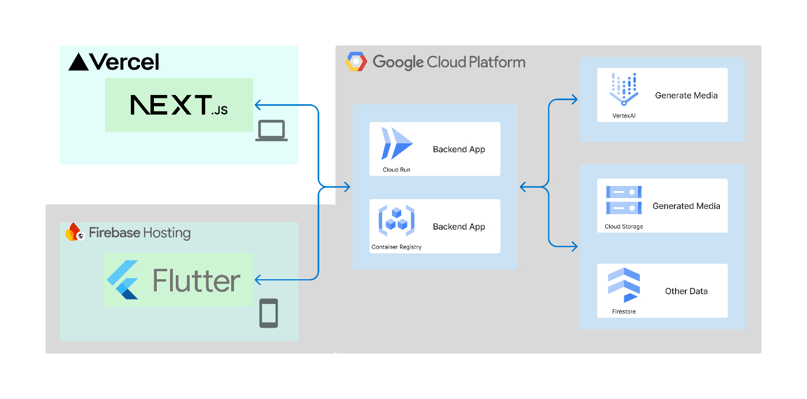
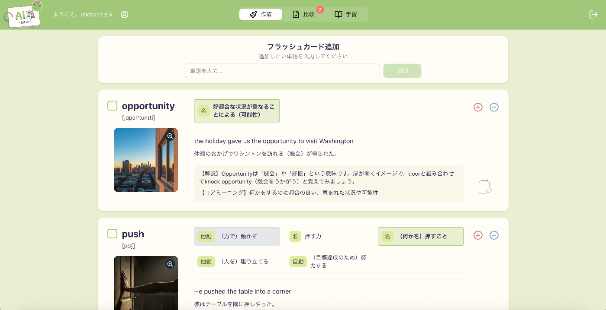
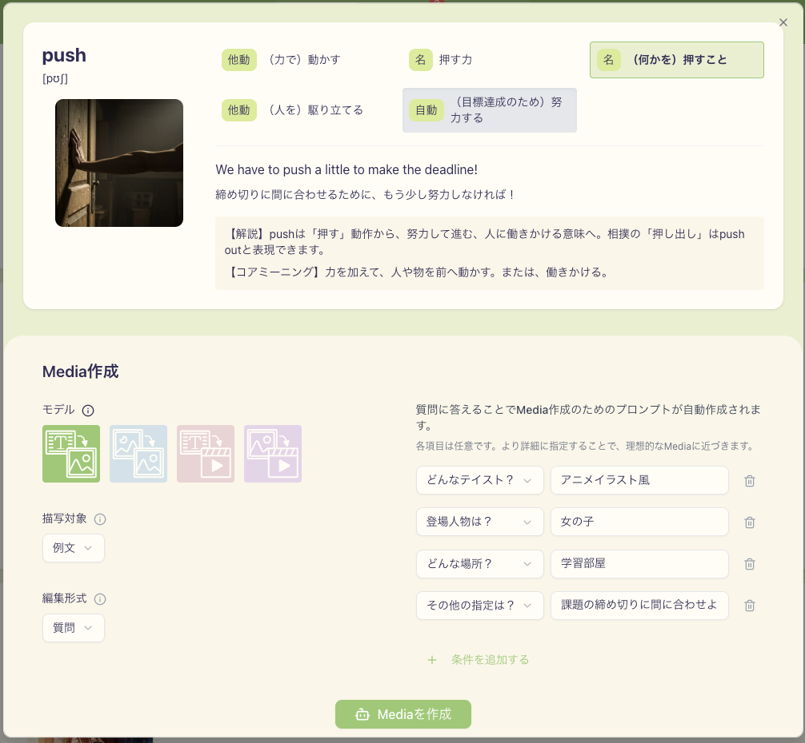
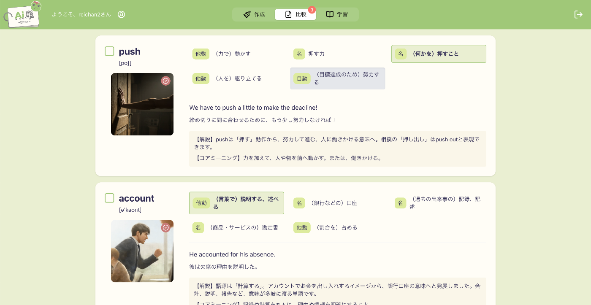
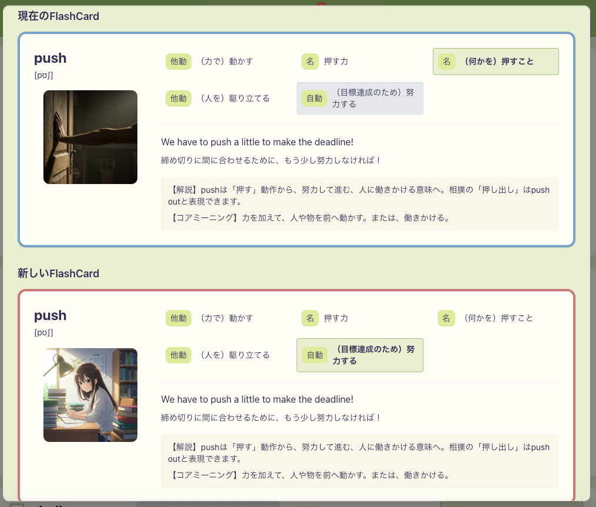
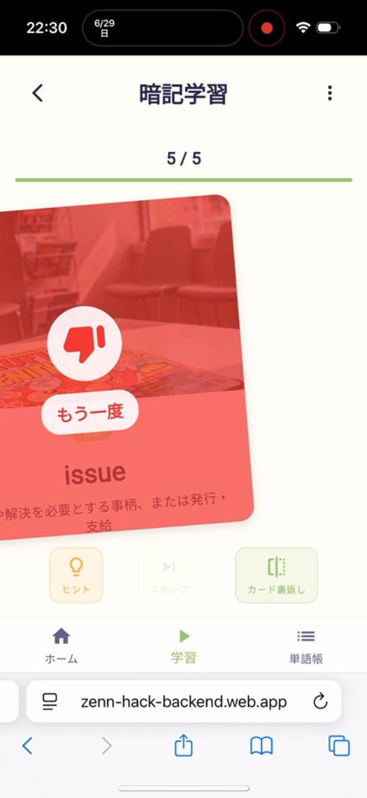

##  1\. はじめに

本記事は、「第2回 AI Agent Hackathon with Google」にて実施したチーム開発の成果報告となります。

英単語の学習に苦手意識を持つ方は多いのではないでしょうか？「単語帳を見ても覚えられない」「勉強が続かない」「もっと楽しく学習したい」そんな悩みを解決するために開発したのが、AI英単語学習アプリ「Ai単 ~Eitan~」です。  

従来の英単語学習は、紙の単語帳や既存のアプリで決められたコンテンツを使って学習するのが一般的です。しかし、これらの方法では個人の興味や学習スタイルに合わせたカスタマイズが難しく、継続的な学習のモチベーション維持が課題となります。

「Ai単 ~Eitan~」は、Google Cloud の AI技術を活用して、ユーザー自身が好きなコンテンツを生成し、視覚的で楽しい学習環境を提供します。出会った単語を登録し、AIが生成する画像や動画を使ったフラッシュカードで学習できる、まったく新しい英単語学習アプリです。

##  2\. このアプリの概要

###  課題

従来の英単語学習では以下のような課題があります：

  1. **継続性の問題** : 単調な学習方法で飽きやすい
  2. **Personalized Learningの課題** : 学習者の興味や理解度に合わせたカスタマイズができない
  3. **単語の種類の制限** : 用意されている単語が媒体に依存
  4. **効率性の問題** : 覚えた単語と覚えていない単語の管理が困難
  5. **多義語の学習しにくさ** : 多義語であるのに対し、例文が１つのみ

###  対象ユーザー

  * **忙しい社会人や学生** : 通勤時間やスキマ時間を活用して効率的に学習したい
  * **視覚的な学習を好む人** : テキストだけでなく、画像や動画を通じて理解を深めたい
  * **技術に興味がある学習者** : AI技術を活用した最新の学習方法を体験したい

###  ソリューションと特徴

「Ai単 ~Eitan~」は以下の機能でこれらの課題を解決します：

  1. **AIを活用したカスタマイズ可能なフラッシュカード** （課題1・2への対応）

     * Vertex AI（Imagen3）を使用して単語に関連するMedia（画像・動画）を自動生成
     * 学習者の好みに合わせてメディアコンテンツを編集・カスタマイズ可能（パーソナライズ化）
     * 視覚的で魅力的なコンテンツにより学習継続を促進
     * 学習者の興味や理解度に合わせて単語、意味、例文、メディアを選択的に隠して学習効率を向上
     * ユーザー自身が生活の中で見つけた未知単語を学習リストに追加可能
  2. **自由な単語収集システム** （課題3への対応）

     * 生活の中で見つけた未知単語を学習リストに追加
     * 自分にとっての未知単語のみを学習可能
     * 媒体に依存しない自由な単語選択
  3. **効率的な反復学習システム** （課題4への対応）

     * 左右スワイプによる直感的な操作で覚えた/覚えていない単語を振り分け
     * 覚えていない単語を重点的に出題するアルゴリズム
     * 学習進捗の自動管理
  4. **多義語対応の例文表示** （課題5への対応）

     * 意味の追加・削除機能により、知らなかった意味を知ることができたり、暗記した意味を見えなくすることができる
     * １つの単語に対して複数の意味と例文を提供

##  3\. 技術スタック

###  システムアーキテクチャ

###  仕様技術

区分 | 技術・サービス名  
---|---  
スマホアプリ | Flutter  
Webアプリ | Next.js, shadcn/ui, Vercel  
バックエンド | FastAPI, Poetry, Docker  
バックエンドデプロイ | Google Cloud Run  
スマホアプリデプロイ | Firebase Hosting  
  
###  使用したGoogle Cloud サービス

用途 | サービス名  
---|---  
プロンプト作成 | Gemini API in Vertex AI  
動画生成 | Veo-2.0  
画像生成（text-to-image） | Imagen-3.0  
画像生成（image-to-image） | Gemini API in Vertex AI  
データベース（生成画像・動画） | Cloud Storage For Firebase  
データベース（その他のデータ） | Firebase Firestore  
バックエンドのデプロイ | Google Cloud Run  
スマホアプリのデプロイ | Firebase Hosting  
  
##  4\. 「Ai単 ~Eitan~」の特徴

###  他サービスとの比較

従来の英単語学習アプリと比較して、「Ai単 ~Eitan~」には以下の独自の特徴があります：

項目 | 従来のアプリ | Ai単 ~Eitan~  
---|---|---  
**コンテンツ** | 提供者が用意  
（みんな同じ） |  **AIによるコンテンツ生成** :   
ユーザーの登録した単語に最適化された画像・動画を自動生成  
**カスタマイズ性** | 限定的 |  **パーソナライゼーション** :   
学習者の好みに合わせてメディアや意味をカスタマイズ  
**学習方法** | 学習方法が固定的 |  **効率的な復習システム** :   
[Web]覚えたい要素クリックによって表示非表示の切り替え  
[スマホ]スワイプ操作による直感的な復習管理  
**プラットフォーム** | 単一プラットフォーム |  **マルチプラットフォーム** :   
Web、スマホアプリが連携  
  
###  開発体験での工夫

開発過程で特に力を入れたのは、**ユーザビリティの向上** です。

  1. UI 
     * アイコン、ファビコン、色合いなど、商業的なアプリケーションを意識
     * 画像やメニュータブにバッジをつけることで、ユーザーが直感的にわかりやすいサービス
     * レスポンシブデザインで様々なデバイスに対応
  2. 機能 
     * 作成 
       * 初学者にとっても使いやすいように、質問形式で答えることでMediaを作成できる
       * プロンプトエンジニアリングに慣れ親しんだユーザーにとって、プロンプト自体を編集することができるので、凝ったMediaも作成できる
       * text-to-imageやimage-to-image、text-to-video、image-to-videoの４種類のモデルを使用でき、自由度の高いMedia作成を行うことができる
       * コアミーニングに対するMediaを作成することで、英単語の核心をMediaとして直感的に覚えることができる
       * ユーザーに馴染みのない意味に対するMediaを作成することで、その意味を覚えやすくする
       * 覚えたい単語を追加するだけで、さまざまな意味や例文、また画像付きのフラッシュカードを簡単に作成することができる
     * 学習 
       * ユーザーが覚えたい部分を非表示にすることで、赤シートのように単語帳としての機能を果たしている
       * 非表示部分をクリックするだけで、その要素だけを確認することができ、学習しやすくなっている
  3. 実装面 
     * APIのエラーハンドリングを多く用意することで、ユーザビリティの向上を図った
     * ディレクトリ構成を考えて、Nextのフロントとバックエンドを切り分けることで、他方を意識することなく開発を効率よく進めることができた
     * Google Cloud サービスの統合では、特にVertex AIの活用に注力
     * 単語の文脈を理解して、適切な画像を生成するためのプロンプトエンジニアリングに時間をかけた
     * AI画像生成は時間がかかるため、非同期処理とキャッシュ機能を実装し、ユーザー体験を向上させた。
     * Imagen3のプロンプトエンジニアリングを重ね、単語の文脈を含めたより詳細なプロンプトを作成することでMediaの品質を向上させた

##  5\. 「Ai単 ~Eitan~」の導入方法

###  1\. Webアプリでのフラッシュカードカスタマイズ、学習

  1. [Ai単 Webアプリ](https://zenn-hack-frontend.vercel.app/) にアクセス
  2. メールアドレスとパスワードでログイン

  
_Webアプリ-`作成タグ`_

単語登録

`作成タグ`

  1. 上部にある「フラッシュカード追加」にて覚えたい英単語を入力
  2. しばらく待つと、フラッシュカードが作成される

カスタマイズ（意味・例文・メモ）

`作成タグ`

  * 意味 
    * 各フラッシュカードの右上の＋マークとーマークから意味追加と削除が可能
  * 例文 
    * 意味をクリックすると、その意味での例文が表示される
  * メモ 
    * 右下のメモ帳にて、メモしたいことを書き込める（内容があれば、メモ帳に４本線が入る）

  
_Webアプリ-`Media作成モーダル`_

  
_Webアプリ-`比較タグ`_

  
_Webアプリ-`Media比較モーダル`_

カスタマイズ（メディア）

`作成タグ`

  1. フラッシュカードの画像をクリックし、`Media作成モーダル`を開く
  2. 左でモデル、描写対象、編集形式を選び、右で自分なりにカスタマイズする 
     * 使用しているフラッシュカードのMediaが動画の場合、選べるモデルは、text-to-imageとtext-to-videoのみ
     * 描写対象を例文とするならば、意味をクリックして描写したい例文に設定しておく
  3. 下のMedia作成をクリックすると、作成が始まる 
     * 作成が完了すると、フラッシュカードの右上にチェックマークがつき、`比較タグ`の右上に作成完了したフラッシュカードの数が表示される

`比較タグ`

  1. フラッシュカードの画像をクリックし、比較モーダルを開く
  2. 使いたいフラッシュカードを選択

  
_スマホアプリ-`学習`_

学習

`学習タグ`

  * 各要素をクリックすることで表示非表示の切り替え可能 
    * 単語（発音込）
    * Media
    * 意味
    * 例文（英・日）
    * 説明
  * メモは`作成タグ`と同様、内容を確認したり書き込めたりできる
  * `学習タグ`の右にある目のアイコンで、全てのフラッシュカードに表示非表示の設定を反映することが可能

###  ２\. スマホアプリでの反復学習

  1. [Ai単 スマホアプリ]スマホアプリをダウンロード（今後リリース予定）
  2. 同じアカウントでログイン  
  
_Webアプリ-`学習タグ`_

学習

  * クリックすることで表と裏の切り替え可能 
    * 表 
      * 単語・画像・品詞・コアミーニング
    * 裏 
      * 発音・意味・例文
  * 覚えたものは右スワイプ、覚えていないものは左スワイプする

##  6\. デモ動画

実際の使用感を確認できるデモ動画をご用意しました：  
<https://youtu.be/dpARUvTikqA>

※デモ動画では以下の機能を紹介しています（3分以内）：

  * Webアプリ：フラッシュカードカスタマイズ
  * Webアプリ：表示非表示での学習
  * スマホアプリ：スワイプ学習

##  7\. まとめ・今後の展開

###  まとめ

「Ai単 ~Eitan~」は、Google Cloud の AI技術を活用して従来の英単語学習に革新をもたらすアプリケーションです。Webアプリ、スマホアプリが連携し、ユーザーの学習体験を大幅に向上させます。

開発を通じて、AIを活用したエデュケーションテクノロジーの可能性を実感しました。特に、個人の学習スタイルに合わせたカスタマイズ性と、視覚的コンテンツによる記憶定着効果は、従来の学習方法を大きく上回る結果を示しています。

英語学習に苦手意識を持つ方や、新しい学習方法を試してみたい方は、ぜひ「Ai単 ~Eitan~」を体験してみてください。AIが生成する美しい画像と共に、楽しく効率的な英単語学習を始めましょう。

###  今後の展開

現在は英単語学習に特化していますが、今後は以下の機能拡張を予定しています：

  * 他言語（中国語、韓国語など）への対応
  * 音声学習機能の追加
  * AI生成動画の品質向上
  * 学習進捗の詳細分析機能

##  補足

###  関連技術と参考リンク

  * **Google Cloud Vertex AI** : [公式ドキュメント](https://cloud.google.com/vertex-ai/docs)
  * **React + TypeScript** : [公式ガイド](https://react.dev/learn/typescript)
  * **Flutter** : [公式サイト](https://flutter.dev/)
  * **FastAPI** : [公式ドキュメント](https://fastapi.tiangolo.com/)

###  GitHub リポジトリ

開発に興味のある方は、以下のリポジトリをご確認ください：

  * [Webフロントエンド](https://github.com/yoh-siba/zenn-hack-backend)
  * [バックエンド](https://github.com/KyoyaIwatsuru/zenn-hack-frontend)
  * [スマホアプリ](https://github.com/KyoyaIwatsuru/zenn-hack-mobile)

* * *

_この記事が皆様の英語学習の一助となれば幸いです。ご質問やフィードバックがございましたら、お気軽にコメントください。_
