###  0\. デモ動画とまとめ

<https://youtu.be/YgmTKkPSiyk>

本記事のまとめ

Whisky AI Bartenderはパーソナライズされたウイスキー体験を提供するサービスです。ウイスキーを楽しむ上で誰もが悩む「選ぶ・表現する・記録する」という一連の体験をサポートします。おすすめのウイスキーの紹介、テイスティングノートの作成支援、そしてボトルの写真撮影による自動記録などの機能で、ユーザーのウイスキーライフをより豊かなものにします。Google Cloudのマルチエージェント技術を活用し、使うほどにユーザーの嗜好に最適化されるのが特徴で、全ての体験をLINEで手軽に利用できます。初心者から愛好家までのユーザー体験価値を向上させ、将来的にはウイスキー業界全体の活性化に貢献することを目指します。

###  1\. はじめに - ウイスキーと私とAI

みなさん、

**「ウイスキー飲んでますか？」**

ウイスキーとは

ウイスキーは、大麦やトウモロコシなどの穀物を主原料とし、糖化、発酵、蒸溜、そして樽での熟成という工程を経て造られる奥深い魅力を持つお酒です。製法や熟成期間、生産される地域によって、実に多様な個性が生まれます。

_ウイスキーのイメージ画像_

バーでゆっくりと味わうのが好きな方、仲間とハイボールを楽しむのが定番という方、あるいは「ウイスキーについて、まだあまり詳しくない」「興味はあるけど、何から始めたら良いかわからない」という方もいらっしゃると思います。

実は、日本は世界5大ウイスキーの1つです。国内でも新しい蒸留所が次々と誕生していて、ジャパニーズウイスキーは世界中から注目をされています。しかし一方で、国内ではウイスキーを日常的に楽しむ方の割合はまだ少なく、ウイスキーの種類が豊富なこと、感想も人それぞれなのことから、「どう楽しめばいいか分かりにくい」と感じられているかもしれません。

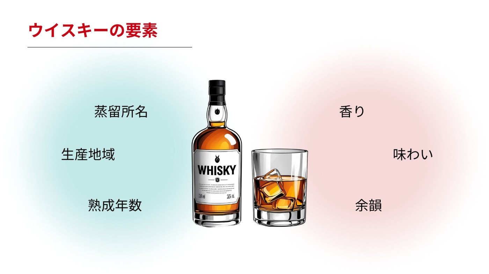_ウイスキーの構成要素_

さて私自身の話になりますが、20歳の時にウイスキーと出会ってから、現在の27歳になるまでその魅力にどっぷりとハマっています。

新しい味わいに出会うワクワク感や、自宅やバーで友人とウイスキー片手に語り合う時間は、かけがえのないものです。さらにウイスキーに関する資格を取ったり、国内外の蒸溜所を訪れたり、と全身でウイスキーライフを謳歌しています。

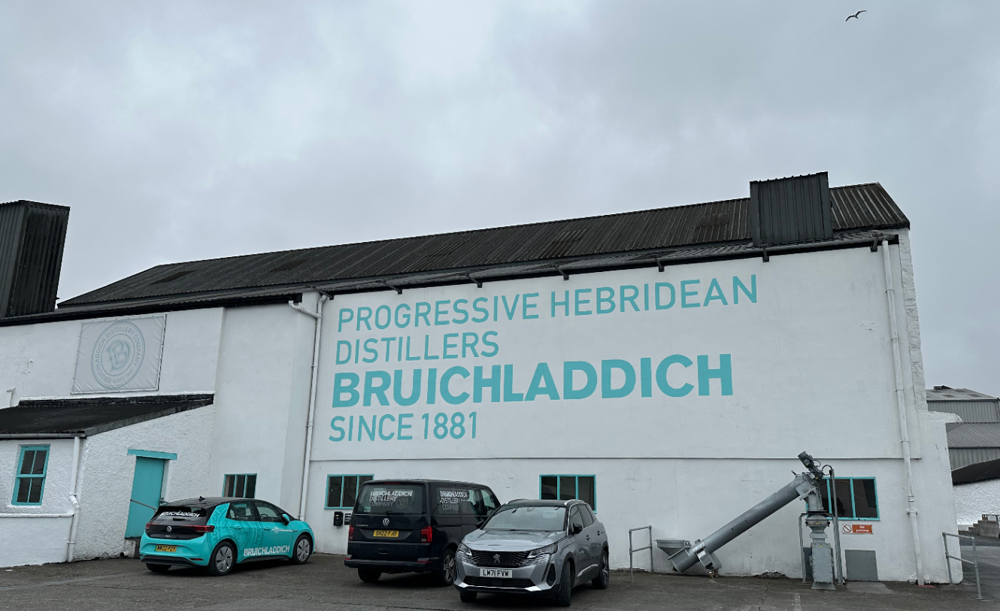_ブルックラディ蒸留所, アイラ島, スコットランド (2025.5.1撮)_

しかし、そんな私も「次の一本をどう選ぶか」「この味わいをどう表現すれば」「あの銘柄は何だったか」といった悩みは尽きません。

これらの悩みは、**ウイスキーを飲み始めたい方、既にウイスキーを飲んでいる方** にとっても「壁」となっており、ウイスキー体験を「もったいない」ものにしてしまいがちです。

データとAIの力で「もったいない」を解消し、上記の方達に楽しんでほしいとの想いから**Whisky AI Bartender** は生まれました。

<https://youtu.be/zc0khP6SYsE>

_Veo3作 (iが無いのはご愛嬌)_

###  2\. 課題 - こんな「もったいない」ありませんか？

ウイスキーの世界は広く深く魅力的ですが、「もったいない」と感じる状況も少なくありません。この「もったいない」を生み出さないように、取り組むべき課題はなんでしょうか。

ウイスキーを飲む時の「**選ぶ・表現する・記録する** 」という一連の流れの中に、誰もが直面しうる3つの大きな課題があると考えました。

####  【3つの課題】

  * **課題1： 自分にぴったりの一本を「選ぶ」ことが難しい**  
ウイスキーの種類は膨大で、自分の好みや気分に合う一本を見つけるのは難しいです。「何を選べばいいか分からない」という戸惑いは最初の一歩を妨げ、飲み慣れた方でさえ新しい発見の機会を逃しがちです。

  * **課題2： 味わいを言葉で「表現する」ことが難しい**  
「美味しい！」と感じても、その具体的な香りや味わいを言葉で表現するのは誰にとっても難しいものです。テイスティングノートの作成も「専門知識がないと難しい」と思われがちです。

  * **課題3： 飲んだウイスキーを手軽に「記録する」ことが難しい**  
好みに合うウイスキーを飲んでも、その情報を手軽に記録できなければ、記憶はすぐに薄れてしまいます。飲んだ記録が整理されていないと、自分の好みを把握したり、過去に飲んだウイスキーを思い出すことも困難です。

これらの「**選ぶ・表現する・記録する** 」という課題が、ウイスキーの素晴らしい体験を「もったいない」ものにしています。AIの力でこの課題の取り組み、専門知識や世代にかかわらず、誰もがもっと気軽に、深くウイスキーを楽しめる世界を目指します。

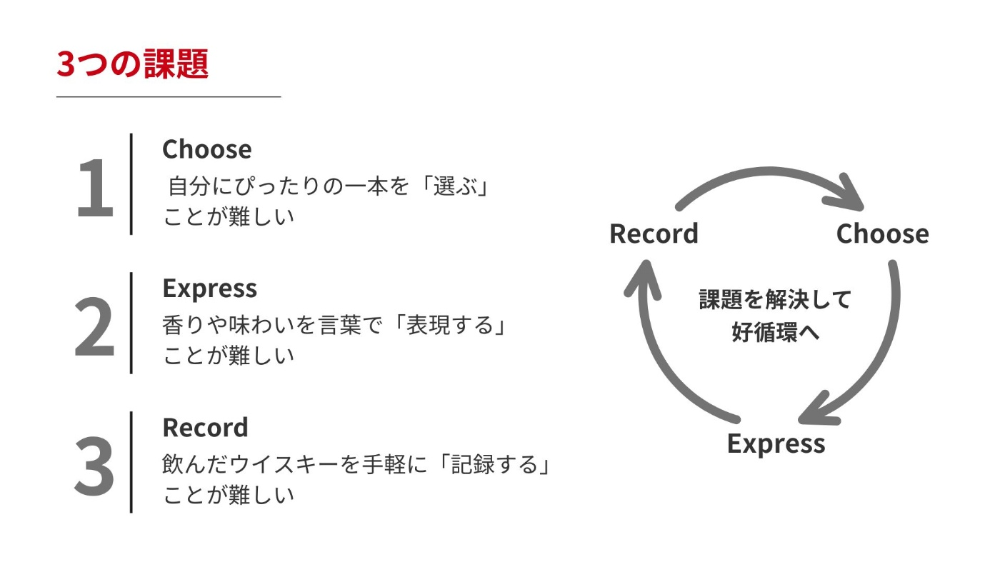_3つの課題_

###  3\. Whisky AI Bartender - AIがあなたのウイスキー体験をパーソナライズ

「選ぶ・表現する・記録する」という3つの課題を解決するために、**Whisky AI Bartender** は生まれました。**Whisky AI Bartender** は、おすすめのウイスキーを提案、テイスティングノート作成をサポート、写真を撮るだけで記録など、ウイスキーに関するあらゆる体験を、より深く・楽しいものへと導きます。

これらの体験は単体のAIではなく、専門的な役割を持つエージェントたちが連携して創りあげます。ユーザーからのリクエストに応じて最適なエージェントが応答し、時には複数のエージェントが協力することで、課題解決を目指します。

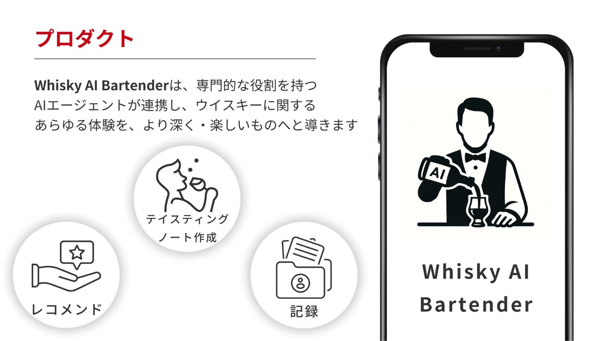_Whisky AI Bartenderとは_

####  【3つの課題を解決するエージェント】

**「選ぶ」を解決：レコメンドエージェント**  
「ウイスキーは初めてで、飲みやすいものから試したい」、そんなあなたの気分や好みを丁寧に聞き取ります。さらに、あなたが過去に記録したウイスキーの情報や、他のユーザーの記録・評価なども参考に、膨大な選択肢の中から提案します。使うほどにあなたの好みを学習し、提案の精度も向上していきます。

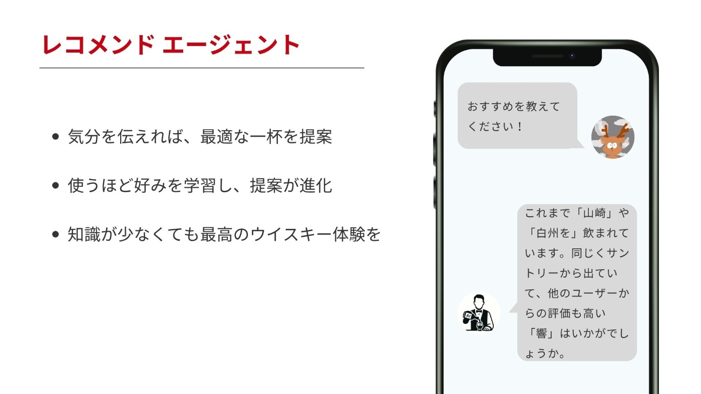_レコメンドエージェントのイメージ_

**「表現する」を解決：テイスティングエージェント**  
「この香り、何かに似ているけど言葉にできない…」そんな時もご安心ください。香り・味わい・余韻といった基本的な表現を提案します。それを元に自由に加筆・修正すれば、あなただけのオリジナルテイスティングノートが完成します。

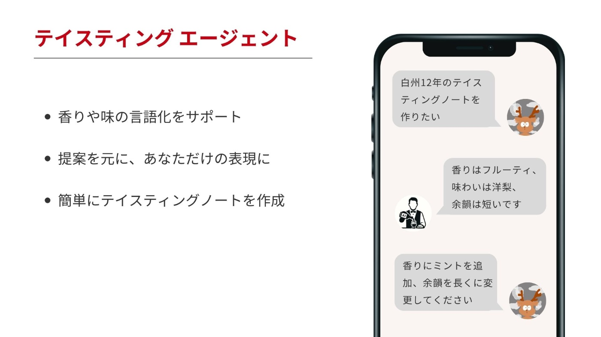_テイスティングエージェントのイメージ_

**「記録する」を解決：スキャンエージェント**  
飲んだウイスキーのボトルを写真を撮るだけで記録は完了です。ボトルから銘柄名、蒸溜所、熟成年数などを自動で読み取り、あなただけのウイスキー棚に保存します。もちろん、ウイスキーの情報と合わせてテイスティングノートを保存することも可能です。

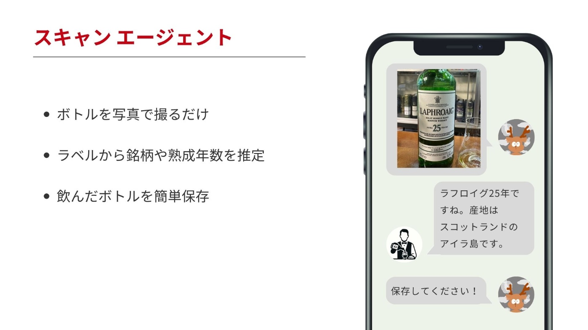_スキャンエージェントのイメージ_

**Whisky AI Bartender** は、選びやすさ、表現の楽しさ、記録のしやすさを追求し、あなたのウイスキー体験をパーソナライズします。

###  4\. アーキテクチャー - Whisky AI Bartenderを構成する技術

**「Whisky AI Bartender」** が提供する体験は、複数のGoogle Cloudサービスによって実現されています。ユーザーとの対話を受け付けるフロントエンド、生成AIを活用して応答を生成するバックエンド、そして迅速な機能改善を自動化するCI/CDパイプラインまで、シームレスに連携しています。

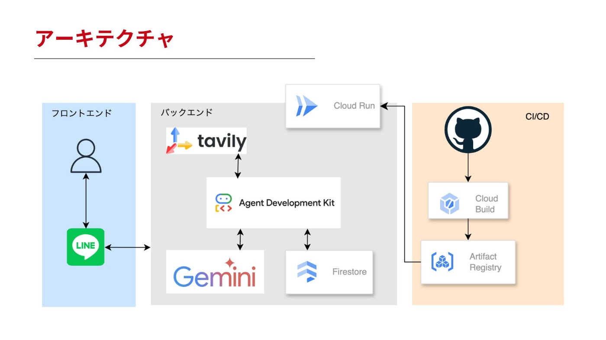_全体アーキテクチャ_

####  【Google Cloudのサービス】

**AI Development Kit (エージェントツール)**  
複数のAIエージェントを効率的に連携させ、複雑な対話フローを管理するために用いています。これにより、ユーザーの意図に応じて最適なエージェントを呼び出す、高度なマルチエージェントシステムを構築しました。ルートエージェントが全体の管理・制御を行い、サブエージェントがツールを使いながら各機能を担当をしています。上記で紹介したエージェント以外にもニュースを届けてくれるニュースエージェントや、過去保存したウイスキーの振り返りができるルックバックエージェントなどが包括的なウイスキー体験をサポートします。

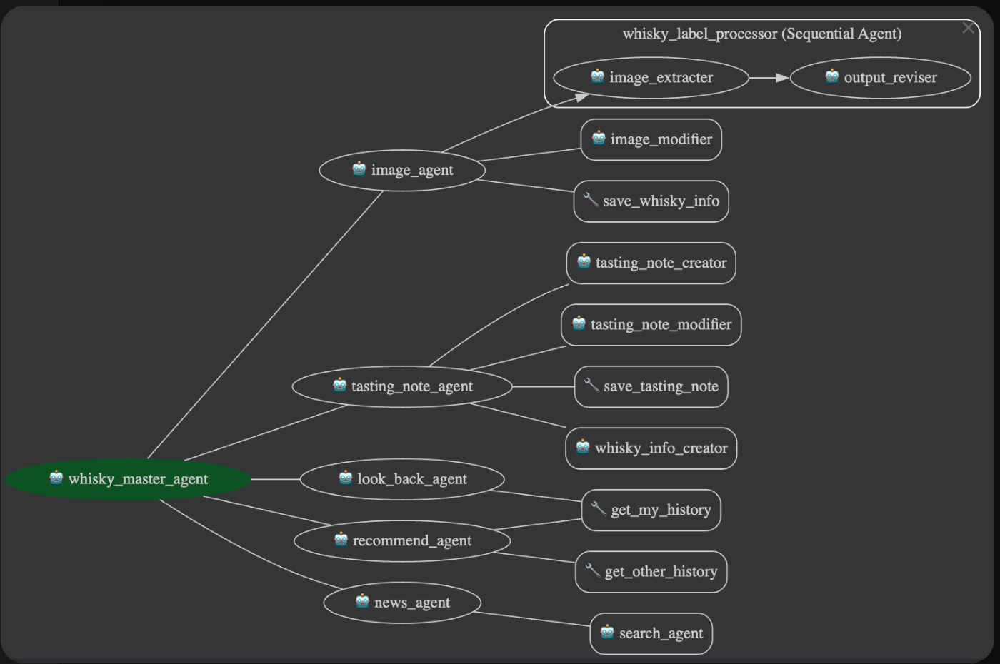_エージェントアーキテクチャ_

**Gemini API in Vertex AI (生成AI)**  
各エージェントの高度なAI機能を実現するために用いています。チャットサービスという特性からレスポンスが速いこと (&高精度) が求められるため、gemini 2.5 flashを用いています。

**Cloud Firestore (データストア)**  
ユーザーの利用履歴や好みを安全に記録し、使うほどにパーソナルな体験を提供するために用いてます。リアルタイムでデータが同期されるため、最新の情報を提供します。

**Cloud Run (サーバーレス実行環境)**  
ユーザーからのリクエストを処理するAPIサーバーの実行環境として用いています。サーバー管理不要で、アクセスに応じて自動でスケールするため、安定してサービスを運用できます。

####  【その他のサービス】

**Tavily API (Web検索)**  
ウイスキーニュースの検索にはTavily APIを利用しています。

**LINE (フロントエンド)**  
ユーザーとの接点には、日常的に使われているLINEを用いています。LINEの公式アカウントを追加いただくだけで、誰もが手軽にパーソナルなウイスキー体験を始めることができます。また下記のようなプッシュ通知を送ることで、ユーザーとの接点を増やしています。

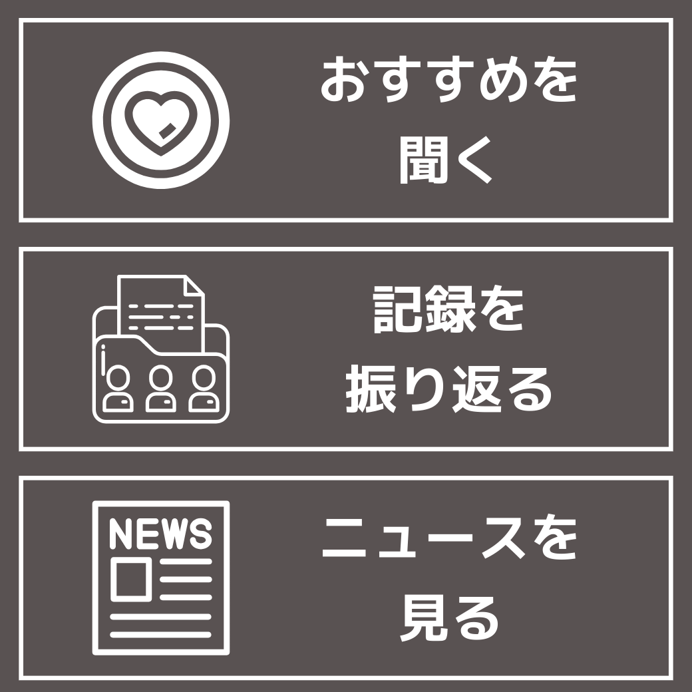_プッシュ通知_

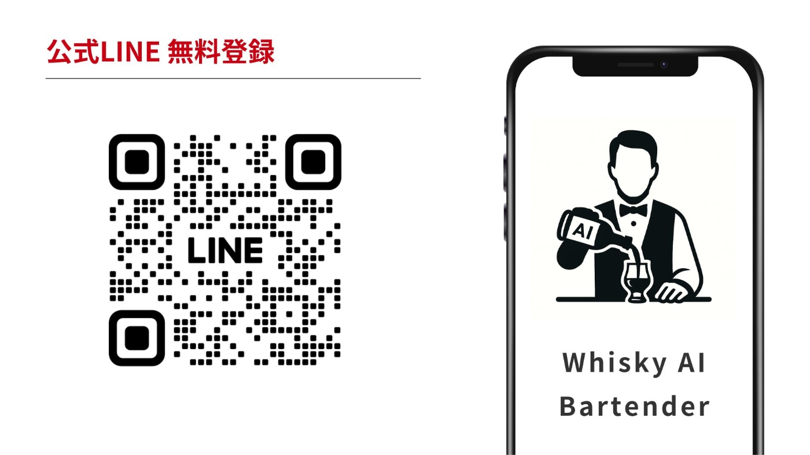_LINE 公式アカウント  
(<https://line.me/R/ti/p/@862yjeqj>)_

###  5\. 開発における3つの工夫

わくわくするウイスキー体験を届けるため、3つの工夫をしています。

  1. **拡張性の高い「マルチエージェント設計」**  
司令塔となるAIが、専門機能を持つサブエージェント群にタスクを委ねることで、複雑なご要望にも的確にお応えしながら、将来の機能追加も容易な、拡張性の高いシステムを実現しました。

  2. **価値が好循環する「ウイスキーデータベース」**  
全ユーザーの記録や感想が、自他のレコメンド精度をさらに向上させる大きな力となります。ひとつの体験がデータとなり、次の優れた体験を生み出していく「好循環」を実現します。

  3. **保守・運用が容易な「LINE × CI/CD」**  
誰もが使い慣れたLINEで手軽な体験を提供しつつ、裏側ではCI/CDパイプラインによって迅速な機能改善を両立させています。

###  6\. おわりに - AIと共に、ウイスキー探求の新たな旅へ

**Whisky AI Bartender** は、ウイスキー体験における「選ぶ・表現する・記録する」という壁を取りはらい、あなたと共に成長するパートナーです。

今後は、バーとの連携機能や、ウイスキーに対するテイスティングノートや評価をユーザー間で共有できる機能などで、ウイスキー体験をさらに広げ、日本のウイスキー文化を盛り上げていきたいと思っています。

このハッカソンが、その大きな一歩です。**Whisky AI Bartender** が、あなたのウイスキーライフを、より身近で、豊かで、エキサイティングなものへと変えていきます。

最後に好きな言葉で締めたいと思います。読んでいただき、ありがとうございました。

> やってみなはれ。やらな、わからしまへんで  
>  鳥井信治郎 (サントリー創業者)

!

この記事はgemini 2.5proと一緒に創り上げました。
