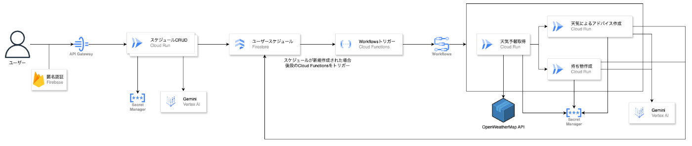
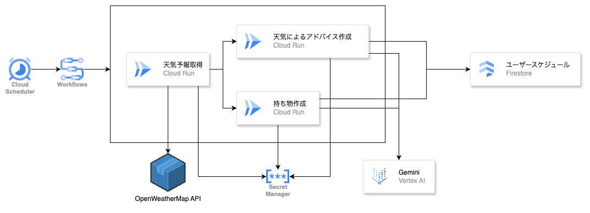
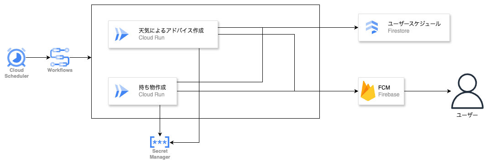

#  はじめに： 準備って、もっとスマートでいい。

「ミライフ、明日の予定って何だっけ？」  
「午前はオンライン会議、午後は吉祥寺のカフェ打ち合わせですね。雨が降る予報なので、折りたたみ傘をどうぞ」  
「ありがとう！あと、時間ありそうだし、どこか寄り道できそうな場所ある？」  
「井の頭公園の紫陽花が見頃のようです。雨の日限定の静けさ、体験してみませんか？」  
「じゃあそれで予定を追加しておいて」

――そんな、ちょっと先の未来のような会話。  
AIが自分のことを理解し、そっと寄り添ってくれる暮らしが、今少しずつ現実になろうとしています。

今回私たちが作成したアプリ「ミライフ」は、**未来 × ライフ** をテーマに生まれたAIエージェントです。

どれだけ文明が発展しても私たちは「準備」することからは逃れられません。その**準備をもっとスマートにする** ために、スケジュールを登録するだけで、**持ち物・天気・楽しみ方** まで考えてくれる、**あなた専属の秘書** のような存在としてこのアプリを開発しました。

#  デモ動画

<https://youtu.be/h79oYjj8BQQ>

#  I. 課題・ユーザー像・ソリューション

##  課題

  * スケジュール登録はしているが、持ち物や準備が後回しになりがち
  * そもそも毎回スケジュール登録をするのが面倒
  * 天気をあらかじめ調べないため急な雨で困ることがある
  * 天気が変わっても、行動のリスク回避や代替案を考えるのが面倒

##  対象ユーザー

  * 多忙な社会人や学生
  * 遊びや外出の準備に抜け漏れがある人
  * 天候や環境に応じたちょっとしたアドバイスが知りたい人

##  ソリューション

###  会話から簡単にスケジュール登録

忙しい人ほどスケジュール登録は大切ですが、忙しいからこそ予定を自分で入力することが難しい、そんな人のために自然言語でスケジュール登録を可能にすることでその面倒さを解決しました。

「明日15時に新橋オフィスで会議」というような自然言語を入力すると後の煩雑な処理はAIがやってくれます。

また、  
友達「今週末1泊2日で軽井沢に行かない？」  
自分「いいね！何時に集合する？」  
友達「じゃあ東京駅に10時に集合で！」

このような会話から直接スケジュール登録をすることができます。

自分で細かく入力する必要がなくなることで、スケジュール管理がより簡単に身近になることでしょう。

###  スケジュールを登録するだけで、持ち物チェックリストを自動生成

スケジュールを追加しても、準備に何が必要なのかを考えることは面倒です。そこでスケジュールを登録後、AIが持ち物チェックリストを自動生成することでその面倒さを解決しました。

もちろんスケジュール準備に必要な日数も考慮してAIが持ち物チェックリストを自動生成するので、「何が必要だっけ」と考える煩雑さからも解放されます。プッシュ通知も適切なタイミングで行われるので忘れる心配もありません。

###  天気を取得して注意点・楽しみ方を提案

天気が変わった時のための準備もしておきたいがあらかじめ調べるのが面倒、そんな人のためにAIが自動で天気を取得して注意点や楽しみ方を提案するようにしました。

たとえば、、、

  * 「週末のピクニック」には、晴れならレジャーシート＋トランプ、雨なら近場のカフェプランを提案
  * 「仕事の出張」には、バッテリー・USBケーブル・折りたたみ傘などの持ち物を天気と期間からリコメンド

ついつい折り畳み傘などは忘れがちですが、AIがあらかじめ「午後からは雨なので折り畳み傘を忘れないように」などといったアドバイスをくれるので、自分で調べて準備をする煩雑さから解放されます。

#  II. 実装機能

##  機能一覧

ミライフの機能は以下です。

  * スケジュール登録・更新・取得・削除
  * 自然文からスケジュール生成
  * メッセージアプリからメッセージを取り込み、自然文からスケジュール生成の機能に登録
  * スケジュールに応じた持ち物自動生成（準備日数も考慮）
  * 天気に応じたアドバイスを生成（注意点＋楽しみ方）
  * 準備期日が迫った持ち物と直近のスケジュールのプッシュ通知
  * AIとのチャット相談及び予定の確認、相談内容に応じたスケジュール登録

#  III. システム構成

  
**拡張性** （ユーザー数やイベント件数が増えても耐えうるスケールアウト設計）と**リアルタイム性** （スケジュール登録直後の応答性、日次での自動更新）を重視して、上記のGoogle Cloudのフルマネージドなサーバレス構成を活用したアーキテクチャで設計しました。

####  API Gateway ＋ Firebaseの匿名認証でセキュアなアクセス制御

モバイルアプリからのリクエストはすべて API Gateway 経由で受け付け、リクエストヘッダーの **Firebase Token** により**匿名ユーザー認証** を行っています。これにより、個人情報を保持せずともユーザーごとのデータ分離が実現でき、初回起動からストレスのない利用が可能です。

####  スケジュールのCRUDはCloud Runで構築

API Gatewayの先に配置された**Cloud Run** により、スケジュールの登録・更新・取得・削除（CRUD）を担います。これらの操作結果はすべて**Firestore** に保存され、ユーザーごとのコレクションにスケジュールドキュメントとして記録されます。  
また、自然文を入力すると、Geminiが日時や場所を抽出し、スケジュール化します。

####  スケジュール登録後は即座にAIが自動生成

スケジュールが新規作成されると、Firestoreのイベント通知により Cloud Functions が起動し、以下の非同期ワークフローを呼び出します：

スケジュール生成ワークフロー（Cloud Workflows）  
Step 1: 対象スケジュールの場所と日付から、天気予報をAPIで取得  
Step 2: 並行して、Cloud Run でGeminiに以下を指示：  
持ち物の自動生成し（準備日数も含む）、生成結果を Firestore に書き戻し  
天気に応じたアドバイスを生成し（注意点＋楽しみ方）、生成結果を Firestore に書き戻し

ワークフローとCloud Runの連携により、1件ずつ処理しつつもスケーラブルな非同期処理を実現しています。

###  不測の事態に対応するための定期更新

  
スケジュール登録時だけでなく、イベント日が近づいたスケジュールに対しては、同じワークフローを日次で再実行します。

天気予報は最新のものに更新され、Geminiからの持ち物提案やアドバイスもアップデートされるため、イベント当日まで安心して準備ができます。

これにより、「計画したけど状況が変わった」という**不測の事態** にも自然に対応できます。

###  リマインダー通知

  
さらに別のワークフローでは、日次バッチとして以下の項目を通知します：

  * 持ち物の準備が必要な期日が今日を含むスケジュール
  * 開催日が近いスケジュール（通知を希望した場合のみ）

これらを Firestore 上で抽出し、**Firebase Cloud Messaging（FCM）** を使ってユーザーに通知を送ります。  
処理は**Cloud Run** で実行され、各ユーザーのデバイストークンへ配信します。  
トークンの無効化判定やエラー処理も組み込んでいます。

###  デプロイはCloud Build × GitHubで自動化

  
開発中のコードは GitHub リポジトリ上で管理されており、mainブランチへのマージをトリガーに Cloud Build が自動で以下を実行します：

  * Docker Image をビルド
  * Container Registry へプッシュ
  * Cloud Run の該当サービスへ自動デプロイ

これにより、CI/CDの整備も最小構成で高速化されており、ハッカソン期間中の開発・改善サイクルに大きく貢献しました。

#  IV. 技術的チャレンジと工夫

##  フロントエンド

ミライフのフロントエンドはFlutterで構築しています。

###  説明なしで直感的に使えるUX設計

まず**ユーザーが説明書なしで自然に操作できる** ということにこだわってデザインしました。

例えば、スケジュール画面では左右スワイプで前日・次の日にサクサク移動可能。予定はスライド操作で削除できるなど、**スマホらしい自然な操作** に対応しています。

日付や時刻の入力は、iPhoneの標準のカレンダーアプリを参考に、日付の選択はカレンダーで、時刻の入力は縦スクロール型ピッカーで行えるようにカスタムウィジェットを作成しました。これにより、日付や時刻をスムーズに選べる体験を提供しています。

トップページでは、「今日やるべきこと」がひと目でわかる構成にしました。今日の予定と、今日準備が必要な持ち物が並んで表示され、**とりあえずミライフを開けば今日何をしないといけないのかがわかる** ようにしています。

###  親しみやすいアプリデザイン

テーマカラーやキャラクターアイコンを自由に選べるようにすることで、ユーザーが自分らしく使える親しみやすさも実現しています。

###  極限まで予定追加を楽に

今回、肝となるのが予定の追加なので、予定の追加機能を極限まで楽にするということに気を配りました。  
そこで、まず**自然言語** で予定を追加できるようにするということを考えました。つまり、「明日15時から渋谷駅近くのオフィスで会議」とだけ入力すれば、AIが自動で日時、場所の入力をしてくれるというものです。もちろん手動での入力も可能で、あくまでユーザーの好みに寄り添った使い方ができるようにしています。

また、友達とメッセージをしている最中に決まった予定をそのまま追加できるように、LINEなどのメッセージアプリとの連携にも対応しています。**共有機能** を活用し、受け取ったメッセージをそのままアプリに共有することで、自然文から予定を生成してスケジュールに登録することができます。

複雑な操作をせずに**共有** だけで予定登録できる体験は、実際に今回のハッカソンのテストのために多くの予定を追加しましたが、かなり楽だったのでお気に入りの機能です。

一つのメッセージだけでなく複数メッセージ選択して共有することもでき、前後のコンテキストに沿った予定追加ができるようになっています。

###  どこからでもAIに質問可能

将来的にAIに相談しながら予定の追加や予定の確認ができると良いと思い、チャットボットをどこからでも呼び出せるようにしました。また、過去のコンテキストも保持しているので、会話の流れに沿った相談が可能です。

「今日の予定を確認」や「明日の予定を確認」などのよくある質問に関してはボタンひとつで対応できるようにあらかじめ選択肢も表示してあります。

##  バックエンド

###  生成AIを「組み合わせて使う」多段設計

ただ1つのプロンプトで終わるのではなく、「持ち物」「天気別の注意点」「その日の楽しみ方」まで、**目的別にプロンプトを切り出し、複数のGemini呼び出しを非同期並列処理** で実装しました。  
生成結果は正規表現で**JSON整形・抽出を安定化** し、FireStoreに即反映しています。

**Gemini（生成） → 正規化処理 → Firestoreに格納** という流れをWorkflows + Cloud Runで構成することで、**拡張性と精度** を両立しました。

###  スケーラブル × サーバレスなアーキテクチャ

ミライフでは**Firestoreにスケジュールデータを集中管理** し、**Cloud Functions や Workflows から直接参照・更新** しています。インフラの管理は不要で、イベントベースで自動処理が走る構成サーバレスな構成を意識しました。

また、通知機能は **Cloud Scheduler で定期実行をトリガーし、Cloud Run で処理 → FCM 経由で配信** 、という流れで構成。アクセスが増えても自動でスケールするため、ユーザー数が多くなっても安定して動作します。

ユーザーが意識しなくても、AIが「何をすべきか」を先回りして教えてくれる、安心感があるアーキテクチャにしました。

###  限られた実行コストで「ちゃんと動く」AI体験を

生成AIはあくまで「魔法」ではなく「道具」ということを意識し、ミライフでは、**AI処理は必要な時だけ呼び出す設計** を徹底しました。

  * 初回登録時 or スケジュール直前の日次更新時にのみ Gemini・天気APIを実行
  * 生成結果は Firestore に保存・再利用し、**無駄な再生成を防止**
  * Cloud Run 中心の構成で **並列性と従量課金のバランス** を確保

ハッカソンであっても「作って終わり」ではなく、「継続利用できる設計」にこだわりました。

#  あとがき

「明日何を準備しないといけないんだっけ」や「来週の旅行では何が必要なんだっけ」「今週末の旅行先の天気はどうだろうか」などは考えるだけでも面倒です。

そこで、**準備って、もっとスマートでいい。** をキャッチコピーとして、誰もが煩雑な思考から解放された状態でその日を楽しめる「思考の省エネな暮らし」を目指すことにしました。

そのための第一歩として、まずはスケジュールを簡単に登録できて、持ち物チェックリストが一瞬で揃い、何も意識しなくても良いタイミングで通知が行われて──そんなアプリが作成できればと思い開発しました。

少しでもAI を**便利** から**相棒** と呼べる存在にできていれば嬉しいです。
