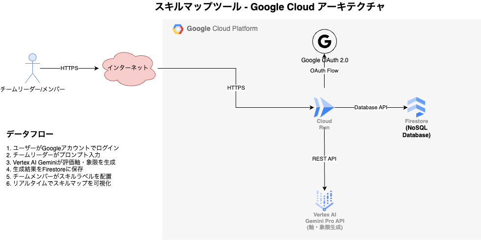

##  はじめに

####  プロジェクト概要

昨今、ビジネス環境の変化は目まぐるしく、組織にとってメンバーのスキルを正確に把握し、戦略的に育成していくことは、競争力を維持・向上させる上で不可欠となっています。しかし、多くの企業では、スキルの可視化やマップ作成に手間がかかり、メンバー間での相互理解が難しいという課題に直面しています。  
本記事では、Google Cloudの最先端AI技術であるVertex AIを核とした、新しいスキルマップ作成ツールについてご紹介します。このツールは、個人のスキルを効率的に抽出し、組織全体のスキル状況を可視化することで、人材育成の最適化と事業成長をサポートします。

####  対象ユーザーと課題

本プロジェクトが対象とするユーザーは、主に以下のような課題を抱える企業のマネージャー、人事担当者、そしてメンバー個人です。

  * **マネージャー/人事担当者:**
    * チームや部門全体のスキル構成が不明瞭で、プロジェクトのアサインや人員配置に迷いが生じる。
    * 従業員個々の強みや弱みを正確に把握しきれておらず、効果的な育成計画が立てられない。
    * スキルの棚卸し作業に膨大な時間と労力がかかり、最新の情報を維持するのが難しい。
    * 将来必要となるスキルセットを特定し、それに向けて組織全体を戦略的に育成するロードマップが描けない。
    * OJTや研修の効果を客観的に評価する指標がない。
  * **メンバー個人:**
    * 自身のスキルが客観的にどう評価されているか分からず、キャリアパスが見えにくい。
    * どのようなスキルを習得すれば市場価値が高まるのか、具体的な指針がない。
    * 自身の学習履歴や成果が適切に評価に反映されているか不安を感じる。

####  課題へのソリューション

これらの課題に対し、当ツールはVertex AIを活用し、以下のようなソリューションを提供します。

  1. **プロンプトからの評価軸の自動生成:**
     * ユーザーが入力したプロンプト（例：「リーダーシップスキルと技術スキルのスキルマップを作成したい」）に基づき、AIがスキルマップの縦軸、横軸、および各象限（四分割）の評価軸（例: 「技術力 - 高い/低い」「リーダーシップ - 高い/低い」など）を自動で生成します。これにより、スキルマップの設計初期段階における思考と構築の負荷を大幅に軽減します。
  2. **スキルマッピングの支援:**
     * 生成された評価軸に対して、ユーザー自身が保有スキルや従業員のスキルをマッピングする作業を支援します。直感的なインターフェースを通じて、効率的にスキルを配置できるようデザインされています。
  3. **直感的なUIとUX:**
     * スキルマップの可視化ダッシュボードは、誰にでも分かりやすいデザインで、必要な情報を素早く、かつ的確に把握できます。

####  ツールの特徴

当ツールの最大の特徴は、以下の点に集約されます。

  1. **AI駆動の軸生成:** Vertex AIにより、複雑なスキルマップの評価軸の設計を自動化し、手作業による負担を劇的に軽減します。
  2. **高精度な軸生成:** ユーザーの意図を汲み取り、文脈を理解した上で、実用的な評価軸を生成する高い精度を実現します。
  3. **スケーラビリティと柔軟性:** Google Cloudのインフラストラクチャ上で構築されているため、大規模な組織にも対応可能であり、ビジネス要件の変化に合わせて柔軟に機能を拡張できます。

##  システムアーキテクチャ

####  システム アーキテクチャ図

**【技術スタック】**

  * **フレームワーク:** Next.js 15 (App Router)
  * **言語:** TypeScript
  * **スタイリング:** Tailwind CSS
  * **UI コンポーネント:** Radix UI
  * **認証:** NextAuth.js (Google OAuth)
  * **アニメーション:** Framer Motion
  * **AI:** Google Vertex AI (Gemini 1.5 Flash)

##  プロジェクトデモ

<https://youtu.be/50kjhSAqK04>

##  Vertex AIを活用した詳細な実装解説

このセクションでは、Vertex AIが具体的にどのように本ツールに活用されているかを、技術的な側面から掘り下げて解説します。

  1. **評価軸の生成と生成AI**

  * **入力プロンプトの解析:**
    * ユーザーが入力したスキルマップのテーマに関する自然言語のプロンプトを解析します。
  * **Vertex AI Generative AIの活用:**
    * 解析されたプロンプトを基に、Vertex AIの強力な生成AIモデル（例: Geminiモデル）を呼び出します。
    * プロンプトエンジニアリングによって、モデルがスキルマップの縦軸、横軸の名称、および各四象限の評価軸（例: 「実践レベル」「学習意欲」など）を生成するように指示します。
    * モデルは、入力されたテーマに関連する一般的なスキル評価軸や、創造的な視点を取り入れた軸を提案します。
  * **出力の構造化:**
    * 生成された軸の名称や説明が、JSONなどの構造化された形式で返されるようにプロンプトを設計します。これにより、フロントエンドでの表示や後続の処理が容易になります。

  2. **（現状ユーザー作業）スキルマッピングとデータ管理**

  * **UIによるマッピング:**
    * 生成された軸が描画されたUI上で、ユーザーが手動でスキル項目（例: 「Python」「コミュニケーション能力」）を作成し、それらのスキルを該当する象限に配置する操作をサポートします。

  3. **モデルの運用と改善**

  * **Vertex AI Pipelines:**
    * 必要に応じて、生成AIモデルのファインチューニングや、プロンプトのバージョン管理、効果測定などのワークフローを自動化するために活用できます。
  * **Vertex AI Model Registry:**
    * 生成AIモデルやプロンプトテンプレートのバージョン管理を一元化し、効果的なデプロイをサポートします。
  * **継続的な改善:**
    * ユーザーからのフィードバック（生成された軸の有用性など）を収集し、生成AIモデルのプロンプトやファインチューニングデータを改善することで、軸生成の精度とユーザー満足度を継続的に向上させます。

##  まとめと今後の展望

本記事では、Vertex AIを活用したスキルマップ作成ツールのコンセプト、解決する課題、システムアーキテクチャ、そして具体的なAI実装の詳細についてご紹介しました。このツールは、AIの力を借りて、これまで時間と労力がかかっていたスキルマップの軸設計を劇的に効率化し、組織の人材戦略をデータに基づいて推進することを可能にします。

####  このツールがもたらす価値

  * **スキルマップ設計の迅速化:** AIによる軸生成で、マップ作成の初期フェーズを大幅に短縮。
  * **多角的な視点:** AIが提案する様々な軸の組み合わせで、スキルの多角的な評価を促進。
  * **直感的な可視化:** ユーザー自身がスキルをマッピングする過程で、スキルの全体像を深く理解。

####  今後の展望

このツールはまだ進化の途上にあり、将来的にはさらなるAIの活用と自動化を目指します。  
今後は以下のような機能拡張を検討しています。

  1. **スキル見分けアンケートの自動生成:**
     * 生成された評価軸に基づき、メンバーが自身のスキルを見分けられるようなアンケート（例: 各軸に関する具体的な設問）をAIが自動で作成します。これにより、メンバーが客観的に自身のスキルを評価しやすくなります。
  2. **アンケート回答からのスキル抽出とマッピング:**
     * メンバーがアンケートに回答すると、その回答内容をVertex AIが解析し、個々のスキルを自動的に抽出し、適切なラベルを付与します。
     * さらに、抽出されたスキルを、事前に生成された評価軸上の適切な位置に自動でマッピングします。これにより、手動でのマッピング作業を大幅に削減し、より大規模かつ正確なスキルマップの構築が可能になります。
  3. **組織全体のスキル可視化とギャップ分析の自動化:**
     * 自動マッピングされたデータに基づき、組織全体のスキル分布をリアルタイムで可視化するダッシュボード機能（ヒートマップ、レーダーチャートなど）を拡充。
     * 目標スキルセットとのギャップをAIが分析し、具体的な育成プランや、不足スキルを補うための人材配置レコメンデーションまでを自動で行えるように進化させます。
  4. **継続的な学習と改善:**
     * アンケートの回答データやスキルマップの利用状況を基に、Vertex AIモデルが継続的に学習し、スキル認識・マッピングの精度をさらに向上させます。  
本ツールが、皆様の組織における人材戦略の推進と、各メンバーの成長に貢献できることを願っています。

##  おわりに

最後までお読みいただきありがとうございました。このテーマにご興味をお持ちいただけたなら幸いです。  
ご意見やご感想、ご質問などございましたら、ぜひコメントでお寄せください。
