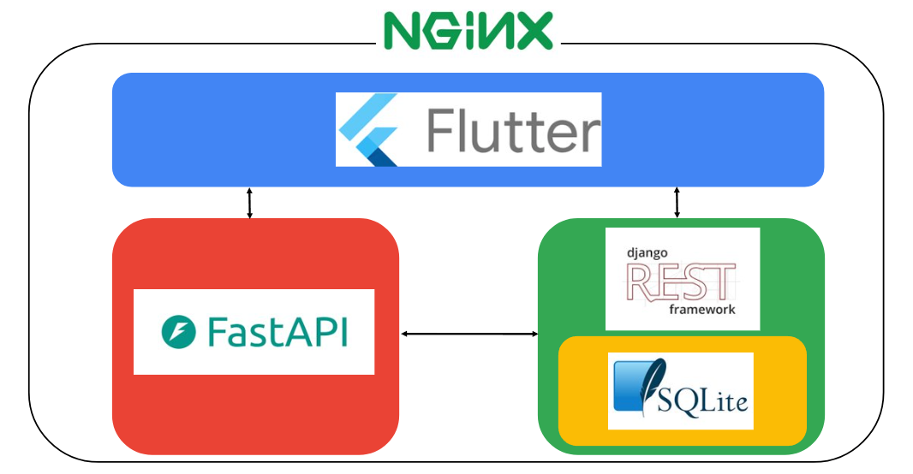
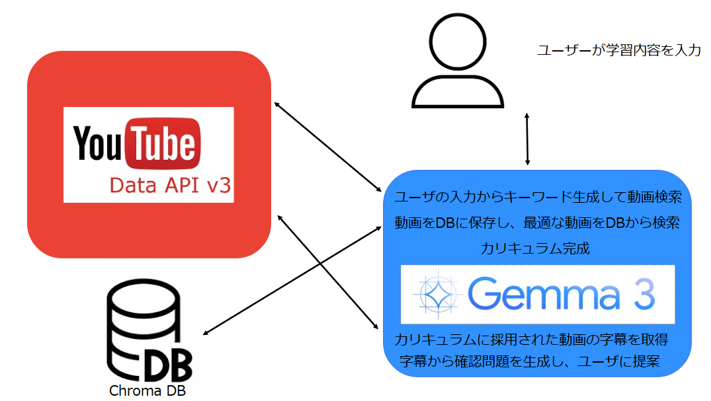

#  プロジェクト概要：YouTube × Gemma 学習支援アプリ

##  1\. はじめに

本記事は、第2回 AI Agent Hackathon with Google Cloudの参加を通じて開発したプロジェクトの成果報告です。

私たちのチームは、**インフラエンジニア1名とAIエンジニア3名** で構成されており、生成AIの活用と学習支援の可能性に着目したプロダクトの開発に取り組みました。

近年、YouTubeをはじめとする動画コンテンツの教育利用が広がる一方で、「どの動画をどう学ぶか」「学習内容の定着をどう測るか」といった課題が顕在化しています。

そこで私たちは、**Gemma（Google製の軽量生成AI）を活用し、YouTube動画から自動で学習カリキュラムと確認問題を生成するアプリケーション** を開発しました。

本記事では、プロジェクトの背景、開発内容、技術構成、得られた成果について詳しくご報告いたします。

##  2\. 対象ユーザー像

本プロジェクトが想定する主なユーザーは以下の通りです：

  * **自学自習を行う学生** （中高生〜大学生）
  * **特定のスキルを効率的に習得したい社会人**
  * **教育コンテンツを使って教材を作りたい教育者や講師**
  * **YouTube動画を活用して学びたいが、何から始めて良いかわからない学習者**

##  3\. ユーザーが抱える課題

  * YouTubeには学習に適した動画が数多くあるが、**学習順序や構成がバラバラ** で全体像が掴みにくい
  * 動画視聴後に知識が定着したか確認する手段がなく、**受け身の学習に留まりがち**
  * 動画の選定や整理に時間がかかり、**効率的な学習設計が困難**
  * 学習塾やプログラミングスクールなどのオフラインの塾は**非常に高価**
  * オンラインの場合でも**安価なサービス** はコンテンツが**不十分** 、コンテンツが**豊富** なサービスは**高価**

##  4\. 問題の明確さと解決策の有効性

上記の課題は、多くの自主学習者が直面する共通の悩みであり、「学ぶ意欲はあるが、何をどう学べばいいか分からない」という状態です。

本アプリケーションは、次の点でこの課題に対して明確かつ有効な解決策を提示します：

  * **明確な問題定義** ：リソースは豊富だが、整理されていない
  * **有効な解決策** ：Gemmaが自動で順序立ててカリキュラムと確認問題を作成し、学習の道筋と評価の手段を同時に提供

これにより、学習の迷いや非効率を最小限に抑え、**行動を開始しやすく、継続しやすい学習体験** を実現します。

##  5\. 課題へのソリューション：本アプリケーションの役割

本アプリケーションは、以下のようにユーザーの課題を解決します：

  1. **YouTube動画を選択するだけでGemmaが最適な学習カリキュラムを自動生成**
     * 動画の内容を解析し、前提知識やレベルに基づいた**順序立てた学習構成** を提示
  2. **各動画の内容に基づいた「確認問題」や「理解度チェック」を自動生成**
     * 見るだけで終わらせず、**能動的な復習・アウトプットが可能**
  3. **ユーザーの目的に合わせたカスタマイズ可能なカリキュラム**
     * 例：入門編、試験対策、短期集中などのテンプレートに合わせて最適化
  4. **安価でコンテンツ量が豊富なサービスを提供**
     * YouTubeというビッグデータを安価なサービスでうまく活用することで安価かつコンテンツ量が豊富なサービスを実現

##  6\. 既存類似サービスとの差別化

本アプリケーションは以下の点で既存類似サービスとの差別化を図ります

  1. **コンテンツの多様性**

     * YouTubeには多種多様なコンテンツ動画が存在するため、受験勉強からプログラミング学習、法律からファッションまで学習することができます。ここまで多種多様な学習プラットフォームは他に存在しません。
     * **YouTubeとの差別化**  
AIが自動で動画を検索し、学習に最適な視聴順序に並べてくれるため効果的に学習ができます。  
また、動画の内容を踏まえてAIが確認問題を生成するためすぐにアウトプットが可能です。(※動画によっては問題を生成できない場合があります)
  2. **価格**

     * 本アプリケーションにかかるコストはGoogle Compute Engineによるサーバー利用のみです。(YoTube Data APIとGemma3のAPIは無料)  
そのため、月額数百円もしくは広告収益での提供を可能にできます。  
現存の類似サービスだと安くても月額2000円以上が相場のため**価格** という観点で優位性を持つことができます

##  7\. アプリケーションの特徴

特徴 | 説明  
---|---  
🎓 学習構成自動化 | 動画内容を理解した上で、Gemmaが順序や分量を調整  
🧠 確認問題生成 | 各動画ごとに理解度チェック用の問題を提示  
🔍 YouTube活用 | 学習者に身近な無料リソース（YouTube）を最大限活用  
🧩 カスタマイズ性 | 学習目的に応じてカリキュラムを自由に調整可能  
📊 進捗トラッキング | 学習進度の可視化・モチベーション維持を支援  
  
##  8\. アプリケーション構成について

本アプリケーションは、Flutterによるフロントエンド、FastAPIおよびDjango REST framework（DRF）によるバックエンド、SQLiteによる軽量なデータストレージを用いた構成になっています。全体はNGINXをリバースプロキシとして統合管理しています。

以下は、全体構成図です。

* * *

###  フロントエンド：Flutter

ユーザーインターフェースはFlutterで実装されており、シンプルかつ直感的な操作性を提供します。必要に応じてwebに加えて、iOS・Androidなど複数のプラットフォームへの展開が可能な構成です。現在はWeb版として提供しています。Flutterからは、FastAPIおよびDRFに対してAPIリクエストを発行します。

* * *

###  バックエンド①：FastAPI

FastAPIは主に**推論や外部API連携を担う役割** を持っています。具体的には以下の処理を実装しています。

  * **YouTube API を活用した動画検索・字幕取得機能**  
テーマに関連する教育動画をYouTubeから検索し、字幕情報を取得することで教材として活用可能なデータを取得します。

  * **Gemma API を活用したカリキュラム自動生成システム**

本アプリでは、**Gemma API** を用いた言語モデルによって、ユーザーの入力テーマから自動的に**学習カリキュラム** と**クイズ問題** を生成します。

カリキュラム生成過程図  

####  🔍 ステップ①：ユーザーのテーマに基づいた関連動画の取得

  1. **ユーザーが学びたいテーマを入力**  
例：「AIの倫理」「量子コンピュータとは？」など

  2. **Gemmaがテーマから検索キーワードを生成**  
言語モデルにより自然で効果的なキーワードを抽出します。

  3. **Gemmaがテーマから検索キーワードを生成**  
動画の「タイトル」や「概要欄」を取得し、内容を**ベクトル化** して**ベクトルDB** に保存します。

####  🧠 ステップ②：類似動画の選定とカリキュラム構築

  4. **ベクトルDBから類似度の高い動画を抽出**  
ユーザーの目的に近い動画を10件自動で選出します。

  5. **Gemmaが動画の内容を分析し、視聴順を決定**  
理解しやすい順番に動画を並べ、最適な学習カリキュラムを提案します。

💡 このステップでは、ユーザーが増えるほどベクトルDBが充実し、  
キーワード抽出が不完全でも**高精度な推薦** が可能になります。

####  📝 ステップ③：動画内容に基づいたクイズ自動生成

  6. **YouTube APIで字幕情報を取得（対応動画のみ）**

  7. **Gemmaが字幕を元にクイズ問題を自動生成**  
動画視聴直後に取り組める**選択式クイズ** を生成し、アウトプット学習を促進します。

####  ✅ 本システムの特長まとめ

  * 🎯 ユーザーの目的に合った動画を自動で選定
  * 🧠 視聴順もGemmaが最適化し、効率的な学習体験を実現
  * ✏️ 字幕を活用してオリジナルのクイズを生成
  * 📈 利用者が増えるほど、システムはより賢くなる（ベクトルDB強化）

* * *

###  バックエンド②：Django REST framework（DRF）

DRFは、アプリケーション内の**データ管理やユーザーとのデータのやり取りを行う中核API** を提供しています。

  * JWT認証によるユーザ認証
  * カリキュラムやクイズデータのCRUD処理
  * Flutterから送信された学習結果やユーザーの進捗データの保存

また、データはSQLiteで管理されており、初期開発や軽量アプリケーションには十分な性能を発揮しています。

* * *

###  NGINX：ルーティングとリバースプロキシ

NGINXは、外部からのリクエストを適切にFlutter、FastAPI、DRFへルーティングする役割を果たします。HTTPS対応やCORS制御などもNGINX側で処理することで、アプリ全体のセキュリティとパフォーマンスを担保しています。

* * *

###  ✅ システム構成のポイント

本システムでは、**AI推論・外部API連携（FastAPI）**と、**データ管理・API基盤（Django REST Framework）**を明確に分離することで、責務が整理された拡張性の高いアーキテクチャを実現しています。

この構成により、以下の利点があります：

  * 🧩 Gemmaのモデル切り替えや機能追加が容易
  * 🔁 バックエンドのスケーラビリティ向上（負荷分散・並列処理など）
  * 🧪 実験・検証にも柔軟に対応可能

##  9\. 本システムがもたらす価値

本アプリケーションは、YouTubeという膨大な学習リソースを活用し、Gemmaによる自然言語処理で**最適な学習カリキュラムと確認問題** を自動生成します。

これにより、現代の学習者に対して以下のような**新しい学習体験** を提供します：

  * ❌ 学ぶべき順序が分からない → **「迷わない」**
  * ⏱ ムダな時間が多い → **「効率よく学べる」**
  * 🎯 習得できているかわからない → **「アウトプットで確認できる」**

###  デモ動画

<https://youtu.be/ufbpTiq-AxM>

###  アプリのURL

※7月半ばごろまで公開予定です  
<https://www.curriculummaker.dev/>

* * *

> 本記事に掲載されている各種ロゴ・サービス名称は、各プロジェクト・企業の商標または著作物です。
> 
>   * Flutter ロゴは Google のブランドガイドラインに基づき使用されています。
>   * Django REST Framework のロゴはオープンソースプロジェクトの紹介を目的として使用しています。
>   * FastAPI ロゴは公式プロジェクトの紹介目的で使用しています。
>   * NGINX ロゴは F5 社のガイドラインに従い、非営利技術紹介の目的で使用しています。
>   * SQLite はパブリックドメインであり、ロゴも紹介目的で使用しています。
>   * Gemma 3 は Google Research の提供するオープンな大規模言語モデルであり、本記事では技術検証および学習支援の目的で紹介しています。
>   * YouTube API v3 は Google の提供する公式APIであり、本記事では教育目的での機能紹介および利活用事例として取り上げています。
> 

> 
> 各ブランド・サービスの権利は、それぞれの正当な権利者に帰属します。
