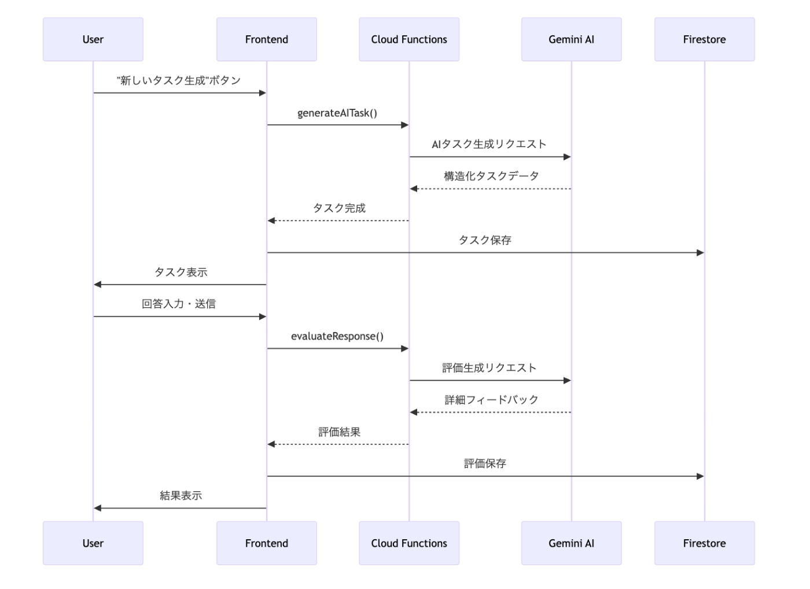
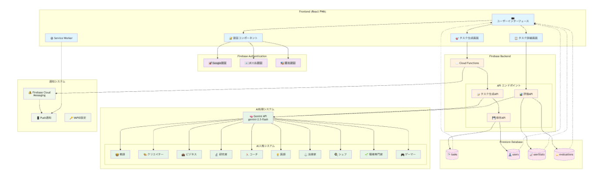
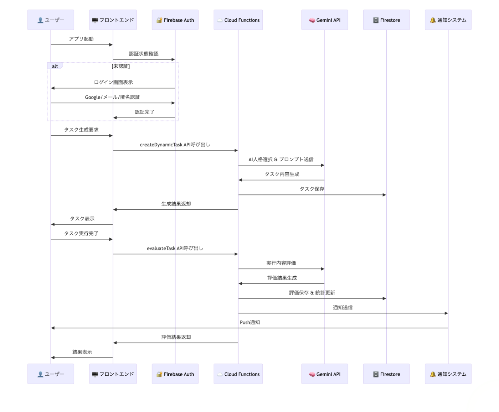
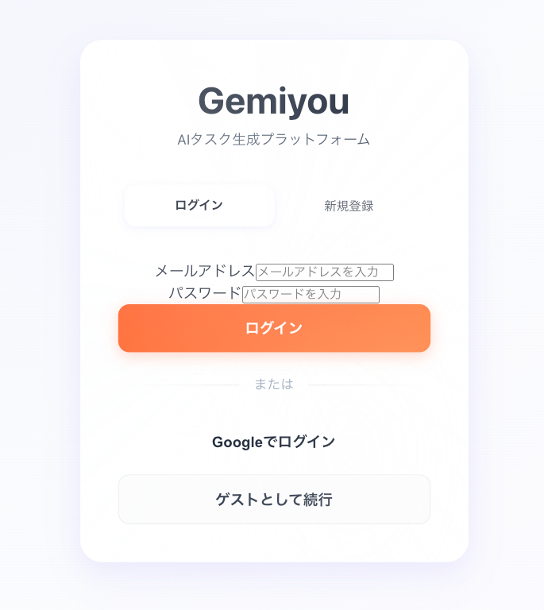
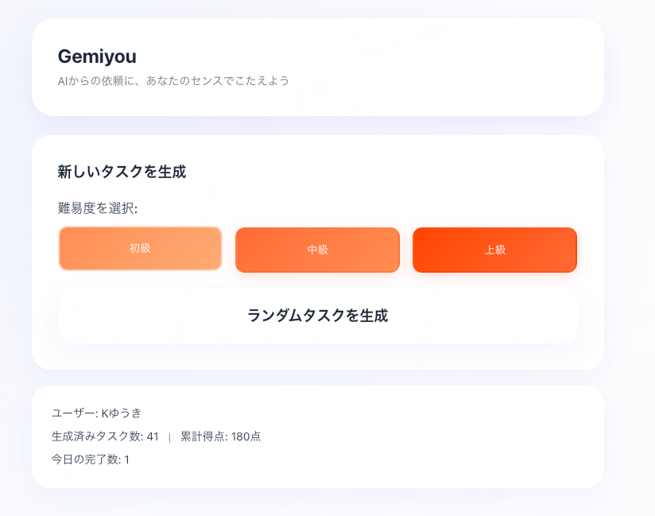
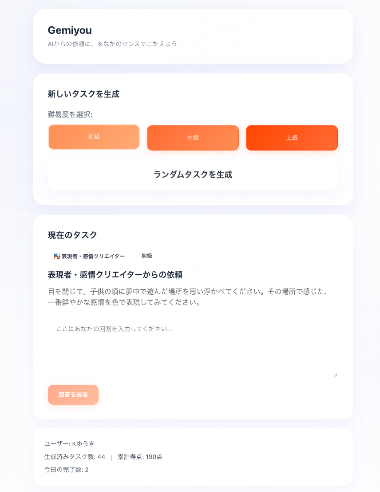
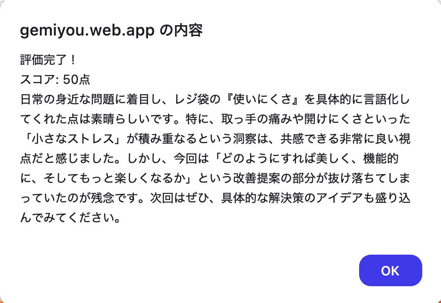
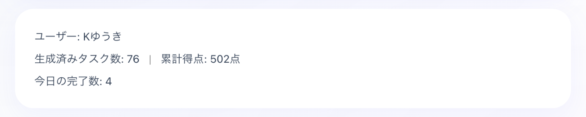

#  はじめに

**「AIが人間にタスクを依頼する」** という従来とは真逆のアプローチで開発したWebアプリケーション「**Gemiyou** 」について、技術的な実装から設計思想まで詳しく紹介します。

このプロジェクトは**第2回 AI Agent Hackathon with Google Cloud** での挑戦として開発しました。テーマである「AI Agent、創造の極みへ」に対して、**AIエージェントが人間にタスク依頼を行い評価し、経済価値を与える** という革新的なアプローチを考案しました。

通常のチャットボットは「人間がAIに質問・依頼する」形ですが、このアプリでは「AIが人間にクリエイティブなタスクを依頼し、人間がタスク実行し、AIが評価する」という言わばAIと人間の立場の逆転体験を提供しています。さらに**WorldID統合** により、AI時代における**Organic Intelligence（人間の創造性）の経済価値化** という未来的なコンセプトの構想を行いました。  
それに加え、AI依存による思考力の低下の自認、およびトレーニング的要素も兼ねています。  
AIが大好きな人から思考力の低下を感じている人、子供から大人まで楽しく使える設計になっており将来的にはこれで人間にしか出来ない仕事ができるのかも？しれません。

##  🎯 プロジェクト概要

###  コンセプト

  * **逆チャット体験** : AIが能動的にタスクを依頼
  * **創造性重視** : 3-25分で完結する創作・アイデアタスク
  * **１０のAI人格** : 専門特化した評価とフィードバック
  * **簡易登録** : Googleアカウント等でインスタント認証
  * **WorldCoin報酬** : 創造的タスク完了でWLD獲得（将来の構想）
  * **OI価値化** : Organic Intelligence（人間の創造性）の経済価値創出（将来の構想）

###  📝 技術スタック

以下のGoogle Cloud技術を活用して開発を行いました。  
使った事のない技術も結構あったので勉強になりました。

  * **Firebase Cloud Functions (Cloud Run functions)** : サーバーレス実行環境
  * **Google Cloud AI**
  * **Gemini API** : タスク生成・評価エンジン （Gemini２.5Flash APIを使用）
  * **Firebase Authentication** : ユーザー認証システム
  * **Firebase Firestore** : NoSQLデータベース
  * **Firebase Hosting** : Webアプリホスティング
  * **Firebase Cloud Messaging** : プッシュ通知システム
  * **React 18** : UIフレームワーク

今回のハッカソンに際し、もっと様々な技術、マルチモーダル・画像や音声の入力等も当初考えたのですが、こういった奇抜なコンセプトモデルの場合様々な機能を盛り込むと本来のコンセプトが薄れてしまう可能性が出てきます。  
もっと色々やりたい事はありましたがブレないよう、まずは本質を理解して貰うために最低限のサービスでコンテストに挑むことにしました。  
最新技術をあれこれ突っ込めば良いってものではなく、目的実現の為の最小構成こそ実現の近道だと思っています。  
個人的にはFirebaseは凄く気に入ったので、これとは並行して個人的に別のサービスを作成しました。  
それはまた、別にZennの記事にしようと思っています。

##  🎭 AI人格システム

###  設計理念

タスクの質と評価の専門性を高めるため、以下の10の特化型AI人格を実装しました。

###  人格別の専門分野

AI人格 | 専門領域 | 主なタスク  
---|---|---  
🎡 タケシ | アイデア発想 | ブレインストーミング、コンセプト開発  
📚 サクラ | 物語創作 | 小説執筆、キャラクター創造  
✍️ レン | コピーライティング | キャッチコピー、広告文作成  
🎨 ミオ | デザイン思考 | UI設計、ブランディング  
💡 ダイ | ライフハック | 生活改善、効率化アイデア  
🎪 ユウ | エンタメ | ゲーム企画、イベント案  
🔧 アキ | 問題解決 | 課題分析、解決案提案  
🌟 ハル | 表現力 | 詩作、感情表現、芸術的創作  
🧠 ミュウ | 知識統合 | 学習方法、情報整理、知識体系化  
🔮 モエ | 未来予測 | トレンド分析、イノベーション創出  
  
人格と専門領域あとは初級・中級・上級のレベルに合わせてAIが自動でタスクを生成します。

この専門領域等はGeminiと壁打ちをしながら練っていきました。  
また実装しながらトライアンドエラーで進めていくことで、様々な領域にわたって幅広くタスク生成出来るようになったと思います。

コードに関しては全てGithubにアップロードしているのでご確認ください。

<https://github.com/yuk1-kondo/Gemiyou>

##  🔄 アプリケーションフロー

###  1\. 初期化プロセス

###  2\. タスク生成から評価まで

##  全体システム構成図

##  主要なデータフロー

##  📱 プッシュ通知システム

###  FCM実装
    
    
    // notificationService.ts
    export class NotificationService {
      async requestPermission(): Promise<string | null> {
        const permission = await Notification.requestPermission();
        
        if (permission === 'granted') {
          const messaging = getMessaging();
          const token = await getToken(messaging, {
            vapidKey: process.env.REACT_APP_FIREBASE_VAPID_KEY
          });
          return token;
        }
        return null;
      }
    
      async scheduleTaskNotification(delay: number = 3600000) { // 1時間後
        setTimeout(async () => {
          if ('serviceWorker' in navigator && 'Notification' in window) {
            const registration = await navigator.serviceWorker.ready;
            registration.showNotification('新しいAIタスクが準備されました！', {
              body: 'クリエイティブな新しい挑戦が待っています',
              icon: '/logo192.png',
              badge: '/logo192.png',
              tag: 'gemiyou-task'
            });
          }
        }, delay);
      }
    }
    

プッシュ通知は実装済みですが、ブラウザ環境やモバイル端末（特にSafariのFCM非対応）により動作が制限される場合があります。なので今後はFlutter等でのネイティブアプリ化も検討しています。

##  🎨 UI/UXの工夫

###  リキッドグラスUIを意識

  
ログイン画面はGoogle認証を実装しています。  
他の認証システムの追加も可能。

  
タスク生成ボタンより、AIタスクを生成します。

  
タスクに対する回答を作成し、送信！

  
評価と点数が表示されます。

生成済みタスクと獲得得点から報酬を得られる仕組みを考案したいと考えています。  
タスク生成を沢山して獲得得点が低い場合は相対的に報酬単価も低くなるような設計にする事で、  
バランスが取れるのではないか？と考えています。  
また今回は実装しませんでしたが、あまりにも酷い回答の場合はマイナスになるような仕組みも良いかもしれません。

僕自身フロントエンドは苦手なのですが、見た目は大事！と言う事もあり、今回は流行りに乗ってリキッドグラスデザインを少し意識してみました。  
個人的には気に入っています。  
スマホ等のモバイルにも最適化しています。レスポンシブです。

##  デモ動画

<https://youtu.be/Ny9cTTJVohk>

デモ動画作成にあたりGoogleのText-to-Speech AIを活用しました。  
またBGMにはSunoAIを利用させていただきました。

##  革新的な報酬システム：World ID統合

今回のGemiyouは正直ユーザーが自律的にタスクをこなすのは不可能だと思っています。  
これは報酬モデルが無いからです。  
AIも報酬モデルがあることで良いスコア報酬を得るために強化学習が行われる訳でこれは人間も一緒ですね。  
そこで着目したのがWorldCoinを提唱しているWorldIDです。  
<https://world.org/ja-jp/world-id>  
実際私もユーザーなのですが本物の人間の証明が出来るWorldIDの技術を統合する事で人間がタスクを行う証明とWeb3のトークン報酬を渡す事で実現出来ると考えています。

##  まとめ

「Gemiyou」は従来のChatAIインタラクションを逆転させることで、新しいクリエイティブ体験の創出の為に考案しました。そして**World ID統合による報酬システム** により、AI時代における**Organic Intelligence（OI）の経済価値** を具現化する世界初のプラットフォームを目指しています。

如何に人間は創造的タスク・思考タスクを苦手としているか。  
AIを利用するようになり、どれだけ自分の思考力が落ちたのか。  
AIの強みがどこにあるのか？

そういった部分をGemiyouを通して理解して頂けると嬉しく思っています。  
また自身の思考力・想像力のトレーニングにも最適です。

作りながらも「何の役に立つんだ？」と自問する日々もありましたが、**誰もやったことがない発想・プロダクトほど楽しいものはありません** 。前例のないコンセプトを形にできたことは、非常に有意義な体験でした。

素晴らしい機会を提供いただいた**Zenn・Google Cloud** 、そして**第2回 AI Agent Hackathon** の運営の皆様に心より感謝いたします。  
ありがとうございました！

<https://gemiyou.web.app>

* * *

🔗 **プロジェクトリンク**

  * [App](https://gemiyou.web.app) \- 誰でも実際にお試しいただけます
  * [GitHub ](https://github.com/yuk1-kondo/Gemiyou)
  * [Youtube](https://youtu.be/Ny9cTTJVohk)

