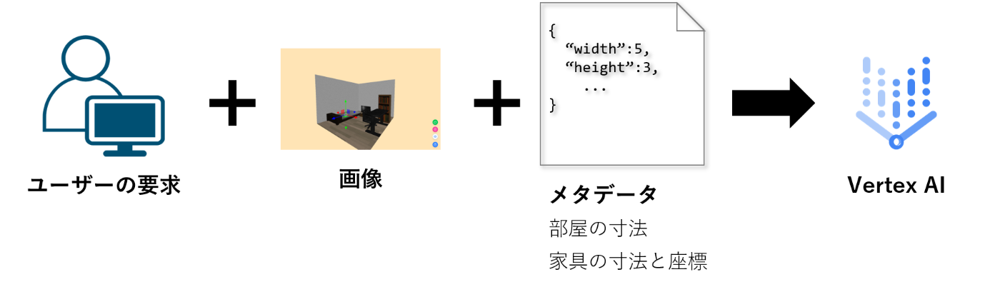
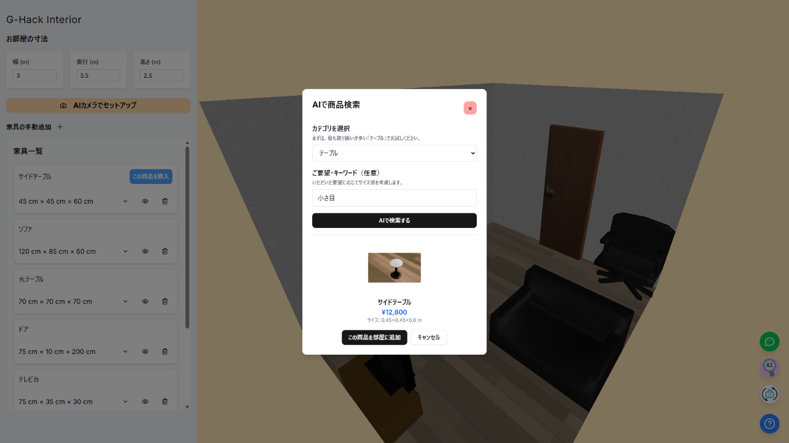
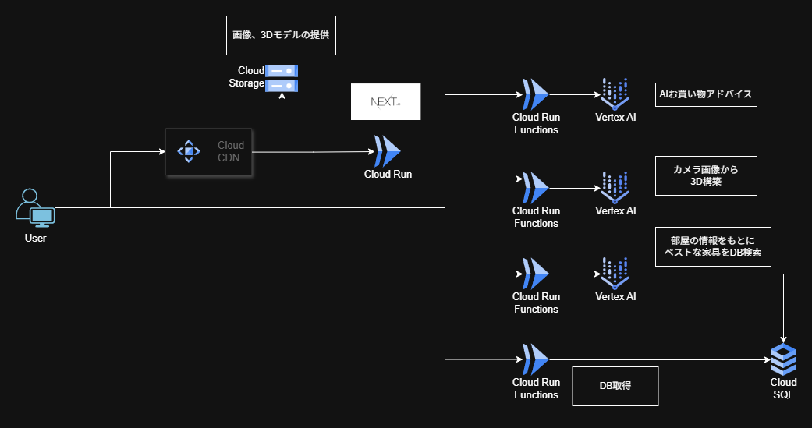

!

本記事は[第2回 AI Agent Hackathon with Google Cloud](https://zenn.dev/hackathons/google-cloud-japan-ai-hackathon-vol2?tab=overview)の提出作品です。

#  はじめに

私は、家具を買う時によく横着をします。

「私の身長がxxxで私が1個分ぐらい入るスペースがある。つまり、この家具は置けるな」

「両手を広げると身長なんだっけ...？その半分だから、あ、いける？」

そして、全然納得感のないサイズの家具が届きます。

そうなると、もったいないやら、ちゃんと測らない自分の怠惰さを認めるのが悔しいやらで、何とか使おうとするものの「数か月以内に捨てる家具」であることを薄々察しながらあがいている、という状態になります。

丁寧な方はメジャーで測ったりするのかもしれませんが、特に何でもいい物を買う場合、似たような経験をされた方はいらっしゃるのではないでしょうか。

#  課題

  * 家具を買う際に、その家具のサイズがちゃんと自分の部屋に合うのかわからない。
  * 自分の家の家具や部屋のサイズを把握してなくても、最適なもの選びたい。

#  ソリューション

Smart Twin Room は AI × デジタルツイン で視覚的に納得感のある最適な提案を行います。

  1. 写真から自分のお部屋のデジタルツインを再現できる
  2. 自分のお部屋で商品のお試しができ、最適かどうかをAIに相談できる
  3. ベストなサイズ感の商品をAIが検索してくれる

により、ユーザーの最適な選択をお手伝いします。

<https://www.youtube.com/watch?v=on4R-1EG-xk>

##  機能

###  ①写真から自分のお部屋のデジタルツインを再現できる

お部屋の写真を送ると、AIが部屋の寸法とどんな家具があるかのデータを回答します。LangChainのJsonOutputParserで回答をパースし、受け取ったデータをもとにThree.jsでお部屋の寸法や家具の情報を取り出して構築し、ユーザーのお部屋を再現します。

AIが目で見てセットアップするため多少のずれの修正は発生しますが、手動でやるよりはるかに楽に一括セットアップができます。

###  ②自分のお部屋で商品のお試しができ、最適かどうかをAIに相談できる

商品詳細ページから自分のお部屋に試したい家具を追加できます。その後、AIのコンシェルジュに対して「この椅子を買った方がいいか？」のような相談することができます。メッセージ送信時に、Three.jsで描画している内容をbase64の画像文字列に変換し、お部屋の寸法、家具の寸法＋座標と合わせて送ります。

AIは、ユーザーと同じ画像を見ているのに加え、部屋のサイズと家具の座標をコンテキストとして会話できるため、正しいアドバイスができ、かつ、ユーザーも見えている状況を説明する必要がありません。

###  ③自分のお部屋の状況をもとにベストなサイズ感の商品をAIが検索してくれる

デジタルツインから商品検索を行うと、AIが最適な商品を検索します。②と同様、ユーザーの要求と、画像と座標データを受け取ったAIがお部屋に最適な家具の幅、奥行き、高さの幅を計算し、Cloud SQLの商品テーブルを検索します。検索結果の商品は実際にユーザーのお部屋に反映して試してもらいます。

ユーザーは自分で最適なものを探す必要が無いですし、AIの提案を受け入れて購入に進むかどうかは自身の目でその場で判断できます。

「自分がお店に行くんじゃなくて、お店がこっちに来て状況見て良い提案してくれないかなあ」と考える時があります。天気や体調が悪い時とか特に。Smart Twin Roomは、家から出ずともプロの提案を受けることができる仕組みです。

また、レコメンドやプロモーションとは別の「偶然自分にぴったりの良いものが見つかる」という体験としても付加価値になっています。

DB検索ツール

Vertex AIにDB検索ツールを持たせて幅、高さ、奥行きの範囲指定をして検索させています。AIの仕事はユーザーの部屋を見て検索範囲を決定することです。
    
    
        def get_target_furniture(min_width, max_width, min_height, max_height, min_depth, max_depth):
            """
            Select the furniture product from database.
            Just designate the dimension range of furniture.
            Furniture category suchas bed or chair is already set.
            """
    
            # SQLAlchemy のエンジン作成
            engine = sqlalchemy.create_engine(
                "mysql+pymysql://",
                creator=getconn,
            )
    
            query = sqlalchemy.text(f"""
                SELECT * FROM {DB_TABLE}
                WHERE category = :category
                AND width >= :min_width AND width <= :max_width
                AND height >= :min_height AND height <= :max_height
                AND depth >= :min_depth AND depth <= :max_depth            
                LIMIT 5
            """)
    
            # クエリ実行
            with engine.connect() as conn:
                result = conn.execute(query, {
                    "category": category,
                    "min_width": min_width,
                    "max_width": max_width,
                    "min_height": min_height,
                    "max_height": max_height,
                    "min_depth": min_depth,
                    "max_depth": max_depth,
                })
                rows = result.fetchone() 
                return rows
    

##  アーキテクチャ

シンプルなNext.jsサーバ、公開API、CDNのアーキテクチャです。

分類 | 使用技術  
---|---  
フロントエンド | Next.js, Three.js  
バックエンド | Cloud Run, Cloud Run Functions, Cloud Storage, Vertex AI  
ネットワーク・配信 | Cloud CDN  
アセットについて

3Dモデルや部屋の壁紙、フローリングのテクスチャなどは、本棚の表面（これだけAI生成）以外は本ハッカソン用に全てBlenderで新規に自作し、家具はデザインごとにサイズが違うようにしています。「デザインだけで選んだら自分の部屋に合わない...」というよくある状況の再現がしたかったのと、「AIが提案してくれたものが意外と合う！」というAIの価値体験を作りたかったからです。職業モデラーではないため、クオリティについてはご容赦ください。  
  
  
3DモデルのAI生成サービスも試したのですが、生成ポリゴン容量を大きくしないと綺麗な形が生成できなかったため、今回使うのは諦めました。誰もが使えるAIデジタルツイン = 低スペックPCでも動く、を目指していたので、容量が膨れ上がるのは致命的だと判断しました。  
  
  
また、AI検索や視点切り替えのアイコンもそれを表すピンポイントな素材が無かったため、illustratorで作りました。

##  AIと別のシステムとが協調するアプローチ

AI単体で課題解決をこなそうとするのではなく、別のシステムと協調し、相乗効果で価値を出すようなシステムを目指しました。

もともとはAI単体を中心とするシステムを考えようとしていたのですが、納得のいくアイデアがなかなか発想できなかったからです。例えば、部屋の写真を送信してAIが適切な商品を検索・提案するようなシステムだと、提案内容に説得力を持たせることが難しいのに加えて、何より毎回カメラ起動するのは面倒だな、と。

そこで、私がXR技術をかじっていたこともあり、AI×デジタルツインを思いつきました。デジタルツインにとってはAIがあるおかげで、セットアップや商品検索を手動でやるよりも格段に楽になり、AIにとっては3D画像と座標データがあるおかげで、相談や検索において常にユーザーの状況を理解した回答ができます。

そして、これらの相乗効果がユーザーにとっての価値である「無駄がない最適な選択を楽にできること」につながっています。状況説明の手間が省けたり、AIの提案が妥当かどうかデジタルツインがあることでその場で目に見える納得感があります。最終的に購入を判断するのはユーザーですが、このHuman-in-the-loopのプロセスにおいて、提案された時点で判断材料が目の前に揃っている、というのは重要視しました。

##  実現性

標準的なプラットフォームができればすぐにさまざまなブランドを巻き込みつつ実現できると考えています。

今回いくつか家具のサイトを調べましたが、ブラウザ上で3Dで家具をぐりぐり動かして360度見ることができる仕組みを持っているサイトがありました。使われていた3Dモデルは、web標準かつ今回私も使用したglb形式だったため、参入していただくのは簡単だと思います。

glbを持っていなくても、設計時のCADデータがあればglbに変換出力できるため、家具に限らず多くのブランドが参入いただけるのではないかなと考えています。

##  発展性・拡張性

Smart Twin Roomは、今回ECサイトの付属物的な作り方にしましたが、個人がAIデジタルツインを所有したうえで、ショップ側とA2Aなどで連携するような仕組みにすれば、複数のショップから商品を選べるようになります。商品数が多くなるほどAI検索の価値は向上していくでしょう。

また、このシステムを実際に友人や社員の方に使ってみてもらったところ、「引っ越しの際や、空いた子供部屋をどう使うか考えるのに使いたい」「工場とか場所を変えたらそこでも使えそう」などのフィードバックもいただけました。

  * シチュエーション（ex. 工場、スーパーマーケットの売り場など）
  * AIの使い方（ex. 物や人の動線予測、引越しサイトとA2Aで連携していい感じの引越し先選定や手軽に引っ越し前後シミュレーション、など）

の組み合わせで様々な課題にアプローチできるポテンシャルがあると考えています。

#  最後に

Smart Twin Room はAI × デジタルツインで視覚的に納得感のある最適な提案を行います。ユーザーは家にいながらボタンを押すだけです。AIが最適な商品を検索し、それをその場でバーチャルお試しできるのが世の中の当たり前になります。腕の長さや身長で測る、という横着すらしなくていい世界を実現します！
