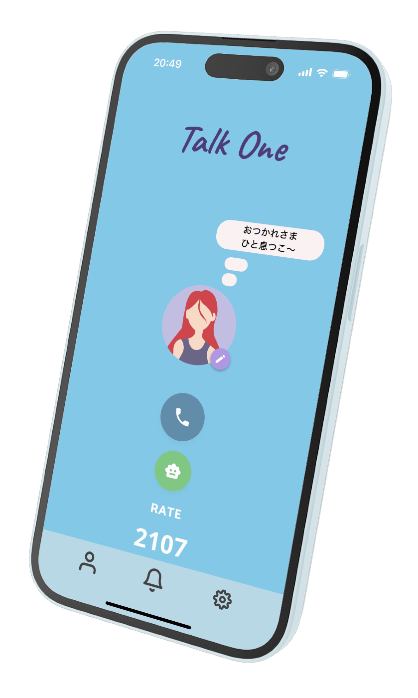
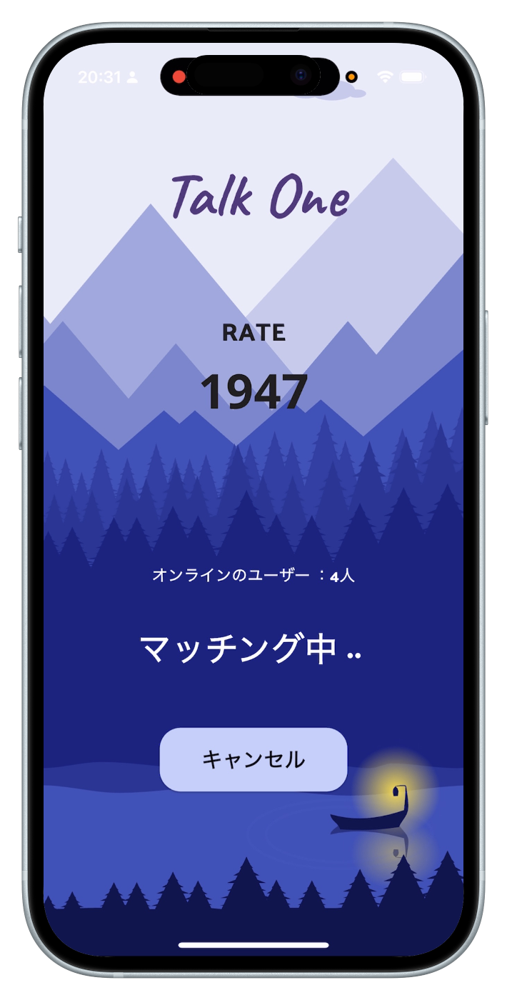
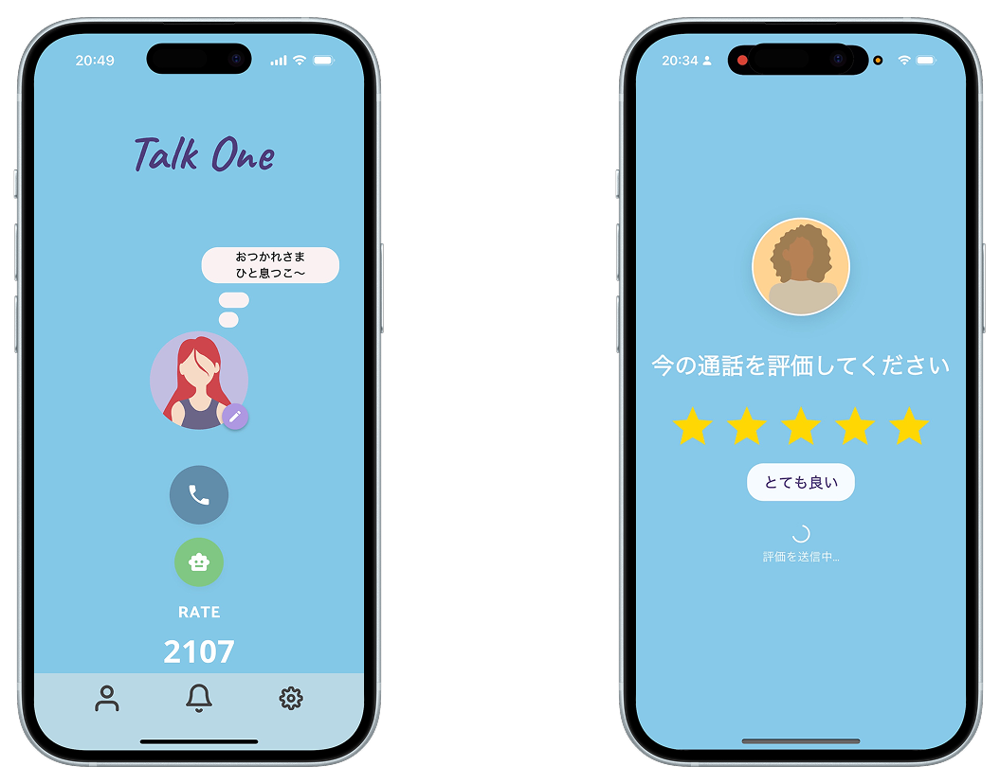
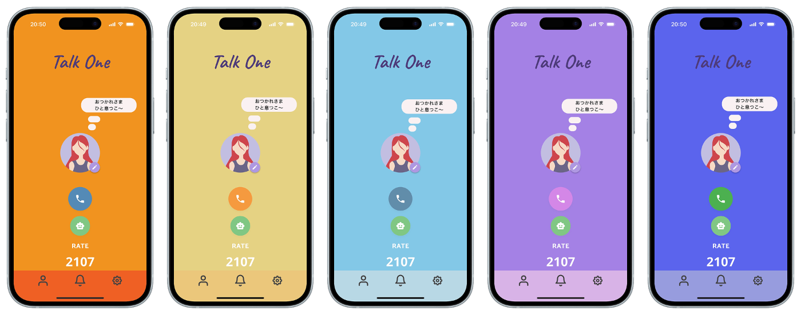
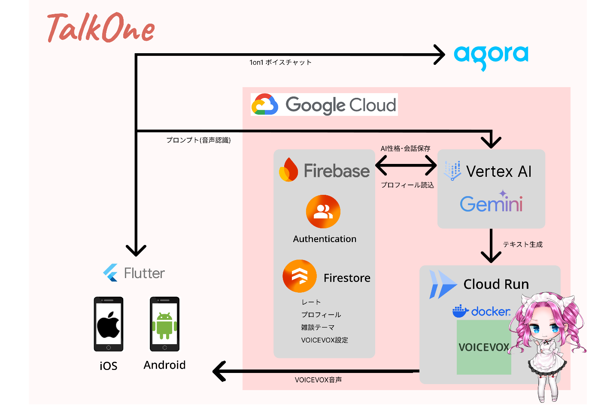
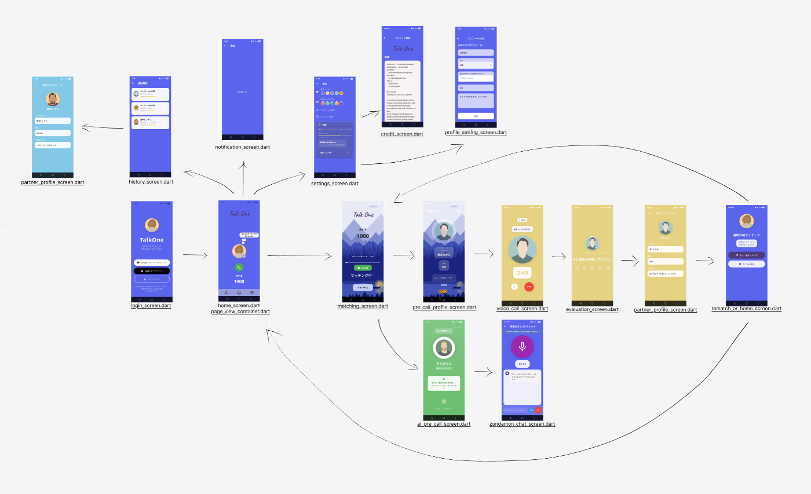
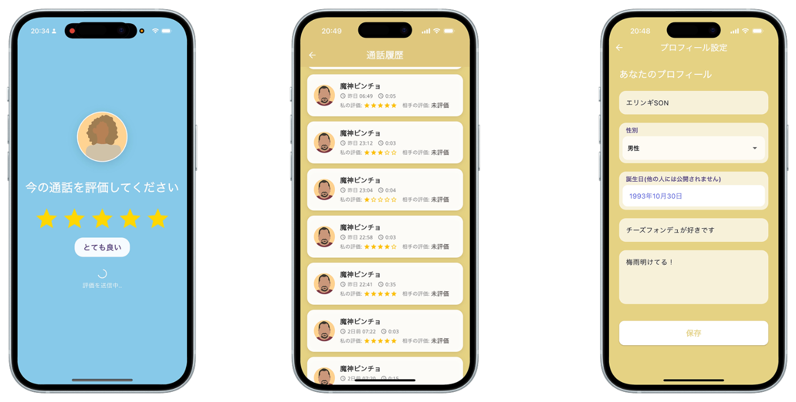

!

この記事は Zenn 主催の "第2回 AI Agent Hackathon with Google Cloud" への応募記事です。

<https://youtube.com/shorts/xmbl_qy4FBU?feature=share>

<https://apps.apple.com/jp/app/talkone/id6747909782>

##  本アプリの特徴

_**「雑談力を上げたい！」**_

_TalkOne はこの課題に応える1対1のボイスチャットアプリです。 通話ボタンを押すだけで、3分間、匿名同士のトークセッションが始まります。 会話が終わると、お互いに今の会話を5段階で評価する、レーティングシステムを搭載しています。 評価が低くなりすぎた場合は、AI エージェント（Gemini）とマッチングされます。_

##  プロジェクトの動機

初対面の人との「雑談」は日常いかなる場面でも発生します。多くは仕事の場で相手に敵意がないことを示すために行われたり、あるいは誰かの主催した会食の場で始まったり、簡単なようで奥が深いのがこの雑談。  
私達が暮らしている環境によっては、その経験をほとんど積めない、というケースもあるかもしれません。

それらをただ楽しめる匿名のトークアプリは多数存在しますが、会話に**緊張感** がなければ、いざという場面で求められる水準まで雑談力が上達することはありません。

そこで、雑談力に自信がなくても**強制的に会話が評価される** 、そんな状態に**ゲーム感覚で参加できる** トークアプリがあればいいのではないか、  
さらに、苦手意識のあるかたには、会話を理解できる**AIに1対1のトークをサポート** してもらえれば、誰でも積極的な会話ができるまで上達するのではないかという考えから、本アプリは生まれました。

##  利用シーン

  1. 人との会話に**苦手意識** がある
  2. 面接等の**大事な場面で話す** 練習がしたい
  3. 短時間でよければ、**知らない人と交流** してみたい

これらのシーンにおいて、ゲームのようにレートが変動するこのアプリによって、レートを上げることを楽しみながら会話力に自身をつけることができます。  
純粋に知らない人とおしゃべりをする新鮮さを、少ない負担で味わってもらえるように、技術実装面とデザイン面において、さまざまなアイデアを盛り込みました。

初対面の相手でも、時にマッチングするAIと練習できる仕組みによって、会話の苦手意識を払拭してもらえるようなアプリになったと考えます。

##  マッチング (技術)

アプリでは、通話にいたるまでの手続き的な画面を極力省き、ホーム画面のボタン一つでマッチングできます。  
どんな時でも話し相手が見つけられる **Cloud Tasks** で実装されたサーバーレスなマッチングキューによって、レートが近い範囲の人を自動的に探すことができます。

自分以外誰も相手がいないときでも大丈夫！60秒間マッチングが行われない場合は**Gemini が待機** していますので、アプリを開けば必ず会話を楽しめます。

##  レーティングシステム (技術)

TalkOne には、通話アプリとしては他にない機能、**レーティングシステム** が実装されています。  
2人がマッチングしたら、会話セッションが開かれます。一つの会話は3分間続きます(途中でどちらかから会話を切ることは可能)。そして、マッチングによる会話が終了した場合に、これまで会話してきた相手から**評価** がつけられます。自分にも、相手の評価を行う画面が出てきます。

さっきの会話が面白かったかを5段階評価することによって、レートの上下が生まれます。**匿名で気兼ねなく評価をつけてもらえる** ので、「次の会話では相手をもっと楽しませよう！」という気になりますね！

##  AI Agent (技術)

**Gemini 2.5 Flash** を AI エージェントとして採用しています。レスポンスの速い会話に対応できるこのモデルは、たくさんのことをこなしてくれます。

  1. マッチングする人が少ないときかわりに待機して、話相手になってくれる
  2. 相手からの評価でレートが連続で下がったときに、代打でキューに入って会話の練習相手になってくれる
  3. 何度もマッチングするにつれて、ユニークな人格を形成していき、人には話しにくいことでも気兼ねなく話せる相手に成長する

**Firebase** に会話の要約を保存することで、ユーザーの**会話の傾向** などを学習して、次の AI へ**システムプロンプトとして渡す** ようになっています。  
自身の雑談力の向上とともに、エージェントが馴染んでいくという、育成の楽しさも生まれます。

##  VOICEVOX 機能 (技術)

レートが上がるにつれて、アチーブメントとして(特定の世代にとってはメジャーな)5人の VOICEVOX キャラクターを実装しました。  
5人の中では Gemini がテキストを生成していますが、5人ともが、システムプロンプトから作られたユニーク性格を持っています。

たまにマッチングで当たることで、キャラクターごとにしかできない会話ができ、ユーザーと紐づけて記録しておくことができます。  
この VOICEVOX Engine は、**Cloud Run** 上で動く Docker コンテナを使ってデプロイされているので、簡単にスケーリングし、多くのユーザーに同時に使用していただけます。

##  話題提供機能 (アイデア)

本アプリには、知らない人と初めての3分間の会話を経験する人にも安心の**話題提供機能** が実装されています。  
通話時は、2人の通話画面に同じ話題が出るため、アプリを使い始めた方々への練習に最適なヘルプツールとなっています。

##  UI/UXへのこだわり(アイデア)

ホーム画面ではワンタップで通話を即時開始できるように、マッチング画面では動的なアニメーション背景を採用し、待機中のストレスをユーザに与えない設計にしました。  
設定やプロフィール画面ではスワイプ一つでホームに戻ることができ、アプリ全体の雰囲気をつかさどる**背景色変更機能** も実装しました。統一感のあるフォントとアイコンを備え、アニメーションにおいても使って楽しくなるような実装によって、快適にお使いいただけます。

##  技術スタック(実装)

\- フロントエンド: Flutter (Dart)  
\- 音声通話エンジン: Agora RTC Engine SDK 6  
\- バックエンド: Firebase（Firestore, OAuth, Vertex AI）  
\- AI エンジン: Gemini 2.5 Flash  
\- 音声合成: VOICEVOX Engine（Google Cloud Run）  
\- 音声認識: iOS（SpeechToText）+ Android（SpeechRecognizer）

フロントエンドにはFlutterを採用し、単一コードベースで iOS/Android に対応しています。一方でバックエンドは、Google Cloud と Firebase のサーバーレスなサービスを全面的に活用し、インフラ管理のオーバーヘッドを極小化した結果、ユーザー体験の向上にリソースを取ることができました。

##  画面フローアーキテクチャ(実装)

できる限り画面を少なくすることで、見通しやすいように設計しました。

##  AI救済システム(アイデア)

レーティングシステムと連動したAI救済機能要素ロジックです：

レーティング 850 以下になったユーザーは、自動でAIとマッチングします。AI通話では必ず星3評価がもらえ、880 ポイント超えで人間とのマッチングに復帰できます。  
700 以下、550 以下でも同様の救済措置マッチングが発生します。

このように救済マッチングは短い期間で限られており、よほどのことでない限り、同じマッチングキューをいれた人と当たるようになっています。

##  AI音声通話(実装)

リアルタイム音声チャットは：

音声入力 → STT（iOS,Android デフォルト音声認識） → Gemini 2.5 Flash → VOICEVOX（音声合成）

となっています。VOICEVOX が解除されていない場合は、Flutter のパッケージ TTS が使われるようになっています。

##  音声通話(実装)

音声通話には Agora Flutter SDK 6 を採用しました。この設定により、iOS・Android の両プラットフォーム間でも、低遅延で安定した音声通話が行えます。

##  通話履歴・評価システム(実装)

全ての通話において、以下の5項目が**Firestore** に保存されます：

\- 通話開始・終了時刻  
\- 相手のプロフィール情報  
\- 双方向の5段階評価  
\- AI通話の識別フラグ  
\- 会話で使用された話題

これらのデータは履歴画面で表示されるため、ユーザーは過去の通話を振り返りながら会話スキルの向上を実感できます。

##  プロフィールと AI 用システムプロンプト (技術)

アプリでは、マッチング時、マッチング後に相手に表示してもよいプロフィールを設定できます。  
設定した**ニックネーム** や**一言メッセージ** の情報は Firestore に保存され、マッチングした相手の画面に、最初の挨拶として表示されます。  
これは、AI に対しても同様であり、**AIに伝えたいこと** 欄に記載した事項はアプリ上のすべての AI にシステムプロンプトとして認識され、ユーザーとの話のなかで話題にしてくれます。これにより、3分間の会話でもエージェントが会話をリードして、充実したセッションを実現できます。

AI 用メッセージ欄の使い方は無限にあります。  
もし AI エージェントがこれまでの話を忘れがちだと感じたら、覚えておいてほしいことを一覧で書いてもいいですし、  
開発者が決めた性格を上書きするようなプロンプトを記載することもできます。

ちなみに、これらの情報は **OAuth で紐づいて管理** されているため、端末を変更した際にもアカウントログインによって、自分の育てた AI を呼ぶことができるようになっています。

##  正規表現・通報機能 (技術)

マッチング終了後に、相手の詳しいプロフィール情報を見ることができますが、ここでは**不適切な単語が載せられない** ようにフィルタリングされています。  
不適切な表現を入力した場合のチェックは、Flutter のコード上で実行されるようになっています。

また、会話セッションにおいて不快な思いをした場合は、相手のことを**運営に通報する機能** があります。

##  レーティング実績(アイデア)

追加機能はレーティングベースで上がっていくにつれて増えていきます。
    
    
    ここまで読んでいただいている方に特別にお伝えいたします。
    設定の実績ポップアップを10回10秒以内にタップすると、レーティングを自在に変えられるダイアログが開きます。ここに好きな値を入れられます。
    OKを押してホーム画面に戻るとその値が反映されます。   
    

##  おわりに

最後までお読みいただき、ありがとうございます。

「雑談が苦手」「うまく会話できるようになりたい」という普遍的な悩みに、テクノロジーとゲームの力で真正面から向き合ったのが、この「TalkOne」です。開発では「どうすればユーザーが楽しみながら成長できるか」を徹底的に議論し、その核としてレーティングシステムとAIエージェントとのマッチングという機能にたどり着きました。

今回のハッカソンでは、Gemini 2.5 FlashをはじめとするGoogle Cloudのパワフルな技術に触れ、その可能性を存分に追求することができました。このような挑戦の場を提供くださったZenn様、Google Cloud様、そして何より、共に走り抜けたチームメンバーに感謝します。

##  今後の展望

  * より自然な感情表現を実現するAI表情フィルターの精度向上
  * 会話内容の「気づき」を記録する自己フィードバック機能
  * 特定の話題に強いAIキャラクターの拡充
  * コミュニティ内の“ファンAI”と話せる特別ルームの実装

##  チームについて

  * **truemato** （iOS／Firebase／Flutter）
  * **darkmocha** （Android／UI／Flutter）

<https://apps.apple.com/jp/app/talkone/id6747909782>  
<https://github.com/truemato/TalkOne-Project>
