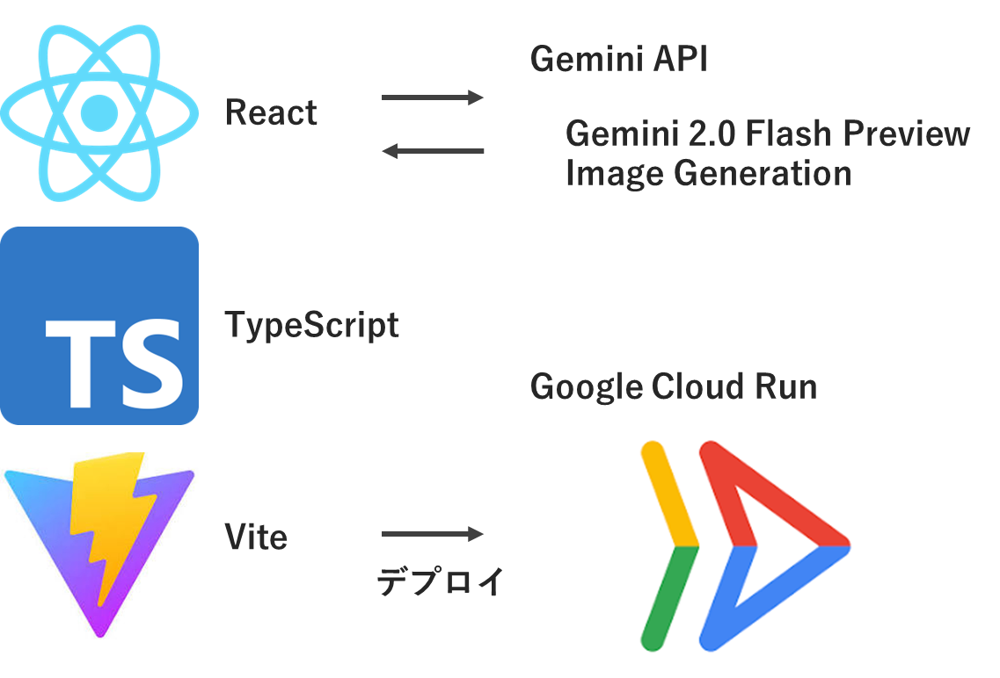

##  第2回 AI Agent Hackathon with Google Cloud 投稿記事

##  はじめに：そのスタンプ、本当にあなたの気持ちを伝えていますか？

大切な友人や恋人とのLINEでのやりとり。  
「ありがとう」「OK！」「笑」

言葉だけでは味気ないからと、私たちはスタンプを使います。でも、ストアに並ぶ無数のスタンプの中に、二人の間でだけ通じる"あの時"の気持ちや、"内輪ネタ"のニュアンスを完璧に表現してくれるものは、果たして存在するでしょうか？

「あの旅行の時の、あの変なポーズをスタンプにできたら絶対ウケるのに…」  
「うちのペットを主人公にしたスタンプが欲しいけど、絵は描けないし…」

そんな、 **「自分たちだけの物語を、もっと気軽に、もっと楽しく共有したい」** という想いを形にするために、私たちはAIスタンプ共同制作アプリケーション **「Sticker Atelier（ステッカーアトリエ）」** を開発しました。

この記事では、ハッカソンで開発した本アプリケーションのコンセプトから、それを支える技術、そして私たちが描く未来について、余すところなくお話しします。

##  1\. Sticker Atelierが解決する課題と、そのためのソリューション

この章では、私たちがどのようなユーザーの、どのような課題に目を向け、それを「Sticker Atelier」でどう解決しようとしているのかを具体的にご説明します。

###  ターゲットユーザーと彼らが抱える"見えない"課題

私たちの主なターゲットユーザーは、 **「関係性をより深めたいと願う、親しい間柄の二人組や小規模なグループ」** です。

  * **遠距離恋愛中のカップル:** 会えない時間が増え、テキストコミュニケーションが中心になる中で、些細なすれ違いやマンネリを感じている。
  * **卒業後も続く大学の友人グループ:** それぞれの生活が始まり、昔のように頻繁には会えない。グループLINEでの会話が、近況報告や事務連絡ばかりになりがち。
  * **ペットを飼っている家族:** 愛するペットのユニークな瞬間をスタンプにしたいが、イラスト化するスキルがない。

彼らが共通して抱えているのは、 **「コミュニケーションの質の低下」** という見えにくい課題です。既製のスタンプは手軽ですが、誰にでも使える"公約数的"な表現しかできません。本当に共有したい個人的な感情や思い出、ユーモアは、その枠組みからこぼれ落ちてしまいます。

思い出の写真はスマホのフォルダに眠ったまま。面白いアイデアは頭の中にしまったまま。関係を深めるためのクリエイティブな共同体験をしたいと思っても、そのための「場」や「ツール」がありませんでした。

###  解決策：「作る体験」こそが、最高のコミュニケーション

私たちは、この課題の解決策は「より良いスタンプを手に入れること」だけではないと考えました。本当の価値は、 **「スタンプを"一緒に作る"という体験そのものにある」** と結論づけました。

「次どんなスタンプにする？」「このポーズ面白いから真似させてみようよ！」「AIが作ったこの顔、変すぎて笑える！」

このような会話が生まれるプロセスこそが、二人の関係性を活性化させ、新たな共通の思い出を作る最高のコミュニケーションになると考えたのです。

「Sticker Atelier」は、そのための「アトリエ（工房）」です。AIというパワフルな絵筆を使って、二人のアイデアを次々と形にしていく。そのクリエイティブな時間を共有することで、自然と会話が弾み、絆が深まっていく。それが私たちの提供するソリューションです。

###  プロダクトの主な特徴：アイデアを形にするための"魔法"

このコンセプトを実現するために、「Sticker Atelier」にはいくつかのユニークな特徴があります。

**① キャラクターの一貫性を保った画像生成**  
このアプリの核となる機能です。ベースとして登録した人物やキャラクターの顔や特徴を維持したまま、さまざまなシチュエーションの画像を生成できます。これにより、「いつもの自分たちのキャラクターが、ありえない状況にいる」という面白さが生まれ、スタンプとしての一貫性も保たれます。

**② ポーズの再現機能**  
「このポーズをさせてみたい！」と思いついた時、言葉で説明するのは困難です。この機能を使えば、参考となるポーズ画像をアップロードするだけで、AIがその骨格を読み取り、あなたのキャラクターに同じポーズを取らせることができます。ネットで見つけた面白い画像や、自分たちで撮影した変なポーズの写真が、一瞬でスタンプの素になります。

**③ プロンプトによる無限のシナリオ設定**  
「どんな場所で？」「何をしている？」「どんな画風で？」といった具体的なシナリオは、テキストプロンプトでAIに指示します。「月面でたこ焼きを食べる、水彩画風」のような、突拍子もないアイデアもAIは忠実に（時には予想の斜め上の解釈で）描き出してくれます。この予測不能性が、ガチャを引くようなワクワク感を生み出します。

**④ 一括生成と直感的なUI**  
一度の操作で最大10枚の画像を生成できるため、たくさんの候補の中からお気に入りの一枚を選ぶ楽しみがあります。AIの出力は常に完璧とは限らないため、多くの選択肢を提供することはユーザー体験の向上に不可欠です。ReactとTailwind CSSで構築されたシンプルで直感的なUIが、ストレスのない創作活動をサポートします。

* * *

##  2\. 実際の動きを見てみよう！ アプリケーションデモ

百聞は一見に如かず。  
コンセプトや特徴を言葉で説明してきましたが、実際にどれほど簡単で、どれほど面白い画像が生まれるのかをぜひご覧ください。

以下のデモ動画では、ベース画像とポーズ画像、そして簡単なプロンプトを入力するだけで、ユニークなスタンプ画像が次々と生成される様子をご確認いただけます。

<https://youtu.be/fsIM_MZjyrQ>

いかがでしたでしょうか。  
たったこれだけのステップで、自分たちだけの物語が詰まったスタンプの"原石"が生まれる。この手軽さと楽しさが「Sticker Atelier」の最大の魅力です。

* * *

##  3\. 舞台裏の仕組み：AIとの対話と技術スタック

このアプリケーションの魔法のような体験は、どのような技術によって支えられているのでしょうか。この章では、システムアーキテクチャと、開発の核となったGoogleの生成AI「Gemini」との連携について解説します。

###  システムアーキテクチャ

本アプリケーションの構成は、モダンなWebフロントエンド技術を活用し、サーバーレスで完結する非常にシンプルなものになっています。

**(アーキテクチャ図)**  

**図の解説:**

  1. **ユーザー (Browser):** ユーザーはブラウザ上で動作するReactアプリケーションを操作します。ベース画像、ポーズ画像、テキストプロンプトの入力はすべてここで行われます。
  2. **Reactアプリケーション (Vite + TypeScript):**
     * Viteによる高速な開発環境とビルドプロセス。
     * TypeScriptによる型安全な開発。
     * Tailwind CSSによる効率的なUIスタイリング。
     * ユーザーから受け取った画像データとテキストは、ここで整形され、Google AI APIへのリクエストとして組み立てられます。
  3. **Google AI API (Gemini 2.0 Flash Preview):**
     * Reactアプリケーションから、HTTPS経由で安全にAPIリクエストが送信されます。
     * 私たちのアプリケーションの心臓部です。受け取ったマルチモーダルな情報（画像＋テキスト）を解釈し、新しい画像を生成して返します。バックエンドサーバーを自前で用意する必要がなく、フロントエンドから直接呼び出せる手軽さが、ハッカソンのような短期間開発において非常に強力な武器となりました。

###  画像生成の"魔法"：Geminiとのマルチモーダルな対話

このアプリの最も重要な技術的ポイントは、 **「どのようにして3つの異なる情報（ベースキャラ、ポーズ、テキスト）をAIに正確に伝えるか」** という点にあります。

私たちは、Googleの生成AIモデル **`gemini-2.0-flash-preview-image-generation`** を採用しました。このモデルは、テキストだけでなく画像も同時に入力として受け取れる「マルチモーダル」な能力を持っています。

実際にAPIに送信しているリクエストの構造は、擬似的なコードで表すとこのようになっています。
    
    
    // 1. 環境変数からAPIキーを取得し、Google AI SDKを初期化する
    const API_KEY = "YOUR_GEMINI_API_KEY";
    const ai = new GoogleGenAI(API_KEY);
    const model = ai.getModel("gemini-2.0-flash-preview-image-generation");
    
    /**
     * 画像を生成する非同期関数
     * @param prompt - 画像生成のためのテキストプロンプト
     * @param baseImage - (任意) スタイルや構成の参照元となるベース画像
     * @param poseImage - (任意) 生成される画像のポーズの参照元となる画像
     * @param onImageGenerated - 画像が1枚生成されるたびに呼び出されるコールバック関数
     */
    async function generateImage(prompt, baseImage, poseImage, onImageGenerated) {
    
      // 2. APIに渡すコンテンツを準備する
      const contents = [];
      contents.push({ text: prompt }); // テキストプロンプトを追加
    
      if (baseImage) {
        // ベース画像があれば追加
        contents.push({ image: baseImage.data, mimeType: baseImage.mimeType });
      }
      if (poseImage) {
        // ポーズ画像があれば追加
        contents.push({ image: poseImage.data, mimeType: poseImage.mimeType });
      }
    
      // 3. 指定された回数（この場合は10回）画像生成を繰り返す
      const numberOfImagesToGenerate = 10;
      for (let i = 0; i < numberOfImagesToGenerate; i++) {
        try {
          // 4. Google AIモデルにリクエストを送信して画像生成を実行
          const result = await model.generateContent({
            contents: contents,
            config: {
              responseModalities: ["IMAGE", "TEXT"], // レスポンスとして画像とテキストを要求
            },
          });
    
          // 5. レスポンスから生成された画像データ（base64形式）を抽出
          const generatedImage = result.getImageData(); // 実際にはより複雑な抽出処理
    
          // 6. 成功した場合、コールバック関数を呼び出して画像データを渡す
          onImageGenerated({ base64Data: generatedImage }, i);
    
        } catch (error) {
          // 7. エラーが発生した場合、コールバック関数にエラー情報を渡す
          console.error(`画像 ${i + 1} の生成中にエラーが発生しました:`, error);
          onImageGenerated({ error: error.message }, i);
        }
      }
    }
    
