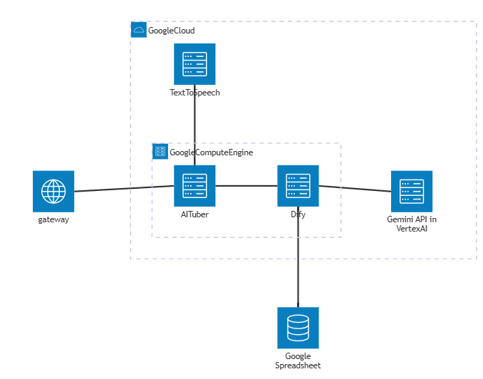
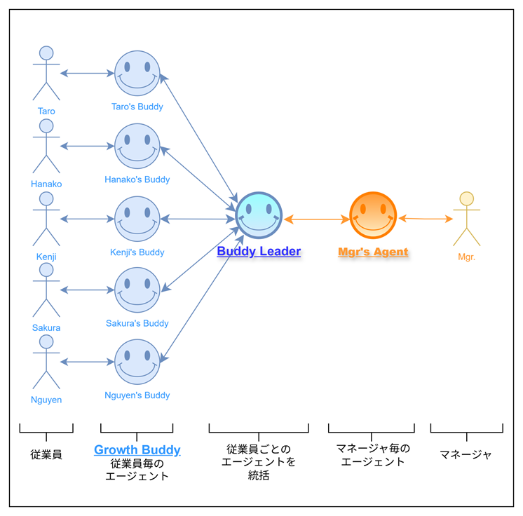
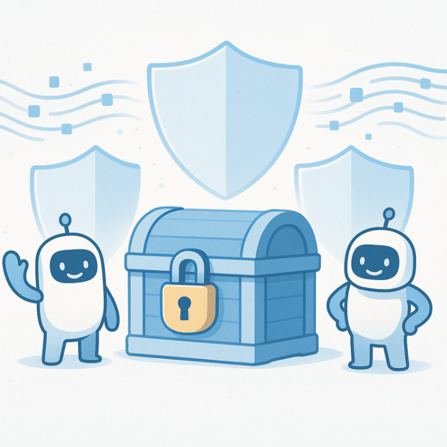

こんにちは、チームManabi-DX-Crewです。  
僕達は今回、Zennの**AI Agent Hackathon** に参加し、「**Growth Buddy** 」というサービスを開発しました。ハッカソンの期間内でどのようなサービスを考えたのかをご紹介します。

##  概要

「**Growth Buddy** 」は、企業・団体の**従業員に寄り添い、成長をサポートする伴走エージェントシステム** です。同時に管理職にもエージェントが伴走し、従業員のエージェントを管轄するBuddy Leaderというエージェントが管理・レポート作成します。

従業員側のエージェントと統括するエージェントおよびデータが分離されており、**やり取りのプライバシー性を確保しながら従業員の継続的成長を促し** 、更に企業内での方針や成長速度に応じてエージェントの挙動を調整することができます。

<https://youtu.be/abOXXAbVP1k?si=VS7reybWf2wtgeWw>

###  チームメンバー

  * [toki](https://zenn.dev/murakamiastom):チームリーダー、インフラ、フロントエンド
  * [M_R_K_W_](https://zenn.dev/mrkw):バックエンド、エージェントデザイン
  * [YF-40](https://zenn.dev/yf_40):フロントエンド、ユーザーテスト
  * [座禅いぬ](https://zenn.dev/zazen_inu):ドキュメント、ユーザーテスト

###  チームで共有の課題感は「従業員の自主的な成長」

元々僕達はイベントで知り合って出来た勉強会のメンバーで、tokiさんが今回のハッカソンの募集を見て「**面白そう！やってみませんか？** 」と声かけしてチームを組みました。まず集まって、「そもそもAI Agentって何だろうか？」「どのような課題を解決するべきだろうか？」というところから議論を何度か行いました。

僕達はバラバラな業種をバックグラウンドに持っています。それぞれの業種での課題を出し合い、AIで解決できるか？既存サービスはあるか？等を検証して絞っていきました。その中で**共通の課題が従業員教育について** でした。そこで、従業員教育エージェントを開発してはどうかという話になったのですが、単に社内教育RAGを作るのでは新規性がないので、**現実に起きている課題を深掘り** していくことにしました。

意見としてあったのが、新人を教育するコストをペイする事が今後困難になる可能性でした。中間層の空洞化が進み、**世代間のギャップや人間関係等で教育がスムーズにいかない** ことがあります。デジタル人材の需要がかつてないほど高まっている一方で不足しており、リスキリングのニーズもあります。テレワークなど**勤務制度の変化で社内教育と労務管理が複雑化** しているのも問題と言えるでしょう。

これらの課題は、従業員の自主的な成長が必須になります。そこで、僕達は**従業員のエンパワーメントおよび労務管理** を目的とするサービスとして**Growth Buddy** を開発しました。

気を付けた点として、企業側の観点だけではない「**あくまで従業員のエンパワーメントを行うこと** 」を主眼におく事としました。というのは、このような仕組みを導入するのはあくまで企業側の決定であるため、多くのサービスはいかに企業側の負担を軽減するかにどうしても主眼が置かれやすいと思います。一方で**課題解決はいかに従業員の仕事体験をよくするかにかかっている** であろうと考え、敢えて**従業員側の観点からのサービス** を開発することにしました。

##  ストーリー：太郎さんとGrowth Buddyの一週間

「**お疲れさまです、太郎さん！今日は新しいプロジェクトの初日でしたね。どんな一日でしたか？** 」

入社2年目の太郎さんは、画面に映るアバターに少し戸惑いながらも答えました。

「あ、はい...正直、新しいチームの人たちとうまくコミュニケーションが取れるか不安で。今日は顔合わせだけだったんですが、みんなベテランの方ばかりで...」

「そうですね、新しい環境は緊張しますよね。でも太郎さんは前のプロジェクトでお客様からの評価も高かったじゃないですか！その経験を活かせると思いますよ。今日の振り返りをしていきましょう！」

Growth Buddyとの自然な会話を通じて、太郎さんは少しずつ心を開いていきました。

###  3日目：チームでの立ち位置に悩む

「うーん...今日はちょっと落ち込んでます。会議で自分の意見を言おうとしたんですが、先輩の山田さんに『それはもう検討済みです』って言われて...。自分がチームの足を引っ張ってるんじゃないかって」

「意見を言おうとしたこと自体がとても素晴らしいと思いますよ。新しいチームで積極的に発言するのって勇気がいりますよね。太郎さんは山田さんの反応について、どう感じましたか？」

「最初はショックでしたが...よく考えてみると、山田さんも忙しい中で説明してくれたし、悪意があったわけじゃないのかも」

「そうですね！それに、たとえ既に検討済みでも、太郎さんが同じ点に注目したということは、重要なポイントだった証拠ですよ」

###  5日目：上司からの適切なサポート

佐藤課長は朝一番に管理職用伴走AIエージェント、Mgr's Agentとレポートを確認していました。  
スタッフ向けのGrowth Buddyの報告をBuddy Leaderというエージェントが集計して、レポートを提出してくれたのです。

「太郎さんの成長意欲は高いが、チーム内でのコミュニケーションに不安を感じている様子。特に意見発信に対する自信を失いかけている」

佐藤課長は考えました。直接太郎さんに「大丈夫？」と聞くのは逆にプレッシャーになるかもしれない。

「太郎さんが自信を持って発言できるような環境を作るにはどうしたらいいでしょうか？」

「太郎さんは事前準備をしっかりする特性があります。次回の会議前に、太郎さんの担当分野について意見を求める時間を設けてはいかがでしょうか？また、山田さんには新メンバーのサポート方法について相談されることをお勧めします」

その日の会議で、佐藤課長は自然に太郎さんに発言の機会を作りました。

「太郎さん、UI設計の部分で何か気づいた点はありますか？新しい視点で見てもらえると助かります」

###  1週間後：成長を実感する瞬間

「今日は会議で自分の提案が採用されました！」太郎さんの声は弾んでいました。

「わあ、おめでとうございます！どんな提案だったんですか？」

「ユーザビリティテストの進め方について提案したんです。最初は緊張しましたが、事前にGrowth Buddyと整理した内容を話したら、みんな真剣に聞いてくれて...山田さんも『いい視点ですね』って言ってくれたんです！」

「それは素晴らしいですね！太郎さんが日々積み重ねてきた努力の成果ですよ。チームの一員として認められた証拠ですね」

一方、佐藤課長もBuddy Leaderから良い報告を受けていました。

「太郎さんの自己効力感が大幅に向上しています。チーム内での発言頻度も増え、他のメンバーとの関係性も改善されています。今後は更なる成長機会の提供をお勧めします」

太郎さんはGrowth Buddyとともに毎日の小さな成長を積み重ね、チームの重要なメンバーとして成長していくのでした。そして佐藤課長も部下の心境を把握し、適切なタイミングで自然にサポートできるようになったのです！

##  使用した技術

  * Google Compute Engine
  * Gemini API in Vertex AI
  * Google Spread Sheet
  * Text-to-speech
  * Dify（Community版）
  * AITuberKit

##  検討の経緯

###  インフラ

今回はプロトタイピングとしてのスピードを考慮し、汎用性の高い**Google Compute Engine** を使用しました。その中でポートを分けて、後述するバックエンドとフロントエンドの機能を実装しました。

###  バックエンド

当初DifyやLangChain/LangGraph等のワークフロー/エージェントを検討しましたが、今回の実装ではプロトタイピングの素早さと、マルチエージェントにすることで作業内容をワークフローでも十分表現できる形であると判断し、**Difyを採用** しました。

###  データベース

今回のキモの一つが、**従業員の情報を非公開にする設計** です。試行錯誤が必要なことを考え、素早いプロトタイピングのツールとしてGoogle Spread SheetをDBがわりに使用しました。もちろん本番運用では、トランザクション等の問題を考慮する必要があるため、Cloud SQLを使用することを検討しています。

###  フロントエンド

実際に従業員に普段から使ってもらわないと今回の目的は達成されないと考えた僕たちは、「**毎日対話をして一緒に成長する** 」ということにこだわり、ユーザーフレンドリーなUI/UXを追求しました。

僕たちが良かれと思って作った仕組みでも、「この仕組みのせいで業務が増えた」と感じるようではいけません。時間的な問題を解決しようとしても、精神的なコストが増えては実態として意味がありません。そこで考えたのが**AITuberKit** の使用です。

ニケちゃん（[@nikechan](https://zenn.dev/nikechan)）さんが開発されたサービスです。ニケちゃんさんはAIエージェント等に関する技術情報発信も多くされている方で、興味深いチャレンジをたくさんしてらっしゃるのでご存じの方も多いと思います。今回、僕達の厚かましいお願いにも関わらずご厚意で使用許諾を頂き、使用させていただきました。

試してみて分かったのが、**驚くほどエージェント連携がスムーズ** なことです。API連携がGUI操作だけで設定でき、あっという間にアバターが連動しました。ユーザーとして想定している従業員は、文字だけの画面はどうしても読みにくいと感じてしまう可能性があります。AITuberKitを使用することで負荷が軽減し、人間とのやり取りに近い直感的な対話体験が出来ます。

##  実際のエージェントの挙動

###  Growth Buddy

アバター情報は個人のプロファイルとしてデータベースに保持しており、**各従業員の性格や業務内容に合わせてカスタマイズ** できます。また、自然なやり取りの会話で、一日の業務の振り返りをする**リフレクション機能** を実装しました。

会話が終了次第、Growth Buddyがデータ要件にあわせて**リフレクションの結果と日常業務報告を作成** し、データ保存までを行ってくれます。ユーザーはあくまで対話でモチベーションを高めることに集中できます。

###  Buddy Leader

Buddy LeaderはGrowth Buddyがまとめた日報などを参照し、レポートを作成するAIエージェントです。**業務とは非同期** で、残業等の影響を受けない深夜に実行されます。

Buddy Leaderは**従業員とGrowth Buddyが行った会話を直接参照することが出来ません** 。この制約によって、従業員のプライバシーが確保できます。また、従業員から直接伝えるのが難しい声やフィードバックをBuddy Leaderが集計し、従業員全体の傾向から管理職側に報告を行うことが出来ます。

###  Mgr's Agent

Mgr's Agentは管理職用伴走AIエージェントです。  
Buddy Leaderからの前日分までの**レポートや経営上のデータを参照し、従業員の成長状況を把握し、適切なサポート** を行います。管理職は忙しいですから、レポートの要点や気になっている点の抽出を行い、業務運営をサポートします。

##  やってみて分かったこと

###  何がうれしいか

  * AITuberKit+会話のカスタマイズ機能がうまく働いていることで、リフレクション機能は業務的な圧迫感のないフランクさで実行出来ます。機能を先に聞いているとちょっと想像出来ないようなユーザー体験がうまく実装できたと思います。

  * Buddy Leaderが間に入っていることで、役割分担とデータ分離が明確に出来ます。Growth Buddyは従業員感情マネジメントに特化し、上司や同僚の愚痴を言っても上司の感情マネジメントには影響がありません。これは実は従業員同士で上司の悪口を言うよりずっと健全な状態ではないかと思います。

  * また、従業員の声を吸い上げる仕組みを人間関係に依存せず作ることができるのは、例えばいわゆるお局さん的な、職場の私物化に繋がりかねない存在を抑制することができる可能性があると思います。

  * 上司もMgr's Agentを使用することで、上司の部下に対する好き嫌いのような感情要素を減らせるのではないかと予想しています。また、参照できる情報の分離により、機密情報の漏洩も抑制できるのではないかと考えています。

###  今後の課題

  * Google Spreadsheet はプロトタイピングには最速でしたが、トランザクションや保守性を考え将来的には Cloud SQL へ移行必須
  * 実際の環境では、従業員に関するデータは勤務時間や業務内容などのデータを参照する仕組みを作り、更に精度の高い伴走を行えるようにしたい
  * 特徴部分を優先し今回は実装しなかったが、社内マニュアルとの連携でRAGを構築し、普段の伴走からシームレスに教育支援を行う仕組みを作れる
  * 従業員の成長状態に応じたタスクの提案、昇進等に向けた教育の実装

##  まとめ

  * Growth Buddy は 「従業員の隣に相談しやすい同僚AIがいる日常」 を実現する伴走エージェント
  * Growth Buddy ↔ Buddy Leader ↔ Mgr's Agent の３層設計で、プライバシーとマネジメントを両立
  * 今回は短期間のプロトタイピングだったが、Dify × Vertex AI × AITuberKit を組み合わせてユーザー体験のデザインまでを実現できた

最後までお読みいただき、ありがとうございました！質問やフィードバックはぜひコメントでお寄せください。
