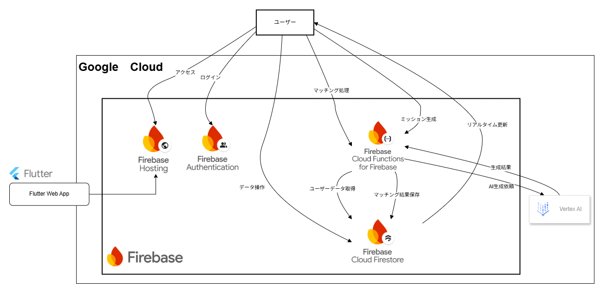
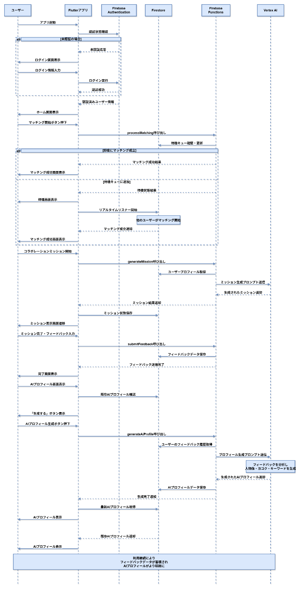

「会社の自販機でドリンクを飲む、その数分間が、新たなイノベーションのきっかけになるとしたら？」

社員2名で使うと無料になる「社長のおごり自販機」。その素晴らしい制度の可能性を、もっと引き出せるとしたら？

「OGORI MATCH」は、あなたを「まだ見ぬ誰か」とリアルタイムに繋ぎ、GoogleのAIが生成する「会話ミッション」で初対面の気まずさを解消します。体験を重ねれば、AIがあなたの「他己紹介」まで自動作成。新たな自分にも出会えます。

このアプリは、開発経験ゼロの新入社員3名が、AIを4人目のメンバーとしてゼロから創りました。

一杯のドリンクから、新たな絆とイノベーションを。

#  はじめに

この記事は、Google Cloud Japan AI Hackathon Vol.2の提出物として作成されました。ハッカソンの詳細については、以下のURLより確認ください。  
<https://zenn.dev/hackathons/google-cloud-japan-ai-hackathon-vol2>

#  私たちについて

チーム名：YOKOKU.D

私たちは、2025年にコクヨ株式会社（以下、コクヨ）へ、初のデジタル系職にて入社した新入社員3名で結成したチームです。このチームの特徴は、メンバー全員がこれまで本格的な開発経験を持たない「初学者」である点です。

初学者という大きな壁を乗り越えるため、私たちは開発プロセスにおいてAIを積極的に活用しました。アイデア出しから設計、コーディング、そしてこのドキュメント作成に至るまで、Gemini、Claude、GitHub Copilot、 Claude Code 、ChatGPT、NotebookLM、Murf AIといった様々な生成AIを駆使しています。AIは、私たちにとって4人目のメンバーになります。

#  背景

コクヨでは、福利厚生として、サントリー食品インターナショナル株式会社様の展開する法人向けサービス「社長のおごり自販機」を導入しています。この「社長のおごり自販機」は、二人の協力で飲み物が無料になる仕組みです。二人で同時に社員証をかざすと、それぞれが飲み物を受け取れます。

「社長のおごり自販機」の目的として、部署や階層を超えた社内コミュニケーションの活性化があります。しかしながら、利用者からは「気心の知れた同僚と使うことが多い」といった声も聞かれ、当初の目的である部署や階層を超えた新たな関係構築の機会としては、まだ活用の余地がある状況です。

そこで、「社長のおごり自販機」が持つコミュニケーション活性化の可能性を最大限に引き出すために、「OGORI MATCH」システムを考案しました。

「社長のおごり自販機」の詳細については、以下の公式ホームページや動画をご覧ください。

<https://www.suntory.co.jp/softdrink/jihanki/ogori/>

[https://www.youtube.com/watch?v=pQ5aQI0L4eY&t=2s](https://www.youtube.com/watch?v=pQ5aQI0L4eY&t=2s)

#  解決したい課題とターゲットユーザー

##  課題

  * 「社長のおごり自販機」の利用が既知の関係に限定される傾向がある
  * 部署や世代を超えての新しい人間関係の機会づくりには、まだ改善の余地がある
  * 初対面同士の会話のきっかけが不足している

##  ターゲットユーザー

  * 「社長のおごり自販機」の利用者
  * 社内での新しいつながりを求める人
  * 類似のコミュニケーション促進サービスの利用者

#  プロダクト概要

##  提案ソリューション

Google Cloudのサービスを活用し、「社長のおごり自販機」を利用したいタイミングで社員同士をマッチングするアプリケーションを構築します。このアプリでは、リアルタイムでのマッチングを通じて、普段接点のない社員同士の出会いを創出します。このアプリにより、「社長のおごり自販機」が持つコミュニケーション活性化の可能性を最大限に引き出します。

また、初対面でも会話が弾むよう「会話ミッション機能」を導入します。会話ミッションの生成では、VertexAIを用いて、そのペアにとって、最適なミッションを提供します。

最後に、「AIによるプロフィール作成機能」を導入します。これは、会話ミッション機能を通じて、相手の情報を収集します。その蓄積データから、「相手から見た自分」という視点でプロフィール情報を自動生成します。これにより、自分では気づいていない自身の特徴や相手からの印象を知ることができ、より多面的な自己理解が促進されます。

使えば使うほど他人から見た自分の情報がより正確になっていく点も、ユーザーが継続利用したくなる要素として設計しています。

##  提供する価値

  1. 新たなコミュニケーション機会の創出

マッチングシステムにより、普段接点のない社員同士の出会いを促進

  2. 多面的な自己理解の促進

他者の視点で作成される自己プロフィールによる新たな自己発見

#  デモ動画

プロダクトのPRとデモを含んだ動画をご覧ください。

<https://youtu.be/XDzRL-mDkpQ>  
※コクヨは福利厚生として、サントリー食品インターナショナル株式会社様の展開する法人向けサービス「社長のおごり自販機」を導入しています。

#  主な機能

##  機能1: マッチングシステム

###  概要

企業内の従業員同士をリアルタイムでマッチングするシステムです。待機キューを使用したペアリング機能により、同時にマッチングを希望する2名のユーザーを自動的にマッチングします。いつでも、知らない人と出会える機能として実装しました。

###  主要機能

  * 即座マッチング：待機ユーザーが存在する場合、即座にマッチング成立
  * キュー管理: 待機ユーザーがいない場合、マッチングキューに追加
  * リアルタイム監視: Firestoreのリアルタイムリスナーによる自動マッチング検出

###  処理フロー

  1. ユーザーがマッチング開始ボタンを押下
  2. Cloud Functions for Firebaseが、バックエンドの処理を実行
  3. Firestoreのコレクションから待機中のユーザーを検索
  4. 待機ユーザーが存在する場合は即座にマッチング成立、存在しない場合はマッチングキューに追加
  5. マッチング成立時は両ユーザーの成立情報をFirestoreのコレクションに記録

##  機能2: ミッション生成システム

###  概要

Vertex AI Gemini 1.5 Proを使用して、マッチングされた2名のユーザーに適したコラボレーション課題を自動生成するシステムです。初対面同士でも、会話が弾むことを目的として実装しました。

###  主要機能

  * AI駆動ミッション生成: 両ユーザーのプロフィール情報を基にした最適なミッション作成
  * 部署間コラボレーション：異なる部署のユーザー向けの特別ミッション
  * 多様な質問形式: 想像質問、選択質問、体験質問、価値観質問の4つの形式
  * リアルタイム状態管理: ミッション実行状況の追跡

###  処理フロー

  1. マッチング成功画面で「コラボレーションミッション開始」ボタンを押下
  2. Cloud Functions for Firebaseを呼び出す
  3. 両ユーザーのプロフィール情報（名前、部署、メール）を取得
  4. 部署情報を基にした専用プロンプトを生成
  5. Vertex AIがコンテキストに応じたミッションを生成
  6. ミッション状態をFirestoreに保存し、ミッション表示画面に遷移

##  機能3:相手目線のプロフィール自動生成システム

###  概要

AIプロフィール生成機能とは、会話ミッションで得られた互いのフィードバックを基に、相手目線の客観的なプロフィールをVertex AIを活用して自動生成するシステムです。

生成されたプロフィールは、

  * ユーザーの特徴や魅力
  * 未来に向けて掲げる「ヨコク」（ビジョン・宣言）
  * ユーザーを象徴するキーワード5つ

をFirestoreに保存し、アプリ内で本人のプロフィールのみ表示・再生成が可能です。

ミッションを達成するほどデータが蓄積され、よりプロフィールの精度が高まると共に、自分では気付かなかった新たな一面を見つけられる可能性があります。ユーザーにアプリを使い続けてもらう動機になると考えています。

###  主要機能

  * AIプロフィール生成:フィードバックデータをもとに、Vertex AIで「総合的な人物像」「ヨコク」「キーワード5つ」を生成
  * 再生成機能: 蓄積データを基にAIプロフィールを再生成

###  処理フロー

  1. ユーザーが「AIプロフィール生成」ボタンを押す
  2. Cloud Functions for Firebaseで以下を実行 
     * 認証ユーザーIDを取得
     * Firestoreからユーザー情報・フィードバックを取得
     * プロンプトを組み立て、Vertex AIに送信
     * AIのレスポンスを構造化データ（総合的な人物像・ヨコク・キーワード）に変換
     * Firestoreに保存
  3. フロントエンドでFirestoreからAIプロフィールを取得し、画面に表示

#  システムアーキテクチャ図

  * システム構成図  

  * シーケンス図  

#  ユーザーレビュー

ハッカソンという限られた時間制約の下、実際のユーザーからフィードバックをいただく機会は、プロダクトが一通り完成した後に設けることとなりました。私たちが創り上げたプロダクトがユーザーの目にどう映り、どのように受け入れられるかを初めて知るための貴重な機会でした。

##  ポジティブな評価

コンセプトへの共感: 「社長のおごり自販機」の利用を活性化させるというコンセプト自体が良いと評価されました。レビュアーからは「普通に使いたいです」、「1人、誰かいるかなぁとかの時に、このアプリを使ってみたいかも」 といった、具体的な利用シーンを想定した前向きな声が聞かれました。

##  浮き彫りになった課題

実際のユーザー視点だからこそ見えてくるの課題も明らかになりました。特に、初めてアプリに触れるユーザー体験に、大きな改善の余地があることが浮き彫りになりました。

###  初回利用時の分かりにくさ

今回、最も多くのレビュアーから共通して指摘されたのが、「初めて利用する際に、何をすればよいか分からない」という点です。

  1. 目的と操作フローの不明瞭さ: アプリを起動した最初の画面で「このアプリが何をするものかがわからない」 、「どういうフローをとればいいのかがわからない」 という意見が多数寄せられました。
  2. 説明・案内の不足: この課題を解決するために、「チュートリアルの動画を入れる」 、「使い方のページがあってもいい」 といった、使い方を案内する機能の必要性が強く提案されました。

##  課題点の修正

画面上部にチュートリアル動画を埋め込み、初めて使用する人でも使い方がわかるようにしました。

#  今後の展望

将来的にはユーザー体験の向上と機能の拡張を目指し、以下のような実装を計画しています。これらのアイデアは、開発中に議論されたものや、ユーザーレビューから得られた貴重なフィードバックから考えています。

##  1\. コア機能の強化

現在のプロダクトの根幹であるマッチングと会話ミッション機能をさらに進化させ、より価値のある体験を提供します。

  * マッチング精度の向上: 
    * 現在のランダムなマッチングに加え、AIを活用してユーザーのプロフィールや過去の活動履歴から相性の良い相手をレコメンドし、マッチングする機能を導入します。
    * ユーザーが所属事業部などの条件を指定してマッチング相手を絞り込めるようにし、より関わりたい人との繋がりを創出します。
  * 「会話ミッション機能」の改善: 
    * ユーザーから「内容が難しい」「初対面向きではない」との指摘があったため、より簡単で分かりやすく、会話のきっかけになりやすいミッション内容へ全面的に見直します。

##  2\. ユーザー体験（UI/UX）の向上

ユーザーレビューで指摘された課題を解決し、誰にとっても直感的で使いやすいサービスを目指します。

  * 操作性の改善: 
    * 「押せそうに見えるが押せないUI」や、機能が分かりにくい「回答ボタン」といった、ユーザーの直感に反するデザインを修正します。

##  3\. 新機能の展望

ユーザーが継続的に利用したくなるような仕組みや、サービスとしての利便性を高めるための機能とシステムの拡張を構想しています。

  * モチベーション向上のための仕組み: 
    * マッチング回数やミッション達成度に応じたポイント制度や、統計情報が見られるページを設け、ユーザーが能動的に使いたくなるようなゲーム性を追加し、サービスを開くきっかけを増やします。
  * 利便性の向上とシステム拡張: 
    * Slackと連携し、プロフィール写真を自動で設定できる機能を実装します。
    * 社員番号とパスワードによるログイン機能を導入し、アクセシビリティを高めます。

#  終わりに

最後に、このハッカソンを企画・運営してくださったZenn（クラスメソッド株式会社）、Google Cloud Japanの皆様、貴重な学習機会とフィードバックをいただいた⽅々、そして開発期間中に支援してくださった全ての⽅々に心から感謝申し上げます。

今後もOGORI MATCHの改善を続け、コクヨ社内でのリリースを目指していきます。多くの職場で新しいコミュニケーションの輪が広がることを目指していきます。
