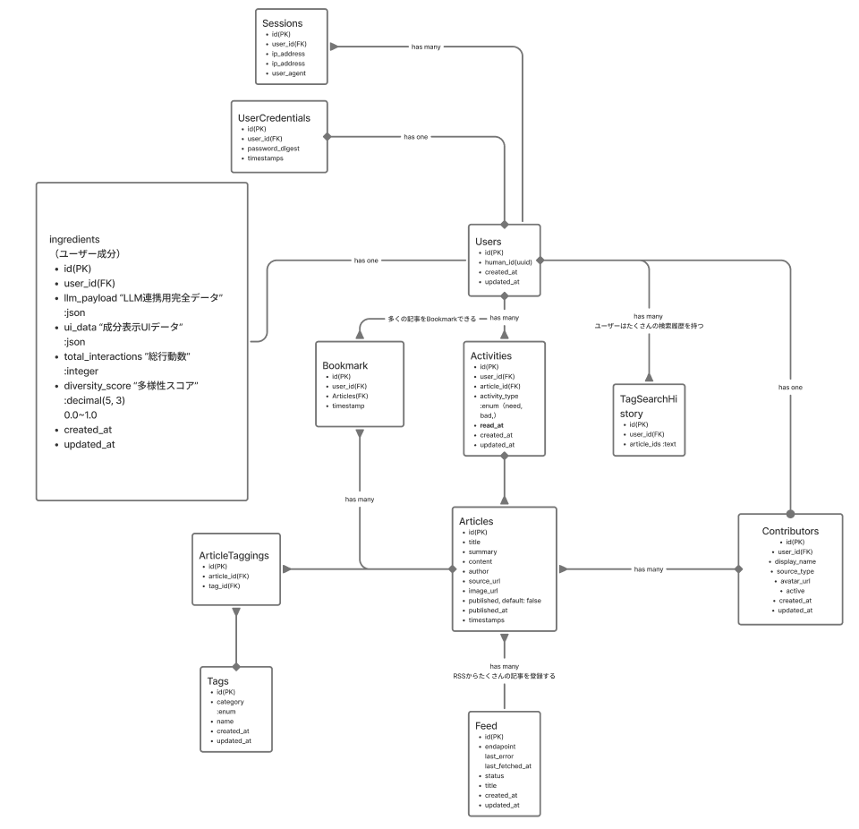
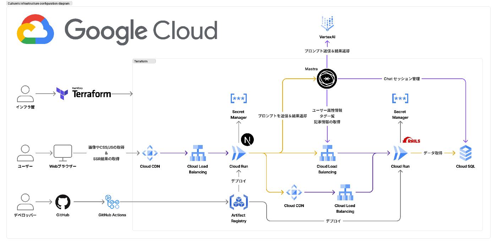
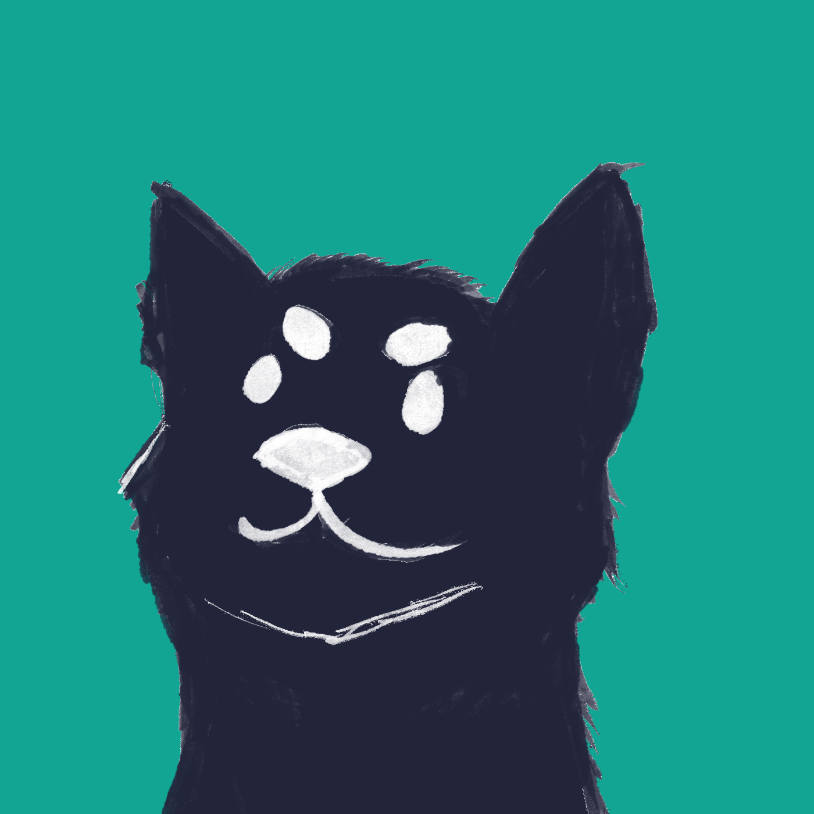

#  作った背景

こんにちはチーム「カルチャーズ」です。  
日々私たちの周りにはたくさんの情報が目まぐるしく出回っています。  
そんな時、情報収集に疲れた私たちはエージェントが寄り添ってくれるニュースアプリを作りました。そこで「カルチャー」です。

##  解決すること

  * 日々の情報収集をより効率的に自分好みの記事を閲覧できる。
  * ただ情報を読むことに特化した、UI。邪魔なるものは全て省く。

#  推しアイデア

今回のアプリではただのニュースアプリではない。Agent（黒猫さん）がいます。  
あなた（黒柴さん）は黒猫さんに「今日のニュースは？」と聞くことができ、あなたに寄り添ったニュースを届けてくれます。

しかも日々ニュースを読んだり、「ホシイ・イラナイ」を選択するたびにあなたの好みを学習してあなたに寄り添う記事の情報を提示してくれます！  
”読むほどあなた好みの記事”が黒猫さんによっておすすめされます。

#  プロジェクトの詳細

##  デモ動画

<https://youtu.be/ZGCgn5DiBOQ>

##  技術スタック

  * フロントエンド：Next.js
  * バックエンド：Rails API
  * データベース：PostgreSQL（Cloud SQL）
  * エージェントフレームワーク：Mastra
  * モデル：gemini-2.5-flash

##  ER図

###  設計

認証など  
Usersテーブルには余計なものを入れずにただ存在確認するためだけのテーブルとして位置付けました。そしてそれを実現するためにRails８系からリリースされた標準の[認証機能](https://railsguides.jp/security.html#%E8%AA%8D%E8%A8%BC%E6%A9%9F%E8%83%BD)・Jwt・Cookieを利用しています。  
ユーザーが記事を読む→読書した記録をどうやってDBに落とし込んでいくかが今回の大きな課題でした。  
案として統計情報をDBに入れる。行動履歴をDBに入れる。などさまざまな案がありましたが、今回は両者を選択してこのようなキュレーションを実現しています。  
両者を取り入れることで、都度計算する手間を省きSQL発行をなるべく減らすことを狙うとともに、日々の記録をDBに登録することで、リアルタイムにユーザーの好みを補足できます。

##  システム構成図

##  UI・UX

今回のテーマカラーはTeal（緑）です。長くみることを前提にしたプロダクトから目に優しい色をみました。  
今回はモバイルからでもみれるようにレスポンシブ対応することで、チャットと記事一覧の両者のモードを切り替えられるようにしました。  
ログイン・記事を読む・黒猫さんによるあなたへのおすすめ機能といったシンプルなものです。

ゆくゆくはおすすめされた内容が記事一覧にもレンダリングされてるようにしていきたいです。

##  レコメンドシステムの概要

###  Mastra（エージェントフレームワーク）

今回使用したのはTypeScriptによって利用できるエージェントフレームワークです。  
今回の使用した機能を紹介します。  
利用したのは２つのAgentsとTool  
Agents（プロンプトやモデル、使用するToolsを定義する）

  1. ユーザーに関連しそうなタグを考える
  2. ニュースをキュレーションする  
Tools（Agetnsが使う道具。API疎通など）
  3. ユーザーの好み・タグの情報から関連するタグを決める
  4. ユーザーの好み・タグ一覧・関連タグ検索結果記事一覧・タグ検索履歴  
これらを元にユーザー・タグ・記事を元にAgentがキュレーションしてくれます。

#  最後に

##  あとがき

メンバーは偶然のタイミングで9/11(木)に結成しました。私たちは福岡のコミュニティから来たチームです。普段からハッカソンに参加してきた私たちですが、初めてチームを組んでプロダクトを作成しました。普段の業務とは異なるプロダクトを作る体験はとても得難いものです。普段触らない技術やAIに触れる機会を得られたことに感謝します。  
まだまだ作りたい機能がたくさんあります！

記事の情報は開発者がRSSから流し込んでいます。現状は非同期ジョブを動かしていないですが、動かすと常に最新の情報がRSSから取れるようになっています。

##  メンバー

  * テックリード：[ニッシー☆](https://x.com/yukinissie)
  * バックエンド：[ゆさ](https://x.com/yusa136)
  * フロントエンド：[やっぴー](https://x.com/tatsu_08191)

##  可愛い黒柴さん

メンバーが描きました。ユーザーアイコン  

