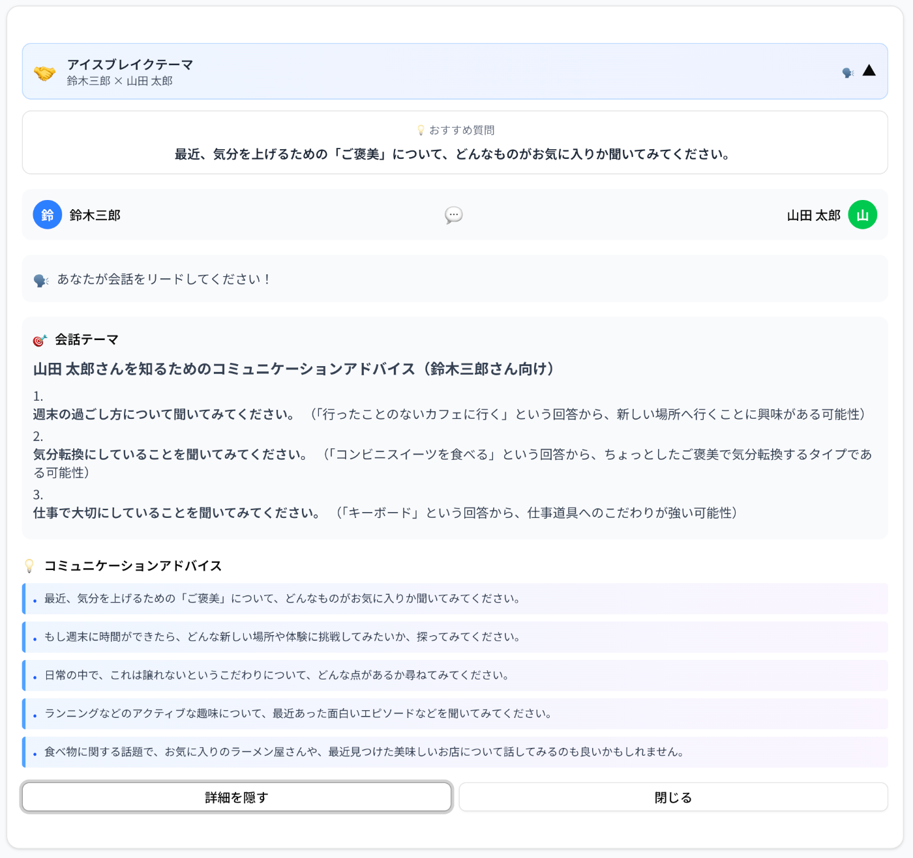
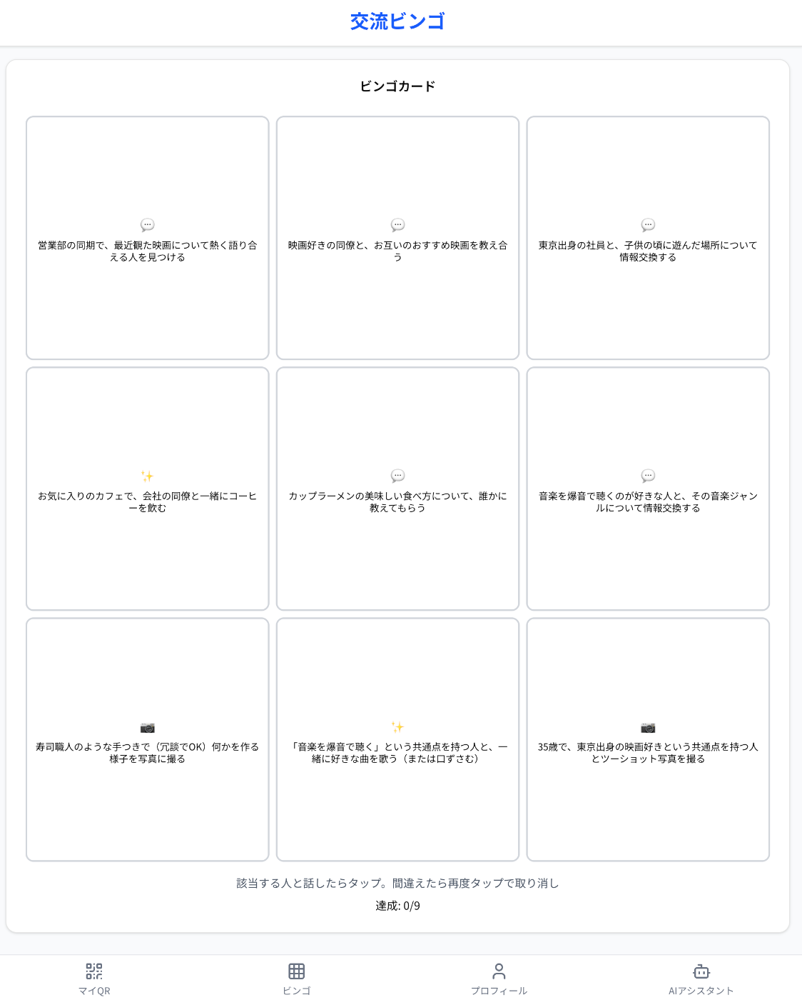
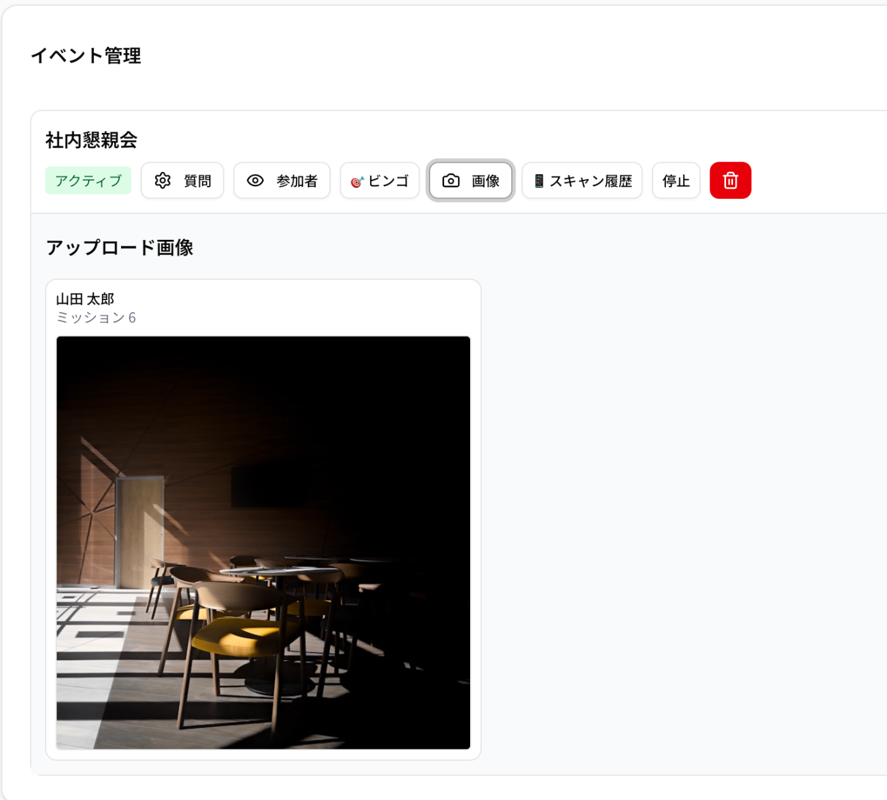
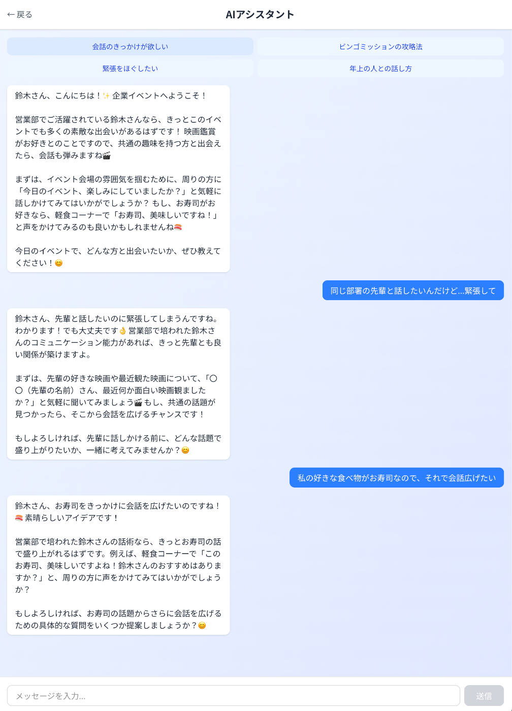
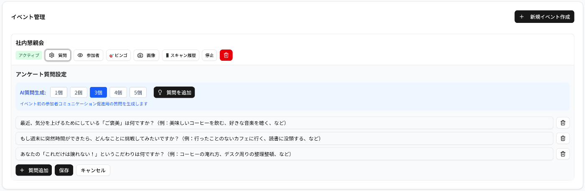
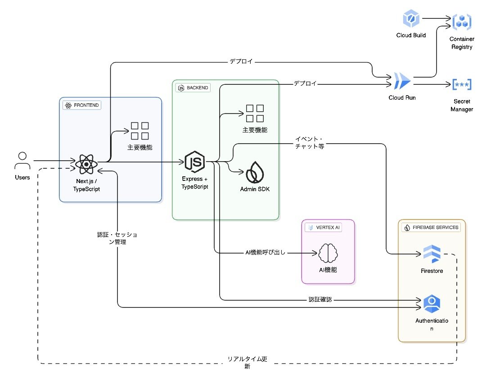

##  はじめに

今回、Google Cloudの勉強も兼ねてAIハッカソンに参加し、Webアプリケーションを開発してみました。

さて、この記事を読んでくださっている皆さん、  
「社内イベントに参加したものの、結局いつも話す人としか話せなかった…」  
「グループに分かれたけど、何を話せばいいか分からず気まずい時間が流れた…」  
そんな経験はありませんか？

私たちは、この普遍的な課題を解決するため、AI交流促進アプリ**『EnQuest』**を開発しました。  
この記事では、EnQuestがどのような課題を、どういった技術で解決するのか、その裏側にあるAIの活用方法までをご紹介します。

##  対象ユーザーと課題

EnQuestが対象とするのは、社内イベントに参加するすべての従業員です。特に、以下のような課題を感じている方に価値を提供します。

  * 会話のきっかけ不足: 部署や役職が違う人と、何を話せばいいか分からない。
  * 関係性の固定化: 結局、いつも話している人と固まってしまい、新しい繋がりが生まれない。
  * イベントの一体感の欠如: 参加者が受け身になりがちで、会場全体での盛り上がりに欠ける。

##  課題へのソリューションと特徴

EnQuestは、これらの課題をAIの力で解決するWebアプリケーションです。参加者はイベント中にスマートフォンからアプリにアクセスし、2つのコア機能を通じて新しい交流を体験します。

###  特徴①：AIアイスブレイク機能

参加者同士がQRコードを交換するだけで、**Vertex AI (Gemini)**が二人のプロフィールやアンケート回答を元に、その場、その二人のためだけのユニークな会話テーマを提案します。これにより、「何を話そう…」という気まずい沈黙をなくし、自然で楽しい会話のきっかけを創出します。  

###  特徴②：AIパーソナライズ・ビンゴ

単なるビンゴではありません。AIが各参加者のプロフィール（部署、趣味など）を考慮し、「開発部の人と趣味の話をする」「自分と同じ出身地の人を見つける」といった、一人ひとり異なるパーソナライズされたビンゴミッションを自動生成します。ゲーム感覚で楽しみながら、部署や役職を超えた偶発的なつながりを生み出します。  

ごく稀に、ミッションの中で写真をとるミッションが発生します。  
そこでアップロードされた写真は管理者画面から確認できるので、イベントのアルバムが作れちゃいます！  
（将来的にはNano Bananaを組み合わせたいです😎）  

###  特徴③：AI会話アシスタント

QRコードもスキャンし合い、ビンゴもしてしまった。  
「このあとどうやって会話したらいいのだろう...」  
そんな時のために、AI会話エージェントを用意してます！  
会話したい人の特徴を伝えたり、どんな会話をしたいのかをAIに質問することで、アドバイスをもらえます。  
これでイベントが長引いても問題なしです😄  

###  特徴④:イベントごとの質問を設定

アイスブレイクやビンゴのミッション生成のために、イベントごとに質問を設定できます。  
参加者にイベントまでに回答いただくことで、よりイベントの味が出せます。  

##  デモ動画 (約2分)

EnQuestが実際にどのように動作するのかを動画にまとめました。  
<https://youtu.be/W02PqMrlIng>

##  システムアーキテクチャ

EnQuestは、Google Cloudのサービスを利用して構築しました。  

###  技術スタック

  * フロントエンド: Next.js, shadcn/ui  
短期間で開発するためにNext.jsを選定しました。  
UIも統一感を出すためにshadcn/uiを利用し、効率的にUIを構築できました。

  * バックエンド: Node.js, Express  
フロントエンドと言語を統一したく、TypeScriptを採用しました。  
Cloud Runとの親和性が高い点も選定理由です。

  * データベース: Firestore  
リアルタイム性が高く、リアルタイム通知やダッシュボード機能に最適だと考えて選定しました。  
自身の学習のためでもあります。（まだ使いこなせてませんが...）

  * 認証: Firebase Authentication  
セキュアな認証機能を比較的容易に実装できるため採用しました。

  * AI: Vertex AI (Gemini)  
AIにはGeminiを利用しました。  
プロンプト次第で多様なアウトプットが可能な点に非常にポテンシャルを感じています。

  * インフラ: Docker, Cloud Run  
初めてCloud Runを利用しましたが、コンテナとの相性が抜群で、デプロイが非常にスムーズでした。

##  今後の展望

今回のハッカソンでは最小限の機能実装に留まりましたが、EnQuestにはさらなる可能性があります。

  * 交流データの可視化  
イベント後に「誰と誰が話したか」「どの部署間の交流が活発だったか」をマップとして可視化し、組織のエンゲージメント分析に活用。

  * 会話形式でのプロフィール作成  
Agent Builderを活用し、単調なフォーム入力をAIエージェントとの楽しい対話体験に進化させる。

これらの機能拡充を通じて、イベントを一過性のものから、継続的な組織活性化つなげていきたいと考えています。

##  おわりに

今回、Google CloudのAIサービスを活用することで、AIによりいかに「人の繋がり」を温かく、そして楽しくサポートできるかを実証しようと試みました。  
EnQuestが、社内イベントを少しでも豊かにする一助となればと思います。

最後までお読みいただきありがとうございました。
