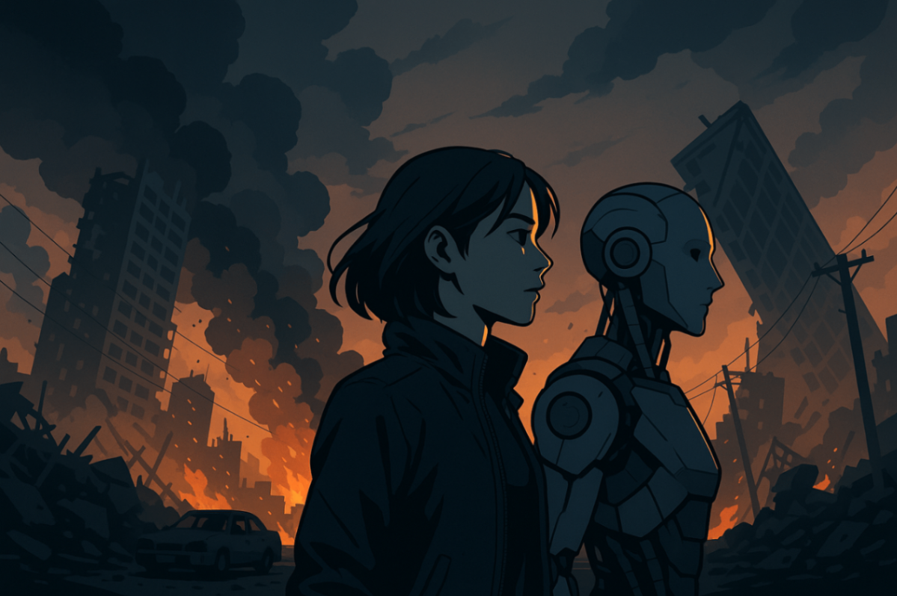
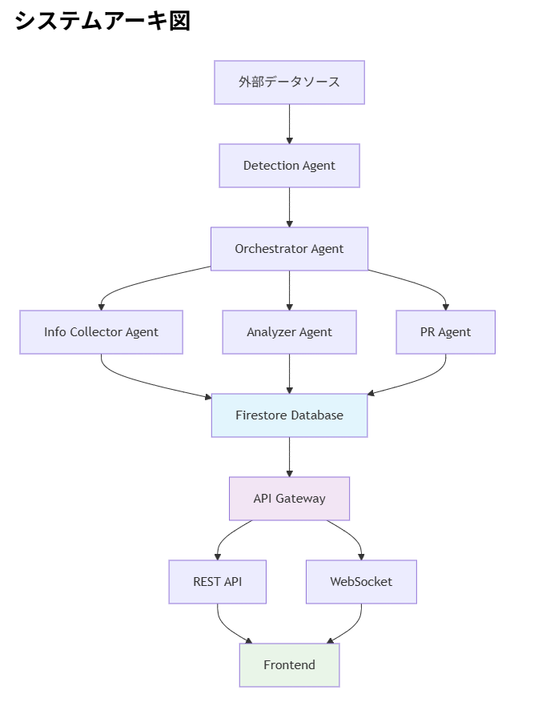

##  はじめに

2023年は記録的な高温の1年であり、世界及び日本の平均気温は統計開始以降最も高くなりました。気象庁の発表によれば、日本の年平均気温および日本近海の平均海面水温は、いずれも統計開始以来、最も高い値を記録しています。この急激な気温上昇の背景には、地球温暖化による海水温の上昇があり、それが線状降水帯や異常気象の頻発化を引き起こしています。

2024年に入っても、この傾向は続いています。元日に発生した令和6年能登半島地震では、マグニチュード7.6、最大震度7を記録し、241名の尊い命が失われました。続く9月には、石川県能登半島で線状降水帯による豪雨災害が発生し、1時間降水量や3時間降水量が観測史上1位の値を更新するなど、復興途中の被災地に追い打ちをかける形となりました。

さらに深刻なのは、今後予測されている大規模災害の存在です。政府の地震調査研究推進本部は2025年1月、南海トラフ地震の30年以内発生確率を「80％程度」に引き上げました。この巨大地震は関東から九州の広い範囲で強い揺れと高い津波が発生するとされ、最大死者数32万人、経済損失は220兆円に達すると想定されています。

これらの災害事例が示すように、私たちは未曽有の自然災害が常態化する時代に突入しています。国連防災機関（UNDRR）の報告によれば、1998年から2017年の20年間に自然災害によって世界全体で130万人が死亡し、経済損失額は2兆9,080億ドルに上りました。日本においても、世界の0.25％の国土面積に対し、マグニチュード6以上の地震回数20.8％、活火山数7.0％、災害被害額18.3％と、極めて高い災害発生率を示しています。

このような現実と向き合う中で、私たちは技術の力を結集し、人々の命と生活を守るための新たなアプローチを模索する必要があります。

##  プロジェクトが対象とするユーザー像と課題

災害発生時、テレビやインターネットのニュース、SNSを通じて災害の発生を知った人々は、複数の深刻な心理的・情報的課題に直面します。これらの課題は、適切な災害対応を阻害し、時として生命の危険に直結する問題となっています。

###  情報過多による混乱

災害時にはSNSやメディアから膨大な情報が同時に流れ、真偽の判別が難しくなります。災害時における情報の拡散は、不安や状況把握欲求を背景に偽情報やデマが広がりやすく真偽判別の難しいため、市民が正確な判断を下せなくなると指摘されています。

参考：総務省 デジタル空間における情報流通の健全性確保の在り方に関する検討会 （第17回） 災害時における真偽判別の難しい情報の伝搬傾向と 期待される各ステークホルダーの対応・対策  
<https://www.soumu.go.jp/main_content/000942565.pdf>

###  正常性バイアス（「自分だけは大丈夫」）

非常時に「大丈夫」「普通だ」と過小評価してしまう心理傾向です。平常時には心を守る働きがありますが、災害時には避難遅れや命の危険につながります。東日本大震災や西日本豪雨でも、警報下で避難しなかった事例が多数報告されています。

参考：首都圏における大規模風水害時の 防災情報の発信・伝達のあり方について  
<https://www.bousai.go.jp/fusuigai/suigaiworking/pdf/kouikihinan/dai3kai/shiryo05.pdf>

###  必要以上の不安とストレス

災害情報の過度な接触は不安やストレスを増幅させ、頭痛・過呼吸・集中力低下などの身体反応や、不安・混乱・無力感などの心理症状を引き起こします。その結果、合理的な判断や適切な行動が妨げられるリスクがあります。

参考：中日新聞【能登半島地震】「共感疲労」に悩む人へ 悲惨な映像や報道…どう向き合えばいい？  
<https://www.chunichi.co.jp/article/833687>

##  課題へのソリューションと特徴

###  アプリの名前

**What I Need to Do** （私がすべきこと）、略して**WIND**

###  アプリ機能の概要と課題に対するソリューション

WINDは、マルチAI Agentアーキテクチャを基盤とした災害情報システムです。本システムの特徴は、AI Agentによる災害情報の自動監視・要約機能と、パーソナライズされた情報提供にあります。

####  1．情報過多による混乱への対策

WINDでは、複数の専門化されたAI Agentが連携し、多数の情報ソースから災害関連情報を自動収集・分析します。情報収集Agentは、公式な気象庁発表、自治体の緊急情報、報道機関のニュース、さらにはSNS上の現地情報まで、幅広いソースから情報を取得します。

収集された情報は、自然言語処理技術を用いて自動的に要約されます。例えば、東京都内で地震が発生した場合、被害状況などを整理し、ユーザーの位置情報に基づいて優先順位を付けて最新フィードに表示します。

地理情報システム（GIS）との連携により、災害情報は視覚的にマッピングされ、ユーザーは自分の周辺状況を直感的に把握できます。これにより、情報の断片化や混乱を防ぎ、必要な情報への迅速なアクセスを可能にしています。

####  2．正常性バイアスへの対策

WINDの最も革新的な機能は、個別ユーザーの位置情報と発信されている災害情報の位置関係をAI Agentが客観的に分析し、災害が各ユーザーに与える具体的な影響を可視化することです。

さらに、過去の災害事例との比較分析により、「同規模の地震が発生した際の帰宅困難者数は約○万人でした」といった客観的なデータを提供し、ユーザーが自身の状況を冷静に評価できるよう支援します。

####  3．必要以上の不安とストレスへの対策

情報の整理・要約機能により、ユーザーは膨大な災害情報に圧倒されることなく、自分にとって本当に必要な情報のみを効率的に取得できます。

また、状況に応じた対策検討Agentが、現在の状況下で取るべき具体的な行動指針を提示します。「現在の状況では自宅待機が最も安全です」「○時頃から交通機関の復旧が見込まれます」といった明確なガイダンスにより、ユーザーの不安を軽減し、合理的な行動選択を支援します。

##  アプリのアーキテクチャ詳細

WINDシステムは、4つの主要なAI Agentから構成される分散協調アーキテクチャを採用しています。

###  1．災害発生検知AI Agent

このAgentは、定時タスクとして気象庁API、地震情報API等から情報を収集し、機械学習モデルを用いて災害発生を自動検知します。検知アルゴリズムは、キーワードベースの単純な検索ではなく、文脈理解を行うTransformerベースのモデルを使用し、災害の種類（地震、豪雨、台風等）、規模、発生地域を特定します。

検知された災害情報は、重要度スコアリングシステムにより評価され、閾値を超えた場合にオーケストレータAgentに通知されます。このスコアリングには、過去の災害データベースとの比較、人口密度、インフラの脆弱性等の要素が考慮されます。

###  2．オーケストレータAgent

システムの中枢となるオーケストレータAgentは、災害発生検知Agentからの通知を受けて、状況に応じた情報収集と対策検討の指示を他のAgentに配信します。このAgentは、リアルタイムで変化する災害状況に応じて、各専門Agentの動作を制御し、システム全体の協調動作を実現します。

###  3．情報収集Agent・対策検討Agent

情報収集Agentは、オーケストレータからの指示に基づき、ニュースサイト、公的機関の発表等から関連情報を収集します。収集された情報は、自然言語処理技術により構造化され、信頼性スコアが付与されます。

対策検討Agentは、収集された情報と個人プロファイルを分析し、各ユーザーに最適化された行動指針を生成します。

###  4．広報Agent

広報Agentは、分析・要約された情報をWEBプラットフォームを通じてリアルタイムで発信します。情報発信は、緊急度に応じて優先順位付けされ、プッシュ通知、WEBサイト更新、SNS投稿等の複数チャネルで同時展開されます。

##  システムアーキテクチャ図

##  デモ動画

<https://youtu.be/G0XikmdnuQE>

##  おわりに

地球温暖化による異常気象の激化に伴い、熱波、線状降水帯、雹、竜巻といった極端現象が私たちの生活を脅かす時代となりました。南海トラフ大地震の発生確率は80％に引き上げられ、富士山の噴火も専門家により懸念されています。このような未曽有の災害が予見される試練の時代に、偶然にも生成AI技術が実用段階に到達したことは、決して偶然ではないかもしれません。

ChatGPTが世界に衝撃を与えてから僅か数年で、AI技術は急速な進歩を遂げ、今や複雑な推論や判断を要する業務領域にまで応用可能となっています。この技術革新の波を、人類が直面する最大の課題の一つである災害対応に活用することは、技術者としての使命であると考えます。

WINDプロジェクトは、AI技術の可能性を最大限に活用し、災害時における人々の適切な判断と行動を支援するシステムです。情報過多による混乱、正常性バイアスによる判断の歪み、そして過度な不安やストレス。これらの根深い課題に対し、技術的なアプローチによる解決策を提示することで、災害による被害を最小化し、一人でも多くの命を救うことを目指しています。

しかし、技術だけでは災害に立ち向かうことはできません。個人の防災意識、地域コミュニティの連携、行政の適切な対応、そして社会全体の災害に対する備えが不可欠です。WINDが提供するのは、これらの要素を結び付け、より効果的な災害対応を実現するための情報基盤です。

未来への希望は、私たち一人ひとりの行動から始まります。技術の力と人間の叡智を結集することで、必ずや災害に負けない強靭で持続可能な社会を築くことができると考えます。
