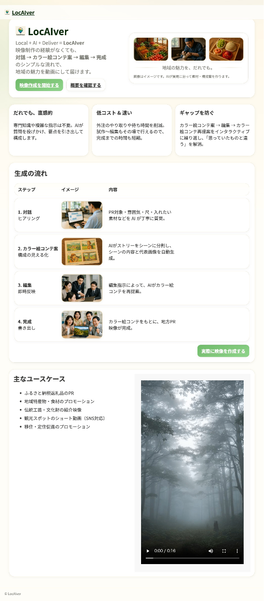
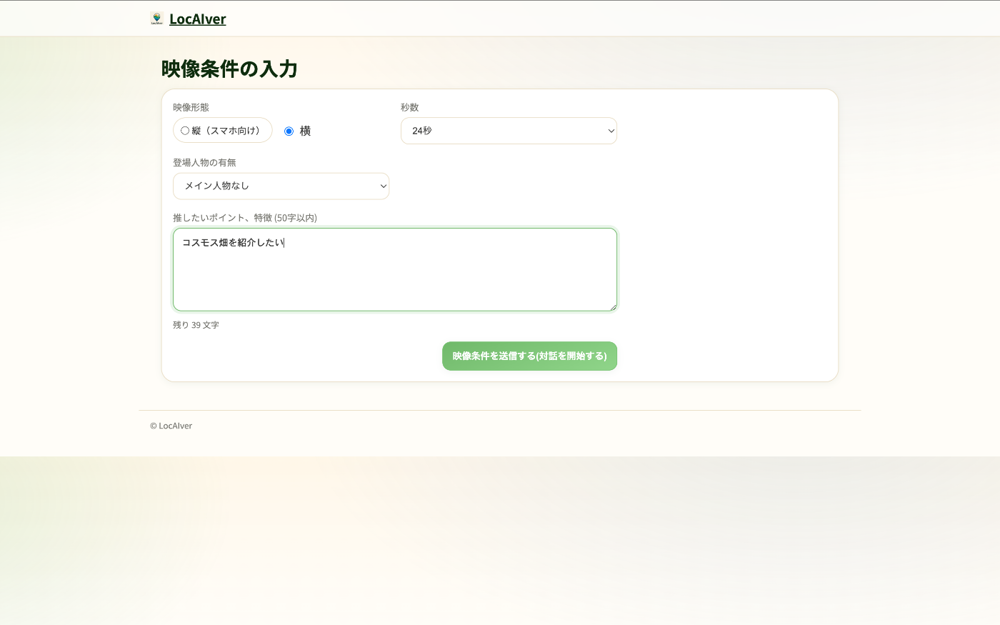
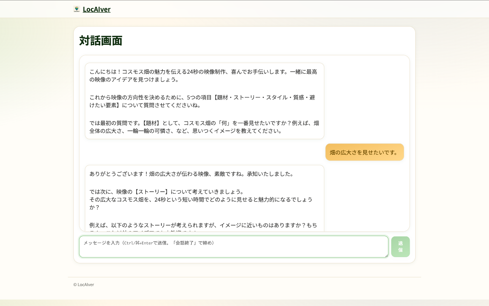
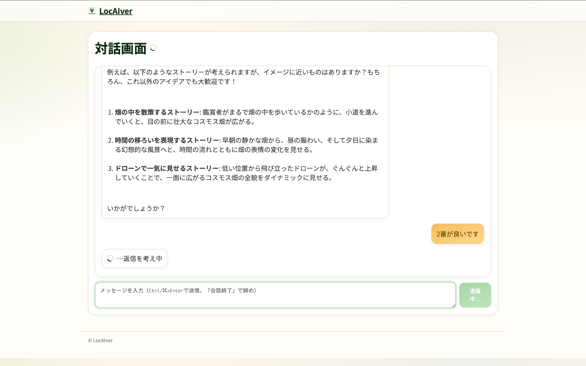
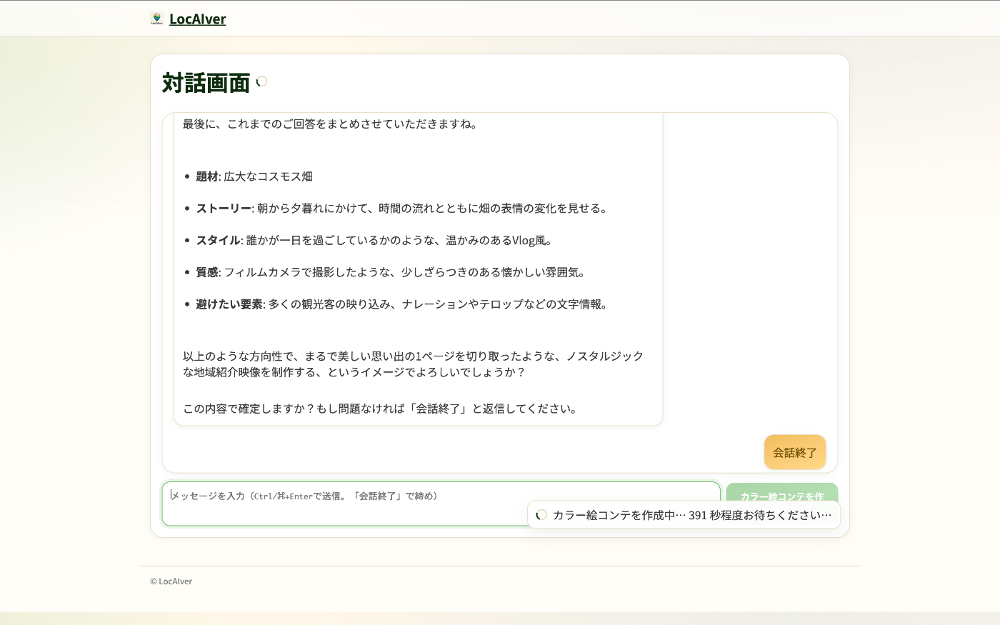
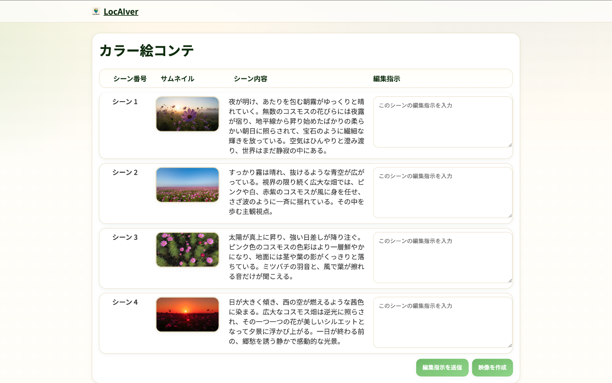
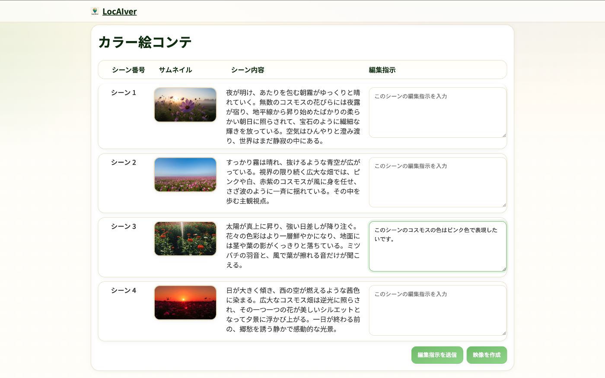
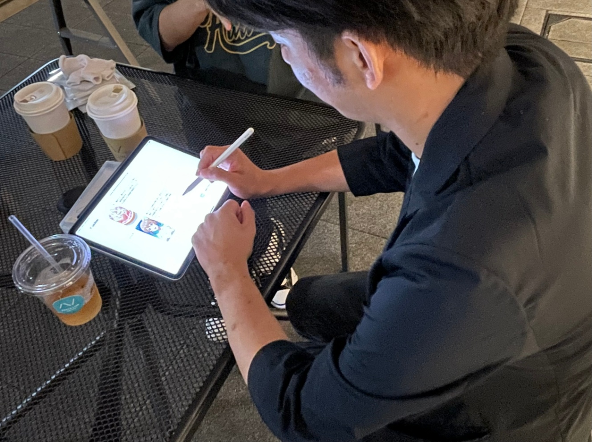

#  デモ動画

<https://youtu.be/Wffi36zZSmk>

#  1\. はじめに

日本各地には多彩な魅力があるにもかかわらず、旅行やふるさと納税などで広く知られる市区町村はごく一部に限られています。観光や特産品のPRを目的に、SNSでの情報発信を求める自治体は多いものの、人材不足や外注の高コストが障壁となり、「**伝えたいのに魅力を伝えられない** 」という課題があります。  
私たちの開発した**LocAIver**(ローカライバー)は、SNS特化型の地方PR映像を作成できる、AIを活用した新しいサービスであり、誰でも簡単に利用できます。  
サービス名の由来は、Local(地元)+AI+Deliver(運ぶ)でLocAIverです。  
対話形式で利用者の希望を引き出し、カラー絵コンテで内容を確認・編集した上で映像を生成します。従来は数万~数十万円・数週間を要した映像制作を、わずか数千円・30分以内で実現可能であるため、**費用対効果に優れています** 。さらに、拡張性を意識した設計によって、将来的なナレーション追加や長編映像対応も視野に入れており、地域の情報発信の可能性を広げる可能性を持ちます。LocAIverは「誰もが手軽に地域の魅力を伝えられる」社会の実現を目指します。

#  2\. 背景

年末年始や夏休みに旅行へ行ったことがある方は多いでしょう。  
では、その時行き先はどうやって探しましたか？  
家族や友人の話、ネット検索、書籍、最近ではSNSなど、人それぞれだと思います。

さて、ここで質問です。  
旅行で話題に上がる市区町村は、全国1500以上の市区町村のうち何%でしょうか。  
10％？20％？――実際は想像よりずっと少ないはずです。

私たちはほとんどの地域を知らず、たくさんの**魅力的な地域との出会いを失っています。**  
これは旅行に限ったことではなく、ふるさと納税を含む特産品との出会いに置き換えても同じことです。  
特産品や伝統工芸品があるのに、知名度が足りない自治体は数多く存在します。

私たちのサービスLocAIverは、  
魅力を伝えたくても伝えられていない、  
そんな地方PRのお手伝いをし、  
皆さんに**素敵な市区町村との出会い** を届けます。

#  3\. 課題・想定ユーザ

地方自治体にとって地域の魅力を発信することは、観光客の誘致や移住促進、特産品のPRなど、地域経済を支える重要な活動です。  
しかし多くの市区町村は、  
近年注目される発信手段である**SNSを用いた地方PR活動に十分対応できていない** のが現状です。

内部のノウハウや人材が不足している。一方で、外注はコストが高く継続が難しい。  
**伝えたいのに伝えられない** という課題を抱える自治体は少なくありません。  
その結果、地域が持つ本来の魅力が広く知られず、  
観光や移住、ふるさと納税の伸び悩みにつながっています。

私たちが想定するユーザーは**地方自治体・観光協会・地域団体** です。  
その中でも特に、「**映像作成やSNS運用に関するノウハウがない方** 」、「**作成したい映像イメージが浮かばないが映像を作りたい方** 」、「**PRしたいものはあるけど映像作成に関する知識が全くない方** 」を対象とします。  
課題を持った自治体がもっと手軽に、効果的に、地域の魅力を発信できるよう、  
私たちは**AIを活用した新しい地方PR映像作成サービスLocAIver** を提案します。

#  4\. ソリューションと本サービスの立ち位置

##  サービス概要

LocAIverはAIを利用して利用者が簡単に地方PR映像を作成できるサービスです。  
Vertex AIが提供するAIサービス、**Veo3** や**Imagen4** 、**Gemini 2.5 Pro** 、**Nano Banana** 、**Lyria2** をフル活用し、映像を生成します。  
近年SNSで注目度の高いShort動画での拡散を期待し、映像の尺は16秒,24秒,32秒、横映像だけでなく縦映像にも対応します。

##  利用の流れ

LocAIverの映像生成の大枠のフローを下記に示します。

  1. トップページ  
サービスの概要、用途、事例を表示しています。
  2. 映像条件の入力  
指定の秒数や映像の縦横などの条件を入力します。
  3. 対話  
AIが利用者に質問を投げかけ、PRしたい対象や雰囲気などを引き出します。
  4. カラー絵コンテ表示  
対話内容をもとにカラー絵コンテ案を生成します。
  5. カラー絵コンテ編集  
カラー絵コンテのシーンごとに、利用者が直感的に編集指示を出せます。
  6. 映像完成  
完成したカラー絵コンテをもとにAIが映像を作成します。

##  立ち位置

LocAIverの立ち位置を、いくつかの指標をもとに下記表にまとめました。

| コスト | スピード | 事前に必要な知識の少なさ | 完成度  
---|---|---|---|---  
自身で作成 | ◯ | △〜× | × | △  
外注 | × | × | ◎ | ◎  
**LocAIver** | ◎ | ◎ | ◎ | △〜◯  
  
LocAIverには大きく3つの**利点** があります。

  1. コスト  
1映像につきわずか3000円で作成できます。  
外注するとかかる数万~数十万というコストと比べると圧倒的に安価です。
  2. スピード  
スピードの面でも圧倒的に優れ、他のサービスが数日〜数ヶ月かかるところ、  
たった30分のみで完成までたどり着きます。
  3. 事前に必要な知識の少なさ  
事前知識も全く必要ありません。映像制作の知識を問われることもなければ、  
AIを扱う複雑なプロンプトも必要ありません。LocAIverが必要な知識を補ってくれます。

一方で、外注による映像作成サービスと比べて映像の完成度は劣ってしまいますが、LocAIverは、SNSで気軽に発信するPR映像として十分な完成度の映像を提供することができます

#  5\. 機能・アーキテクチャ

##  アーキテクチャ

システムアーキテクチャ図は、以下の図のようになっています。  
  
_システムアーキテクチャ図_

フロントエンドとバックエンドはそれぞれ独立した**Cloud Run** サービスで動いており、通信でやりとりをしています。  
独立させることで、問題を局所化し、運用のしやすい体制になっています。  
フロントエンドは**Next.js** 、バックエンドは**Python Flask** でそれぞれ実装されています。  
映像生成に使う各種Vertex AIサービスはバックエンドから接続され、  
途中過程でできた生成物(jsonファイルや画像、映像)は**GCS**(Google Cloud Storage)に保存します。

##  各機能の詳細

本章ではLocAIverの各機能について紹介します。

###  トップページ

トップページでは、LocAIverのサービス概要、一部映像生成例が表示されています。

  
_トップページ_

###  映像条件の入力

映像条件入力では、写真のように映像作成の必要要素4つを入力します。  
  
_映像条件の入力_

フォーム項目以上の詳細はAIとの対話で深ぼられるため、**詳しく書く必要はありません** 。

###  対話

対話はAIが利用者から映像の詳細イメージを引き出す最重要フェーズです。  
対話は下記写真のようなチャットアプリに模した画面で行われます。

  
_対話画面_

今回の想定利用者は「具体的な映像イメージが浮かばないが映像を作りたい」という自治体職員なので、  
**AIが利用者に対して質問を投げかけ、能動的に深掘りを行うことが非常に重要** になります。  
対話は会話に優れたGemini 2.5 Proを主にしており、下記フローで行われます。

LocAIverの対話は**質問時に候補選択肢を表示する** 工夫を施しています。  
質問と合わせて候補選択肢を利用者に提供することで、利用者に映像作成の事前知識がない場合でも**回答しやすい対話を展開するような対話エージェント** を設計しています。  
(候補選択肢外の要件を指定することもできます)  
  
_AIエージェントが選択肢を示してくれている様子_

対話エージェントからの質問が終了した際には、  
対話履歴が整理され、サマリーが表示されます。  
サマリーの内容に問題がなければ、「会話終了」と送信すると、  
次ステップのカラー絵コンテの作成が始まります。

  
_会話終了の様子_

###  カラー絵コンテ表示

カラー絵コンテは**本サービスの核** となる機能です。  
カラー絵コンテの存在意義は、大きく2つあります。

  1. 映像制作をする前に、ストーリーやサムネイルを**確認/修正できる**
  2. 後の映像制作時にサムネイルを使用することで、完成映像の**精度の向上** につながる

実際のカラー絵コンテ画面は、以下写真のようになります。  
  
_カラー絵コンテ画面_

下記フローは、カラー絵コンテ表示するフローです。

  1. ストーリー作成  
Gemini 2.5 Proがストーリーやスタイルを含んだjsonファイルを作成します。
  2. ストーリーの分割  
次にGemini 2.5 Proにより、ストーリーをシーンに分割します。シーンに分けることで、Veo3の最大映像時間8秒という要件でも、十分に満足のいく映像作成が可能です。この時点で、映像を考慮した光や画角、焦点などの情報も作成します。
  3. メイン人物の生成(メイン人物有の場合)  
メイン人物有を指定した場合は、作成したストーリーに登場するメイン人物の画像を**Imagen4** で作成します。
  4. サムネイル生成(メイン人物有の場合)  
メイン人物有の場合は、**Nano banana** でシーンのサムネイルを作成します。Nano bananaの入力は、作成したストーリーと、メイン人物の画像を用いています。
  5. サムネイルの生成(メイン人物無の場合)  
メイン人物無の場合は、**Imagen4** でシーンのサムネイルを作成します。入力で使うのはストーリーの内容のみです。
  6. カラー絵コンテ表示  
以上の処理で作成したカラー絵コンテを利用者に向けて表示します。

###  カラー絵コンテ編集

カラー絵コンテの存在により、ユーザが完成映像を確認する前に編集をすることが可能になります。  
このメリットは下記の2つです。

  * **所用時間の抑制**
  * **コストの抑制**

映像作成には所要時間もコストもかかりますが、**映像がなくとも容易に映像を想像できるカラー絵コンテ** のおかげで、上記のような絶大なメリットを受けています。

利用者は以下の画面のように編集指示を入力し、  
編集を送信ボタンを押すだけで、カラー絵コンテを編集できます。  
  
_カラー絵コンテの修正をしている様子_

カラー絵コンテ編集は下記フローで構成されます。

この編集は**利用者が満足するまで** 続けることができます。  
編集が不要な場合は、映像作成ボタンを押すと、次のステップの映像作成が開始します。

###  映像完成

ユーザが承認したカラー絵コンテ内の要素を**Veo3** への入力とし、各シーンの動画を生成します。  
入力として利用するのは、各シーンのシーン内容のテキストとサムネイル画像です。  
各シーン内容のテキストはVeo3に入力する前に、Veo3の映像作成規定にかからないようテキスト内の不適切な語を書き換える処理を行う工夫をすることで、生成成功率を上げています。  
そして、Veo3によって生成された各シーンの映像を連結し、一本の動画に仕上げます。  
その後、**Lyria2** によって生成したBGMを付加することで、ユーザに提供する映像を完成させます。

フローは以下の通りです。

#  6\. 検証、実証実験

実際に使用するユーザを想定して、映像制作に関する知識がないユーザ8人(地方自治体関係者を含む)にLocAIverを体験していただき、評価をしてもらいました。いただいた意見の一部を記載します。  
  
_体験してもらっている様子(※体験してくださった皆さん、ご協力ありがとうございました。)_

全体の使用感：  
・**要望通り** にポップな雰囲気に仕上がってよかった。街ブラ感という曖昧な指示をしたが、想像していたような映像に仕上がった。  
・とても使いやすくて、自分の**意図をいい感じにAIが汲み取って** くれたように感じてとても良いと思った

使いやすいと感じた部分：  
・肯定的に話を進めてくれることで要望を伝えやすくなった。**一緒に作業してくれている気分** 。  
・カラー絵コンテに対して**修正が伝えやすい** 形式になっていてよかった。最終的に生成される動画のイメージがその時点でできた。  
・対話形式なので、自分の作りたい**動画内容が固まってなくても、深掘りして固めてくれる**  
・**絵コンテを作って動画前にイメージ確認** させてくれるところ。  
・細かく聞いてくれるから、映像はだいぶ自分の想像に近いものができた。**想像より短い時間で** 作成できた。

実際に1つの動画を作成するのにかかる時間は1人あたり**約25分** でした。  
また、生成に必要な費用はほとんどVeo3による映像生成料金に依存し、**24秒の映像で約1600円** でした(運用管理費を除く)。これは従来の外注による映像制作サービスに比べて**スピード感やコスト面** で圧倒的に優れていることを示しています。

いただいたコメントにもある通り、AIと対話することで制作する動画のイメージが徐々に湧いてくることに対して好印象な意見や、動画生成に移る前にカラー絵コンテに修正を入れることができる点について高評価をいただきました。ユーザは生成された動画に対して概ね満足しており、LocAIverが目指し、満たすべき要件を満たしていることを確認することができました。

#  7\. 今後の展望(拡張可能性)

LocAIverは、さらなる拡張可能性を秘めています。  
例として、3例挙げます。

  1. ナレーション機能の追加  
ナレーションをAIで自動生成することで、映像の完成度をさらに高めることも可能です。
  2. 映像の尺  
現状は短尺動画で設計していますが、将来的には長編動画や複数シナリオを組み合わせた**ドキュメンタリー的コンテンツ** への対応も視野に入れています。
  3. 完成までの速度  
現在は、画像や映像の作成に失敗した時に、複数回リトライするような形で制御を行っています。  
そのため、余分に時間がかかっている部分があることは否定できません。  
今後、コンテンツ生成が安定するような仕組みを実現することで**完成までの速度を上げる** ことができると考えています。

これらの拡張により、より本格的な映像制作に取り組めるようになるはずです。結果として、自治体が持つ魅力をより多くの人々に届けられるような未来を届けられると私たちは信じています。

#  8\. 終わりに

今回のハッカソンを通じて、  
「AI Agentが、現実を豊かにする」というテーマに挑戦しました。  
AIハッカソンの特徴にも上げられたAI技術である**Veo3** と**Imagen4** を用いることで、  
映像制作の経験がない人でも簡単に映像を作成できる仕組みを作りあげることができました。  
限られた開発期間で技術選定や試行錯誤を重ね、  
1つのプロトタイプにまとめ上げられたことは、大きな成果であると感じています。  
地域の魅力を発信するという、日本全国に影響を与える大きな課題に取り組む中で、  
**生成AIのスピード感や柔軟性** が従来の発想では難しかったアプローチを実現できることを確認できました。  
今回の開発を支えてくれたチームメンバー、  
そしてこの機会を提供してくださったハッカソンの運営・関係者の皆様に深く感謝いたします。  
この経験を土台として、今後は実証や改良を重ね、  
実際に自治体や地域の広報活動で役立つ形へと発展させていきたいと考えています。
