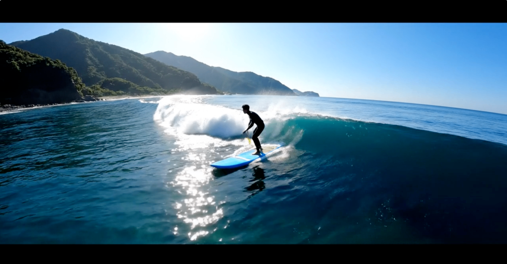
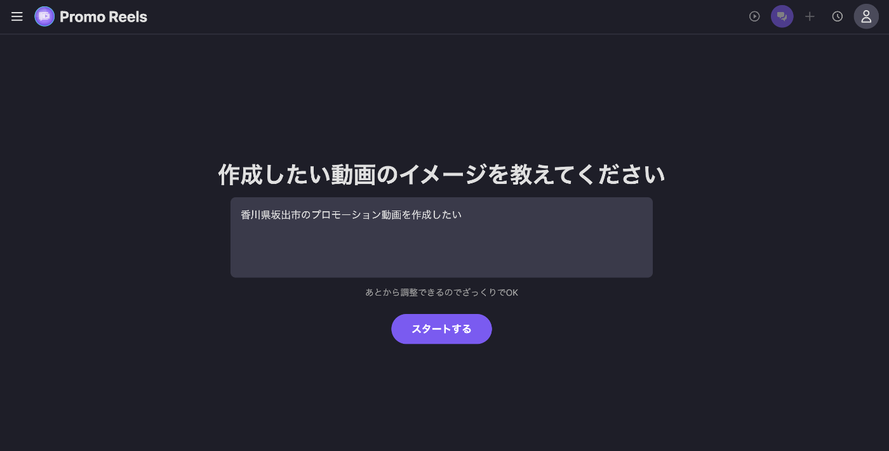
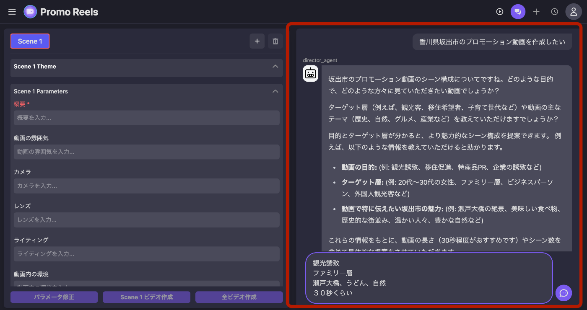
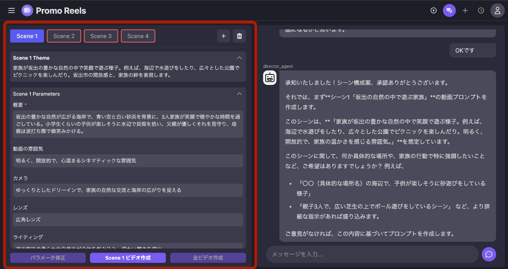
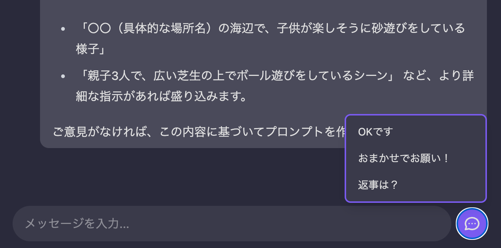
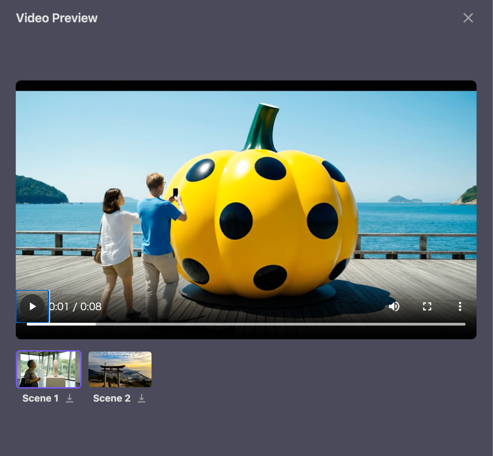
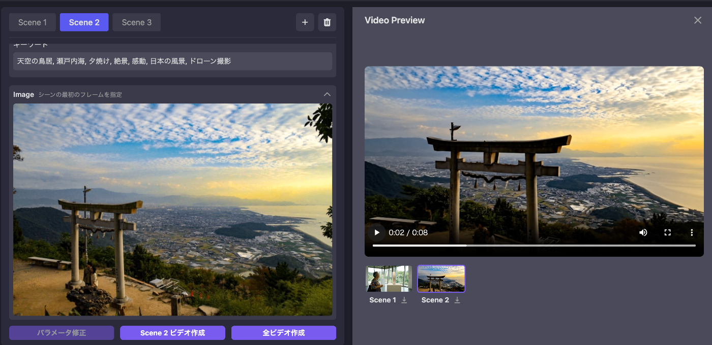
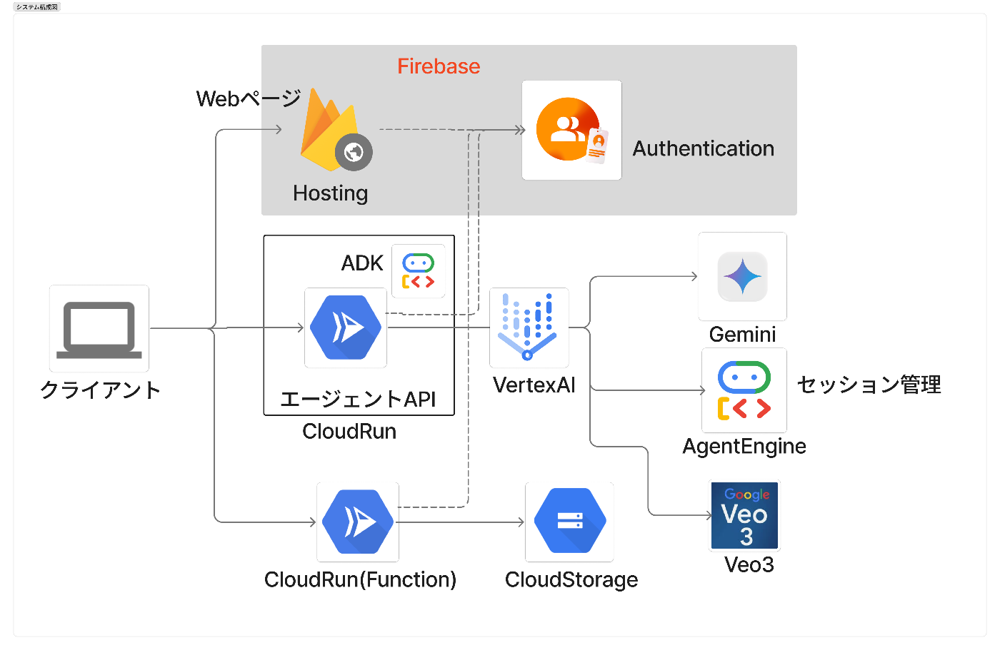
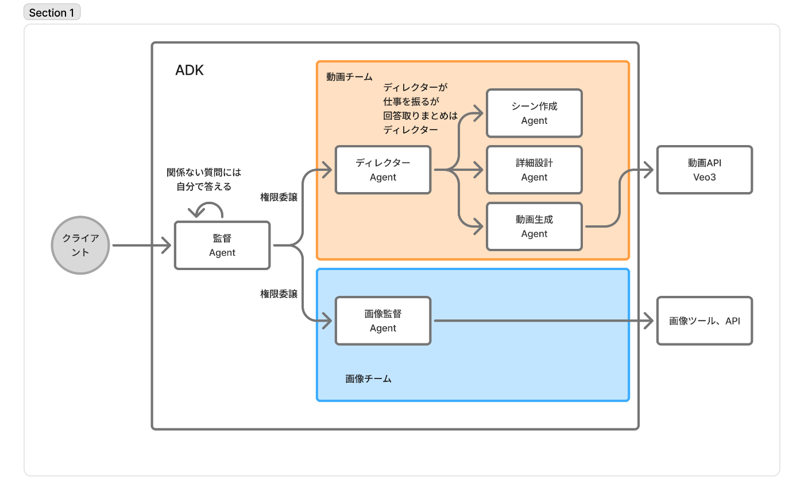

<https://www.youtube.com/watch?v=M0kotBvRnE4>

##  1\. 背景

あっという間に私たちの仕事や生活にAI技術が浸透しました。  
AIを使っていてまだ不完全さを感じることもままありますが、短時間でトライアンドエラーを重ねられることは非常に大きな強みであり、プロトの制作などあっという間にできるようになって時代に大変感謝です。

一方で、時間をかけないと解決しないものもまだありそうです。  
私たちが経験によって身に付けている、時間をかけないと身につかない技術や感性です。

たとえば”素敵に映像を撮る”などです。

個人も企業も自治体も個別にメディアチャンネルを持つようなこの時代だからこそ、映像は発信という点において大きな武器です。特にPRが必要な場合には大きく役立つものですが、人の少ない私の田舎もうまく発信ができていない印象があります。

映像制作はまだまだ職人技術っぽいところがあります。特に、”こういう映像を撮る！”と決めるのがむずかしいのです（個人の感想です）  
私は映像のカメラマンをかじっていましたが、駆け出しの頃お仕事の際には大変に悩んだものです。

これもトライアンドエラーを繰り返すしかないのですが、それは非常に時間がかかるものです。  
どういう角度で撮ればどう見えるのか、どういう光でとると情緒があるのか、レンズはどうだ、頭で考えることはたくさんできても、試すには移動や機材セッティングを含めると相当に時間が必要なのです。

嘘かと思うほどリアルな映像が生成できるようになってきた今、少しでも短時間でこのギャップを埋められるツール、さらには誰でもいい感じの映像をディレクションできるツールを目指してPromo Reelsを開発しました。

##  2\. 目標と課題

###  目標

「PRしたいものがある！」、「撮りたいものがある！」という漠然とした目的だけしか持っていなくても、誰でも

  * こういう構図でこういうシーンを撮影する
  * どういう場所でどのように撮影するか

などの計画をたてられるツールを作ります。

ツールやUIの開発にあたって今回「地方のPR担当者で動画について詳しくない人」を主なユーザ想定としました。

###  課題

映像制作が難しかった要因はいくつか考えられます。（実際に私が感じていたことです）

  * 現実世界で色々な条件で試すには時間がかかる 
    * 適切な時間やライティングや機材の選定は感覚を掴みづらい
  * そもそも素敵な撮影パターンがたくさん思いつかない 
    * 素敵なパターンに出会うにはリニアに時間がかかる
    * 出会うパターンが好みで偏る
  * 題材にしたい物や場所はあるけど簡単に試せない 
    * 現地の事前取材は普通は大変すぎる
    * いざ取ろうと思うと想像と違う
  * CGやアニメはやっぱり現実の物とは違う 
    * こうやって撮りたいな！って思っても現実は違うからやはり現実のものでイメトレすべき

このようなものの解決を目指します。

##  3\. 設計・機能

###  コンセプト

  1. "このツールのプロじゃないと扱えない" ツールにはしない

  * 深く考えなくても扱えることを意識 
    * 頭で思ったことを映像にできる
    * 次々に色々なパターンを試せる
    * 新しい映像に出会える
    * 次々にいろんなパターンの映像に出会える

  2. フィクションで終わらせない

  * ただのAIツールの操作で終わらないよう、現実世界での撮影を意識できる作りにする

###  機能

####  目的から始められる

  * 専門的な知識、明確な手段が決まっていない状態からでもスピーディーに制作開始できることをいしきしました。
  * ざっくりと目的だけ伝えればAIとの壁打ちが始まります。

  * チャット形式で対話しつつ、シーン割を決めていくことができます。
  * 明確な意思がなくても動画の目的や対象、秒数などについて質問されるので回答していけば方針を提案してくれます。
  * 簡単に方針の変更や要素の追加もできます。
  * 結果をみて修正したり反省したりするトライアンドエラーが大事だと思っているのでこの段階ではサクサク進められることを意識しています。

####  具体的なシーンへの落とし込みと調整

  * ざっくりとしたシーン割がきまったら、シーンの詳細を詰めていきます。
  * 動画の雰囲気や、カメラの動き、使うレンズなどについて打ち合わせます。
  * 下記のような要素を設定できます。映像的な話と、AIが動画を生成するときに理解しやすいようなパラメータとが混ざっていますが、感覚的には実際の映像制作の言語化と似ています。 
    * 動画概要
    * 雰囲気
    * カメラの動き
    * レンズの特性
    * ライティング
    * キーワード
  * 正直分からなければAIにお任せしましょう。大事なことはこの設定で出来上がった映像がどんな感じか理解することですので、一旦意見を出さなくてもどんどん進められます。
  * 空撮や広角レンズなどもVeo3は余裕で表現してくれます。

  * 考えなくても勧められるように「OK」、「おまかせで」ボタンがあるので映像化までどんどん進めることができます。
  * もちろん明確にやりたいことがある人や、映像を見た結果修正したい場合は、左の欄の設定値を手動で変更したり、AIに変更を依頼することが可能です。

####  動画確認

  * シーン詳細が決まったら各シーンの動画を作成できます
  * 現在Veo3は1動画8秒までなので１シーン８秒としています。
  * シームレスに再生できるようにプリロードしておいて連続再生することで、できるだけ１動画に見えるようにしています。
  * ダウンロードもできます
  * 映像をみてもう少し違うパターンを試したければ設定や舞台を変えます

####  そして現実へ

  * Veo3がそもそも実に写実的なので、現実を舞台にした撮影というところを十分に意識できるのですが、実際に存在する場所でイメージを掴むことが重要です。
  * 設定領域に実際の写真を添付すると、その写真からカットが始まります。

###  システム

####  システム構成

  * Webアプリ 
    * Firebase Hostingに静的ページをホスティング
    * フロントエンドは React+typescript+tailwindcss
    * Authentication で認証されたユーザのみ扱える 
      * Loginページのみ認証なし
      * それ以外はルールでFirebase Functionsに飛ばして認証あり
  * AIエージェント 
    * ADKを使ってマルチエージェント開発
    * CloudRunにデプロイ
    * SessionやStateの永続化のために AgentEngineを利用
    * VertexAI経由でGeminiやVeo3のAPIを利用
  * ストレージ 
    * 画像、動画をCloudStorageに保存
    * ユーザからのアクセスはCloudRun（Functions）でFirebase認証ユーザのみに限定
    * CloudRun内からのアクセスはサービスアカウントの権限で通信

####  エージェント開発

  * ADKを使ってエージェント開発 
    * Supervisor：リクエストの振り分け & 関係ない質問に返答 
      * 他のエージェントに権限を委譲
    * ディレクター 
      * 動画生成関係を引き受ける。ただし、他エージェントはAgentToolとして使って回答はとりまとめ
    * シーン作成：ざっくりシーンを作成する
    * 詳細設計：各シーンの詳細や設定値を決める
    * 動画生成：Veo３で動画を生成する
    * 画像生成など
  * エージェントをどのくらい分割するのか、程度に悩んだ
  * あまり責任を持たせすぎると曖昧な結果になるので細かく分けた
  * ただし連携に曖昧さが出ることがあったので設定やContenxtの設定によって動作を安定させた

##  4\. おわりに

Veo3の写実性がかなり高いことで、フィクションの世界と現実の世界の垣根が低くなった。  
映像的にリアルという意味ではなく、さらに現実に寄せることでかなり効果の高いツールになると感じた。  
リアルではできない、現実世界的なものの見え方での撮影のトライアンドエラーを手軽に試すことができるので、コーディングにおけるプロト・モック制作の感覚で映像作品の初版を作れるだけでなく、感性を養うことに繋がると感じている。

実際の写真や地図情報、Map写真やデータを活用連携すれば更なる発展・効果の向上が目指せそうだ。間に合わなくて断念。残念。

AIはユーザとして使っていて力を入れて開発したことはなかったが、結果の揺れを減らす調整が難しい。いいところでもあるが、そのあたり勉強してより良いものにしていきたい。
