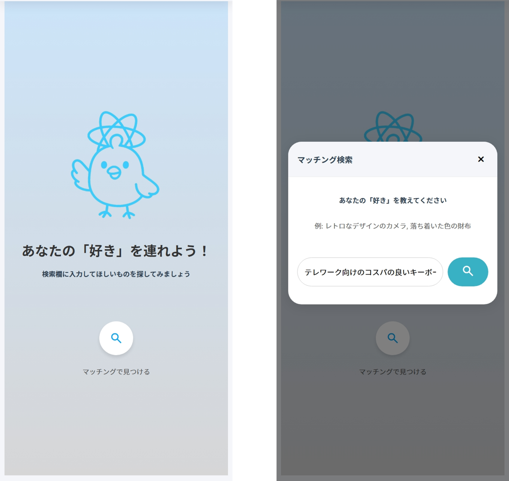
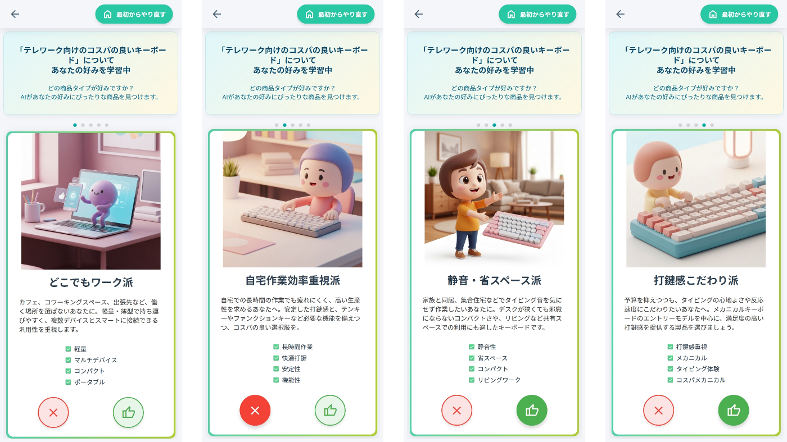
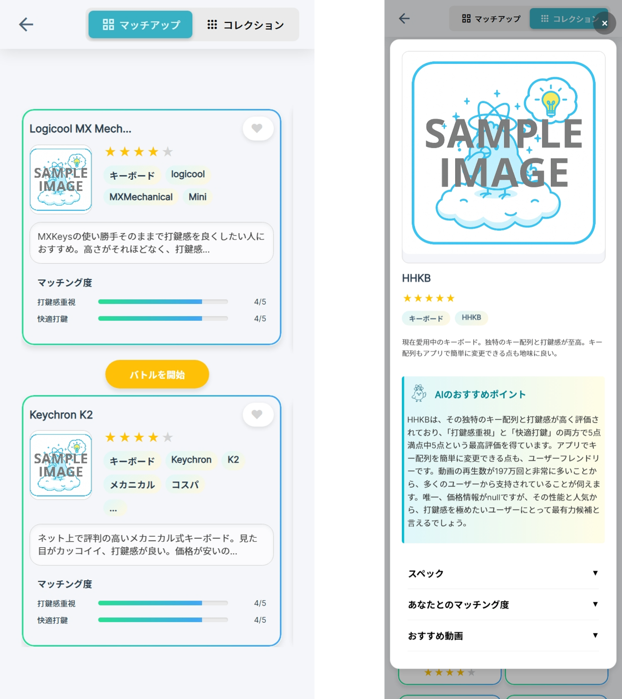
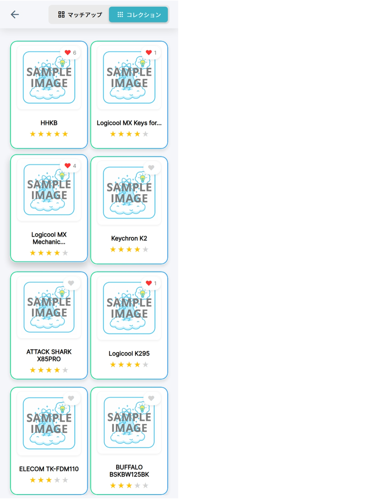
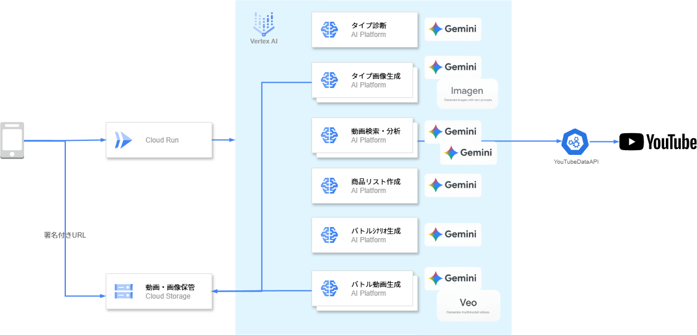

#  はじめに - 私がキーボード選びで感じた、もどかしさ

「新しいキーボードが欲しいな🎵」

軽い気持ちでYouTubeを開いたのが、全ての始まりでした。メカニカル、メンブレン、静電容量無接点...。沼に足を踏み入れると、そこは情報の海。キーの"軸"の種類を調べるだけで数時間。いったいいくつあるの...。ガジェット系YouTuberの動画を片っ端から見ても、本当に知りたい核心的な情報にはなかなか辿り着けません。

気づけば1ヶ月。プライベートの時間はほとんどスマホの画面とにらめっこ。「早く最高のキーボードで仕事がしたい」というワクワク感はいつしか消え、「まだ見ていない動画があるせいで損をするかもしれない」という、宿題に追われるような義務感と焦りに変わっていました。

やっとの思いで購入したキーボードには満足しています。でも、心の底から叫びたい。

**📢買い物のプロセスって、本来もっと楽しいものじゃなかったっけ！？📢**

この想いを仲間や友人に打ち明けてみると、返ってきたのは意外なほど強い共感の嵐でした。  
「わかる」  
「YouTube見始めると本当に時間溶ける」  
「結局、最初の動画の内容なんて忘れちゃってる」

このもどかしさを感じていたのは、私だけではなかったのです。

この情報過多の時代がもたらした、誰もが心のどこかで感じていた **「豊かさの裏側の不自由さ」** 。これを解決したいという、 **みんなの悔しい想い** が、私たちのプロジェクトの原点です。

#  AIエージェントが変えるべき「現実」とは

価格比較サイトやレビューまとめサイトは、確かに便利です。しかし、私たちの感じる「比較検討の疲れ」を根本的には解決してくれません。なぜなら、

  * **画一的すぎる比較軸:** サイトが用意した一般的なスペック比較が中心で、「私」が本当に重視するニッチなポイント（例：「静かだけど、しっかりとした打鍵感が欲しい」）では比べられない。
  * **情報の信頼性の問題:** ECサイトのレビューは、残念ながらサクラレビューの疑念が拭いきれません。一方で、実際に利用している様子が見えるYouTubeの動画レビューは、レビュアーの個性や本音が垣間見えるため、信頼性が高いと感じる人が多いという傾向があります。
  * **情報へのアクセシビリティの悪さ:** 結局、自分が求めるピンポイントな情報は、長尺の動画や大量のテキストコメントの中から自力で探し出すしかなく、膨大な時間と労力がかかります。

私たちは、この **「パーソナライズされておらず、信頼できる情報へのアクセスが困難な状態」** こそが、現代の買い物体験から楽しさを奪っている本質的な課題だと考えました。この現実を、AIエージェントの力で「豊か」に変えること。それが私たちのミッションです。

#  私たちのAIエージェント「ラクばと！」が届いてほしい人

私たちは、以下のような「もどかしさ」を抱える人々に「ラクばと！」を届けたいと考えています。

  * **ガジェット大好き！でも時間がないITエンジニアＡさん（28歳）:**  
最新情報は追いたいけど、レビュー動画を1から見る時間がない。要点だけを効率的に知って、買い逃しをなくしたい。
  * **賢くお買い物したい！トレンドに敏感な主婦Ｂさん（35歳）:**  
専門用語は苦手。広告に惑わされず、子育て世帯ならではのリアルな使い勝手を知って、コスパの良いものを選びたい。
  * **モノ選びに失敗したくない！慎重派な大学生Ｃさん（20歳）:**  
高価な買い物だから絶対に失敗したくない。ネットに溢れる玉石混交の情報の中から、信頼できる客観的なアドバイスが欲しい。
  * **家族と趣味を大切にする、頼れる親父Ｄさん（48歳）:**  
昔ほどガジェットに詳しくないけど、家族のために良いものを選びたい。「で、結局何が違うの？」を分かりやすく教えてほしい。

#  「ラクばと！」がもたらす、新しい豊かな体験

もし、あの日の私が「ラクばと！」を使っていたら、世界はこう変わっていたはずです。

##  Before

1ヶ月間、毎日数時間を動画視聴に費し、心身ともに疲弊。情報を整理できず、購入を先延ばしにし続ける...😵‍💫

##  After

**Step1.** 🗣️「ラクばと！」に「テレワーク向けのコスパの良いキーボード」とざっくり伝える。  

**Step2.** 💡AIエージェントが生成したいくつかの質問に答えるだけで、自分が「打鍵感」と「静音性」を特に重視していることに気づかされる。  

**Step3.** 🃏AIが複数のYouTube動画から私の好みに合うキーボードをピックアップし、カードとして提示してくれる。カードには重視するポイントの充足度がゲージで表示され、一目瞭然。  
  
（画像は本来ショッピングサイトから読み込む予定ですが使用許諾等々検討不足のためサンプル画像にしています。）

**Step4.** ⚔️気になるキーボードを2つ選んで「バトル」開始！まるでゲームのような動画が流れ、キーボード自身が「私の打鍵感は、まるで雲の上を歩くような心地よさです！」「静音性なら私にお任せを。深夜の作業でも家族を起こしません！」と、レビュー動画の内容を元に自己PRを始める。  

**Step5.** ❤️数回のバトルをゲーム感覚で楽しんだ結果、たくさんの「❤️」がついたお気に入りの一品。ものの1時間で、心から納得できるキーボードに出会え、笑顔で「ポチる🛒」ことができた。翌日には最高の環境で仕事を始めている😙――。  

「ラクばと！」は、退屈な情報収集を、**AIとの対話とゲームを通じた自己発見のエンターテイメント** へと昇華させるのです。

実際にプロトタイプを触ってくれた方々からも、私たちの仮説を裏付ける嬉しい声をいただきました。

> 「AIに好みを分析される中で、自分でも気づいていなかった『本当に大事にしている価値観』を発見できたのが面白かった」  
>  「『AIにおすすめ商品を探してもらう！』ボタンを押した後のアニメーションが素敵で、待ち時間もワクワクしました」  
>  「ぼんやり欲しい物がある時、いつもなら手当たり次第に動画を見てたけど、これなら**欲しい物に最短距離で近づけるきっかけをくれる** と感じます」

#  3分でわかる！AIエージェントが動く様子

私たちのAIエージェント「ラクばと！」が、実際にどのようにユーザーの買い物を楽しく、楽にするのか。ぜひこちらのデモ動画をご覧ください。  
<https://youtu.be/1v1sYinmt-k>

#  豊かな体験を支える舞台裏

「楽で楽しい」という最高のユーザー体験は、堅牢かつモダンな技術スタックによって支えられています。  

##  技術スタック

  * **フロントエンド:** React (TypeScript), Vite, Sass, React Router, Axios
  * **バックエンド:** FastAPI (Python), Pydantic, Uvicorn, YouTubeDataAPI
  * **AI/ML:** Agent Development Kit（ADK）, Google Cloud Vertex AI SDK, Gemini, Veo, Imagen
  * **インフラストラクチャ:** Google Cloud Run, AgentEngine, Google Cloud Build
  * **開発支援:** VS Code Dev Containers, Cloud Code, Gemini Code Assist, Gemini CLI, GitHub Actions

#  私たちが「魂を込めた」ポイント

今回のハッカソンで、私たちが特に情熱を注いだのは以下の2点です。

##  1\. "作業"から"対話"と"熱狂"へ：徹底したUXへのこだわり

私たちは、ユーザーがデータを「読み解く」のではなく、まるで**商品とコミュニケーションをとっているかのような体験** を目指しました。AIがユーザーの潜在的なニーズを掘り起こし、商品自身がバトル形式でプレゼンする。この「ゲーム」のような体験を通じて、ユーザーがいつの間にか自分の好みを理解し、熱中しながら最適な商品にたどり着く。このUXこそが「ラクばと！」の心臓部です。

##  2\. 初心者チームの挑戦と "AIとのペアプロ"

実は私たち、ReactもGoogle Cloudも初めて触る初心者集団でした。しかし、「ハッカソンで何かを成し遂げたい！」という想いのもと、Gemini Code AssistやGemini CLI、Gemini APIを "最高の相棒" として開発に挑みました。AIに相談し、コードを生成してもらい、レビューを頼む。この**AIとのペアプログラミング体験** は、私たちの開発スキルを飛躍的に向上させ、不可能だと思っていたアイデアを形にする原動力となりました。

#  今後の展望：もっと「豊か」な体験を目指して

プロトタイプを体験してくれた方々から、今後の可能性を広げる貴重なフィードバックもいただきました。私たちは、これらの声を真摯に受け止め、さらに「ラクばと！」を最高の体験へと進化させていきたいと考えています。

  * **体験の連続性を高める「履歴機能」:** 「前に調べたアレ、なんだっけ？」を防ぎ、いつでも過去のコレクションに戻れるようにします。
  * **情報ソースの拡充:** YouTubeだけでなく、様々なレビューサイトやブログ記事からも情報を集められるようにし、より網羅的で偏りのない分析を実現します。
  * **AIとの共闘感を高める「進捗の可視化」:** AIが今どの動画を分析しているのかなどをリアルタイムで見せることで、待ち時間を期待感に変える演出を加えます。
  * **圧倒的なスピード体験:** 現在のプロトタイプではAIの思考時間に待ちが発生します。これはGoogle Cloudのアーキテクチャをさらに深く理解・最適化することで解決できると確信しており、よりサクサク動く体験を目指します。

#  おわりに - 私たちがAIエージェントと描く未来

私たちが目指すのは、世界を劇的に変えるような壮大な物語ではありません。

情報に追われる生活から少しだけ解放され、日々の買い物の楽しみがちょっと戻ってくる。新しいモノを手に入れるワクワク感を、誰もが気軽に味わえるようになる。

AIエージェント「ラクばと！」がもたらすのは、そんな**足元の現実を、少しだけ豊かにする幸せ** です。

この記事を読んで、少しでも共感していただけたら、ぜひ応援よろしくお願いいたします。
