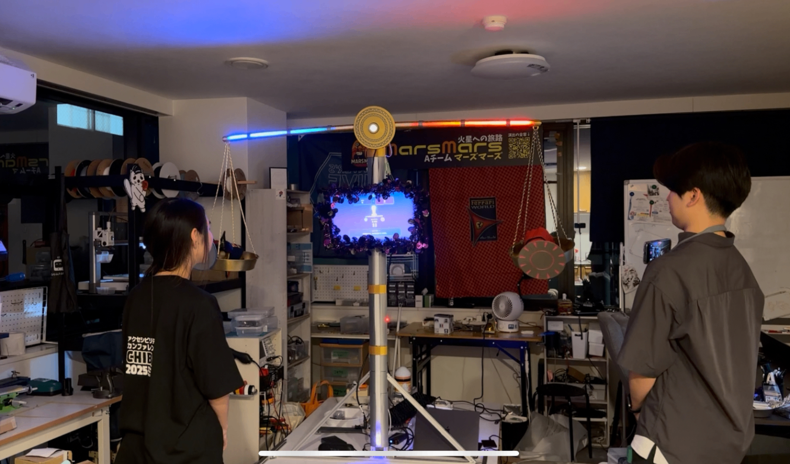
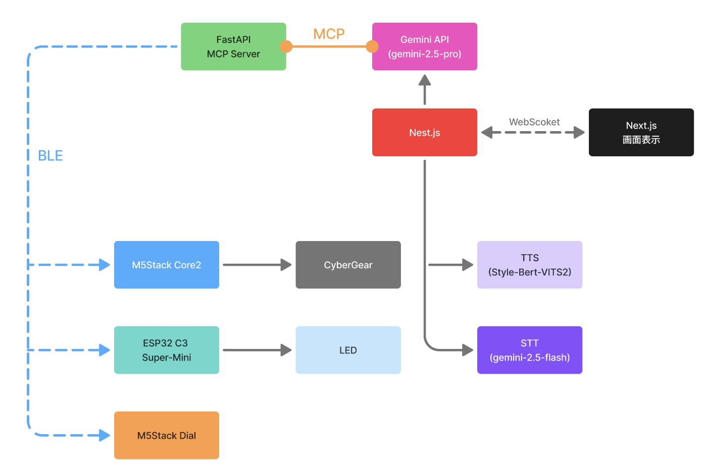
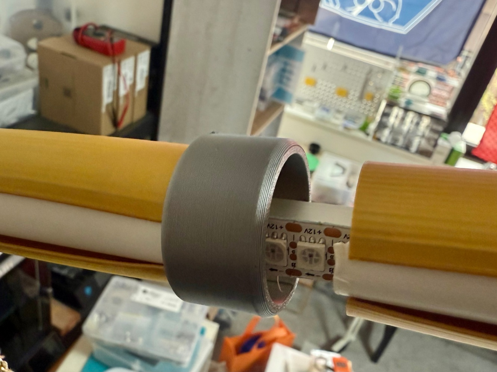
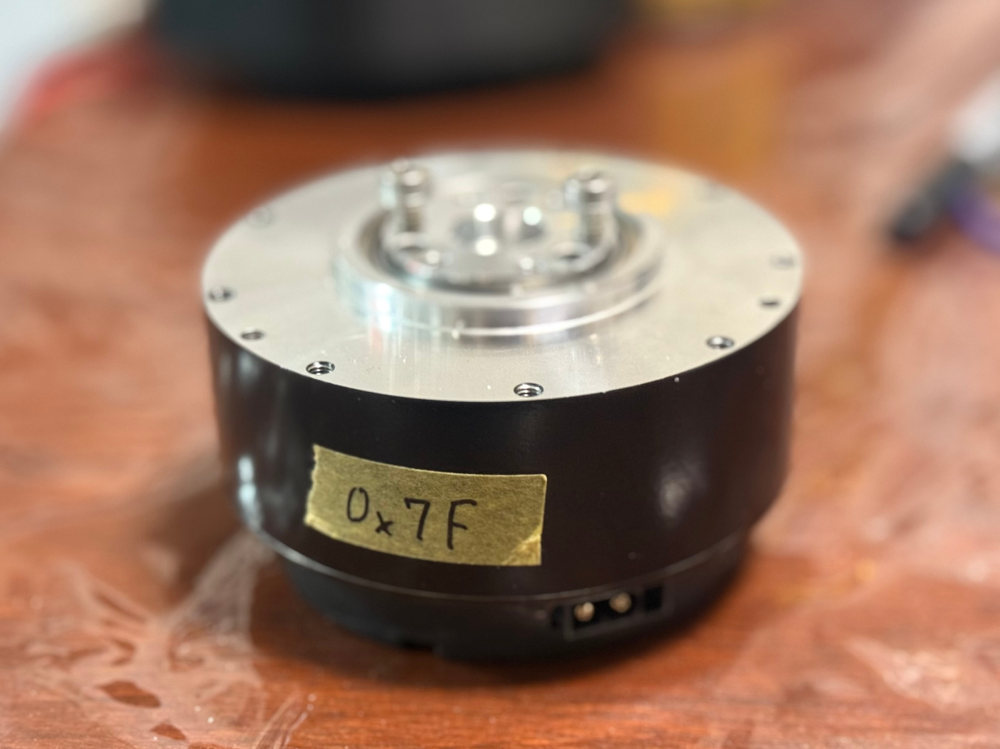

こちら、第三回AI Agent Summit with Google Cloudにて、優秀賞をいただきました！！🙌🙌

展示した際も体験した方から、大変好評をいただいたので、さらなるブラッシュアップを図っていく所存です〜！！

また、もしこちら使ってみたい企業さんなどがいらっしゃれば、ぜひコラボ等したいと考えておりますので、X（Twitter）のDM等でご連絡いただければ幸いです！

ーーーーーー

「目玉焼きには醤油かソースか」「犬派か猫派か」「トイレットペーパーは三角折りするか否か」…  
日常にあふれる、どうでもいいけど意外と決着のつかない論争。

そんな時こそ、この【魔法の天秤】の出番です！  

この天秤があれば、そんな論争もディベート大会に早変わり。  
LLMによる司会進行と論理的な点数付けによって解決します

実際に遊んでいる様子がこちら↓  
<https://youtu.be/IoXSTlqXFxY>

* * *

##  遊び方

  1. ディベートに参加する2人が、天秤の前に立ちます。

     * 片方は「太陽」を司る器、もう片方は「月」を司る器。
     * それぞれの器に、自分のビーバーを置きます。
  2. 魔法使いビーバーの声に導かれながら、交互に主張を述べます。

     * 声に乗せた言葉は天秤に届き、審判が下されます。
  3. 全3回の「審判の儀」で、それぞれの論がどれだけ説得力を持っていたかが判定されます。

     * 論理性、根拠の有無、表現力、戦略性…様々な観点から評価。
     * 天秤はその結果に応じて傾きます。
  4. 最終審判では、全ラウンドを総合して大きく揺れ動き、最終結果を示します。

言葉が物理的に「天秤を動かす」瞬間は、見ている側も思わず笑ってしまう体験になります。

* * *

##  なぜ作ったか

この「魔法の天秤」を作ろうと思った理由はいくつかあります。

###  1\. 論理的思考を遊びながら鍛えたい

ディベートや議論の場では、

  * 主張の一貫性
  * 根拠の有無
  * 相手の論を理解して反論する力

といったスキルが求められます。  
ただ、これらを真面目に練習しようとするとハードルが高く、続かないことが多いという問題があります。

「だったら遊びの延長で楽しみながらできる仕掛けを作れないか？」というのが最初の発想でした。  
どうでもいいテーマ（醤油派 vs ソース派など）なら気軽に挑戦できますし、笑いながら論理的思考を練習できます。

また、LLMの登場によって、真に論理性のあり第三者視点に立つ存在が生まれたといえます。

今まででは到底実現できなかったものですが、今なら作れる！と思ったのがきっかけになります。

* * *

###  2\. 技術的なチャレンジを試したかった

上記で触れた「LLMだからこそ実現できる仕組み」に加え、私はMCPとハードウェアを組み合わせることで、LLMによって制御される大型ハードウェア――すなわちロボット――に挑戦してみたいと考えました。

従来、このようなロボットの挙動は、ソフトウェア側で詳細に要件を定義し、その枠組みに沿って決められた動作をさせるしかありませんでした。ところがMCPの登場により、標準化された仕組みを通じて、LLMが柔軟に制御を担うことが可能となったのです。

今回のプロダクトではその特性を活かし、高レイヤーからの制御はあえて「プロンプト」のみを与えています。これにより、ゲームの進行に応じてモーターやLEDが自律的かつ動的に振る舞う仕組みを実現しました。

私自身、普段からいくつかのロボコンへの参加を通じてモーター制御等に関する知見を持っていますが、「MCPを介して大型モーターをLLMに制御させる」というのは長らくの挑戦目標でした。ただし、競技環境では勝敗がかかるため瞬時の応答性が必須であり、なかなか実現の機会は得られませんでした。

しかし今回のプロダクトでは、特性上応答にいくばくかの余裕があることと、非同期的に行うなどの工夫を凝らすことで、ユーザーが違和感を覚えない速度でMCP経由の制御を成立させることに成功しました。その結果、LLMとハードウェアの親和性を最大限に引き出したプロダクトに仕上がったと感じています。

さらに、筐体をあえて大きく設計することで、ゲームセンターにあるアーケード筐体のような没入感を演出し、ユーザーに特別な体験を提供することも狙いとしています

* * *

###  3\. 「面白そうだから」

そして一番大きい理由はこれです。

「目玉焼きに何をかけるか？」  
「犬派か猫派か？」

どうでもいい論争を本気で審判する装置って、想像しただけで面白いと思いませんか？

最初、冗談半分で「魔法の天秤」という名前をメモに書きましたが、「これを本当に作ったら絶対に面白い」とワクワクしてしまい、作ることになりました。

* * *

###  まとめ

つまり理由は3つです。

  1. 論理的思考を楽しく鍛えたい
  2. 技術的なチャレンジをしたかった
  3. 何より面白そうだったから

遊び心と技術的探究心が両方あったからこそ、最後までモチベーションを維持して完成できたプロジェクトだと思います。

* * *

##  システム構成

システム構成は以下の通りです。  

論題はユーザーが提示するものの、それを論議しやすいように加工し、司会進行をGeminiで行います。  
また、ユーザーの発言のSTTを行い、その弁論の要点や点数付けもGeminiで行っています。  
点数を元にデバイスをMCP経由のBLE制御で行っています。

コアロジックをLLMで持っているため、プロンプトを変更するだけで、全く違うゲーム内容にすることもでき、拡張性もとても高いと考えています。

例えば、英語版や中国語版などの多言語対応もプロンプトを変えるだけで可能です。

* * *

##  ハードウェア

BLEを用いて、モーターとLEDの制御を行っています。

モーメントが非常にかかるので、芯は金属（アルミ）で作っていて、3Dプリンターで装飾しています。  

高トルクBLDCモーターを使用して、絶妙なトルク管理と位置制御を行い、自然な天秤の揺れの感じを表現。  

フルカラーLEDも目の細かいものを使用し、本当に魔法で流れるモーションのように表現しました。

制御にはM5StackS3とM5 Dialを使用しています。  
[https://docs.m5stack.com/ja/core/M5CoreS3 SE](https://docs.m5stack.com/ja/core/M5CoreS3%20SE)

<https://docs.m5stack.com/ja/core/M5Dial>

また、よりゲームへの没入感を増すために、

  * ビーバーを自分の皿に乗せる儀式（自分の担当の皿がどちらかを印象付ける効果を狙ったもの）
  * 天秤の傾きに合わせて、天秤のギギギという音を鳴らしている

のもこだわりポイントです。

* * *

##  作ってみての感想

作っていて、今回のゲームのような遊びながらタスクをこなしていく世界は、ひょっとしたらもすぐ近くまで来ているのではないかなとも思いました。

インタラクティブ性は非常に重要な要素だと考えているのですが、LLM（大規模言語モデル）の進化が進む中で、これまでにない新しい体験の中にこそ残されているのではないかと、考えるきっかけにもなりました。

また開発者目線では、メインロジックのコーディングこそがプロジェクト開発の核心だと信じていたのが、LLMとMCPという仕組みの前では、その考えは過去のものとなりつつあると感じました。

今後はMCPに接続することのできる各要素の充実（これはソフト・ハード限らず）が進んでいくことで、いよいよLLMで全てを制御できる世界が来てしまうかもしれないと感じます・・！

* * *

##  追記：この作品のアピールポイント

以下はGoogle Cloud AI Hackathonの審査に向けて、この作品の体験提供型プロジェクトにおけるアピールポイントを簡単にまとめた物になります。

###  課題の新規性：従来の「議論ゲーム」の壁を越える

これまでの議論系ゲームや教育ツールには、

  * **真面目すぎてとっつきにくい**
  * **参加のハードルが高い**
  * **観客が楽しみにくい**

といった課題がありました。

魔法の天秤は、この壁を「どうでもいいテーマ」を題材にすることで突破しました。  
「ソース派 vs 醤油派」なら、誰でも笑いながら参加できます。

さらに、LLMを「公平な審判」として導入したことで、これまで不可能だった **第三者による即時判定** を成立させ、新しい議論体験を作り出しました。

###  解決策の有効性：言葉が「物理」を動かす瞬間

魔法の天秤の仕組みはシンプルです。

  * ユーザーは交互に主張を述べる
  * LLMが論理性・根拠・表現力などをスコア化
  * そのスコアがBLE経由でモーターに伝わり、天秤が傾く

これにより、**「言葉が物理的に天秤を動かす」** という直感的で笑える体験が生まれました。

身体感覚を伴った体験になることで、参加者も観客も強く引き込まれます。  
また審判がAIのため、公正で即時的な審判を下しやすくなりました。

従来あった、人が判定を下すようなディベートゲームに比べ、コスト面や気軽さ、公平性などにおいて優位な点が多くあります。

###  実装品質と拡張性：LLM×MCP×ハードの柔軟なアーキテクチャ

実装面では、以下の工夫をしました。

  * **ハードウェア**

    * 高トルクBLDCモーター＋アルミ芯で自然な揺れを再現
    * 3Dプリンタで装飾、アーケード筐体風の没入感
    * フルカラーLEDで「魔法」らしい演出
    * M5Stack / M5 Dial による制御
  * **ソフトウェア**

    * コアロジックはLLMに集約
    * MCP経由でBLE制御を行い、ルール変更や多言語化をプロンプト操作だけで実現可能
    * 拡張性が高く、将来的には教育用途や国際展開も容易

この構成により非常にスケーラブルな設計になっています。
