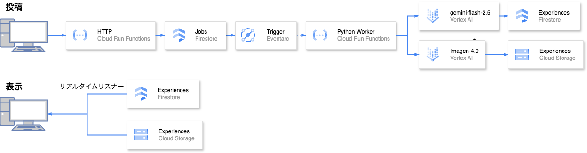

##  はじめに

私は普段からワクワクする体験をしたいなと思って様々なウェブサイト上を探したり生成AIに相談したりするんですが、誰かが用意した"ありきたりな体験"に行き着くことが多く、関心にぴったり合った体験の発掘は非常に難しいなと感じています。ネット上に転がる情報はどうしても商業的なものが多く、また、探し方も自分の想定範囲に留まりがちで、意外と身近に転がっている魅力的な体験を見過ごしてしまっているのではないかなと考えています。  
そこで今回、偶然性を楽しみながら魅力的な体験と出会うためのアプリ「Trypedia」を作ってみました。このアプリによってワクワクする体験の芽を見つけられるのではないかと期待しています。  
このアプリを使ってみたいだけの方もいると思うので、成果物は最初に貼っておきます。ご自由にお使いください。コメントや拡散いただけると嬉しい限りです。

**デモ動画のURL**  
<https://youtu.be/L2IXYtzDpv8>  
**デプロイ先のURL**  
<https://trypedia-250924.web.app>  
**リポジトリのURL**  
<https://github.com/mySweetEden/trypedia>

##  コンセプト

###  課題感

  * 面白い体験を探そうとしても誰かが用意した消費活動に行き着いてしまいがち
  * 興味や気分、予算に沿った体験候補を探すには時間がかかり、偶然の出会いがあまりない

###  ユーザ像

  * 休日を楽しく過ごしたい人
  * 新しい趣味を見つけたい人

###  課題へのソリューション

  * 体験時間や予算、興味などから多彩な体験を多数提案する
  * 条件付きのおまかせガチャ機能で予想外だが刺さる体験を提案する
  * 面白かった体験の共有を支援する

###  特徴

  * 直感的で楽しい操作性で体験の探索を促す
  * 生成AIでの支援により体験の投稿を促す

##  実装

###  技術選定

####  1\. インフラ

Firebaseを用いてのイベント駆動型アーキテクチャを採用することにしました。

技術選定の背景は下記のとおりです。

重視したいポイント | 技術選定理由  
---|---  
クラウドアプリ開発に不慣れな私でもアイデアを短期間で簡単に実装できること | Firebaseは様々な技術がほどよく抽象化されている  
ネット上に実装知見がまとまっており、学習コストが低いこと | Firebaseはネット上の情報も豊富そう  
今後の機能拡張が容易であること | イベント駆動型アーキテクチャを構成しておけば今後の機能追加も比較的容易そう  
運用が簡単でコストも安く済むこと | イベント駆動型アーキテクチャは稼働時のみ課金されるため、安く済みそう  
  
####  2\. アプリ

フロントエンド側ではTypeScriptでReact、バックエンドではPythonを採用しました。  
こちらは比較的慣れているからという理由です。

###  使用技術

####  1\. インフラ

使用した技術スタックは以下の通りです。

  * Firebase Auth
  * Firestore
  * Firebase Authentication
  * Firebase Storage
  * Firebaes Functions

Google Cloud側での実体としては、おおよそ以下のような構成となっています。  

####  2\. アプリ

使用した主要なライブラリ・サービスは以下の通りです。詳細気になる方はリポジトリを直接ご覧ください。  
**フロントエンド**

  * MUI
  * Firebase Web SDK（Auth、Firestore、Hosting）

**バックエンド**

  * Firebase Admin SDK（Cloud Functions内で利用）
  * Google Gen AI SDK（Vertex AI呼び出し）

###  成果物

**デモ動画のURL**  
<https://youtu.be/L2IXYtzDpv8>  
**デプロイ先のURL**  
<https://trypedia-250924.web.app>  
**リポジトリのURL**  
<https://github.com/mySweetEden/trypedia>

##  振り返り

フロントエンドとバックエンドが揃ったアプリをちゃんと作るのはほぼ初めてだったので、技術選定からかなり難航しました。生成AIのサポートを受けつつ、当初想定していたうちの主要な機能はなんとか作り切れてよかったと思います。  
まだまだ拡張したいポイントはたくさんあったので、こちらに一部挙げておきます。

  * 検索機能の拡充：意味検索機能を追加する
  * 投稿時の整形処理高度化：既存の体験と近そうだったら上手く統合する
  * 面白い体験の収集：面白い体験を自動でウェブ上から収集して追加にする
  * 新たな体験の創出：体験同士の統合や調整により、新たな体験を創出する
  * ユーザごとの評価：体験にいいねや投票、コメントをできるようにする
  * ユーザごとの体験の詳細提案：ユーザの居住地などを用いて実際に体験できる場所を提案する

自分自身で使いたくて作ったアプリなので、引き続き開発していきたいなと思っています。

##  おわりに

Trypediaは魅力的な体験に出会うための最小限の機能を持ったプラットフォームです。体験の投稿数が増えるほど価値が高まるプロダクトだと思っているので、気になった方はぜひ触ってみて、面白い体験をシェアしてもらえると嬉しいです。改善アイデアやフィードバックもお待ちしています。
