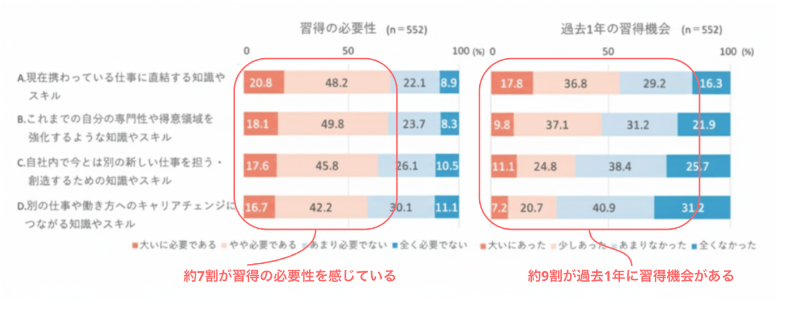
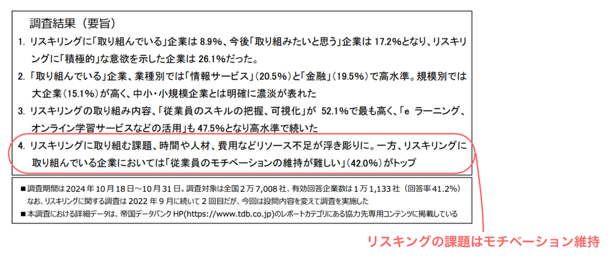
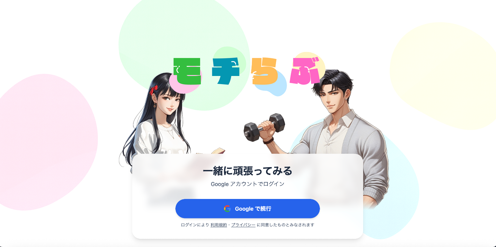
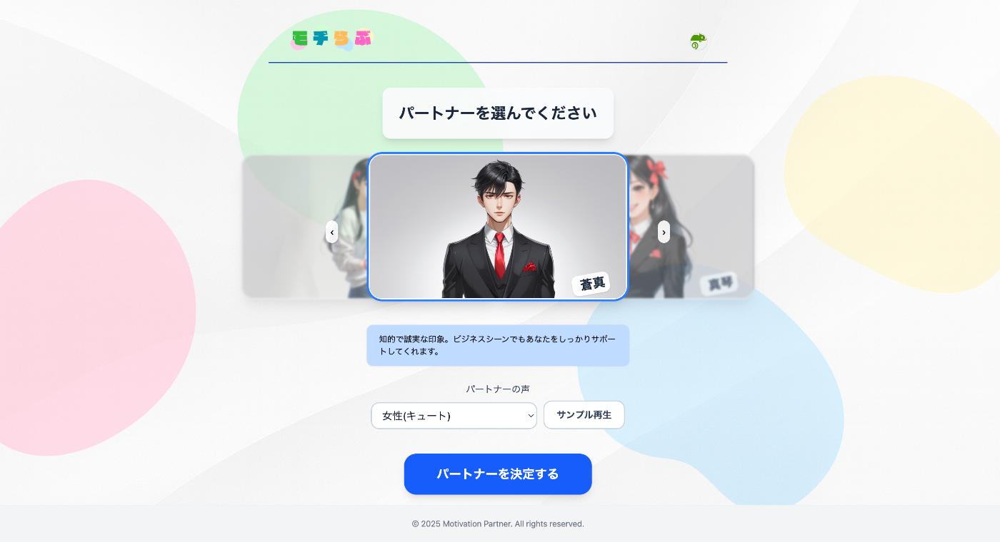
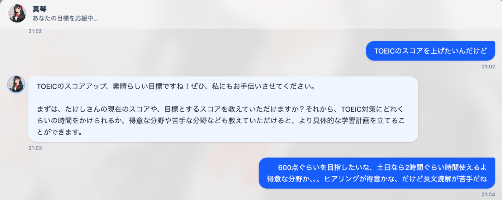
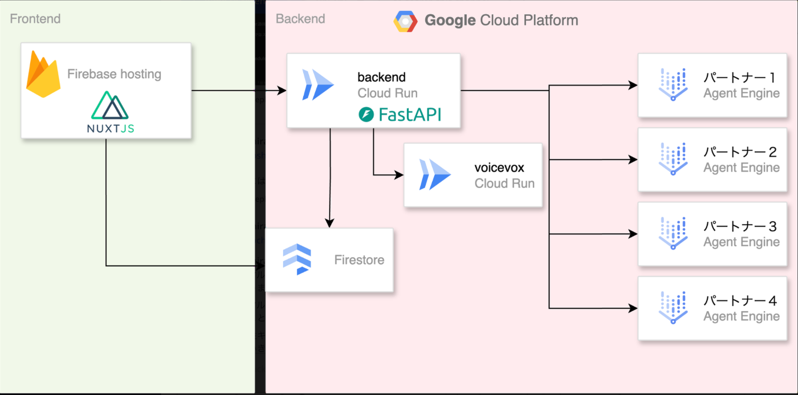

##  1.背景

AIを始めとする技術の進化速度は速くなるにつれ、求められる知識の変化の速さ、求められる質、量の増加が激しくなっており社会人のリスキリングニーズが高くなってきている。  
産業構造が大きく変化していく中でリスキリング効率を上げていくことは日本の競争優位性を担保していくためにとても重要な課題である。

下記のリクルートマネジメントソリューションズの調査でも、約7割がリスキリングの必要性を感じており、約9割が過去1年間に実際に習得の機会があったと回答している。  
  
出典:[リクルートマネジメントソリューションズ調査](https://www.recruit-ms.co.jp/news/pressrelease/0000000428/)

リスキリングに力を入れる企業も増えてきており、個人としても将来の不安等からリスキリングを行う人は増えてきている。しかし、リスキリングが上手くいっているかというとそうでもない。

リスキリング、つまり学習により新しい知識、スキルを獲得する際の重要な要素は下記に分解できると考えている。

**A.適切な知識獲得方法の確立** × **B.継続努力**

**A.適切な知識獲得方法の確立**  
SNS（youtube）やオンライン学習コンテンツの発展により、資格やスキルに関する適切な知識を獲得する方法は巷に多く溢れており、良質なコンテンツに安価にアクセスできる状況にある。

**B.継続努力**  
一方で良質なコンテンツは十分に用意されているのにも関わらず、リスキリングが十分に行われていない状況がある。この原因は継続努力を行えずに学習を定期的に行えないことが原因である。  
下記の帝国データバンクの調査でもリスキリングの課題はモチベーション維持であるという結果がでている。

  
出典[帝国データバンク調査](https://www.tdb.co.jp/resource/files/assets/d4b8e8ee91d1489c9a2abd23a4bb5219/f877c0dafdd04dd4a607acf2d7de4b23/20241119_%E3%83%AA%E3%82%B9%E3%82%AD%E3%83%AA%E3%83%B3%E3%82%B0%E3%81%AB%E9%96%A2%E3%81%99%E3%82%8B%E4%BC%81%E6%A5%AD%E3%81%AE%E6%84%8F%E8%AD%98%E8%AA%BF%E6%9F%BB\(2024%E5%B9%B4\).pdf)

特に社会人のリスキングは「教師の不在」、「学友の不在」、「明確なカリキュラムの欠如」等、学生時に比べ、モチベーション的なハードルが高い。

**B.継続努力のためのモチベーションコントロール** が適切に行えれば、日本の社会課題であるリスキリングの成功確率が飛躍的に上がると考えている。

##  2.課題

思えば学生時代はみんな学習を日常的に行なっていた。（イヤイヤかもしれないが）  
学生時代と社会人の違いはなんだろうか。下記に表にして整理をしてみた。

モチベーションの源泉 | 内容 | 生み出すモチベーションのタイプ | 特徴 | 社会人になっての有無・変化 | 人的リソース  
---|---|---|---|---|---  
教師・指導者の存在 | 常に進捗や姿勢を見てくれる存在 | 外発的モチベーション（監視・期待） | 怠けにくくなる/即時の指導が入る | x：他者の監視・励ましが減る | ○  
明確なカリキュラム | 教科書・年間スケジュールなど | 目標型モチベーション（達成感） | 「今どこにいるか」「ゴールまで何をすればよいか」が明確 | x：道筋が自分で見えにくい |   
定期テスト/成績評価 | 成果を定期的に可視化される | 成果型モチベーション | 努力が数値で示され、周囲と比較可能 | x：成果の可視化が曖昧になる |   
周囲の競争・仲間の存在 | 同級生・友人との比較・共同 | 競争型 or 協調型モチベーション | 同じ目標に向かう仲間がいることで刺激がある | △：仲間の有無は環境による | ○  
保護者の期待 | 家庭からの期待・支援 | 外発的モチベーション | 努力に対する正当な報酬・応援がある | x：期待・評価が不明確になる | ○  
進学・卒業といった明確なゴール | 時間軸で設定された必達目標 | 時限的モチベーション | 「あと〇年」という見通しがある | x：社会人は終わりのない戦い |   
学校の物理的拘束（出席・時間割） | 授業の強制力・時間の制約 | 習慣化型モチベーション | 強制でも「やることになる」環境 | x：裁量に任されると緩む |   
  
多くのギャップが存在するが、そのうちのいくつかは既存の学習用サービス等により補われている。ただし、人的リソースに関するギャップを埋めることはこれまでのサービスでは難しく、特に下記３つの壁がモチベーションコントロールに対する大きな壁であった。

**モチベーションコントロール対する壁**  
1.学習開始の壁：なかなか学習を開始できない（席につけない、参考書をひらけない）  
2.達成感欠如の壁：達成感が感じられない、学習する意味が見出せない  
3.学習難易度の壁：難しい問題にあたってしまい挫折してしまう

今回我々は、最新技術を用いて、この人的リソースのギャップを埋めにいきモチベーションコントロールを適切に行えるサービスを開発した。

##  3.プロダクト

###  本当の恋人のような学習パートナーサービス「モチらぶ」

モチベーションコントロールには学生時代の親や友達、先生のように時に励ましてくれたり、慰めてくれたり、叱咤してくれるような人的リソースが必要である。  
今回は我々はマルチモーダルUI（音声、テキスト、画像、動画）×マルチAIエージェントにより、本当の恋人（パートナー）のようにユーザとコミュニケーションを行い、リスキリングにおける目標達成を支援するサービス「モチらぶ」を開発した。

<https://youtu.be/EdvAQUvw4Hw>

###  マルチモーダルUI（音声、テキスト、画像、動画）

人的リソースによる支援を有効なものにするには本当の人間がそこにいるようなリアル感が重要である。  
これまでは難しかった本当の人間と会話しているようなリアルタイムでの会話を行うことで、リアルな恋人感を演出する。また、音声だけでなくテキストでの会話や、学習教材としての画像のリアルタイム生成や、モチベーションUPのためのご褒美動画の生成も可能とし、マルチモーダルでのUI提供により本当の恋人に応援されているような気分にさせる。

###  マルチAIエージェント

モチベーションコントロールに対する壁を突破するために３つのサブエージェントを用意し、ルートエージェントが必要に応じてサブエージェントを切替えることでモチベーションコントロールの壁を突破することを実現した。

**モチベーションコントロール対する壁**  
1.学習開始の壁：なかなか学習を開始できない（席につけない、参考書をひらけない）  
2.達成感欠如の壁：達成感が感じられない、学習する意味が見出せない  
3.学習難易度の壁：難しい問題にあたってしまい挫折してしまう

**サブエージェント**

対応する壁 | サブエージェント名 | サブエージェント役割  
---|---|---  
1.学習開始の壁 | コンパニオン | ユーザに好きになってもらい、楽しくなってもらうような会話を行い、サービスを利用したくなるようにすることで学習開始のハードルを下げる  
2.達成感欠如の壁 | モチベータ | ユーザの目標達成に対する意欲を上げるような会話や、学習マイルストーン達成時に褒めることで達成感欠如によるモチベ低下を防ぐ  
3.学習難易度の壁 | 学習パートナー | 目標に対するロードマップ作成や、問題作成、解説、不明点に対する回答、アドバイスを行うことで難易度の高い問題に接触した際のモチベ低下を防ぐ  
  
###  パーソナライズ化

「モチらぶ」ではVertexAIのMemoryBankサービスを利用してユーザとの会話における重要な記憶のみを長期記憶として管理させるような仕組みを導入した。これによりAIエージェントは過去に会話した情報から重要度の高い情報を記憶し会話に反映させることができるため、ユーザはパーソナライズされた会話を体験でき、**私だけ** のエージェント感によりAIエージェントへのエンゲージメントを高めることができる。

##  4.機能紹介

###  1.ログイン

Googleアカウントでログインを行います。  

###  2.パートナー選択

あなた好みの学習パートナーを選択します。  

###  3.AIエージェント

**・ルートエージェント**  
サブエージェントをコントロールするルートエージェント。  
ルートエージェントはキャラに応じた性格を設定しており、話し方やモチベーションのあげ方がルートエージェントにより変化する。  
また、状態として1.natural(通常状態),2.ready(学習準備完了状態),3.motivational(意欲的状態)の3状態を管理しており、会話からユーザがどの状態にいるかを判断した上でどのサブエージェントにタスクを割り振るかを判断する。

**・コンパニオンエージェント**  
ユーザと何気ない会話を行い、ユーザにこのサービスを利用したいと思ってもらえるような楽しい会話を繰り広げユーザのエンゲージメントをあげる役割を担う。

**・モチベータエージェント**  
ユーザの学習に対する意欲をげ、意欲が下がってきている場合に励ましの言葉をかけてあげることで学習意欲を維持する役割を担う。

**・学習支援エージェント**  
ユーザの学習目標に対するロードマップの作成や問題集の提示、わからない箇所の質問回答等を行い学習全般の支援を行う役割を担う。

##  5.アーキテクチャ

####  アーキテクチャ図

###  システム概要図

###  主要コンポーネント

####  フロントエンド

  * **Firebase Hosting** : Nuxt.js SPAのホスティング
  * **Firestore** : ユーザーデータとチャット履歴の保存
  * **Firebase Authentication** : ユーザー認証

####  バックエンドサービス

  * **App Service (Cloud Run)** : FastAPI WebSocketサーバー
  * **VoiceVox Service (Cloud Run)** : 音声合成エンジン

####  AI/MLサービス

  * **Vertex AI** : Gemini 2.0 Flash モデル
  * **Agent Engine** : ADK（Agent Development Kit）
  * **Speech-to-Text API** : 音声認識
  * **Text-to-Speech API** : 音声合成（Google）

####  AIエージェントシステム

  * **Manager Agent** : メインエージェント（各サブエージェントを統括）
  * **Learning Partner** : 学習支援エージェント
  * **Motivator** : モチベーション支援エージェント
  * **Image Generator** : 画像生成エージェント
  * **Companion** : コンパニオンエージェント

####  インフラストラクチャ

  * **Terraform** : インフラストラクチャ管理
  * **Artifact Registry** : Dockerイメージ管理
  * **Cloud Storage** : 静的ファイル保存

####  データフロー

  1. ユーザーが音声入力
  2. WebSocketでApp Serviceに送信
  3. Speech-to-Text APIで音声をテキストに変換
  4. Agent Engineがテキストを処理し、適切なサブエージェントに振り分け
  5. Vertex AIで応答を生成
  6. VoiceVoxまたはText-to-Speech APIで音声合成
  7. WebSocketでユーザーに音声データを返送
  8. チャット履歴をFirestoreに保存

##  6.おわりに

リスキリングは日本が失われた30年を継続せずに復活するための重要な課題であり、リスキリングを日本社会に根付かせるには再現性のある方法でモチベーションをコントロールすることがキーポイントである。我々はより人間らしくあなたにパーソナライズされたAIエージェント「モチらぶ」を利用することでモチベーションの課題を解決したいと考えた。  
応答精度や学習支援のバリュエーションはこれから磨き込みを行なっていく余地はあるが、プロダクトとしてのMVP機能は実装することができた。

生成AIの発展によりこれまで難しかったリアルタイムの音声認識、生成や動画生成が簡単に構築することができるようになり、WEBブラウザによる文字、画像ベースのUIが中心だったプロダクトの世界が劇的に変化し始めている。  
こういったリアルタイムでの音声、動画といったUIにより、人間にしかできないと思っていた仕事がAIプロダクトにより代替可能、もしくは人間よりもより良いサービスの提供が可能になっていくと思う。  
「モチらぶ」は人間にしかできないと思われていた「やる気を出す」という機能をリアルタイム音声で乗り越えようとしたプロダクトである。

「モチらぶ」を発展させつつ、新たなUI×AIエージェントで既存のプロダクトでは実現できないUXを提供していきたい。
