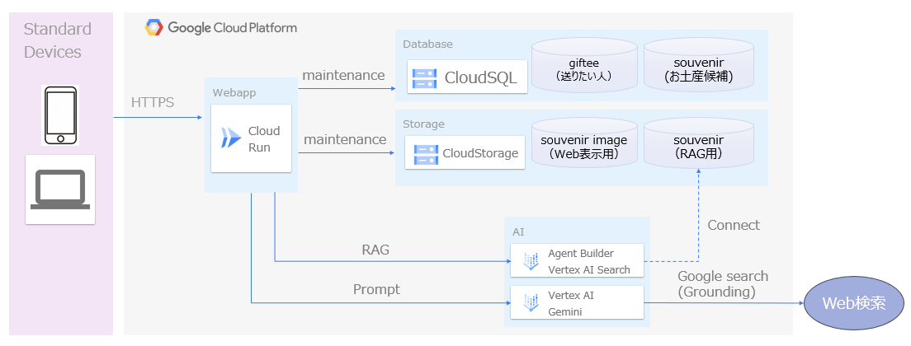
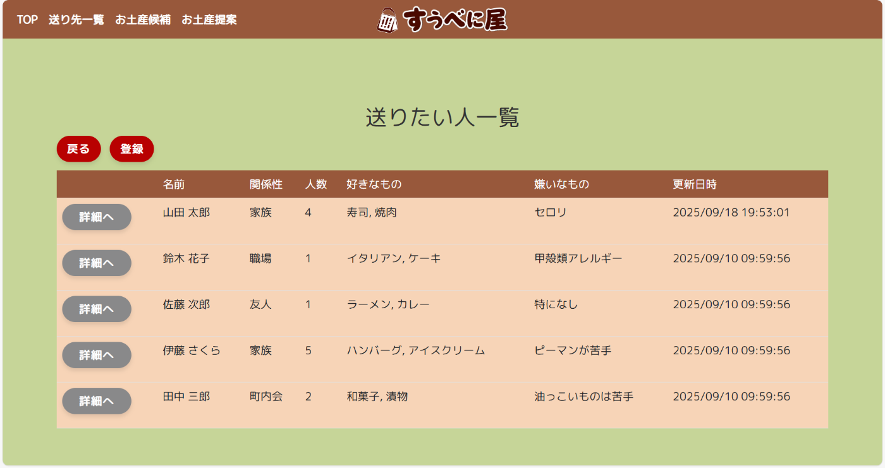
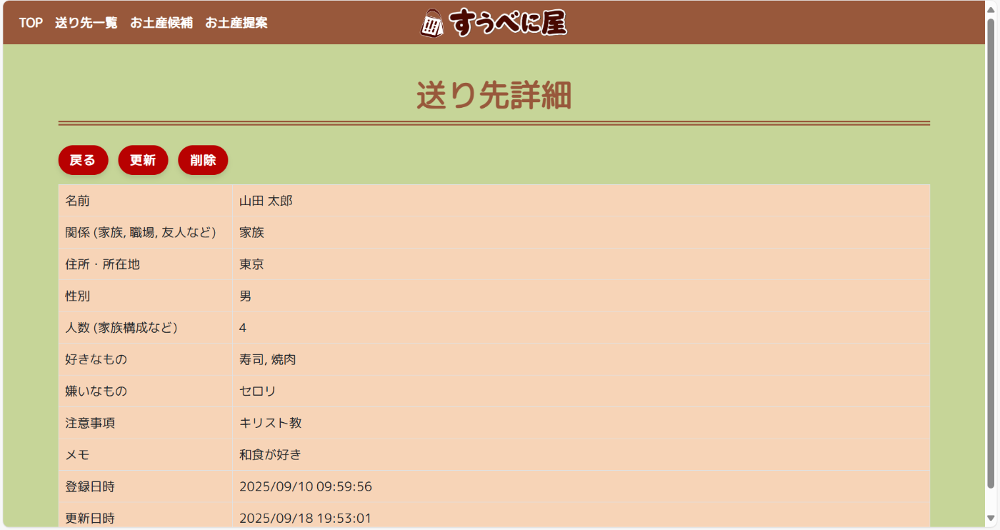
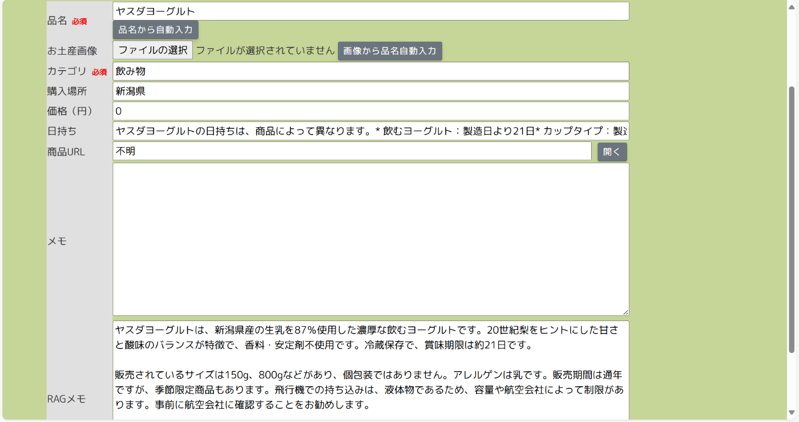
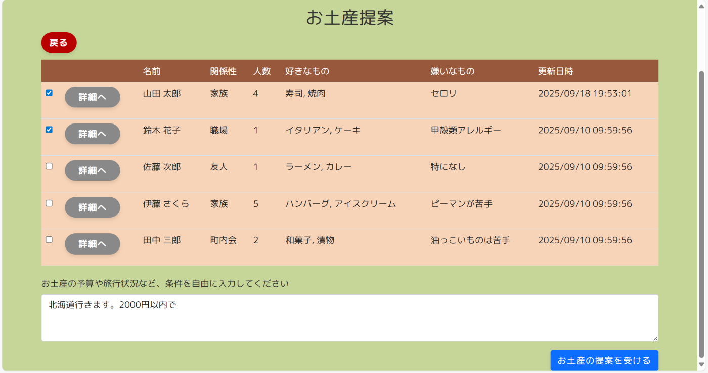
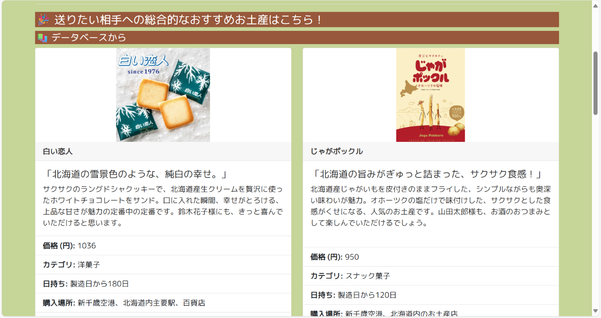
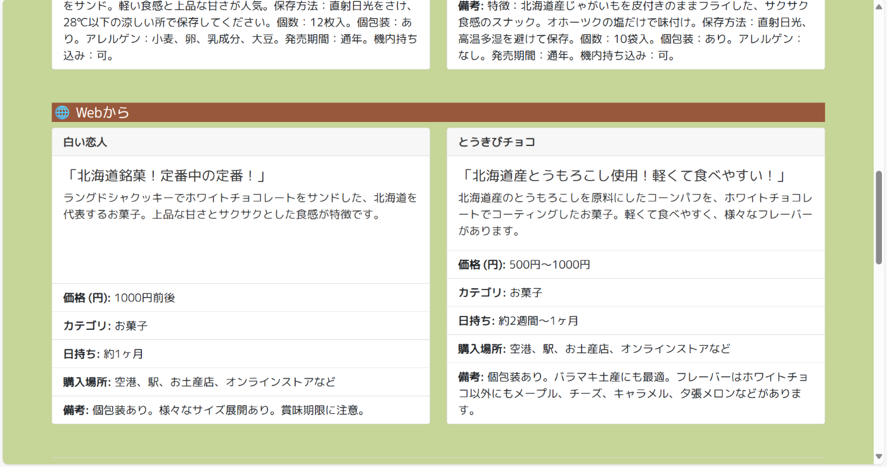
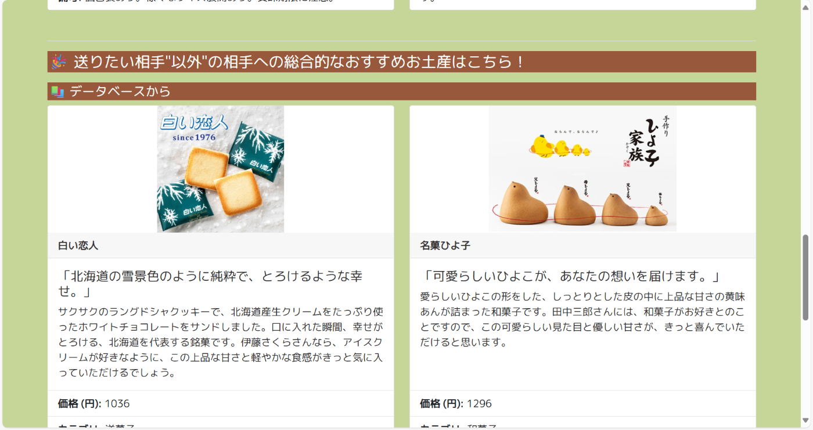

##  はじめに

この記事は第3回 AI Agent Hackathon with Google Cloud にて製作したプロダクト「すうべに屋」の紹介記事となります。

##  プロジェクト概要

###  目的・背景

私たちがお土産を選ぶ際、**相手の趣味・立場・人数** などの観点によって、最適なお土産は大きく異なります。  
出張や旅行の帰り際などで、お土産物屋さんで悩んで時間を使ってしまった経験はありませんか？職場には定番で日持ちのする個包装の菓子、一方友人にはもっとカジュアルなものが良いし、そもそも何人だっけ…？  
そんなお土産選びの迷子を救うため、私たちはお土産選びの最高のパートナーを開発しました。

###  ターゲットユーザ

  * 取引先や社内の異なる部署への手土産選びに気を使うビジネスパーソン
  * 家族構成や年齢層に応じたお土産選びが必要な親戚付き合いが多い方
  * 気配り・ホスピタリティを重視する性格の方
  * 自分のセンスでお土産を選ぶのが不安な方

##  機能要件の構成

本プロダクトは、「誰に・どんな場面で・何を渡すべきか」という複雑なお土産選びを支援するために、以下の3つの主要機能群で構成されています。

###  1\. 送りたい人情報の管理機能

  * グループ名、人数、名前、関係性、アレルギー等の注意事項など送りたい人の情報を管理します。

###  2\. お土産候補の管理機能

  * 日常生活で気になったお土産を見た時にすばやく登録でき、お土産候補として管理します。

###  3\. お土産提案機能（AIエージェント）

ユーザが入力したお土産条件に基づき、AIエージェントがまるで優秀な秘書のように、複数の役割・視点から自律的にお土産を提案します。

  * **おすすめのお土産提案** ：  
ユーザへの共感を下に、総合的な視点でのお土産選定を担当し、お土産候補の中から最適なお土産を提案します。
  * **相手視点での選定** ：  
相手への共感を下に、相手の好みや立場の視点でのお土産選定を担当し、お土産候補の中から最適なお土産を提案します。
  * **相手以外視点での選定** ：  
ユーザの想定外の視点から、送る予定はなかったけど、送った方がよい人を提案し、ユーザに気づきを与えた上で、送る人にあった最適なお土産を提案します。
  * **一般的な基準での選定** ：  
お土産候補や送りたい人は関係なく、第三者の視点からの一般的な基準で、Web検索を駆使しながら、予算や常識から外れない常に最新・最適なお土産を提案します。

##  工夫した点

###  1\. お土産候補の登録における情報補完

お土産情報を登録しておきたいが、情報をたくさん入力するのは手間なので、お土産名やお土産画像を入力するだけで、**生成AIがWeb検索（グラウンディング）を行い、詳細を補完** するようにしています。

###  2\. お土産候補からのお土産抽出

曖昧なお土産条件でも、検索がヒットするように、**お土産候補データをRAG化（Vertex AI Search）して、セマンティック検索ができる** ようにしています。また、自動更新が可能となるように、データストアとしてCloud Storageを使っており、Cloud SQLにてデータの整合性を取っています。

###  3\. お土産提案におけるプロンプトエンジニアリング

可能な限り、1回の提案でお土産が見つかるように、**ユーザ自身・送りたい人・想定外の人・一般的な人という4つのロール** （人格）に対する思考をAIエージェントにさせています。こうすることで、ユーザがお土産を選定する際の決定を支援しています。

##  システムアーキテクチャ

本プロダクトは、Google Cloud Platform上に構築されたWebアプリケーションで、ユーザの属性や関係性に応じて最適なお土産を提案するAIエージェントを提供します。

###  全体構成

  1. **Webアプリ（Cloud Run）**  
ユーザはスマートフォンやPCなどの標準的なデバイスから、HTTPS経由でWebアプリにアクセスします。WebアプリはCloud Run上でホストされており、ユーザからのリクエストを受けて以下の処理を行います：

     * データベースへのアクセス（CloudSQL）
     * ストレージへのアクセス（CloudStorage）
     * AIサービスへのプロンプト送信
  2. **データベース（CloudSQL）**  
データベースには、以下の2種のデータが格納されています。

     * `giftee`：送りたい人の情報（属性、関係性など）
     * `souvenir`：お土産候補のデータベース  
Webアプリはこれらの情報をもとに、AIエージェントの応答をパーソナライズします。
  3. **ストレージ（CloudStorage）**  
ストレージには、お土産に関する以下の2種のデータが格納されています。

     * `souvenir image`：Web表示用のお土産画像
     * `souvenir`：RAG（検索拡張生成）用の情報データ  
AIコンポーネントはこのストレージを参照して、文脈に応じた情報生成を行います。またお土産情報は更新が激しいデータになりますが、CloudStorageのRAG機能にはベクトルデータベースを定周期で更新される機能があるため情報更新を気にする必要もありません。
  4. **AIコンポーネント群（Vertex AI）**  
以下のサービスを利用し、対話機能とRAG機能を備えたAIエージェントを構成します：

     * **Vertex AI Search** ：情報検索とRAG処理
     * **Vertex AI (Gemini)** ：自然言語生成と対話処理  
Webアプリから送られたプロンプトを受け取り、ユーザに最適な提案を生成します。また前述したとおり、AIコンポーネントは必要に応じてGoogle検索を活用し、外部情報を取り入れて応答の精度を高めます。

###  プロンプトエンジニアリング

Vertex AIに渡すプロンプトに関して、今回は以下の点を意識して設計しました。

  * **Few-shotプロンプティング**  
お土産情報の自動出力やお土産提案をエージェントがスムーズに行えるように、プロンプト内に望ましい出力イメージを表記しています。  
例：

    
    
    "category": f"「{souvenir_name}」のカテゴリを、「お菓子」「雑貨」「飲み物」のように一言で教えて。見つからない時は、「不明」と返してください。",
    "price": f"""
    あなたは、お土産の「1個あたりの税込価格」を計算するAIです。以下のルールに厳密に従って、最終的な計算結果の【数値のみ】を回答してください。
    …
    # 回答例
    - 12枚入り1200円のお菓子A:100
    - 1個1200円のキーホルダー:1200
    - 5個入り600円、10個入り1000円のお菓子B:110
    

  * **出力形式 、計算基準、例外処理、エラーハンドリングなどのルール設定**  
こちらがプログラム内で決めたSQL様式やHTMLリクエスト様式に沿った形でエージェントが回答を返せるよう、欲しい出力様式や例外が発生した場合の出力ルールなどを細かく指定しています。  
例：

    
    
    # ルール
    - **最重要**: 必ず「1個あたりの価格」を計算してください。複数個入りの商品を調査し、必ず「総額 ÷ 個数」の計算を実行してください。
    - **価格帯**: 複数の価格帯（例: 5個入り600円、10個入り1000円）が見つかった場合は、それぞれの1個あたりの価格を計算し、その平均値を出してください。
    - **単品**: 複数個入りでない場合は、その商品の価格を回答してください。
    - **不明な場合**: 価格が見つからない、または計算できない場合は、例外なく「0」と回答してください。
    

  * **渡される情報によって利用するプロンプトを変える**  
お土産提案ではユーザに条件指定を任せていますが、場合によっては特定の条件（送る対象など）が指定されない場合があります。このような場合でも対応できるように、入力された情報に応じてプロンプトの内容を変え、AIエージェントの役割を最適化しています。  
例：  
（送りたい対象が指定されていない場合）

    
    
    あなたは、プロのお土産選びの専門家です。
    お土産リストとユーザの要望を分析し、最適な商品を推薦してください。
    　…
    

（対象が指定されている場合）
    
    
    あなたは、プロのお土産選びの専門家です。
    ユーザの要望+送り相手を理解し、あなたが持つ情報から、ユーザの要望に含まれる送り相手が喜ぶ最高のお土産を提案することがあなたの使命です。
    　…
    

  * **ユーザがお土産を選ぶ際に本当に知りたいであろう情報（アレルゲン、保存方法、個包装の有無、販売期間、飛行機での制限など）を網羅した要約**  
AIエージェントがお土産選定時にユーザの要望や送る対象の制限に対応できるよう、お土産候補を登録する際にお土産選定の際の重要ポイントを網羅できるようにしています。  
例：

    
    
    　…
    "rag_memo": f"""
    あなたは、お土産情報の検索を専門とする優秀なアシスタントです。「{souvenir_name}」について、以下の情報を含めて200字以内で回答してください。
    #含めるべき情報
    ・商品の特徴
    ・保存方法（常温、冷蔵、冷凍など）
    ・個数（10個入り、20個入りなどバリエーションがある場合はすべて記載）
    ・個包装か否か
    ・アレルゲン
    ・販売期間
    ・飛行機等での制限
    #注意事項
    ・商品が見つからないときは「特になし」と返してください。
    ・具体的な商品名ではなく品目などがユーザから入力された場合も、ユーザに対して追加の質問はせずに一般的な情報で回答してください。
    ・必ず200字以内で回答してください。
    　…
    

##  デモ

###  動画

<https://www.youtube.com/watch?v=zlbNKXhQEXA>

###  サービスのポイント

  1. **送りたい人情報の単位をフレキシブルに設定可能**  

今回のアプリでは、個人単位だけでなく**グループ単位** でも送りたい人情報を管理できるようになっています。このようにすることで、個人から職場・友達グループまで**送る人数にも応じた適切なお土産プランを提案できる** ようになります。

  2. **送りたい人情報を詳細に記入可能**  

今回のアプリでは、送りたい人の名前や性別などの基本項目だけでなく所在地や関係、さらには**アレルギー・宗教上の理由などの注意事項** も登録することができます。これにより送りたい人の細かな事情にまで対応できるプランを提案できます。

  3. **お土産候補の情報を自動補完**  

今回のアプリでは、お土産候補の情報登録をサポートする機能を実装しています。それが**自動補完機能** であり、

  * お土産の画像をアップロードすることでお土産名を判定
  * お土産名を入力することでWebから情報を自動的に収集  
の二つができます。少ない情報からでもお土産をアプリに登録できます。

  4. **お土産提案時の条件指定を柔軟に**  

今回お土産提案機能では、以下の形で条件を指定できるようにしています。

  * お土産を送る人：一度に複数対象を選択できます
  * その他の条件：「どこに行くか」「何円以下に収めるか」を**自然言語で指定** できます  
そのため、思いつくまま雑に入力しても適切な提案が行われます。

  5. **お土産提案時にRAGだけでなく、Web検索で取得したお土産の情報も同時に提示**  
  

お土産提案時には、基本的にはお土産候補のデータベースからRAGを利用して提案しています。加えてお土産候補の幅を広げるために**Web検索によりお土産情報を取得し提案に盛り込める** ようになっています。

  6. **お土産提案時にあげたい人以外に向けても提案**  

さらにユーザの想定外の視点から、**送る予定はなかったけど送った方がよい人をAIエージェントが発見** し、ユーザに対して**その人に対する最適なお土産を提案** できるようになっています。これによりユーザに想定外の気づきを与え、コミュニケーションの機会を創出できるようになります。

##  今後の展望

今後はこのような機能を追加したいと考えています。

  * 提案履歴

一度アプリを閉じた後でも提案を後から見返せるように、提案自体を保存するデータベースを用意したいと考えています。

  * 送った履歴

「どのグループに何を送ったか」という情報を保存し、「自分が送ったことのあるお土産と提案との被りを事前に防ぐ」「送ったときの相手の感想を残し、提案時の参考情報とする」といった形で活用できるようにしたいと考えています。

  * Webからの画像自動取得

お土産候補の登録時やお土産提案時にWeb検索をする際、テキストだけでなく画像も取得することでユーザビリティをあげたいと考えています。

##  あとがき

今回のテーマ「AI Agentが、現実を豊かにする」からは様々なAIエージェントのアイデアを見出すことができます。SDGsなど大きな課題に対してのソリューションを見出すこともできますが、今回は逆に「お土産の選定」という身近だけど悩ましい課題を攻めてみることにしました。実際にプロダクトを作ってみると、最初に想定したよりAIエージェントがよいサポートをしてくれることがわかり、身近な課題に対してもAIエージェントで解決できることを実感できました。

筆者は今回が初ハッカソンでしたが、開発経験を通して「プロンプト次第でAIエージェントにどんな役割も担わせることができる」「特定の役割のAIエージェントを組み合わせることで、複雑な機能も簡単に実装できる」といったAIエージェントの可能性を強く感じられました。またGoogle Cloudを活用することで、短期間でも実用的なプロダクトを制作できたと思います。  
今後もこの経験を活かして、より良いサービス開発に挑戦していきたいと思います。
